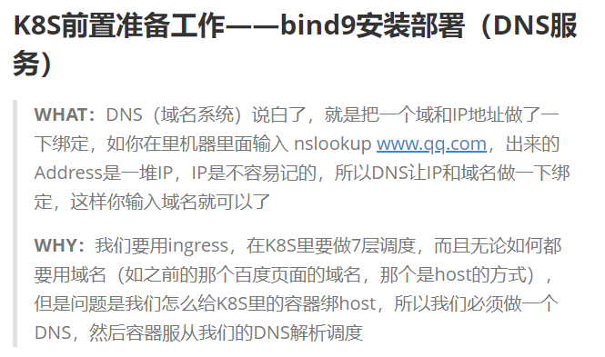
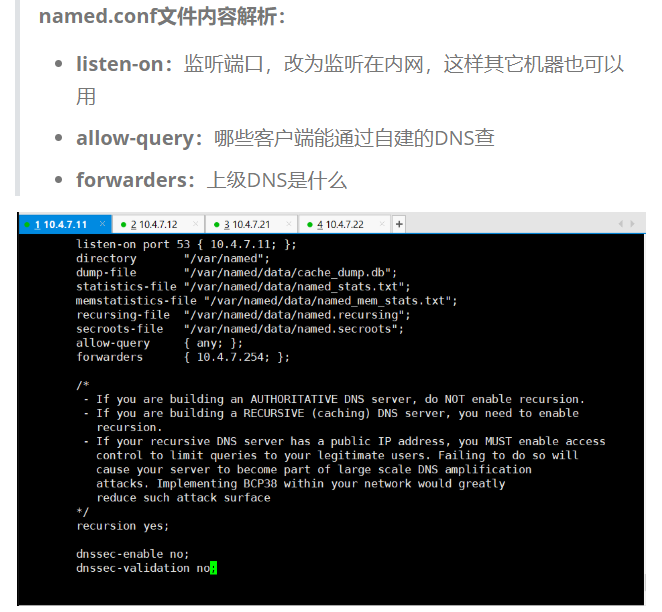
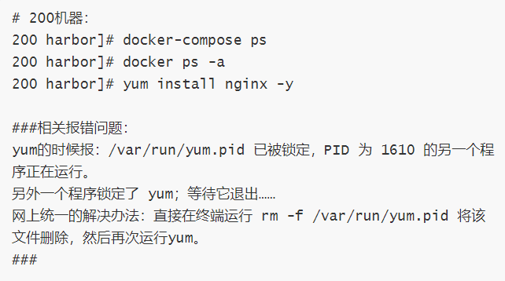
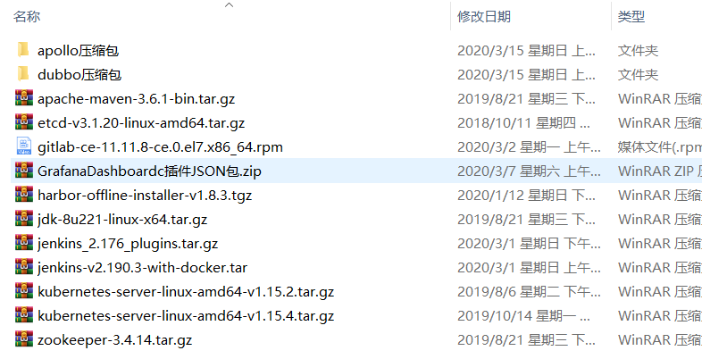

## Features

- 对做的事情进行说明是什么（WHAT），为什么要做（WHY）

- 对相关文件进行解析、指明哪部机器操作、配图，并在易出错点添加解决办法。

- 使用文件皆是官方文件，且软件包有对应文件，避免被更新或其它问题导致无法下载等情况，百度云https://pan.baidu.com/s/1arE2LdtAbcR80gmIQtIELw 提取码：ouy1。

  

- 无数前人遍历/建设代码，为代码完整性保驾护航，欢迎给我们提供你的建议、扩展、报错

  

## Q&A

- Q: 我的电脑是4核8G能做吗：
  - A: 4核8G能做到dashboard前后，4核16G能做到Jenkins前后，8核24G能做到prometheus前后，当然对于部分同学可能一开始就买个8核32G的机器很浪费，你可以先用你的机器做到做不动再买，因为前期很多东西看不懂，学习的进度也是比较慢，而且我强烈建议各位如果可以一定要做到Jenkins后重装一遍。
- Q: 我是新手可以吗
  - A: 只要你会用电脑就可以，至于懂不懂linux懂不懂开发，这些都无关紧要
- Q: 一直报错找不到解决办法怎么办
  - A: 当然是找我呀，或者你可以重装，前提是你确定不是你操作的问题（PS：机器命名和配置一定要跟我的一样，不然我很难给你找）
- Q: 做完了一部分但是看不懂，就感觉自己在复制粘贴
  - A: 所有的学习都是从复制粘贴开始，没有人能看一遍就什么都懂（当然是因为我没见过这种人，我遇到的大部分都是有基础所以学的快）

