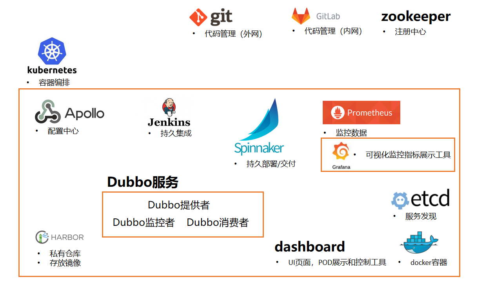

# k8s_PaaS
       

   

基于Kubernetes(K8S)一步步部署成PaaS/DevOps（一套完整的软件研发和部署平台）——教程/学习（实战代码/欢迎讨论/大量注释/操作配图），你将习得部署如：Kubernetes(K8S)、dashboard、Harbor、Jenkins、本地gitlab、Apollo框架、promtheus、grafana、spinnaker等。

注释及配图覆盖率达80%以上，旨在帮助快速入门。

并将告诉你：是什么（WHAT）、为什么这么做(WHY)、怎么做(HOW)。

建议学习时长1个月+，最终将实现点点点（自动化）的形式就能部署上线并维护。

## PaaS架构图

> 橙色框内软件皆部署在K8S集群中，也就是我们可以随时扩容缩容

## <a href="https://github.com/ben1234560/k8s_PaaS/blob/master/Features.md">Features</a>

- 对做的事情进行说明是什么（WHAT），为什么要做（WHY）。
- 对相关文件进行解析、指明哪部机器操作、配图，并在易出错点添加解决办法。第二章由于配置内容较多，建议配合[check_tool](https://github.com/ben1234560/k8s_PaaS/tree/master/%E8%BD%AF%E4%BB%B6%E5%8C%85/check_tool)使用。
- 使用文件皆是官方文件，相关软件包有对应文件，避免被更新或其它问题导致无法下载等情况，百度云https://pan.baidu.com/s/1arE2LdtAbcR80gmIQtIELw 提取码：ouy1。
- 无数前人遍历/建设代码，为代码完整性保驾护航，欢迎给我们提供你的建议、扩展、报错。
- 整理了多人问的4个问题<a href="https://github.com/ben1234560/k8s_PaaS/blob/master/Features.md#qa">Q&A</a>：配置只有4核8G够吗，新手可以吗，找不到报错怎么办，做完看不懂怎么办
- 推出公有云部署版本，如[第二章——企业部署实战_K8S【公有云版】](https://github.com/ben1234560/k8s_PaaS/blob/master/%E7%AC%AC%E4%BA%8C%E7%AB%A0%E2%80%94%E2%80%94%E4%BC%81%E4%B8%9A%E9%83%A8%E7%BD%B2%E5%AE%9E%E6%88%98_K8S%E3%80%90%E5%85%AC%E6%9C%89%E4%BA%91%E7%89%88%E3%80%91.md)。自己电脑资源紧张的完全可以用，而且费用也便宜

## 学习章节：

<ul>
    <li><a href="https://github.com/ben1234560/k8s_PaaS/blob/master/%E7%AC%AC%E4%B8%80%E7%AB%A0%E2%80%94%E2%80%94Docker%EF%BC%88%E5%B7%B2%E7%86%9F%E6%82%89%E7%9A%84%E5%8F%AF%E4%BB%A5%E4%BB%8E%E7%AC%AC%E4%BA%8C%E7%AB%A0%E5%BC%80%E5%A7%8B%EF%BC%89.md">第一章——Docker</a>
    <ul>
        <li><a href="https://github.com/ben1234560/k8s_PaaS/blob/master/%E7%AC%AC%E4%B8%80%E7%AB%A0%E2%80%94%E2%80%94Docker%EF%BC%88%E5%B7%B2%E7%86%9F%E6%82%89%E7%9A%84%E5%8F%AF%E4%BB%A5%E4%BB%8E%E7%AC%AC%E4%BA%8C%E7%AB%A0%E5%BC%80%E5%A7%8B%EF%BC%89.md#%E5%AE%89%E8%A3%85docker">安装Docker</a>
      <li><a href="https://github.com/ben1234560/k8s_PaaS/blob/master/%E7%AC%AC%E4%B8%80%E7%AB%A0%E2%80%94%E2%80%94Docker%EF%BC%88%E5%B7%B2%E7%86%9F%E6%82%89%E7%9A%84%E5%8F%AF%E4%BB%A5%E4%BB%8E%E7%AC%AC%E4%BA%8C%E7%AB%A0%E5%BC%80%E5%A7%8B%EF%BC%89.md#%E5%BC%80%E5%90%AF%E6%88%91%E4%BB%AC%E7%9A%84%E7%AC%AC%E4%B8%80%E4%B8%AAdocker%E5%AE%B9%E5%99%A8">开启我们的第一个docker容器</a>
      <li><a href="https://github.com/ben1234560/k8s_PaaS/blob/master/%E7%AC%AC%E4%B8%80%E7%AB%A0%E2%80%94%E2%80%94Docker%EF%BC%88%E5%B7%B2%E7%86%9F%E6%82%89%E7%9A%84%E5%8F%AF%E4%BB%A5%E4%BB%8E%E7%AC%AC%E4%BA%8C%E7%AB%A0%E5%BC%80%E5%A7%8B%EF%BC%89.md#dockerhub%E6%B3%A8%E5%86%8C%E8%87%AA%E5%B7%B1%E7%9A%84%E8%BF%9C%E7%A8%8B%E4%BB%93%E5%BA%93">Dockerhub注册（自己的远程仓库）</a>
      <li><a href="https://github.com/ben1234560/k8s_PaaS/blob/master/%E7%AC%AC%E4%B8%80%E7%AB%A0%E2%80%94%E2%80%94Docker%EF%BC%88%E5%B7%B2%E7%86%9F%E6%82%89%E7%9A%84%E5%8F%AF%E4%BB%A5%E4%BB%8E%E7%AC%AC%E4%BA%8C%E7%AB%A0%E5%BC%80%E5%A7%8B%EF%BC%89.md#docker%E9%95%9C%E5%83%8F%E7%AE%A1%E7%90%86%E5%AE%9E%E6%88%98">Docker镜像管理实战</a>
      <li><a href="https://github.com/ben1234560/k8s_PaaS/blob/master/%E7%AC%AC%E4%B8%80%E7%AB%A0%E2%80%94%E2%80%94Docker%EF%BC%88%E5%B7%B2%E7%86%9F%E6%82%89%E7%9A%84%E5%8F%AF%E4%BB%A5%E4%BB%8E%E7%AC%AC%E4%BA%8C%E7%AB%A0%E5%BC%80%E5%A7%8B%EF%BC%89.md#docker%E9%95%9C%E5%83%8F%E7%AE%A1%E7%90%86%E5%AE%9E%E6%88%98">docker容器操作</a>
      <li><a href="https://github.com/ben1234560/k8s_PaaS/blob/master/%E7%AC%AC%E4%B8%80%E7%AB%A0%E2%80%94%E2%80%94Docker%EF%BC%88%E5%B7%B2%E7%86%9F%E6%82%89%E7%9A%84%E5%8F%AF%E4%BB%A5%E4%BB%8E%E7%AC%AC%E4%BA%8C%E7%AB%A0%E5%BC%80%E5%A7%8B%EF%BC%89.md#dockerfile-%E7%BB%BC%E5%90%88%E5%AE%9E%E9%AA%8C">dockerfile 综合实验</a>
    </ul>
  </li>
    <li><a href="https://github.com/ben1234560/k8s_PaaS/blob/master/%E7%AC%AC%E4%BA%8C%E7%AB%A0%E2%80%94%E2%80%94%E4%BC%81%E4%B8%9A%E9%83%A8%E7%BD%B2%E5%AE%9E%E6%88%98_K8S.md">第二章——企业部署实战_K8S</a>
<ul>
  <li><a href="https://github.com/ben1234560/k8s_PaaS/blob/master/%E7%AC%AC%E4%BA%8C%E7%AB%A0%E2%80%94%E2%80%94%E4%BC%81%E4%B8%9A%E9%83%A8%E7%BD%B2%E5%AE%9E%E6%88%98_K8S.md#k8s%E5%89%8D%E7%BD%AE%E5%87%86%E5%A4%87%E5%B7%A5%E4%BD%9Cbind9%E5%AE%89%E8%A3%85%E9%83%A8%E7%BD%B2dns%E6%9C%8D%E5%8A%A1">K8S前置准备工作——bind9安装部署（DNS服务）</a>
  <li><a href="https://github.com/ben1234560/k8s_PaaS/blob/master/%E7%AC%AC%E4%BA%8C%E7%AB%A0%E2%80%94%E2%80%94%E4%BC%81%E4%B8%9A%E9%83%A8%E7%BD%B2%E5%AE%9E%E6%88%98_K8S.md#k8s%E5%89%8D%E7%BD%AE%E5%B7%A5%E4%BD%9C%E5%87%86%E5%A4%87%E7%AD%BE%E5%8F%91%E8%AF%81%E4%B9%A6%E7%8E%AF%E5%A2%83">K8S前置工作——准备签发证书环境</a>
  <li><a href="https://github.com/ben1234560/k8s_PaaS/blob/master/%E7%AC%AC%E4%BA%8C%E7%AB%A0%E2%80%94%E2%80%94%E4%BC%81%E4%B8%9A%E9%83%A8%E7%BD%B2%E5%AE%9E%E6%88%98_K8S.md#k8s%E5%89%8D%E7%BD%AE%E5%B7%A5%E4%BD%9C%E9%83%A8%E7%BD%B2docker%E7%8E%AF%E5%A2%83">K8S前置工作——部署docker环境</a>
  <li><a href="https://github.com/ben1234560/k8s_PaaS/blob/master/%E7%AC%AC%E4%BA%8C%E7%AB%A0%E2%80%94%E2%80%94%E4%BC%81%E4%B8%9A%E9%83%A8%E7%BD%B2%E5%AE%9E%E6%88%98_K8S.md#k8s%E5%89%8D%E7%BD%AE%E5%B7%A5%E4%BD%9C%E9%83%A8%E7%BD%B2harbor%E4%BB%93%E5%BA%93">K8S前置工作——部署harbor仓库</a>
  <li><a href="https://github.com/ben1234560/k8s_PaaS/blob/master/%E7%AC%AC%E4%BA%8C%E7%AB%A0%E2%80%94%E2%80%94%E4%BC%81%E4%B8%9A%E9%83%A8%E7%BD%B2%E5%AE%9E%E6%88%98_K8S.md#%E5%AE%89%E8%A3%85%E9%83%A8%E7%BD%B2%E4%B8%BB%E6%8E%A7%E8%8A%82%E7%82%B9%E6%9C%8D%E5%8A%A1etcd">安装部署主控节点服务etcd</a>
  <li><a href="https://github.com/ben1234560/k8s_PaaS/blob/master/%E7%AC%AC%E4%BA%8C%E7%AB%A0%E2%80%94%E2%80%94%E4%BC%81%E4%B8%9A%E9%83%A8%E7%BD%B2%E5%AE%9E%E6%88%98_K8S.md#%E9%83%A8%E7%BD%B2api-server%E9%9B%86%E7%BE%A4">部署API-server集群</a>
  <li><a href="https://github.com/ben1234560/k8s_PaaS/blob/master/%E7%AC%AC%E4%BA%8C%E7%AB%A0%E2%80%94%E2%80%94%E4%BC%81%E4%B8%9A%E9%83%A8%E7%BD%B2%E5%AE%9E%E6%88%98_K8S.md#%E5%AE%89%E8%A3%85%E9%83%A8%E7%BD%B2%E4%B8%BB%E6%8E%A7%E8%8A%82%E7%82%B9l4%E5%8F%8D%E4%BB%A3%E6%9C%8D%E5%8A%A1">安装部署主控节点L4反代服务</a>
  <li><a href="https://github.com/ben1234560/k8s_PaaS/blob/master/%E7%AC%AC%E4%BA%8C%E7%AB%A0%E2%80%94%E2%80%94%E4%BC%81%E4%B8%9A%E9%83%A8%E7%BD%B2%E5%AE%9E%E6%88%98_K8S.md#%E5%AE%89%E8%A3%85%E9%83%A8%E7%BD%B2controller-manager%E8%8A%82%E7%82%B9%E6%8E%A7%E5%88%B6%E5%99%A8%E8%B0%83%E5%BA%A6%E5%99%A8%E6%9C%8D%E5%8A%A1">安装部署controller-manager（节点控制器/调度器服务）</a>
  <li><a href="https://github.com/ben1234560/k8s_PaaS/blob/master/%E7%AC%AC%E4%BA%8C%E7%AB%A0%E2%80%94%E2%80%94%E4%BC%81%E4%B8%9A%E9%83%A8%E7%BD%B2%E5%AE%9E%E6%88%98_K8S.md#%E5%AE%89%E8%A3%85%E9%83%A8%E7%BD%B2%E8%BF%90%E7%AE%97%E8%8A%82%E7%82%B9%E6%9C%8D%E5%8A%A1kubelet">安装部署运算节点服务</a>
</ul>
    <li><a href="https://github.com/ben1234560/k8s_PaaS/blob/master/%E7%AC%AC%E4%B8%89%E7%AB%A0%E2%80%94%E2%80%94k8s%E9%9B%86%E7%BE%A4.md">第三章——k8s集群</a>
    <ul>
        <li><a href="https://github.com/ben1234560/k8s_PaaS/blob/master/%E7%AC%AC%E4%B8%89%E7%AB%A0%E2%80%94%E2%80%94k8s%E9%9B%86%E7%BE%A4.md#%E5%AE%89%E8%A3%85%E9%83%A8%E7%BD%B2flanneld">安装部署flanneld</a>
      <li><a href="https://github.com/ben1234560/k8s_PaaS/blob/master/%E7%AC%AC%E4%B8%89%E7%AB%A0%E2%80%94%E2%80%94k8s%E9%9B%86%E7%BE%A4.md#flannel%E4%B9%8Bsnat%E8%A7%84%E5%88%99%E4%BC%98%E5%8C%96">flannel之SNAT规则优化</a>
      <li><a href="https://github.com/ben1234560/k8s_PaaS/blob/master/%E7%AC%AC%E4%B8%89%E7%AB%A0%E2%80%94%E2%80%94k8s%E9%9B%86%E7%BE%A4.md#%E5%AE%89%E8%A3%85%E9%83%A8%E7%BD%B2coredns%E6%9C%8D%E5%8A%A1%E5%8F%91%E7%8E%B0">安装部署coredns（服务发现）</a>
      <li><a href="https://github.com/ben1234560/k8s_PaaS/blob/master/%E7%AC%AC%E4%B8%89%E7%AB%A0%E2%80%94%E2%80%94k8s%E9%9B%86%E7%BE%A4.md#k8s%E7%9A%84%E6%9C%8D%E5%8A%A1%E6%9A%B4%E9%9C%B2ingress">K8S的服务暴露ingress</a>
    </ul>
  </li>
  <li><a href="https://github.com/ben1234560/k8s_PaaS/blob/master/%E7%AC%AC%E5%9B%9B%E7%AB%A0%E2%80%94%E2%80%94dashboard%E6%8F%92%E4%BB%B6%E5%8F%8Ak8s%E5%AE%9E%E6%88%98%E4%BA%A4%E4%BB%98.md">第四章——dashboard插件及k8s实战交付</a>
    <ul>
        <li><a href="https://github.com/ben1234560/k8s_PaaS/blob/master/%E7%AC%AC%E5%9B%9B%E7%AB%A0%E2%80%94%E2%80%94dashboard%E6%8F%92%E4%BB%B6%E5%8F%8Ak8s%E5%AE%9E%E6%88%98%E4%BA%A4%E4%BB%98.md#dashboard%E5%AE%89%E8%A3%85%E9%83%A8%E7%BD%B2">dashboard安装部署</a>
      <li><a href="https://github.com/ben1234560/k8s_PaaS/blob/master/%E7%AC%AC%E5%9B%9B%E7%AB%A0%E2%80%94%E2%80%94dashboard%E6%8F%92%E4%BB%B6%E5%8F%8Ak8s%E5%AE%9E%E6%88%98%E4%BA%A4%E4%BB%98.md#k8s%E4%BB%AA%E8%A1%A8%E7%9B%98%E9%89%B4%E6%9D%83">K8S仪表盘鉴权</a>
      <li><a href="https://github.com/ben1234560/k8s_PaaS/blob/master/%E7%AC%AC%E5%9B%9B%E7%AB%A0%E2%80%94%E2%80%94dashboard%E6%8F%92%E4%BB%B6%E5%8F%8Ak8s%E5%AE%9E%E6%88%98%E4%BA%A4%E4%BB%98.md#dashboardheapster%E5%8F%AF%E4%B8%8D%E5%81%9A">dashboard——heapster</a>
      <li><a href="https://github.com/ben1234560/k8s_PaaS/blob/master/%E7%AC%AC%E5%9B%9B%E7%AB%A0%E2%80%94%E2%80%94dashboard%E6%8F%92%E4%BB%B6%E5%8F%8Ak8s%E5%AE%9E%E6%88%98%E4%BA%A4%E4%BB%98.md#k8s%E5%B9%B3%E6%BB%91%E5%8D%87%E7%BA%A7%E6%8A%80%E5%B7%A7">K8S平滑升级技巧</a>
    </ul>
  </li>
  <li><a href="https://github.com/ben1234560/k8s_PaaS/blob/master/%E7%AC%AC%E4%BA%94%E7%AB%A0%E2%80%94%E2%80%94K8S%E7%BB%93%E5%90%88CI%26CD%E6%8C%81%E7%BB%AD%E4%BA%A4%E4%BB%98%E5%92%8C%E9%9B%86%E4%B8%AD%E7%AE%A1%E7%90%86%E9%85%8D%E7%BD%AE.md">第五章——K8S结合CI&CD持续交付和集中管理配置</a>
    <ul>
        <li><a href="https://github.com/ben1234560/k8s_PaaS/blob/master/%E7%AC%AC%E4%BA%94%E7%AB%A0%E2%80%94%E2%80%94K8S%E7%BB%93%E5%90%88CI%26CD%E6%8C%81%E7%BB%AD%E4%BA%A4%E4%BB%98%E5%92%8C%E9%9B%86%E4%B8%AD%E7%AE%A1%E7%90%86%E9%85%8D%E7%BD%AE.md#%E5%AE%89%E8%A3%85%E9%83%A8%E7%BD%B2zookeeper">安装部署zookeeper</a>
        <li><a href="https://github.com/ben1234560/k8s_PaaS/blob/master/%E7%AC%AC%E4%BA%94%E7%AB%A0%E2%80%94%E2%80%94K8S%E7%BB%93%E5%90%88CI%26CD%E6%8C%81%E7%BB%AD%E4%BA%A4%E4%BB%98%E5%92%8C%E9%9B%86%E4%B8%AD%E7%AE%A1%E7%90%86%E9%85%8D%E7%BD%AE.md#%E5%AE%89%E8%A3%85%E9%83%A8%E7%BD%B2jenkins">安装部署Jenkins</a>
        <li><a href="https://github.com/ben1234560/k8s_PaaS/blob/master/%E7%AC%AC%E4%BA%94%E7%AB%A0%E2%80%94%E2%80%94K8S%E7%BB%93%E5%90%88CI%26CD%E6%8C%81%E7%BB%AD%E4%BA%A4%E4%BB%98%E5%92%8C%E9%9B%86%E4%B8%AD%E7%AE%A1%E7%90%86%E9%85%8D%E7%BD%AE.md#%E5%AE%89%E8%A3%85maven">安装maven</a>
        <li><a href="https://github.com/ben1234560/k8s_PaaS/blob/master/%E7%AC%AC%E4%BA%94%E7%AB%A0%E2%80%94%E2%80%94K8S%E7%BB%93%E5%90%88CI%26CD%E6%8C%81%E7%BB%AD%E4%BA%A4%E4%BB%98%E5%92%8C%E9%9B%86%E4%B8%AD%E7%AE%A1%E7%90%86%E9%85%8D%E7%BD%AE.md#%E5%88%B6%E4%BD%9Cdubbo%E5%BE%AE%E6%9C%8D%E5%8A%A1%E7%9A%84%E5%BA%95%E5%8C%85%E9%95%9C%E5%83%8F">制作dubbo微服务的底包镜像</a>
        <li><a href="https://github.com/ben1234560/k8s_PaaS/blob/master/%E7%AC%AC%E4%BA%94%E7%AB%A0%E2%80%94%E2%80%94K8S%E7%BB%93%E5%90%88CI%26CD%E6%8C%81%E7%BB%AD%E4%BA%A4%E4%BB%98%E5%92%8C%E9%9B%86%E4%B8%AD%E7%AE%A1%E7%90%86%E9%85%8D%E7%BD%AE.md#%E4%BD%BF%E7%94%A8jenkins%E6%8C%81%E7%BB%AD%E6%9E%84%E5%BB%BA%E4%BA%A4%E4%BB%98dubbo%E6%9C%8D%E5%8A%A1%E7%9A%84%E6%8F%90%E4%BE%9B%E8%80%85">使用Jenkins持续构建交付dubbo服务的提供者</a>
        <li><a href="https://github.com/ben1234560/k8s_PaaS/blob/master/%E7%AC%AC%E4%BA%94%E7%AB%A0%E2%80%94%E2%80%94K8S%E7%BB%93%E5%90%88CI%26CD%E6%8C%81%E7%BB%AD%E4%BA%A4%E4%BB%98%E5%92%8C%E9%9B%86%E4%B8%AD%E7%AE%A1%E7%90%86%E9%85%8D%E7%BD%AE.md#%E5%80%9F%E5%8A%A9blueocean%E6%8F%92%E4%BB%B6%E5%9B%9E%E9%A1%BEjenkins%E6%B5%81%E6%B0%B4%E7%BA%BF%E6%9E%84%E5%BB%BA%E5%8E%9F%E7%90%86">借助BlueOcean插件回顾Jenkins流水线构建原理</a>
        <li><a href="https://github.com/ben1234560/k8s_PaaS/blob/master/%E7%AC%AC%E4%BA%94%E7%AB%A0%E2%80%94%E2%80%94K8S%E7%BB%93%E5%90%88CI%26CD%E6%8C%81%E7%BB%AD%E4%BA%A4%E4%BB%98%E5%92%8C%E9%9B%86%E4%B8%AD%E7%AE%A1%E7%90%86%E9%85%8D%E7%BD%AE.md#%E4%BA%A4%E4%BB%98dubbo-monitor%E5%88%B0k8s%E9%9B%86%E7%BE%A4">交付dubbo-monitor到k8s集群</a>
        <li><a href="https://github.com/ben1234560/k8s_PaaS/blob/master/%E7%AC%AC%E4%BA%94%E7%AB%A0%E2%80%94%E2%80%94K8S%E7%BB%93%E5%90%88CI%26CD%E6%8C%81%E7%BB%AD%E4%BA%A4%E4%BB%98%E5%92%8C%E9%9B%86%E4%B8%AD%E7%AE%A1%E7%90%86%E9%85%8D%E7%BD%AE.md#%E5%AE%9E%E7%8E%B0dubbo%E9%9B%86%E7%BE%A4%E7%9A%84%E6%97%A5%E5%B8%B8%E7%BB%B4%E6%8A%A4">实现dubbo集群的日常维护</a>
        <li><a href="https://github.com/ben1234560/k8s_PaaS/blob/master/%E7%AC%AC%E4%BA%94%E7%AB%A0%E2%80%94%E2%80%94K8S%E7%BB%93%E5%90%88CI%26CD%E6%8C%81%E7%BB%AD%E4%BA%A4%E4%BB%98%E5%92%8C%E9%9B%86%E4%B8%AD%E7%AE%A1%E7%90%86%E9%85%8D%E7%BD%AE.md#%E5%AE%9E%E6%88%98k8s%E9%9B%86%E7%BE%A4%E6%AF%81%E7%81%AD%E6%80%A7%E6%B5%8B%E8%AF%95">实战K8S集群毁灭性测试</a>
    </ul>
  </li>
  <li><a href="https://github.com/ben1234560/k8s_PaaS/blob/master/%E7%AC%AC%E5%85%AD%E7%AB%A0%E2%80%94%E2%80%94%E5%9C%A8K8S%E4%B8%AD%E9%9B%86%E6%88%90Apollo%E9%85%8D%E7%BD%AE%E4%B8%AD%E5%BF%83.md">第六章——在K8S中集成Apollo配置中心</a>
    <ul>
      <li><a href="https://github.com/ben1234560/k8s_PaaS/blob/master/%E7%AC%AC%E5%85%AD%E7%AB%A0%E2%80%94%E2%80%94%E5%9C%A8K8S%E4%B8%AD%E9%9B%86%E6%88%90Apollo%E9%85%8D%E7%BD%AE%E4%B8%AD%E5%BF%83.md#configmap%E4%BD%BF%E7%94%A8%E8%AF%A6%E8%A7%A3">configmap使用详解</a>
      <li><a href="https://github.com/ben1234560/k8s_PaaS/blob/master/%E7%AC%AC%E5%85%AD%E7%AB%A0%E2%80%94%E2%80%94%E5%9C%A8K8S%E4%B8%AD%E9%9B%86%E6%88%90Apollo%E9%85%8D%E7%BD%AE%E4%B8%AD%E5%BF%83.md#%E4%BA%A4%E4%BB%98apollo-configservice%E5%88%B0k8s">交付Apollo-ConfigService到K8S</a>
      <li><a href="https://github.com/ben1234560/k8s_PaaS/blob/master/%E7%AC%AC%E5%85%AD%E7%AB%A0%E2%80%94%E2%80%94%E5%9C%A8K8S%E4%B8%AD%E9%9B%86%E6%88%90Apollo%E9%85%8D%E7%BD%AE%E4%B8%AD%E5%BF%83.md#apollo-configservice%E8%BF%9E%E6%8E%A5%E6%95%B0%E6%8D%AE%E5%BA%93ip%E5%88%86%E6%9E%90">Apollo-ConfigService连接数据库IP分析</a>
      <li><a href="https://github.com/ben1234560/k8s_PaaS/blob/master/%E7%AC%AC%E5%85%AD%E7%AB%A0%E2%80%94%E2%80%94%E5%9C%A8K8S%E4%B8%AD%E9%9B%86%E6%88%90Apollo%E9%85%8D%E7%BD%AE%E4%B8%AD%E5%BF%83.md#%E4%BA%A4%E4%BB%98apollo-portal%E5%89%8D%E6%95%B0%E6%8D%AE%E5%BA%93%E5%88%9D%E5%A7%8B%E5%8C%96">交付Apollo-Portal前，数据库初始化</a>
      <li><a href="https://github.com/ben1234560/k8s_PaaS/blob/master/%E7%AC%AC%E5%85%AD%E7%AB%A0%E2%80%94%E2%80%94%E5%9C%A8K8S%E4%B8%AD%E9%9B%86%E6%88%90Apollo%E9%85%8D%E7%BD%AE%E4%B8%AD%E5%BF%83.md#%E5%88%B6%E4%BD%9Cportal%E7%9A%84docker%E9%95%9C%E5%83%8F%E5%B9%B6%E4%BA%A4%E4%BB%98">制作Portal的docker镜像，并交付</a>
      <li><a href="https://github.com/ben1234560/k8s_PaaS/blob/master/%E7%AC%AC%E5%85%AD%E7%AB%A0%E2%80%94%E2%80%94%E5%9C%A8K8S%E4%B8%AD%E9%9B%86%E6%88%90Apollo%E9%85%8D%E7%BD%AE%E4%B8%AD%E5%BF%83.md#dubbo%E6%9C%8D%E5%8A%A1%E6%8F%90%E4%BE%9B%E8%80%85%E8%BF%9E%E6%8E%A5apollo%E5%AE%9E%E6%88%98">dubbo服务提供者连接Apollo实战</a>
      <li><a href="https://github.com/ben1234560/k8s_PaaS/blob/master/%E7%AC%AC%E5%85%AD%E7%AB%A0%E2%80%94%E2%80%94%E5%9C%A8K8S%E4%B8%AD%E9%9B%86%E6%88%90Apollo%E9%85%8D%E7%BD%AE%E4%B8%AD%E5%BF%83.md#dubbo%E6%9C%8D%E5%8A%A1%E6%B6%88%E8%B4%B9%E8%80%85%E8%BF%9E%E6%8E%A5apollo%E5%AE%9E%E6%88%98">dubbo服务消费者连接Apollo实战</a>
      <li><a href="https://github.com/ben1234560/k8s_PaaS/blob/master/%E7%AC%AC%E5%85%AD%E7%AB%A0%E2%80%94%E2%80%94%E5%9C%A8K8S%E4%B8%AD%E9%9B%86%E6%88%90Apollo%E9%85%8D%E7%BD%AE%E4%B8%AD%E5%BF%83.md#%E5%AE%9E%E6%88%98apollo%E5%88%86%E7%8E%AF%E5%A2%83%E7%AE%A1%E7%90%86dubbo%E6%9C%8D%E5%8A%A1-%E4%BA%A4%E4%BB%98apollo-configservice">实战Apollo分环境管理dubbo服务-交付Apollo-configservice</a>
      <li><a href="https://github.com/ben1234560/k8s_PaaS/blob/master/%E7%AC%AC%E5%85%AD%E7%AB%A0%E2%80%94%E2%80%94%E5%9C%A8K8S%E4%B8%AD%E9%9B%86%E6%88%90Apollo%E9%85%8D%E7%BD%AE%E4%B8%AD%E5%BF%83.md#%E5%AE%9E%E6%88%98%E4%BD%BF%E7%94%A8apollo%E5%88%86%E7%8E%AF%E5%A2%83%E7%AE%A1%E7%90%86dubbo%E6%9C%8D%E5%8A%A1%E4%BA%A4%E4%BB%98apollo-portal%E5%92%8Cadminservice">实战使用Apollo分环境管理dubbo服务——交付Apollo-portal和adminservice</a>
      <li><a href="https://github.com/ben1234560/k8s_PaaS/blob/master/%E7%AC%AC%E5%85%AD%E7%AB%A0%E2%80%94%E2%80%94%E5%9C%A8K8S%E4%B8%AD%E9%9B%86%E6%88%90Apollo%E9%85%8D%E7%BD%AE%E4%B8%AD%E5%BF%83.md#%E5%AE%9E%E6%88%98%E5%8F%91%E5%B8%83dubbo%E8%BF%9E%E6%8E%A5apollo%E5%88%B0%E4%B8%8D%E5%90%8C%E7%8E%AF%E5%A2%83">实战发布dubbo连接Apollo到不同环境</a>
      <li><a href="https://github.com/ben1234560/k8s_PaaS/blob/master/%E7%AC%AC%E5%85%AD%E7%AB%A0%E2%80%94%E2%80%94%E5%9C%A8K8S%E4%B8%AD%E9%9B%86%E6%88%90Apollo%E9%85%8D%E7%BD%AE%E4%B8%AD%E5%BF%83.md#%E5%AE%9E%E6%88%98%E6%BC%94%E7%A4%BA%E9%A1%B9%E7%9B%AE%E6%8F%90%E6%B5%8B%E5%8F%91%E7%89%88%E6%B5%81%E7%A8%8B">实战演示项目提测，发版流程</a>
    </ul>
  </li>
  <li><a href="https://github.com/ben1234560/k8s_PaaS/blob/master/%E7%AC%AC%E4%B8%83%E7%AB%A0%E2%80%94%E2%80%94Promtheus%E7%9B%91%E6%8E%A7k8s%E4%BC%81%E4%B8%9A%E7%BA%A7%E5%BA%94%E7%94%A8.md">第七章——Promtheus监控k8s企业家应用</a>
    <ul>
      <li><a href="https://github.com/ben1234560/k8s_PaaS/blob/master/%E7%AC%AC%E4%B8%83%E7%AB%A0%E2%80%94%E2%80%94Promtheus%E7%9B%91%E6%8E%A7k8s%E4%BC%81%E4%B8%9A%E7%BA%A7%E5%BA%94%E7%94%A8.md#prometheus%E7%9B%91%E6%8E%A7%E8%BD%AF%E4%BB%B6%E6%A6%82%E8%BF%B0">Prometheus监控软件概述</a>
      <li><a href="https://github.com/ben1234560/k8s_PaaS/blob/master/%E7%AC%AC%E4%B8%83%E7%AB%A0%E2%80%94%E2%80%94Promtheus%E7%9B%91%E6%8E%A7k8s%E4%BC%81%E4%B8%9A%E7%BA%A7%E5%BA%94%E7%94%A8.md#%E4%BA%A4%E4%BB%98kube-state-metric">交付kube-state-metric</a>
      <li><a href="https://github.com/ben1234560/k8s_PaaS/blob/master/%E7%AC%AC%E4%B8%83%E7%AB%A0%E2%80%94%E2%80%94Promtheus%E7%9B%91%E6%8E%A7k8s%E4%BC%81%E4%B8%9A%E7%BA%A7%E5%BA%94%E7%94%A8.md#%E4%BA%A4%E4%BB%98node-exporter">交付node-exporter</a>
      <li><a href="https://github.com/ben1234560/k8s_PaaS/blob/master/%E7%AC%AC%E4%B8%83%E7%AB%A0%E2%80%94%E2%80%94Promtheus%E7%9B%91%E6%8E%A7k8s%E4%BC%81%E4%B8%9A%E7%BA%A7%E5%BA%94%E7%94%A8.md#%E4%BA%A4%E4%BB%98cadvisor">交付cadvisor</a>
      <li><a href="https://github.com/ben1234560/k8s_PaaS/blob/master/%E7%AC%AC%E4%B8%83%E7%AB%A0%E2%80%94%E2%80%94Promtheus%E7%9B%91%E6%8E%A7k8s%E4%BC%81%E4%B8%9A%E7%BA%A7%E5%BA%94%E7%94%A8.md#%E4%BA%A4%E4%BB%98blackbox-exporter">交付blackbox-exporter</a>
      <li><a href="https://github.com/ben1234560/k8s_PaaS/blob/master/%E7%AC%AC%E4%B8%83%E7%AB%A0%E2%80%94%E2%80%94Promtheus%E7%9B%91%E6%8E%A7k8s%E4%BC%81%E4%B8%9A%E7%BA%A7%E5%BA%94%E7%94%A8.md#%E5%AE%89%E8%A3%85%E9%83%A8%E7%BD%B2prometheus-server">安装部署Prometheus-server</a>
      <li><a href="https://github.com/ben1234560/k8s_PaaS/blob/master/%E7%AC%AC%E4%B8%83%E7%AB%A0%E2%80%94%E2%80%94Promtheus%E7%9B%91%E6%8E%A7k8s%E4%BC%81%E4%B8%9A%E7%BA%A7%E5%BA%94%E7%94%A8.md#%E9%85%8D%E7%BD%AEprometheus%E7%9B%91%E6%8E%A7%E4%B8%9A%E5%8A%A1%E5%AE%B9%E5%99%A8">配置Prometheus监控业务容器</a>
      <li><a href="https://github.com/ben1234560/k8s_PaaS/blob/master/%E7%AC%AC%E4%B8%83%E7%AB%A0%E2%80%94%E2%80%94Promtheus%E7%9B%91%E6%8E%A7k8s%E4%BC%81%E4%B8%9A%E7%BA%A7%E5%BA%94%E7%94%A8.md#%E5%AE%89%E8%A3%85%E9%83%A8%E7%BD%B2%E9%85%8D%E7%BD%AEgrafana">安装部署配置Grafana</a>
      <li><a href="https://github.com/ben1234560/k8s_PaaS/blob/master/%E7%AC%AC%E4%B8%83%E7%AB%A0%E2%80%94%E2%80%94Promtheus%E7%9B%91%E6%8E%A7k8s%E4%BC%81%E4%B8%9A%E7%BA%A7%E5%BA%94%E7%94%A8.md#%E5%AE%89%E8%A3%85%E9%83%A8%E7%BD%B2alertmanager">安装部署alertmanager</a>
      <li><a href="https://github.com/ben1234560/k8s_PaaS/blob/master/%E7%AC%AC%E4%B8%83%E7%AB%A0%E2%80%94%E2%80%94Promtheus%E7%9B%91%E6%8E%A7k8s%E4%BC%81%E4%B8%9A%E7%BA%A7%E5%BA%94%E7%94%A8.md#%E6%B5%8B%E8%AF%95alertmanager%E6%8A%A5%E8%AD%A6%E5%8A%9F%E8%83%BD">测试alertmanager报警功能</a>
      <li><a href="https://github.com/ben1234560/k8s_PaaS/blob/master/%E7%AC%AC%E4%B8%83%E7%AB%A0%E2%80%94%E2%80%94Promtheus%E7%9B%91%E6%8E%A7k8s%E4%BC%81%E4%B8%9A%E7%BA%A7%E5%BA%94%E7%94%A8.md#%E9%80%9A%E8%BF%87k8s%E9%83%A8%E7%BD%B2dubbo%E5%BE%AE%E6%9C%8D%E5%8A%A1%E6%8E%A5%E5%85%A5elk%E6%9E%B6%E6%9E%84">通过K8S部署dubbo微服务接入ELK架构</a>
      <li><a href="https://github.com/ben1234560/k8s_PaaS/blob/master/%E7%AC%AC%E4%B8%83%E7%AB%A0%E2%80%94%E2%80%94Promtheus%E7%9B%91%E6%8E%A7k8s%E4%BC%81%E4%B8%9A%E7%BA%A7%E5%BA%94%E7%94%A8.md#%E5%88%B6%E4%BD%9Ctomcat%E5%AE%B9%E5%99%A8%E7%9A%84%E5%BA%95%E5%8C%85%E9%95%9C%E5%83%8F">制作tomcat容器的底包镜像</a>
      <li><a href="https://github.com/ben1234560/k8s_PaaS/blob/master/%E7%AC%AC%E4%B8%83%E7%AB%A0%E2%80%94%E2%80%94Promtheus%E7%9B%91%E6%8E%A7k8s%E4%BC%81%E4%B8%9A%E7%BA%A7%E5%BA%94%E7%94%A8.md#%E4%BA%A4%E4%BB%98tomcat%E5%BD%A2%E5%BC%8F%E7%9A%84dubbo%E6%9C%8D%E5%8A%A1%E6%B6%88%E8%B4%B9%E8%80%85%E5%88%B0k8s%E9%9B%86%E7%BE%A4">交付tomcat形式的dubbo服务消费者到K8S集群</a>
      <li><a href="https://github.com/ben1234560/k8s_PaaS/blob/master/%E7%AC%AC%E4%B8%83%E7%AB%A0%E2%80%94%E2%80%94Promtheus%E7%9B%91%E6%8E%A7k8s%E4%BC%81%E4%B8%9A%E7%BA%A7%E5%BA%94%E7%94%A8.md#%E4%BA%8C%E8%BF%9B%E5%88%B6%E5%AE%89%E8%A3%85%E9%83%A8%E7%BD%B2elasticsearch">二进制安装部署elasticsearch</a>
      <li><a href="https://github.com/ben1234560/k8s_PaaS/blob/master/%E7%AC%AC%E4%B8%83%E7%AB%A0%E2%80%94%E2%80%94Promtheus%E7%9B%91%E6%8E%A7k8s%E4%BC%81%E4%B8%9A%E7%BA%A7%E5%BA%94%E7%94%A8.md#%E5%AE%89%E8%A3%85%E9%83%A8%E7%BD%B2kafka%E5%92%8Ckafka-manager">安装部署kafka和kafka-manager</a>
      <li><a href="https://github.com/ben1234560/k8s_PaaS/blob/master/%E7%AC%AC%E4%B8%83%E7%AB%A0%E2%80%94%E2%80%94Promtheus%E7%9B%91%E6%8E%A7k8s%E4%BC%81%E4%B8%9A%E7%BA%A7%E5%BA%94%E7%94%A8.md#%E5%88%B6%E4%BD%9Cfilebeat%E5%BA%95%E5%8C%85%E5%B9%B6%E6%8E%A5%E5%85%A5dubbo%E6%9C%8D%E5%8A%A1%E6%B6%88%E8%B4%B9%E8%80%85">制作filebeat底包并接入dubbo服务消费者</a>
      <li><a href="https://github.com/ben1234560/k8s_PaaS/blob/master/%E7%AC%AC%E4%B8%83%E7%AB%A0%E2%80%94%E2%80%94Promtheus%E7%9B%91%E6%8E%A7k8s%E4%BC%81%E4%B8%9A%E7%BA%A7%E5%BA%94%E7%94%A8.md#%E9%83%A8%E7%BD%B2logstash%E9%95%9C%E5%83%8F">部署logstash镜像</a>
      <li><a href="https://github.com/ben1234560/k8s_PaaS/blob/master/%E7%AC%AC%E4%B8%83%E7%AB%A0%E2%80%94%E2%80%94Promtheus%E7%9B%91%E6%8E%A7k8s%E4%BC%81%E4%B8%9A%E7%BA%A7%E5%BA%94%E7%94%A8.md#%E4%BA%A4%E4%BB%98kibana%E5%88%B0k8s%E9%9B%86%E7%BE%A4">交付kibana到K8S集群</a>
      <li><a href="https://github.com/ben1234560/k8s_PaaS/blob/master/%E7%AC%AC%E4%B8%83%E7%AB%A0%E2%80%94%E2%80%94Promtheus%E7%9B%91%E6%8E%A7k8s%E4%BC%81%E4%B8%9A%E7%BA%A7%E5%BA%94%E7%94%A8.md#%E8%AF%A6%E8%A7%A3kibana%E7%94%9F%E4%BA%A7%E5%AE%9E%E8%B7%B5%E6%96%B9%E6%B3%95">详解Kibana生产实践方法</a>
    </ul>
  </li>
  <li><a href="https://github.com/ben1234560/k8s_PaaS/blob/master/%E7%AC%AC%E5%85%AB%E7%AB%A0%E2%80%94%E2%80%94spinnaker%E9%83%A8%E7%BD%B2%E4%B8%8E%E5%BA%94%E7%94%A8.md">第八章——spinaker部署与应用</a>
    <ul>
      <li><a href="https://github.com/ben1234560/k8s_PaaS/blob/master/%E7%AC%AC%E5%85%AB%E7%AB%A0%E2%80%94%E2%80%94spinnaker%E9%83%A8%E7%BD%B2%E4%B8%8E%E5%BA%94%E7%94%A8.md#%E9%83%A8%E7%BD%B2spinnaker%E7%9A%84amory%E5%8F%91%E8%A1%8C%E7%89%88">部署Spinnaker的Amory发行版</a>
      <li><a href="https://github.com/ben1234560/k8s_PaaS/blob/master/%E7%AC%AC%E5%85%AB%E7%AB%A0%E2%80%94%E2%80%94spinnaker%E9%83%A8%E7%BD%B2%E4%B8%8E%E5%BA%94%E7%94%A8.md#%E5%AE%89%E8%A3%85%E9%83%A8%E7%BD%B2redis">安装部署redis</a>
      <li><a href="https://github.com/ben1234560/k8s_PaaS/blob/master/%E7%AC%AC%E5%85%AB%E7%AB%A0%E2%80%94%E2%80%94spinnaker%E9%83%A8%E7%BD%B2%E4%B8%8E%E5%BA%94%E7%94%A8.md#%E5%AE%89%E8%A3%85%E9%83%A8%E7%BD%B2clouddriver">安装部署clouddriver</a>
      <li><a href="https://github.com/ben1234560/k8s_PaaS/blob/master/%E7%AC%AC%E5%85%AB%E7%AB%A0%E2%80%94%E2%80%94spinnaker%E9%83%A8%E7%BD%B2%E4%B8%8E%E5%BA%94%E7%94%A8.md#%E5%AE%89%E8%A3%85%E9%83%A8%E7%BD%B2spinnaker%E5%85%B6%E4%BD%99%E7%BB%84%E4%BB%B6">安装部署spinnaker其余组件</a>
      <li><a href="https://github.com/ben1234560/k8s_PaaS/blob/master/%E7%AC%AC%E5%85%AB%E7%AB%A0%E2%80%94%E2%80%94spinnaker%E9%83%A8%E7%BD%B2%E4%B8%8E%E5%BA%94%E7%94%A8.md#%E4%BD%BF%E7%94%A8spinnaker%E7%BB%93%E5%90%88jenkins%E6%9E%84%E5%BB%BA%E9%95%9C%E5%83%8F">使用spinnaker结合Jenkins构建镜像</a>
      <li><a href="https://github.com/ben1234560/k8s_PaaS/blob/master/%E7%AC%AC%E5%85%AB%E7%AB%A0%E2%80%94%E2%80%94spinnaker%E9%83%A8%E7%BD%B2%E4%B8%8E%E5%BA%94%E7%94%A8.md#%E4%BD%BF%E7%94%A8spinnaker%E9%85%8D%E7%BD%AEdubbo%E6%9C%8D%E5%8A%A1%E6%8F%90%E4%BE%9B%E8%80%85%E5%8F%91%E5%B8%83%E8%87%B3k8s">使用spinnaker配置dubbo服务提供者发布至K8S</a>
      <li><a href="https://github.com/ben1234560/k8s_PaaS/blob/master/%E7%AC%AC%E5%85%AB%E7%AB%A0%E2%80%94%E2%80%94spinnaker%E9%83%A8%E7%BD%B2%E4%B8%8E%E5%BA%94%E7%94%A8.md#%E4%BD%BF%E7%94%A8spinnaker%E9%85%8D%E7%BD%AEdubbo%E6%9C%8D%E5%8A%A1%E6%B6%88%E8%B4%B9%E8%80%85%E5%88%B0k8s">使用spinnaker配置dubbo服务消费者到K8S</a>
      <li><a href="https://github.com/ben1234560/k8s_PaaS/blob/master/%E7%AC%AC%E5%85%AB%E7%AB%A0%E2%80%94%E2%80%94spinnaker%E9%83%A8%E7%BD%B2%E4%B8%8E%E5%BA%94%E7%94%A8.md#%E6%A8%A1%E6%8B%9F%E7%94%9F%E4%BA%A7%E4%B8%8A%E4%BB%A3%E7%A0%81%E8%BF%AD%E4%BB%A3">模拟生产上代码迭代</a>
    </ul>
  </li>
  <li><a href="https://github.com/ben1234560/k8s_PaaS/blob/master/%E7%BB%88%E7%AB%A0%E2%80%94%E2%80%94%E5%B8%B8%E7%94%A8%E6%93%8D%E4%BD%9C%E5%91%BD%E4%BB%A4%E5%8F%8A%E7%9B%B8%E5%85%B3%E6%96%B9%E6%A1%88.md">终章——常用操作命令及相关方案</a>
  </li>
</ul>

##### 资料参考：

[深入剖析kubernetes](https://time.geekbang.org/column/intro/116)也可以[免费下载（在Docker章节最下面）](https://github.com/ben1234560/k8s_PaaS/blob/master/%E7%AC%AC%E4%B8%80%E7%AB%A0%E2%80%94%E2%80%94Docker%EF%BC%88%E5%B7%B2%E7%86%9F%E6%82%89%E7%9A%84%E5%8F%AF%E4%BB%A5%E4%BB%8E%E7%AC%AC%E4%BA%8C%E7%AB%A0%E5%BC%80%E5%A7%8B%EF%BC%89.md#docker%E9%83%A8%E5%88%86%E5%AE%8C%E7%BB%93)

[老男孩教育K8S容器云架构师1期](https://www.luffycity.com/home)

## 互助群

QQ群号：676040917（群未回的，请一定要提Issues或者发邮件给作者）

    

群内禁止一切广告，只为解决问题而存在。

## 贡献者

欢迎参与贡献和完善内容，贡献方法参考[CONTRIBUTING](https://github.com/ben1234560/k8s_PaaS/blob/master/CONTRIBUTING.md)。感谢所有的贡献者，贡献列表见[contributors](https://github.com/ben1234560/k8s_PaaS/graphs/contributors)。

另外，感谢一直在群里提供建议和解答的伙伴们，感谢大家无私的开源精神👍👍👍

## 说明

 本专题并不用于商业用途，转载请注明本专题地址，如有侵权，请务必邮件通知作者。

 本人水平有限，文字代码难免有遗漏错误的地方，望不吝赐教，万分感谢。

 Email：909336740@qq.com

 PS：看到点赞很开心，谢谢😊
