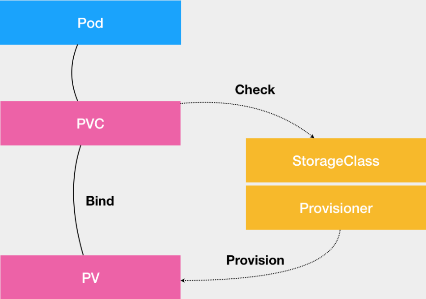
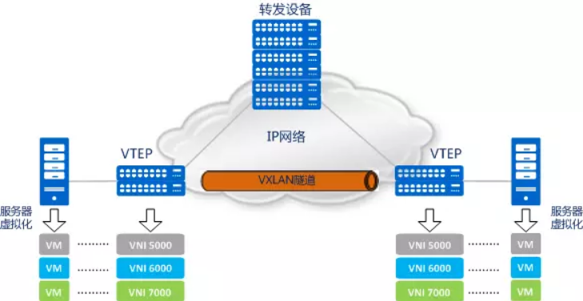
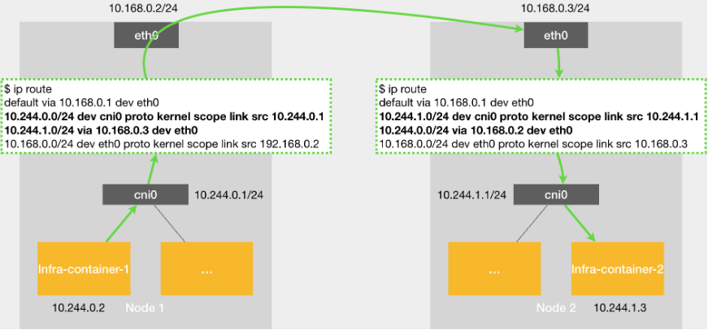

## Kubernetes yaml文件

### PV和PVC工作原理

**PV**：描述持久化存储数据卷，定义的是一个持久化存储在宿主机上的目录，比如一个 NFS 的挂载目录。通常由运维人员事先创建在 Kubernetes 集群里待用的。

**PVC**：是 Pod 所希望使用的持久化存储的属性，比如，Volume 存储的大小、可读写权限等等。通常由开发人员创建。

而创建的 PVC 要真正被容器使用起来，就必须先和某个符合条件的 PV 进行绑定。这里要检查的条件，包括两部分

- 第一个条件，当然是 PV 和 PVC 的 spec 字段。比如，PV 的存储（storage）大小，就必须满足 PVC 的要求。
- 而第二个条件，则是 PV 和 PVC 的 storageClassName 字段必须一样。

当然一个大规模的Kubernetes 集群里很可能有成千上万个 PVC，意味着运维人员必须得事先创建出成千上万个 PV。就不得不继续添加新的、能满足条件的 PV，否则新的 Pod 就会因为 PVC 绑定不到 PV 而失败。在实际操作中，这几乎没办法靠人工做到。

**Dynamic Provisioning**：自动创建 PV 的机制，机制工作的核心在于StorageClass （API对象）。

**StorageClass**：创建 PV 的模板，它会定义如下两个部分

- 第一，PV 的属性。比如，存储类型、Volume 的大小等等。
- 第二，创建这种 PV 需要用到的存储插件。比如，Ceph 等等。

有了这样两个信息之后，Kubernetes 就能够根据用户提交的 PVC，找到一个对应的 StorageClass 了。然后，Kubernetes 就会调用该 StorageClass 声明的存储插件，创建出需要的 PV。

如下例子

~~~
apiVersion: ceph.rook.io/v1beta1
kind: Pool
metadata:
  name: replicapool
  namespace: rook-ceph
spec:
  replicated:
    size: 3
---
apiVersion: storage.k8s.io/v1
kind: StorageClass
metadata:
  name: block-service
provisioner: ceph.rook.io/block
parameters:
  pool: replicapool
  #The value of "clusterNamespace" MUST be the same as the one in which your rook cluster exist
  clusterNamespace: rook-ceph
~~~

> **provisioner**：是存储插件的名字

这样就定义了一个名叫block-service的StorageClass，有了 StorageClass 的 YAML 文件之后，运维人员就可以在 Kubernetes 里创建这个 StorageClass 了

~~~
kubectl create -f sc.yaml
~~~

而开发者，只需要在要运行的 PVC 里指定要使用的 StorageClass 名字即可，如下所示

~~~
apiVersion: v1
kind: PersistentVolumeClaim
metadata:
  name: claim1
spec:
  accessModes:
    - ReadWriteOnce
  storageClassName: block-service
  resources:
    requests:
      storage: 30Gi
~~~

> PVC 里添加了一个叫作 storageClassName 的字段，用于指定该 PVC 所要使用的 StorageClass 的名字是block-service。

这样Kubernetes 就会将 StorageClass 相同的 PVC 和 PV 绑定起来。

- PVC 描述的，是 Pod 想要使用的持久化存储的属性，比如存储的大小、读写权限等。
- PV 描述的，则是一个具体的 Volume 的属性，比如 Volume 的类型、挂载目录、远程存储服务器地址等。
- 而 StorageClass 的作用，则是充当 PV 的模板。并且，只有同属于一个 StorageClass 的 PV 和 PVC，才可以绑定在一起。

也正是因为这套存储体系，使得使用者不需要类似挂载一样分配磁盘空间，也不会对已有的用户造成影响，PVC 的 YAML并没有任何改变，这个特性所有的实现只会影响到PV的处理，这就是“解耦”的好处。

### Flannel工作原理

**先说下传统数据中心网络面试的挑战**

> 传统网络模型

- 虚拟机规模受网络设备表项规格的限制
  - 对于同网段主机的通信而言，报文通过查询MAC表进行二层转发。服务器虚拟化后，数据中心中VM的数量比原有的物理机发生了数量级的增长，伴随而来的便是虚拟机网卡MAC地址数量的空前增加。MAC地址表项规模已经无法满足快速增长的VM数量。
- 传统网络的隔离能力有限
  - VLAN作为当前主流的网络隔离技术，在标准定义中只有12比特，也就是说可用的VLAN数量只有4000个左右。对于公有云或其它大型虚拟化云计算服务这种动辄上万甚至更多租户的场景而言，VLAN的隔离能力显然不够
- 虚拟机迁移范围受限
  - 虚拟机迁移，顾名思义，就是将虚拟机从一个物理机迁移到另一个物理机，但是要求在迁移过程中业务不能中断。要做到这一点，需要保证虚拟机迁移前后，其IP地址、MAC地址等参数维持不变。这就决定了，虚拟机迁移必须发生在一个二层域中。而传统数据中心网络的二层域，将虚拟机迁移限制在了一个较小的局部范围内。

目前Flannel 支持三种后端实现，分别是

1. VXLAN；
2. host-gw；
3. UDP（性能较差）；

#### **VXLAN**

即 Virtual Extensible LAN（虚拟可扩展局域网），是 Linux 内核本身就支持的一种网络虚似化技术。完全在内核态实现封装和解封装的工作，采用L2 over L4（MAC-in-UDP）的报文封装模式，将二层报文用三层协议进行封装，可实现二层网络在三层范围内进行扩展，同时满足数据中心大二层虚拟迁移和多租户的需求。

> VXLAN网络模型，出现了以下传统数据中心网络中没有的新元素
>
> - VTEP（VXLAN Tunnel Endpoints，VXLAN隧道端点）
>   - VXLAN网络的边缘设备，是VXLAN隧道的起点和终点，VXLAN报文的相关处理均在这上面进行。它是VXLAN网络中绝对的主角，后面会讲到。
> - VNI（VXLAN Network Identifier，VXLAN 网络标识符）
>   - 以太网数据帧中VLAN只占了12比特的空间，这使得VLAN的隔离能力在数据中心网络中力不从心。而VNI的出现，就是专门解决这个问题的。VNI是一种类似于VLAN ID的用户标示，一个VNI代表了一个租户，属于不同VNI的虚拟机之间不能直接进行二层通信。VXLAN报文封装时，给VNI分配了足够的空间使其可以支持海量租户的隔离。
> - VXLAN隧道
>   - 就是将原始报文“变身”下，加以“包装”，好让它可以在承载网络（比如IP网络）上传输。“VXLAN隧道”便是用来传输经过VXLAN封装的报文的，它是建立在两个VTEP之间的一条虚拟通道。

**VXLAN如何解决传统数据中心的一系列问题**

- 隐形
  - 前文提到MAC地址表项规模有限制，这时就需要VTEP，VTEP会将VM发出的原始报文封装成一个新的UDP报文，并使用物理网络的IP和MAC地址作为外层头，对网络中的其他设备只表现为封装后的参数。也就是说，网络中的其他设备看不到VM发送的原始报文。
  - 如果服务器作为VTEP，那从服务器发送到接入设备的报文便是经过封装后的报文，这样，接入设备就不需要学习VM的MAC地址了，它只需要根据外层封装的报文头负责基本的三层转发就可以了。因此，虚拟机规模就不会受网络设备表项规格的限制了。
  - 当然，如果网络设备作为VTEP，它还是需要学习VM的MAC地址。但是，从对报文进行封装的角度来说，网络设备的性能还是要比服务器强很多。
- 扩容
  - 对于“传统网络的隔离能力有限”这个问题，VXLAN采用了“扩容”的解决方法，引入了类似VLAN ID的用户标示，也就是前文提到的VNI。一个VNI代表了一个租户，属于不同VNI的虚拟机之间不能直接进行二层通信。VTEP在对报文进行VXLAN封装时，给VNI分配了24比特的空间，这就意味着VXLAN网络理论上支持多达16M（即224-1）的租户隔离。相比VLAN，VNI的隔离能力得到了巨大的提升，有效得解决了云计算中海量租户隔离的问题。
- 迁移
  - VXLAN网络模型有了VTEP的封装机制和VXLAN隧道后，所谓的 “二层域”就可以轻而易举的突破物理上的界限，也就是说，在IP网络中， 看起来传输的是跨越三层网络的UDP报文，实际却已经悄悄将源VM的原始报文送达目的VM。就好像在三层的网络之上，构建出了一个虚拟的二层网络，而且只要IP网络路由可达，这个虚拟的二层网络想做多大就做多大
- 更多详解内容请参考[这篇文章](https://blog.csdn.net/tony_vip/article/details/100097245)

#### host-gw

> host-gw示意图

假设现在，Node 1 上的 Infra-container-1，要访问 Node 2 上的 Infra-container-2。

当你设置 Flannel 使用 host-gw 模式之后，flanneld 会在宿主机上创建这样一条规则，以 Node 1 为例

~~~
$ip route
...
10.244.1.0/24 via 10.168.0.3 dev eth0
~~~

> 注释目的 IP 地址属于 10.244.1.0/24 网段的 IP 包，应该经过本机的 eth0 设备发出去（即dev eth0）；并且，它下一跳地址（next-hop）是 10.168.0.3（即via 10.168.0.3）。

所谓下一跳地址就是如果 IP 包从主机 A 发到主机 B，需要经过路由设备 X 的中转。那么 X 的 IP 地址就应该配置为主机 A 的下一跳地址。

而从 host-gw 示意图中我们可以看到，这个下一跳地址对应的，正是我们的目的宿主机 Node 2。

一旦配置了下一跳地址，那么接下来，当 IP 包从网络层进入链路层封装成帧的时候，eth0 设备就会使用下一跳地址对应的 MAC 地址，作为该数据帧的目的 MAC 地址。显然，这个 MAC 地址，正是 Node 2 的 MAC 地址。

这样，这个数据帧就会从 Node 1 通过宿主机的二层网络顺利到达 Node 2 上。

而 Node 2 的内核网络栈从二层数据帧里拿到 IP 包后，会“看到”这个 IP 包的目的 IP 地址是 10.244.1.3，即 Infra-container-2 的 IP 地址。这时候，根据 Node 2 上的路由表，该目的地址会匹配到第二条路由规则（也就是 10.244.1.0 对应的路由规则），从而进入 cni0 网桥，进而进入到 Infra-container-2 当中。

可以看到，**host-gw 模式的工作原理，其实就是将每个 Flannel 子网（Flannel Subnet，比如10.244.1.0/24）的“下一跳”，设置成了该子网对应的宿主机的 IP 地址。**

也就是说，这台“主机”（Host）会充当这条容器通信路径里的“网关”（Gateway）。这也正是“host-gw”的含义。

当然，Flannel 子网和主机的信息，都是保存在 Etcd 当中的。flanneld 只需要 WACTH 这些数据的变化，然后实时更新路由表即可。

> 注意在 Kubernetes v1.7 之后，类似 Flannel、Calico 的 CNI 网络插件都是可以直接连接 Kubernetes 的 APIServer 来访问 Etcd 的，无需额外部署 Etcd 给它们使用。

而在这种模式下，容器通信的过程就免除了额外的封包和解包带来的性能损耗。根据实际的测试，host-gw 的性能损失大约在 10% 左右，而其他所有基于 VXLAN“隧道”机制的网络方案，性能损失都在 20%~30% 左右。

**Flannel host-gw 模式必须要求集群宿主机之间是二层连通的。**

**总结**基于上述原因，如果是在公有云上，由于宿主机网络本身比较“直白”，一般推荐更加简单的 Flannel host-gw 模式。（Calico项目也非常不错）

### Service工作原理及实现模式

为什么使用Service，一方面是因为 Pod 的 IP 不是固定的，另一方面则是因为一组 Pod 实例之间总会有负载均衡的需求。

一个最典型的 Service 定义，如下所示

~~~
apiVersion: v1
kind: Service
metadata:
  name: hostnames
spec:
  selector:
    app: hostnames
  ports:
  - name: default
    protocol: TCP
    port: 80
    targetPort: 9376
~~~

> **selector**：声明这个 Service 只代理携带了 app=hostnames 标签的 Pod
>
> **ports**：这个Service的80端口，代理的是 Pod 的 9376 端口

对应的Deployment，如下所示

~~~
apiVersion: apps/v1
kind: Deployment
metadata:
  name: hostnames
spec:
  selector:
    matchLabels:
      app: hostnames
  replicas: 3
  template:
    metadata:
      labels:
        app: hostnames
    spec:
      containers:
      - name: hostnames
        image: k8s.gcr.io/serve_hostname
        ports:
        - containerPort: 9376
          protocol: TCP
~~~

> 这个应用的作用就是，就是每次访问 9376 端口时，返回它自己的 hostname

通过该 Service 的 VIP 地址 10.0.1.175，你就可以访问到它所代理的 Pod 了

~~~
$ kubectl get svc hostnames
NAME        TYPE        CLUSTER-IP   EXTERNAL-IP   PORT(S)   AGE
hostnames   ClusterIP   10.0.1.175   <none>        80/TCP    5s
 
$ curl 10.0.1.175:80
hostnames-0uton
 
$ curl 10.0.1.175:80
hostnames-yp2kp
 
$ curl 10.0.1.175:80
hostnames-bvc05
~~~

> 这个 VIP 地址是 Kubernetes 自动为 Service 分配的。而像上面这样，通过三次连续不断地访问 Service 的 VIP 地址和代理端口 80，它就为我们依次返回了三个 Pod 的 hostname。这也正印证了 Service 提供的是 Round Robin 方式的负载均衡。对于这种方式，我们称为ClusterIP 模式的 Service。
>
> 关于Service的负载均衡，再Ingress部分做补充

实际上，**Service 是由 kube-proxy 组件，加上 iptables 来共同实现的。**

举个例子，对于我们前面创建的名叫 hostnames 的 Service 来说，一旦它被提交给 Kubernetes，那么 kube-proxy 就可以通过 Service 的 Informer 感知到这样一个 Service 对象的添加。而作为对这个事件的响应，它就会在宿主机上创建这样一条 iptables 规则（你可以通过 iptables-save 看到它），如下所示

~~~
-A KUBE-SERVICES -d 10.0.1.175/32 -p tcp -m comment --comment "default/hostnames: cluster IP" -m tcp --dport 80 -j KUBE-SVC-NWV5X2332I4OT4T3
~~~

可以看到，这条 iptables 规则的含义是凡是目的地址是 10.0.1.175、目的端口是 80 的 IP 包，都应该跳转到另外一条名叫 KUBE-SVC-NWV5X2332I4OT4T3 的 iptables 链进行处理。

kube-proxy 通过 iptables 处理 Service 的过程，其实需要在宿主机上设置相当多的 iptables 规则。而且，kube-proxy 还需要在控制循环里不断地刷新这些规则来确保它们始终是正确的。

不难想到，当你的宿主机上有大量 Pod 的时候，成百上千条 iptables 规则不断地被刷新，会大量占用该宿主机的 CPU 资源，甚至会让宿主机“卡”在这个过程中。所以说，**一直以来，基于 iptables 的 Service 实现，都是制约 Kubernetes 项目承载更多量级的 Pod 的主要障碍。**

这是就需要 IPVS 模式的 Service，其工作原理当我们创建了前面的 Service 之后，kube-proxy 首先会在宿主机上创建一个虚拟网卡（叫作kube-ipvs0），并为它分配 Service VIP 作为 IP 地址，如下所示

~~~
# ip addr
  ...
  73kube-ipvs0<BROADCAST,NOARP>  mtu 1500 qdisc noop state DOWN qlen 1000
  link/ether  1a:ce:f5:5f:c1:4d brd ff:ff:ff:ff:ff:ff
  inet 10.0.1.175/32  scope global kube-ipvs0
  valid_lft forever  preferred_lft forever
~~~

而接下来，kube-proxy 就会通过 Linux 的 IPVS 模块，为这个 IP 地址设置三个 IPVS 虚拟主机，并设置这三个虚拟主机之间使用轮询模式 (rr) 来作为负载均衡策略。我们可以通过 ipvsadm 查看到这个设置，如下所示

~~~
# ipvsadm -ln
 IP Virtual Server version 1.2.1 (size=4096)
  Prot LocalAddress:Port Scheduler Flags
    ->  RemoteAddress:Port           Forward  Weight ActiveConn InActConn     
  TCP  10.102.128.4:80 rr
    ->  10.244.3.6:9376    Masq    1       0          0         
    ->  10.244.1.7:9376    Masq    1       0          0
    ->  10.244.2.3:9376    Masq    1       0          0
~~~

> 这三个 IPVS 虚拟主机的 IP 地址和端口，对应的正是三个被代理的 Pod。

这时候，任何发往 10.102.128.4:80 的请求，就都会被 IPVS 模块转发到某一个后端 Pod 上了。

而相比于 iptables，IPVS 在内核中的实现其实也是基于 Netfilter 的 NAT 模式，所以在转发这一层上，理论上 IPVS 并没有显著的性能提升。但是，IPVS 并不需要在宿主机上为每个 Pod 设置 iptables 规则，而是把对这些“规则”的处理放到了内核态，从而极大地降低了维护这些规则的代价。这也正印证了我在前面提到过的，“将重要操作放入内核态”是提高性能的重要手段。

当然，IPVS 模块只负责上述的负载均衡和代理功能。而一个完整的 Service 流程正常工作所需要的包过滤、SNAT 等操作，还是要靠 iptables 来实现。只不过，这些辅助性的 iptables 规则数量有限，也不会随着 Pod 数量的增加而增加。

所以，在大规模集群里，非常建议为 kube-proxy 设置–proxy-mode=ipvs 来开启这个功能。它为 Kubernetes 集群规模带来的提升，还是非常巨大的。

**Service 与 DNS 的关系**

Service 和 Pod 都会被分配对应的 DNS A 记录（从域名解析 IP 的记录）

- ClusterIP 模式的 Service 比如上面的例子，它的 A 记录的格式是..svc.cluster.local。当你访问这条 A 记录的时候，它解析到的就是该 Service 的 VIP 地址。
- 指定了 clusterIP=None 的 Headless Service它的 A 记录的格式也是..svc.cluster.local。但是，当你访问这条 A 记录的时候，它返回的是所有被代理的 Pod 的 IP 地址的集合。当然，如果你的客户端没办法解析这个集合的话，它可能会只会拿到第一个 Pod 的 IP 地址。

### 外界连通Service与Service调试“三板斧”

Service 的访问信息在 Kubernetes 集群之外，其实是无效的。

这其实也容易理解所谓 Service 的访问入口，其实就是每台宿主机上由 kube-proxy 生成的 iptables 规则，以及 kube-dns 生成的 DNS 记录。而一旦离开了这个集群，这些信息对用户来说，也就自然没有作用了。

所以，在使用 Kubernetes 的 Service 时，一个必须要面对和解决的问题就是**如何从外部（Kubernetes 集群之外），访问到 Kubernetes 里创建的 Service？**

**最常用的一种方式就是NodePort。**例子

~~~
apiVersion: v1
kind: Service
metadata:
  name: my-nginx
  labels:
    run: my-nginx
spec:
  type: NodePort
  ports:
  - nodePort: 8080
    targetPort: 80
    protocol: TCP
    name: http
  - nodePort: 443
    protocol: TCP
    name: https
  selector:
    run: my-nginx
~~~

> **type=NodePort**：声明它的类型
>
> **ports**：声明了 Service 的 8080 端口代理 Pod 的 80 端口，Service 的 443 端口代理 Pod 的 443 端口。

这时候，要访问这个 Service，你只需要访问

~~~
< 任何一台宿主机的 IP 地址 >:8080
~~~

就可以访问到某一个被代理的 Pod 的 80 端口了。在 NodePort 方式下，Kubernetes 会在 IP 包离开宿主机发往目的 Pod 时，对这个 IP 包做一次 SNAT 操作，如下所示

~~~
-A KUBE-POSTROUTING -m comment --comment "kubernetes service traffic requiring SNAT" -m mark --mark 0x4000/0x4000 -j MASQUERADE
~~~

> 这条规则设置在 POSTROUTING 检查点给即将离开这台主机的 IP 包，进行了一次 SNAT 操作，将这个 IP 包的源地址替换成了这台宿主机上的 CNI 网桥地址，或者宿主机本身的 IP 地址（如果 CNI 网桥不存在的话）。

如果一台宿主机上，没有任何一个被代理的 Pod 存在，使用 node 2 的 IP 地址访问这个 Service，请求会直接被 DROP 掉。

**第二种方式，适用于公有云上的 Kubernetes 服务**

可以指定一个 LoadBalancer 类型的 Service，如下所示

~~~
---
kind: Service
apiVersion: v1
metadata:
  name: example-service
spec:
  ports:
  - port: 8765
    targetPort: 9376
  selector:
    app: example
  type: LoadBalancer
~~~

在公有云提供的 Kubernetes 服务里，都使用了一个叫作 CloudProvider 的转接层，来跟公有云本身的 API 进行对接。所以，在上述 LoadBalancer 类型的 Service 被提交后，Kubernetes 就会调用 CloudProvider 在公有云上为你创建一个负载均衡服务，并且把被代理的 Pod 的 IP 地址配置给负载均衡服务做后端。

**第三种方式，是 Kubernetes 在 1.7 之后支持的一个新特性，叫作 ExternalName**

举例

~~~
kind: Service
apiVersion: v1
metadata:
  name: my-service
spec:
  type: ExternalName
  externalName: my.database.example.com
~~~

> 指定了一个 externalName=my.database.example.com 的字段

当通过 Service 的 DNS 名字访问它的时候，比如访问my-service.default.svc.cluster.local。那么，Kubernetes 返回的就是`my.database.example.com`。所以说，ExternalName 类型的 Service，其实是在 kube-dns 里为你添加了一条 CNAME 记录。这时，访问 my-service.default.svc.cluster.local 就和访问 my.database.example.com 这个域名是一个效果了。

实际上，在理解了 Kubernetes Service 机制的工作原理之后，很多与 Service 相关的问题，其实都可以通过分析 Service 在宿主机上对应的 iptables 规则（或者 IPVS 配置）得到解决。

举例当你的 Service 没办法通过 DNS 访问到的时候。你就需要区分到底是 Service 本身的配置问题，还是集群的 DNS 出了问题。一个行之有效的方法，就是检查 Kubernetes 自己的 Master 节点的 Service DNS 是否正常

~~~
# 在一个 Pod 里执行
$ nslookup kubernetes.default
Server:    10.0.0.10
Address 1: 10.0.0.10 kube-dns.kube-system.svc.cluster.local
 
Name:      kubernetes.default
Address 1: 10.0.0.1 kubernetes.default.svc.cluster.local
~~~

如果上面访问 kubernetes.default 返回的值都有问题，那你就需要检查 kube-dns 的运行状态和日志了。否则的话，你应该去检查自己的 Service 定义是不是有问题。

而如果你的 Service 没办法通过 ClusterIP 访问到的时候，你首先应该检查的是这个 Service 是否有 Endpoints

> **Endpoints**：被 selector 选中的 Pod，就称为 Service 的 Endpoints，只有处于 Running 状态，且 readinessProbe 检查通过的 Pod，才会出现在 Service 的 Endpoints 列表里

~~~
$ kubectl get endpoints hostnames
NAME        ENDPOINTS
hostnames   10.244.0.5:9376,10.244.0.6:9376,10.244.0.7:9376
~~~

需要注意的是，如果你的 Pod 的 readniessProbe 没通过，它也不会出现在 Endpoints 列表里。

而如果 Endpoints 正常，那么你就需要确认 kube-proxy 是否在正确运行。在我们通过 kubeadm 部署的集群里，你应该看到 kube-proxy 输出的日志如下所示

~~~
I1027 22:14:53.995134    5063 server.go:200] Running in resource-only container "/kube-proxy"
I1027 22:14:53.998163    5063 server.go:247] Using iptables Proxier.
I1027 22:14:53.999055    5063 server.go:255] Tearing down userspace rules. Errors here are acceptable.
I1027 22:14:54.038140    5063 proxier.go:352] Setting endpoints for "kube-system/kube-dns:dns-tcp" to [10.244.1.3:53]
I1027 22:14:54.038164    5063 proxier.go:352] Setting endpoints for "kube-system/kube-dns:dns" to [10.244.1.3:53]
I1027 22:14:54.038209    5063 proxier.go:352] Setting endpoints for "default/kubernetes:https" to [10.240.0.2:443]
I1027 22:14:54.038238    5063 proxier.go:429] Not syncing iptables until Services and Endpoints have been received from master
I1027 22:14:54.040048    5063 proxier.go:294] Adding new service "default/kubernetes:https" at 10.0.0.1:443/TCP
I1027 22:14:54.040154    5063 proxier.go:294] Adding new service "kube-system/kube-dns:dns" at 10.0.0.10:53/UDP
I1027 22:14:54.040223    5063 proxier.go:294] Adding new service "kube-system/kube-dns:dns-tcp" at 10.0.0.10:53/TCP
~~~

如果 kube-proxy 一切正常，你就应该仔细查看宿主机上的 iptables 了。而**一个 iptables 模式的 Service 对应的规则，我在上一篇以及这一篇文章里已经全部介绍到了，它们包括**

1. KUBE-SERVICES 或者 KUBE-NODEPORTS 规则对应的 Service 的入口链，这个规则应该与 VIP 和 Service 端口一一对应；
2. KUBE-SEP-(hash) 规则对应的 DNAT 链，这些规则应该与 Endpoints 一一对应；
3. KUBE-SVC-(hash) 规则对应的负载均衡链，这些规则的数目应该与 Endpoints 数目一致；
4. 如果是 NodePort 模式的话，还有 POSTROUTING 处的 SNAT 链。

通过查看这些链的数量、转发目的地址、端口、过滤条件等信息，你就能很容易发现一些异常的蛛丝马迹。

当然，**还有一种典型问题，就是 Pod 没办法通过 Service 访问到自己**。这往往就是因为 kubelet 的 hairpin-mode 没有被正确设置。

在 hairpin-veth 模式下，你应该能看到 CNI 网桥对应的各个 VETH 设备，都将 Hairpin 模式设置为了 1，如下所示

~~~
$ for d in /sys/devices/virtual/net/cni0/brif/veth*/hairpin_mode; do echo "$d = $(cat $d)"; done
/sys/devices/virtual/net/cni0/brif/veth4bfbfe74/hairpin_mode = 1
/sys/devices/virtual/net/cni0/brif/vethfc2a18c5/hairpin_mode = 1
~~~

而如果是 promiscuous-bridge 模式的话，你应该看到 CNI 网桥的混杂模式（PROMISC）被开启，如下所示

~~~
$ ifconfig cni0 |grep PROMISC
UP BROADCAST RUNNING PROMISC MULTICAST  MTU:1460  Metric:1
~~~

### Service和Ingress

由于每个 Service 都要有一个负载均衡服务，所以这个做法实际上既浪费成本又高。作为用户，我其实更希望看到 Kubernetes 为我内置一个全局的负载均衡器。然后，通过我访问的 URL，把请求转发给不同的后端 Service。

**这种全局的、为了代理不同后端 Service 而设置的负载均衡服务，就是 Kubernetes 里的 Ingress 服务。所谓Ingress，就是Service的“Service”**

一个 Ingress 对象的主要内容，实际上就是一个“反向代理”服务（比如Nginx）的配置文件的描述。而这个代理服务对应的转发规则，就是 IngressRule。

Ingress 只能工作在七层，而 Service 只能工作在四层。所以当你想要在 Kubernetes 里为应用进行 TLS 配置等 HTTP 相关的操作时，都必须通过 Ingress 来进行。

有了 Ingress 这个抽象，用户就可以根据自己的需求来自由选择 Ingress Controller。比如，如果你的应用对代理服务的中断非常敏感，那么你就应该考虑选择类似于 Traefik 这样支持“热加载”的 Ingress Controller 实现。

