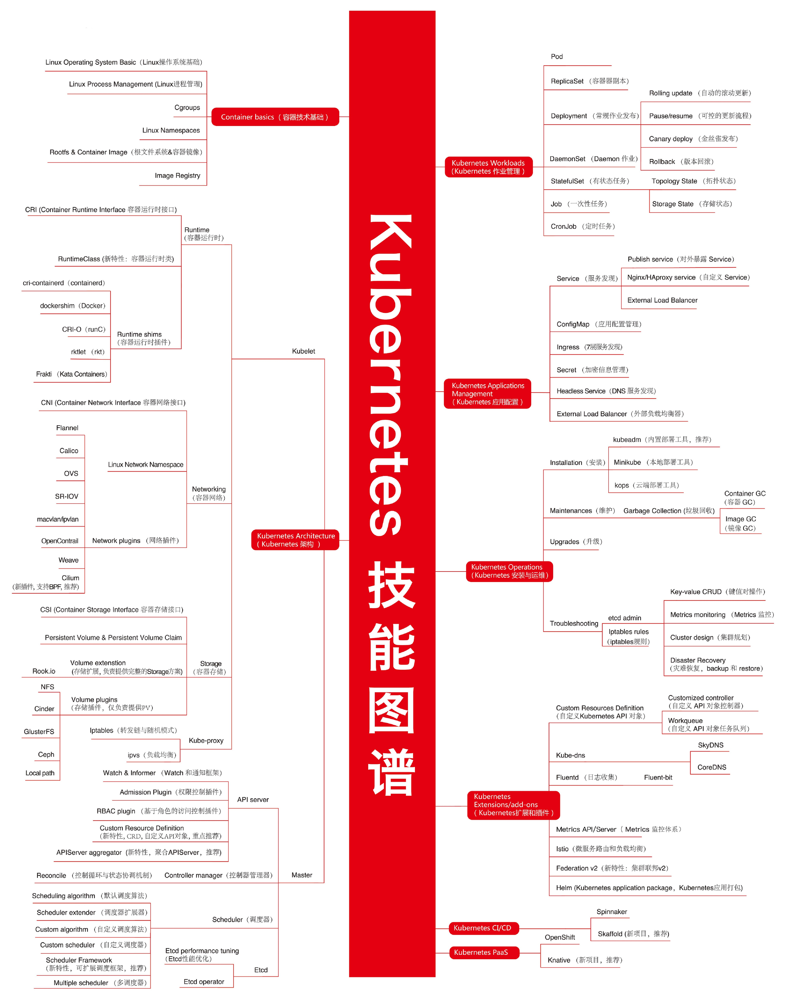

## Kubernetes基本概念

### 初识Pod

> **WHAT**：它只是一个逻辑概念、是一种编排思想、k8s中最小编排单位，k8s处理的还是宿主机上Linux的Namespace和Cgrous
>
> **WHY：**
>
> - 一些容器更适合放在一起紧密协作
> - 容器的日志收集

**Pod 里的所有容器，共享的是同一个 Network Namespace，并且可以声明共享同一个 Volume。**

对与上面的容器的日志收集，举例：有一个应用，需要不断地把日志文件输出到容器的 /var/log 目录，这时我们把一个 Pod 里的 Volume 挂载到应用容器的 /var/log 目录上。然后在这个Pod里运行一个 sidecar 容器，也声明挂载同一个 Volume 到自己的 /var/log 目录上。sidecar 容器就只需要做一件事儿，就是不断地从自己的 /var/log 目录里读取日志文件，转发到 MongoDB 或者 Elasticsearch 中存储起来。一个最基本的日志收集工作就完成了。

**实际工作中：**当你需要把一个运行在虚拟机里的应用迁移到 Docker 容器中时，一定要仔细分析到底有哪些进程（组件）运行在这个虚拟机里。

然后，你就可以把整个虚拟机想象成为一个 Pod，把这些进程分别做成容器镜像，把有顺序关系的容器，定义为 Init Container。这才是更加合理的、松耦合的容器编排诀窍，也是从传统应用架构，到“微服务架构”最自然的过渡方式。

### Pod中几个重要字段的含义和用法

**凡是调度、网络、存储，以及安全相关的属性，基本上是 Pod 级别的。**

**HostAliases**：定义了 Pod 的 hosts 文件（比如 /etc/hosts）里的内容，用法如下：

~~~
apiVersion: v1
kind: Pod
...
spec:
  hostAliases:
  - ip: "10.1.2.3"
    hostnames:
    - "foo.remote"
    - "bar.remote"
...
~~~

**shareProcessNamespace=true**：在这个 Pod 里的容器共享 PID Namespace

~~~
apiVersion: v1
kind: Pod
metadata:
  name: nginx
spec:
  shareProcessNamespace: true
  containers:
  - name: nginx
    image: nginx
  - name: shell
    image: busybox
    stdin: true
    tty: tru
~~~

上面的YAML文件中，还定义了两个容器：一个是 nginx 容器，一个是开启了 tty 和 stdin 的 shell 容器。在 Pod 的 YAML 文件里声明开启它们俩，其实等同于设置了 docker run 里的 -it（-i 即 stdin，-t 即 tty）参数。

> **tty**：Linux 给用户提供的一个常驻小程序，用于接收用户的标准输入，返回操作系统的标准输出
>
> **stdin**：为了能够在 tty 中输入信息，还需要同时开启 stdin（标准输入流）。

这个 Pod 被创建后，你就可以使用 shell 容器的 tty 跟这个容器进行交互了。

**容器要共享宿主机的 Namespace，也一定是 Pod 级别的定义**

~~~
apiVersion: v1
kind: Pod
metadata:
  name: nginx
spec:
  hostNetwork: true
  hostIPC: true
  hostPID: true
  containers:
  - name: nginx
    image: nginx
  - name: shell
    image: busybox
    stdin: true
    tty: true
~~~

在这个 Pod 中，定义了共享宿主机的 Network、IPC 和 PID Namespace。这就意味着，这个 Pod 里的所有容器，会直接使用宿主机的网络、直接与宿主机进行 IPC 通信、看到宿主机里正在运行的所有进程。

#### Container是Pod中最重要的字段

- **ImagePullPolicy**：定义了镜像拉取的策略

  - 默认是 Always，即每次创建 Pod 都重新拉取一次镜像。
  - 可以定义为 Never 或者 IfNotPresent，则意味着 Pod 永远不会主动拉取这个镜像，或者只在宿主机上不存在这个镜像时才拉取。

- **Lifecycle**：定义的是 Container Lifecycle Hooks。在容器状态发生变化时触发一系列“钩子”。如下例子：

  ~~~
  apiVersion: v1
  kind: Pod
  metadata:
    name: lifecycle-demo
  spec:
    containers:
    - name: lifecycle-demo-container
      image: nginx
      lifecycle:
        postStart:
          exec:
            command: ["/bin/sh", "-c", "echo Hello from the postStart handler > /usr/share/message"]
        preStop:
          exec:
            command: ["/usr/sbin/nginx","-s","quit"]
  ~~~

  > **postStart **：在容器启动后，立刻执行一个指定的操作。
  >
  > - 该操作虽然是在 Docker 容器 ENTRYPOINT 执行之后，但它并不严格保证顺序。也就是说，在 postStart 启动时，ENTRYPOINT 有可能还没有结束。
  > - 执行超时或者错误，Kubernetes 会在该 Pod 的 Events 中报出该容器启动失败的错误信息，导致 Pod 也处于失败的状态。
  >
  > **preStop**：preStop 发生的时机，则是容器被杀死之前（比如，收到了 SIGKILL 信号）。preStop 操作的执行，是**同步**的，它会阻塞当前的容器杀死流程，直到这个 Hook 定义操作完成之后，才允许容器被杀死 

### Pod的几种状态

1. **Pending**：这个状态意味着，Pod 的 YAML 文件已经提交给了 Kubernetes，API 对象已经被创建并保存在 Etcd 当中。但是，这个 Pod 里有些容器因为某种原因而不能被顺利创建。比如，调度不成功。
2. **Running**：这个状态下，Pod 已经调度成功，跟一个具体的节点绑定。它包含的容器都已经创建成功，并且至少有一个正在运行中。
3. **Succeeded**：这个状态意味着，Pod 里的所有容器都正常运行完毕，并且已经退出了。这种情况在运行一次性任务时最为常见。
4. **Failed**：这个状态下，Pod 里至少有一个容器以不正常的状态（非 0 的返回码）退出。这个状态的出现，意味着你得想办法 Debug 这个容器的应用，比如查看 Pod 的 Events 和日志。
5. **Unknown**：这是一个异常状态，意味着 Pod 的状态不能持续地被 kubelet 汇报给 kube-apiserver，这很有可能是主从节点（Master 和 Kubelet）间的通信出现了问题。

### 水平扩展和滚动升级

举个例子，如果你更新了 Deployment 的 Pod 模板（比如，修改了容器的镜像），那么 Deployment 就需要遵循一种叫作“滚动更新”（rolling update）的方式，来升级现有的容器。

这个能力的实现，依赖的是 Kubernetes 项目中的一个非常重要的概念（API 对象）：**ReplicaSet**。

~~~
apiVersion: apps/v1
kind: ReplicaSet
metadata:
  name: nginx-set
  labels:
    app: nginx
spec:
  replicas: 3
  selector:
    matchLabels:
      app: nginx
  template:
    metadata:
      labels:
        app: nginx
    spec:
      containers:
      - name: nginx
        image: nginx:1.7.9
~~~

> 它定义的 Pod 副本个数是 3（spec.replicas=3）。

**一个 ReplicaSet 对象，其实就是由副本数目的定义和一个 Pod 模板组成的**。“水平扩展 / 收缩”只需要把这个值3改成4或者4改成3。而将一个集群中正在运行的多个 Pod 版本，交替地逐一升级的过程（去掉旧的增加新的），就是“滚动更新”。

### RBAC:基于角色的权限控制

三个基本概念：

1. Role：角色，它其实是一组规则，定义了一组对 Kubernetes API 对象的操作权限。
2. Subject：被作用者，既可以是“人”，也可以是“机器”，也可以使你在 Kubernetes 里定义的“用户”。
3. RoleBinding：定义了“被作用者”和“角色”的绑定关系。

~~~
kind: Role
apiVersion: rbac.authorization.k8s.io/v1
metadata:
  namespace: mynamespace
  name: example-role
rules:
- apiGroups: [""]
  resources: ["pods"]
  verbs: ["get", "watch", "list"]
      ...
  secrets:
  - name: example-sa-token-vmfg6
~~~

>  Role 对象指定了它能产生作用的 Namepace 是：mynamespace。
>
> **rules**：定义权限规则
>
> **verbs**：赋予用户 example-user 的权限
>
> **secrets**：对应的、用来跟 APIServer 进行交互的授权文件，我们一般称它为：Token，它以一个 Secret 对象的方式保存在 Etcd 当中。

###  Operator 工作原理

> **WAHT：**一个相对更加灵活和编程友好的管理“有状态应用”的解决方案

以Etcd为例：

Etcd Operator 的使用方法非常简单，只需要两步即可完成：

**第一步，将这个 Operator 的代码 Clone 到本地：**

~~~
$git clone https://github.com/coreos/etcd-operator
~~~

**第二步，将这个 Etcd Operator 部署在 Kubernetes 集群里。**

~~~
$example/rbac/create_role.sh
~~~

上述脚本为 Etcd Operator 定义了如下所示的权限：

1. 对 Pod、Service、PVC、Deployment、Secret 等 API 对象，有所有权限；
2. 对 CRD 对象，有所有权限；
3. 对属于 etcd.database.coreos.com 这个 API Group 的 CR（Custom Resource）对象，有所有权限。

 Etcd Operator 本身，其实就是一个 Deployment，它的 YAML 文件如下所示：

~~~
apiVersion: extensions/v1beta1
kind: Deployment
metadata:
  name: etcd-operator
spec:
  replicas: 1
  template:
    metadata:
      labels:
        name: etcd-operator
    spec:
      containers:
      - name: etcd-operator
        image: quay.io/coreos/etcd-operator:v0.9.2
        command:
        - etcd-operator
        env:
        - name: MY_POD_NAMESPACE
          valueFrom:
            fieldRef:
              fieldPath: metadata.namespace
        - name: MY_POD_NAME
          valueFrom:
            fieldRef:
              fieldPath: metadata.name
...
~~~

使用上述的 YAML 文件来创建 Etcd Operator

~~~
kubectl create -f example/deployment.yaml
~~~

tcd Operator 的 Pod 进入了 Running 状态，就有一个 CRD 被自动创建了出来，如下所示：

~~~
$kubectl get pods
NAME                              READY     STATUS      RESTARTS   AGE
etcd-operator-649dbdb5cb-bzfzp    1/1       Running     0          20s
 
$kubectl get crd
NAME                                    CREATED AT
etcdclusters.etcd.database.coreos.com   2018-09-18T11:42:55Z
~~~

这个 CRD 名叫`etcdclusters.etcd.database.coreos.com` 。你可以通过 kubectl describe 命令看到它的细节，如下所示：

~~~
kubectl describe crd  etcdclusters.etcd.database.coreos.com
...
Group:   etcd.database.coreos.com
  Names:
    Kind:       EtcdCluster
    List Kind:  EtcdClusterList
    Plural:     etcdclusters
    Short Names:
      etcd
    Singular:  etcdcluster
  Scope:       Namespaced
  Version:     v1beta2
  
...
~~~

> 这个 CRD 相当于告诉了 Kubernetes：接下来，如果有 API 组（Group）是`etcd.database.coreos.com`、API 资源类型（Kind）是“EtcdCluster”的 YAML 文件被提交上来，你可一定要认识啊。

所以说，通过上述两步操作，实际上是在 Kubernetes 里添加了一个名叫 EtcdCluster 的自定义资源类型。而 Etcd Operator 本身，就是这个自定义资源类型对应的自定义控制器。

当 Etcd Operator 部署好之后，接下来在这个 Kubernetes 里创建一个 Etcd 集群的工作就非常简单了。你只需要编写一个 EtcdCluster 的 YAML 文件，然后把它提交给 Kubernetes 即可，如下所示：

~~~
$kubectl apply -f example/example-etcd-cluster.yaml
~~~

这个 example-etcd-cluster.yaml 文件里描述的，是一个 3 个节点的 Etcd 集群。我们可以看到它被提交给 Kubernetes 之后，就会有三个 Etcd 的 Pod 运行起来，如下所示：

~~~
$kubectl get pods
NAME                            READY     STATUS    RESTARTS   AGE
example-etcd-cluster-dp8nqtjznc   1/1       Running     0          1m
example-etcd-cluster-mbzlg6sd56   1/1       Running     0          2m
example-etcd-cluster-v6v6s6stxd   1/1       Running     0          2m
~~~

以上就完成了Etcd集群

**Operator 的工作原理，实际上是利用了 Kubernetes 的自定义 API 资源（CRD），来描述我们想要部署的“有状态应用”；然后在自定义控制器里，根据自定义 API 对象的变化，来完成具体的部署和运维工作。**

### kubernetes技能图谱

