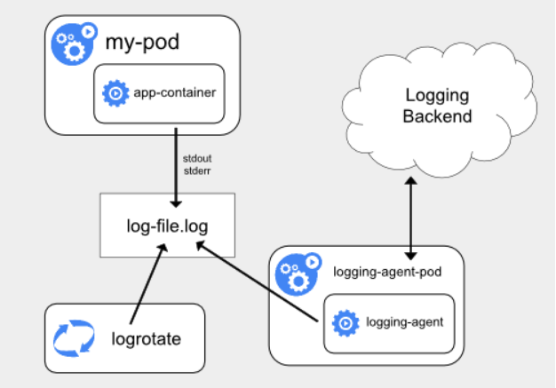
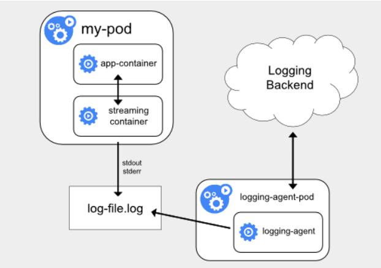
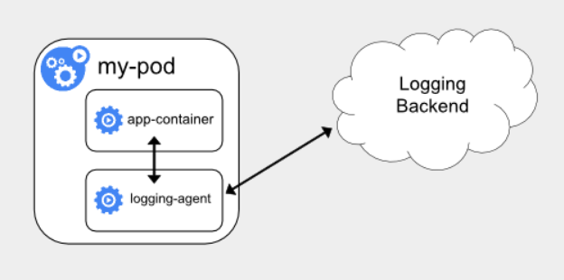

## Kubernetes相关生态

### Prometheus、Metrics Server与Kubernetes监控体系

> 简介：Prometheus 项目与 Kubernetes 项目一样，也来自于 Google 的 Borg 体系，它的原型系统，叫作 BorgMon，是一个几乎与 Borg 同时诞生的内部监控系统

Prometheus 项目的作用和工作方式，官方示意图

> Prometheus 项目工作的核心，是使用 Pull （抓取）的方式去搜集被监控对象的 Metrics 数据（监控指标数据），然后，再把这些数据保存在一个 TSDB （时间序列数据库，比如 OpenTSDB、InfluxDB 等）当中，以便后续可以按照时间进行检索。
>
> **Pushgateway**：允许被监控对象以 Push 的方式向 Prometheus 推送 Metrics 数据
>
> **Alertmanager**：可以根据 Metrics 信息灵活地设置报警
>
> **Grafana **：对外暴露出的、可以灵活配置的监控数据可视化界面

#### Metrics 数据的来源

- 第一种 Metrics，是宿主机的监控数据
  - 这部分数据的提供，需要借助一个由 Prometheus 维护的[Node Exporter](https://github.com/prometheus/node_exporter) 工具，就是代替被监控对象来对 Prometheus 暴露出可以被“抓取”的 Metrics 信息的一个辅助进程。
- 第二种 Metrics，是来自于 Kubernetes 的 API Server、kubelet 等组件的 /metrics API
  - 除了常规的 CPU、内存的信息外，这部分信息还主要包括了各个组件的核心监控指标。比如，对于 API Server 来说，它就会在 /metrics API 里，暴露出各个 Controller 的工作队列（Work Queue）的长度、请求的 QPS 和延迟数据等等。这些信息，是检查 Kubernetes 本身工作情况的主要依据。
- 第三种 Metrics，是 Kubernetes 相关的监控数据
  - 这部分数据，一般叫作 Kubernetes 核心监控数据（core metrics）。这其中包括了 Pod、Node、容器、Service 等主要 Kubernetes 核心概念的 Metrics。
  - 这里提到的 Kubernetes 核心监控数据，其实使用的是 Kubernetes 的一个非常重要的扩展能力，叫作 Metrics Server。在社区的定位，是用来取代Heapster。

在具体的监控指标规划上，建议你**遵循业界通用的 USE 原则和 RED 原则**

USE 原则指的是，按照如下三个维度来规划资源监控指标（原则是主要关注“资源”）

1. 利用率（Utilization），资源被有效利用起来提供服务的平均时间占比；
2. 饱和度（Saturation），资源拥挤的程度，比如工作队列的长度；
3. 错误率（Errors），错误的数量。

RED 原则指的是，按照如下三个维度来规划服务监控指标（原则是主要关注“服务”）

1. 每秒请求数量（Rate）；
2. 每秒错误数量（Errors）；
3. 服务响应时间（Duration）。

### 日志收集与管理

> Kubernetes 中对容器日志的处理方式,都叫做 cluster-level-logging，即这个日志处理系统，与容器、Pod 以及 Node 的生命周期都是完全无关的。这种设计当然是为了保证，无论是容器挂了、Pod 被删除，甚至节点宕机的时候，应用的日志依然可以被正常获取到。

**第一种，在 Node 上部署 logging agent，将日志文件转发到后端存储里保存起来**，架构图如下

这里的核心在于 logging agent ，它一般都会以 DaemonSet 的方式运行在节点上，然后将宿主机上的容器日志目录挂载进去，最后由 logging-agent 把日志转发出去。

**优势**：在 Node 上部署 logging agent，在于一个节点只需要部署一个 agent，并且不会对应用和 Pod 有任何侵入性。

**不足**：要求应用输出的日志，都必须是直接输出到容器的 stdout 和 stderr 里。即如果每秒日志量很大时，直接输出到容器的stdout和stderr,很容易就把系统日志配额用满，因为对系统默认日志工具是针对单服务(例如docker)而不是进程进行限额的，最终导致的结果就是日志被吞掉。解决办法一个是增加配额，一个是给容器挂上存储，将日志输出到存储上

> **stdout 和 stderr**stdout是标准输出，stderr是错误输出

**第二种，就是对这种特殊情况的一个处理，即当容器的日志只能输出到某些文件里的时候，我们可以通过一个 sidecar 容器把这些日志文件重新输出到 sidecar 的 stdout 和 stderr 上，这样就能够继续使用第一种方案了。**架构图如下

**不足**：宿主机上实际上会存在两份相同的日志文件一份是应用自己写入的；另一份则是 sidecar 的 stdout 和 stderr 对应的 JSON 文件。这对磁盘是很大的浪费，除非万不得已或者应用容器完全不可能被修改，否则不要使用这个方案

**第三种方案，就是通过一个 sidecar 容器，直接把应用的日志文件发送到远程存储里面去**，架构图如下

**优势**：直接把日志输出到固定的文件里而不是 stdout，logging-agent 可以使用 fluentd，后端存储可以是 ElasticSearch。部署简单，对宿主机友好。

**不足**：这个 sidecar 容器很可能会消耗较多的资源，甚至拖垮应用容器。并且，由于日志还是没有输出到 stdout 上，所以你通过 kubectl logs 是看不到任何日志输出的。

最后，无论是哪种方案，都必须要及时将这些日志文件从宿主机上清理掉，或者给日志目录专门挂载一些容量巨大的远程盘。否则，一旦主磁盘分区被打满，整个系统就可能会陷入奔溃状态。