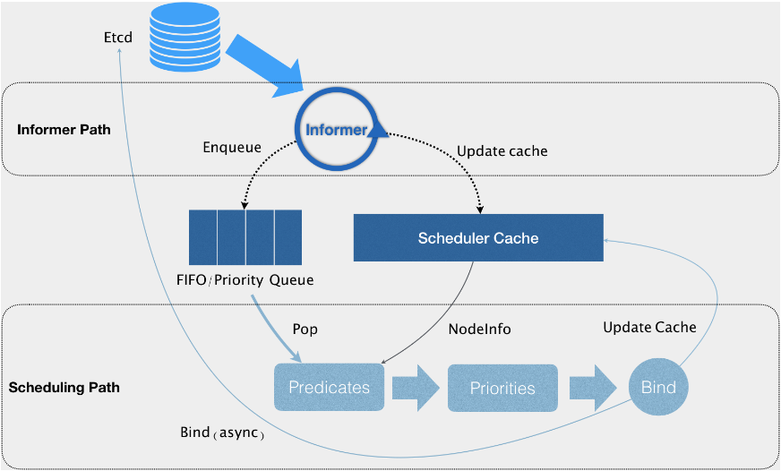
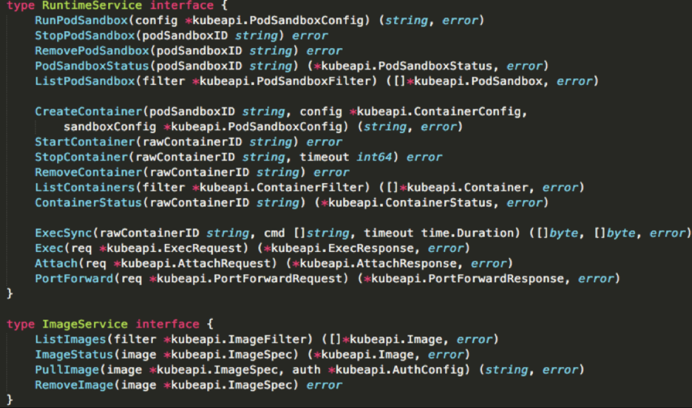

## Kubernetes调度机制

### Kubernetes的资源模型与资源管理

所有跟调度和资源管理相关的属性都是属于 Pod 对象的字段，其中最重要的部分，就是 Pod 的 CPU 和内存配置，如下所示

~~~
apiVersion: v1
kind: Pod
metadata:
  name: frontend
spec:
  containers:
  - name: db
    image: mysql
    env:
    - name: MYSQL_ROOT_PASSWORD
      value: "password"
    resources:
      requests:
        memory: "64Mi"
        cpu: "250m"
      limits:
        memory: "128Mi"
        cpu: "500m"
  - name: wp
    image: wordpress
    resources:
      requests:
        memory: "64Mi"
        cpu: "250m"
      limits:
        memory: "128Mi"
        cpu: "500m"
~~~

> 在Kubernetes 中
>
> - CPU称为 “可压缩资源” ，可压缩资源不足时，Pod只会“饥饿”，不会退出
> - 内存称为“不可压缩资源”，不可压缩资源不足时，Pod会因为OOM（Out-Of-Memory）被内核杀掉
> -  Pod 可以由多个 Container 组成，所以 CPU 和内存资源的限额，是要配置在每个 Container 的定义上的，而Pod整体资源配置，就由这些 Container 的配置值累加得到

**limits 和 requests** 的区别很简单在调度的时候，kube-scheduler 只会按照 requests 的值进行计算。而在真正设置 Cgroups 限制的时候，kubelet 则会按照 limits 的值来进行设置。

requests+limits 的做法，其实是Borg的思想，即，实际场景中，大多数作业使用到的资源其实远小宇它所请求的资源限额，基于这种假设，用户可以声明一个相对小的requests值供调度器使用，而Kubernetes 真正设置给容器 Cgroups 的，则是相对较大的 limits 值。

#### QoS 模型

> 三个级别，衔接上面

- **Guaranteed**：Pod 里的每一个 Container 都同时设置了 requests 和 limits，并且 requests 和 limits 值相等的时候，这个 Pod 就属于 Guaranteed 类别

~~~
apiVersion: v1
kind: Pod
metadata:
  name: qos-demo
  namespace: qos-example
spec:
  containers:
  - name: qos-demo-ctr
    image: nginx
    resources:
      limits:
        memory: "200Mi"
        cpu: "700m"
      requests:
        memory: "200Mi"
        cpu: "700m"
~~~

- **Burstable**：当 Pod 不满足 Guaranteed 的条件，但至少有一个 Container 设置了 requests。那么这个 Pod 就会被划分到 Burstable 类别

~~~
apiVersion: v1
kind: Pod
metadata:
  name: qos-demo-2
  namespace: qos-example
spec:
  containers:
  - name: qos-demo-2-ctr
    image: nginx
    resources:
      limits
        memory: "200Mi"
      requests:
        memory: "100Mi"
~~~

- **BestEffort**：如果 Pod 既没有设置 requests，也没有设置 limits，那么它的 QoS 类别就是 BestEffort

~~~
apiVersion: v1
kind: Pod
metadata:
  name: qos-demo-3
  namespace: qos-example
spec:
  containers:
  - name: qos-demo-3-ctr
    image: nginx
~~~

**QoS 划分的主要应用场景，是当宿主机资源紧张的时候，kubelet 对 Pod 进行 Eviction（即资源回收）时需要用到的。**当Eviction发生时，kubelet 具体会挑 Pod 进行删除操作，按如下级别

**BestEffort < Burstable < Guaranteed**

并且，Kubernetes 会保证只有当 Guaranteed 类别的 Pod 的资源使用量超过了其 limits 的限制，或者宿主机本身正处于 Memory Pressure 状态时，Guaranteed 的 Pod 才可能被选中进行 Eviction 操作。

#### cpuset 的设置

> 一个实际生产中非常有用的特性，衔接上面
>
> 在使用容器时，可以通过设置 cpuset 把容器绑定到某个 CPU 的核上，而不是像 cpushare 那样共享 CPU 的计算能力，这样CPU之间进行上下文切换的次数大大减少，容器里应用的性能会得到大幅提升

实现方法

-  Pod 必须是 Guaranteed 的 QoS 类型
- 将 Pod 的 CPU 资源的 requests 和 limits 设置为同一个相等的整数值

如下例子

~~~
spec:
  containers:
  - name: nginx
    image: nginx
    resources:
      limits:
        memory: "200Mi"
        cpu: "2"
      requests:
        memory: "200Mi"
        cpu: "2"
~~~

这样，该Pod就会绑定在2个独占的CPU核上，具体是哪两个CPU，由kubelet 分配

基于上面的情况，建议将DaemonSet（亦或者类似的）的 Pod 都设置为 Guaranteed 的 QoS 类型，否则一旦被资源紧张被回收，又立即会在宿主机上重建出来，这样资源回收的动作就没有意义了

### Kubernetes默认的调度策略

> 调度机制的工作原理示意图

**默认的几种调度策略**

1. **第一种类型，GeneralPredicates**：这一组过滤规则，负责的是最基础的调度策略，计算的就是宿主机的 CPU 和内存资源等是否够用。
2. **第二种类型，与 Volume 相关的过滤规则**：这一组过滤规则，负责的是跟容器持久化 Volume 相关的调度策略。
3. **第三种类型，是宿主机相关的过滤规则**：这一组规则，主要考察待调度 Pod 是否满足 Node 本身的某些条件。比如，PodToleratesNodeTaints，负责检查的就是我们前面经常用到的 Node 的“污点”机制。
4. **第四种类型，是 Pod 相关的过滤规则**：这一组规则，跟 GeneralPredicates 大多数是重合的。而比较特殊的，是 PodAffinityPredicate。这个规则的作用，是检查待调度 Pod 与 Node 上的已有 Pod 之间的亲密（affinity）和反亲密（anti-affinity）关系

**在具体执行的时候， 当开始调度一个 Pod 时，Kubernetes 调度器会同时启动 16 个 Goroutine，来并发地为集群里的所有 Node 计算 Predicates，最后返回可以运行这个 Pod 的宿主机列表。**

> **Goroutine**go语言的“线程”，比传统线程对资源的占用更合理

在 Predicates 阶段完成了节点的“过滤”之后，Priorities 阶段的工作就是为这些节点打分。这里打分的范围是 0-10 分，得分最高的节点就是最后被 Pod 绑定的最佳节点。

Priorities 里最常用到的一个打分规则，是 LeastRequestedPriority。它的计算方法，可以简单地总结为如下所示的公式

~~~
score = (cpu((capacity-sum(requested))10/capacity) + memory((capacity-sum(requested))10/capacity))/2
~~~

这个算法实际上就是在选择空闲资源（CPU 和 Memory）最多的宿主机。

与 LeastRequestedPriority 一起发挥作用的，还有 BalancedResourceAllocation。它的计算公式如下所示

~~~
score = 10 - variance(cpuFraction,memoryFraction,volumeFraction)*10
~~~

每种资源的 Fraction 的定义是 Pod 请求的资源 / 节点上的可用资源。而 variance 算法的作用，则是计算每两种资源 Fraction 之间的“距离”。而最后选择的，则是资源 Fraction 差距最小的节点。

**也就是调度完成后，所有节点里各种资源分配最均衡的那个节点，从而避免一个节点上 CPU 被大量分配、而 Memory 大量剩余的情况**

此外，还有 NodeAffinityPriority、TaintTolerationPriority 和 InterPodAffinityPriority 这三种 Priority。这里就不一一介绍了，除了默认的调度策略，还有很多默认不会开启的策略，可以通过为 kube-scheduler 指定一个配置文件或者创建一个 ConfigMap ，来配置哪些规则需要开启、哪些规则需要关闭。并且，还可以通过为 Priorities 设置权重，来控制调度器的调度行为。

### 调度器的优先级与强制机制

工作中我们也需要一些Pod有优先级和抢占机制，比如Pod调度失败后，会被“搁置”，知道Pod被更新或集群状态发生变化，调度器才会对Pod进行重新调度，我们希望高优先级的Pod调度失败后不被搁置，而“挤走”某些低优先级的。

1.11版本后这个特性已经是Beta，用法如下

先在Kubernetes里提交一个PriorityClass，如下:

~~~
apiVersion: scheduling.k8s.io/v1beta1
kind: PriorityClass
metadata:
  name: high-priority
value: 1000000
globalDefault: false
description: "This priority class should be used for high priority service pods only."
~~~

> 这个YAML文件名为high-priority
>
> **value**：值越大代表优先级越高（最大1000000000/10亿）
>
> **globalDefault**：声明使用该PriorityClass的Pod拥有值为1000000 的优先级，没有声明则为0。 true 的话，那就意味着这个 PriorityClass 的值会成为系统的默认值

然后我们在Pod就可以声明使用，如下

~~~
apiVersion: v1
kind: Pod
metadata:
  name: nginx
  labels:
    env: test
spec:
  containers:
  - name: nginx
    image: nginx
    imagePullPolicy: IfNotPresent
  priorityClassName: high-priority
~~~

> 提交后，Kubernetes 的 PriorityAdmissionController 就会自动将这个 Pod 的 spec.priority 字段设置为 1000000

调度器里维护着一个调度队列，高优先级的 Pod 就可能会比低优先级的 Pod 提前出队，从而尽早完成调度过程。**这个过程，就是“优先级”这个概念在 Kubernetes 里的主要体现。**

而当一个高优先级的 Pod 调度失败的时候，调度器的抢占能力就会被触发。这时，调度器就会试图从当前集群里寻找一个节点，使得当这个节点上的一个或者多个低优先级 Pod 被删除后，待调度的高优先级 Pod 就可以被调度到这个节点上。**这个过程，就是“抢占”这个概念在 Kubernetes 里的主要体现。**

### kubelet

**kubelet 调用下层容器运行时的执行过程，并不会直接调用 Docker 的 API，而是通过一组叫作 CRI（Container Runtime Interface，容器运行时接口）的 gRPC 接口来间接执行的。**为什么由CRI来间接执行是关乎历史原因，搭配CRI之后，Kubernetes 以及 kubelet 本身的架构，就可以用如下所示的一幅示意图来描述。

可以看到，当 Kubernetes 通过编排能力创建了一个 Pod 之后，调度器会为这个 Pod 选择一个具体的节点来运行，比如创建一个Pod。此时，kubelet 实际上就会调用一个叫作 GenericRuntime 的通用组件来发起创建 Pod 的 CRI 请求。如果使用容器项目是 Docker 的话，那么负责响应这个请求的就是一个叫作 dockershim 的组件。它会把 CRI 请求里的内容拿出来，然后组装成 Docker API 请求发给 Docker Daemon。

**CRI 这个接口的定义**如下图

- 第一组，是 RuntimeService。它提供的接口，主要是跟容器相关的操作。比如，创建和启动容器、删除容器、执行 exec 命令等等。
- 而第二组，则是 ImageService。它提供的接口，主要是容器镜像相关的操作，比如拉取镜像、删除镜像等等。

**CRI 设计的一个重要原则，就是确保这个接口本身，只关注容器，不关注 Pod**

**第一**，Pod 是 Kubernetes 的编排概念，而不是容器运行时的概念。所以，我们就不能假设所有下层容器项目，都能够暴露出可以直接映射为 Pod 的 API。

**第二**，如果 CRI 里引入了关于 Pod 的概念，那么接下来只要 Pod API 对象的字段发生变化，那么 CRI 就很有可能需要变更。而在 Kubernetes 开发的前期，Pod 对象的变化还是比较频繁的，但对于 CRI 这样的标准接口来说，这个变更频率就有点麻烦了。

所以，在 CRI 的设计里，并没有一个直接创建 Pod 或者启动 Pod 的接口。

