## 第一章——Docker（已熟悉的可以从第二章开始）

### 安装Docker

> **WHAT**：可以让开发者打包他们的应用以及依赖包到一个轻量级、可移植的容器中，然后发布到任何流行的 Linux 机器上，也可以实现虚拟化，三个核心概念：镜像、容器、仓库
>
> - 快速，一致地交付您的应用程序
>   - 允许开发人员使用您提供的应用程序或服务的本地容器在标准化环境中工作，从而简化了开发的生命周期
> - 响应式部署和扩展
>   - 基于容器的平台，允许高度可移植的工作负载，可移植性和轻量级的特性，实时扩展或拆除应用程序和服务
> - 在同一硬件上运行更多工作负载
>   - 非常适合于高密度环境以及中小型部署，而您可以用更少的资源做更多的事情
> - 这里推荐我认为讲的很不错的一篇文章https://blog.csdn.net/deng624796905/article/details/86493330
>
> **WHY**：docker的一个核心就是容器（沙箱），在开发环境开发的代码，到测试环境需要调整，到预生产环境也需要调整，到生产环境更加需要调整，而我们想要的是一次部署到处运行，这就是为什么使用docker。
>
> **原理/源码解析**：[容器是怎么隔离的](https://github.com/ben1234560/k8s_PaaS/blob/master/%E5%8E%9F%E7%90%86%E5%8F%8A%E6%BA%90%E7%A0%81%E8%A7%A3%E6%9E%90/Docker%E5%9F%BA%E7%A1%80.md#%E5%AE%B9%E5%99%A8%E6%98%AF%E6%80%8E%E4%B9%88%E9%9A%94%E7%A6%BB%E7%9A%84)
>
> 推荐书籍：深入剖析kubernetes（书籍），你也可以去下载免费的https://pan.baidu.com/s/1gWAQUVsqs1AdMPvRuaEtNA 提取码：q0ht

环境：centos7.6，2核2G内存（1C2G即可）

> 如果你需要7.6的镜像和xshell可以去网上下载或者我提供的包https://pan.baidu.com/s/1mkIzua1XQmew240XBbvuFA 提取码：7p6h。当然如果你下载7.6镜像包比较慢，想先上手做一下，可以联系我QQ：909336740开一个**免费**的服务器（人数过多，已无）

~~~
# 查看机器信息，内核版本必须是3.8以上
~]# uname -a
#out： Linux VM_0_5_centos 3.10.0-957.21.3.el7.x86_64 #1 SMP Tue Jun 18 16:35:19 UTC 2019 x86_64 x86_64 x86_64 GNU/Linux
~]# cat /etc/redhat-release 
#out： CentOS Linux release 7.6.1810 (Core) 
# 关闭防火墙
~]# getenforce
#out： Disabled
~]# systemctl stop firewalld
# 查看内存大小
~]# free -m
~~~

> **uname**：可显示电脑及操作系统的相关信息，-a/-all：显示全部信息
>
> **cat**：用于连接文件并打印内容到页面（打印有两种情况，一种是无执行内容所以就是查看，有执行内容则变成执行里面的内容）
>
> **getenforce**：查看防火墙信息，Disabled为关闭模式
>
> **systemctl**：用于管理系统，stop：停止某个服务
>
> **free**：用于显示内存状态，-m：以MB为单位显示内存使用情况

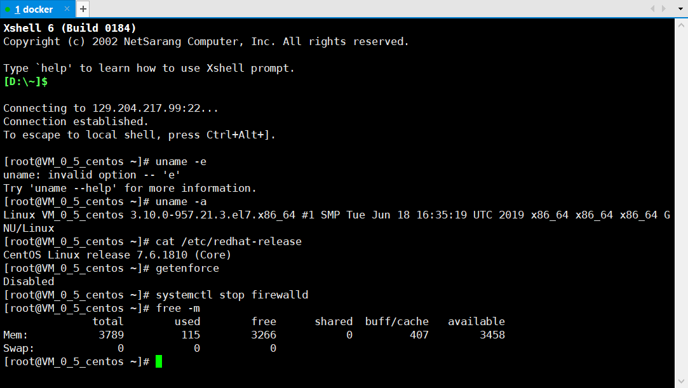

~~~
# 查看网络，并安装必要组件
~]# ping baidu.com
# 注意，你的本地源得是删掉的，一般是没有的
# rm /etc/yum.repos.d/local.repo
~]#curl -o /etc/yum.repos.d/CentOS-Base.repo http://mirrors.aliyun.com/repo/Centos-7.repo
~]# yum install epel-release -y
# 安装docker包
~]# yum list docker --show-duplicates
~]# yum install -y yum-utils
~]# yum-config-manager --add-repo http://mirrors.aliyun.com/docker-ce/linux/centos/docker-ce.repo
~]# yum list docker-ce --show-duplicates
~]# yum install -y docker-ce
#out：...Complete!
~~~

> **ping**：执行ping指令会使用ICMP传输协议，发出要求回应的信息，若远端主机的网络功能没有问题，就会回应该信息，因而得知该主机运作正常
>
> **rm** ：命令用于删除一个文件或者目录。
>
> **curl**：支持文件的上传和下载，是综合传输工具
>
> **yum**：提供了查找、安装、删除某一个、一组甚至全部软件包的命令，
>
> - **install**：安装
>
> - **-y**：安装过程的提示选择全部为"yes"

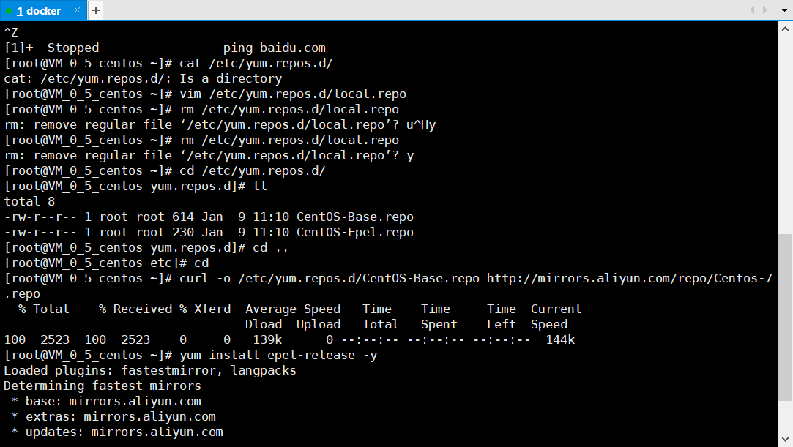

~~~
# 设为开机启动，启动并修改相关配置
~]# systemctl enable docker
~]# systemctl start docker
~]# vi /etc/docker/daemon.json
{
  "graph": "/data/docker",
  "storage-driver": "overlay2",
  "insecure-registries": ["registry.access.redhat.com","quay.io"],
  "registry-mirrors": ["https://q2gr04ke.mirror.aliyuncs.com"],
  "bip": "172.7.5.1/24",
  "exec-opts": ["native.cgroupdriver=systemd"],
  "live-restore": true
}

# 重启docker让配置生效
~]# systemctl reset-failed docker.service
~]# systemctl start docker.service
~]# systemctl restart docker
# 如果失败了，systemctl status docker查看报错信息
~]# docker info
~~~

> **daemon.json**文件内容解析：
>
> - graph：docker的工作目录，docker会在下面生成一大堆文件
> - storage-driver： 存储驱动
> - insecure-registries：私有仓库
> - registry-mirrors：国内加速源
> - bip：docker容器地址（ip的中间两位和我现在的外网129.204.217.99的后两位有对照关系，方便出问题了快速定位在哪个宿主机，但是我这里没改）
> - live-restrore：容器引擎死掉的事情，起来的docker是否继续活着
>
> systemctl status：查看服务信息
>
> docker info：查看docker信息

完成

### 开启我们的第一个docker容器

~~~
~]# docker run hello-world
# docker是典型的CS架构
~~~

> **docker run**：创建一个新的容器并运行，现在本地是没有镜像的，但是它会自动拉取网上的，如下图：
>
> - 语法：docker run [OPTIONS] IMAGE [COMMAND] [ARG...]

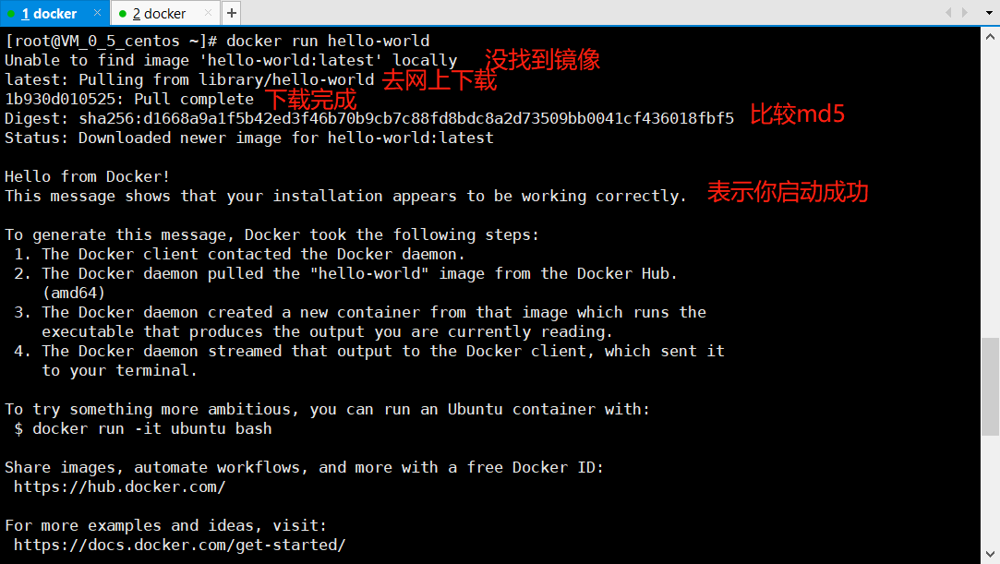

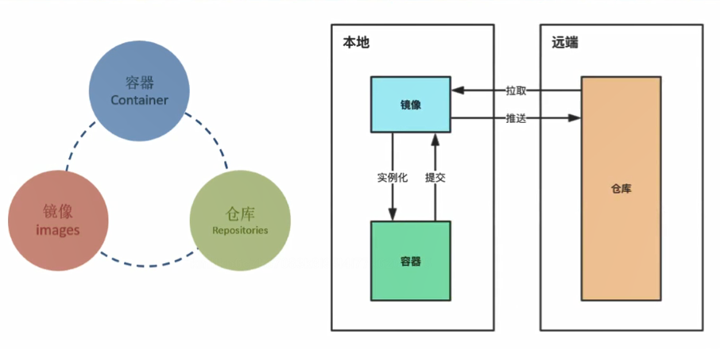

> 上图为docker容器和本地仓库、远程仓库的关系

~~~
镜像常规结构如下：
${registry_name}/${repository_name}/${image_name}:${tag_name}
例如：
docker.io/library/alipine:3.10.1
~~~

完成

### Dockerhub注册（自己的远程仓库）

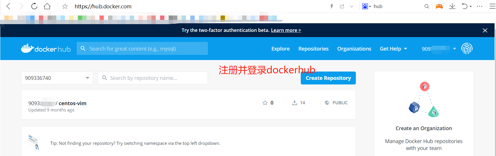

~~~
# 登录你的远程仓库
~]# docker login docker.io
# 你的登录信息在这里
~]# cat /root/.docker/config.json
~~~

> 复习：
>
> - cat：用于连接文件并打印内容到页面

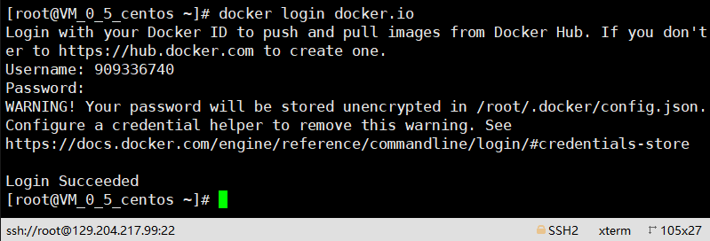

完成

### Docker镜像管理实战

~~~
~]# docker search alpine
~]# docker pull alpine
~]# docker pull alpine:3.10.3
~]# docker pull alpine:3.10.1
~~~

> **docker pull**：从镜像仓库中拉取或者更新指定镜像
>
> - 语法：**docker pull [OPTIONS] NAME[:TAG|@DIGEST]**

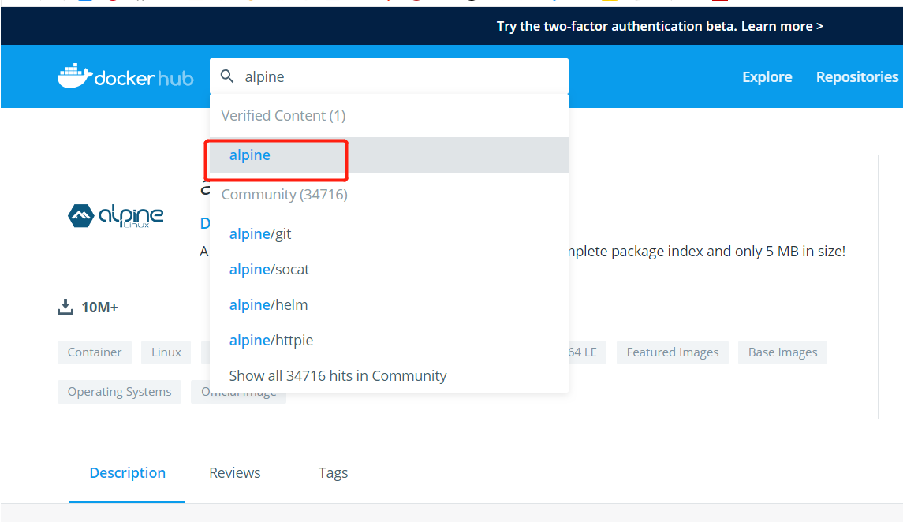

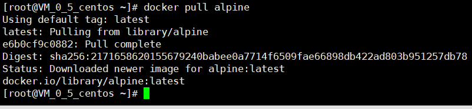

~~~
~]# docker images
~]# docker image ls
~]# docker tag 965ea09ff2eb docker.io/909336740/alpine:v3.10.3
~~~

> **docker images/docker image ls :** 列出本地镜像
>
> **docker tag**：标记本地镜像，将其归入某一仓库
>
> - 语法：docker tag [OPTIONS] IMAGE[:TAG] [REGISTRYHOST/][USERNAME/]NAME[:TAG]

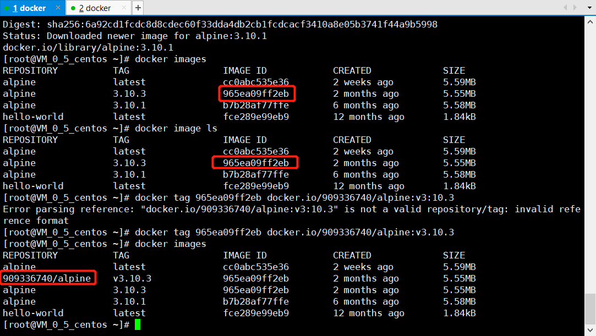

~~~
~]# docker push docker.io/909336740/alpine:v3.10.3
~~~

> **docker push**：将本地的镜像上传到镜像仓库,要先登陆到镜像仓库，带版本号
>
> - 语法：docker push [OPTIONS] NAME[:TAG]

~~~
~]# docker rmi 965ea09ff2eb
~]# docker rmi -f 965ea09ff2eb
# docker pull 909336740/alpine 拉取自己远程仓库镜像
~~~

> **docker rmi**：删除本地一个或多少镜像
>
> - **-f**：强制删除

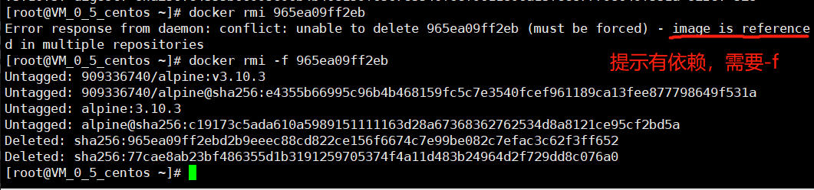

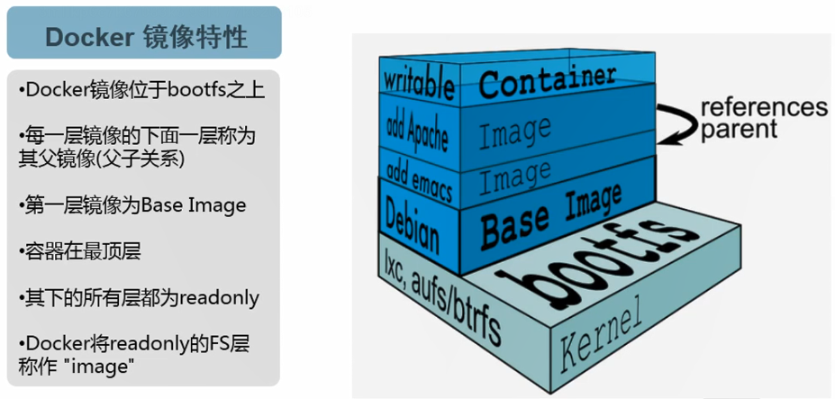

~~~
# 镜像不管多大，实际线上只会改变变动的部分，并不会全部替换，所以不需要担心速度问题，只有首次比较慢
~~~

完成

### docker容器基本操作

~~~
# 全部有记录的容器进程
~]# docker ps -a
# 存活的容器进程
~]# docker ps
# 启动容器（运行容器）
~]# docker run [options] image[command]
# 过滤出全部已经退出的容器并删掉
~]# for i in `docker ps -a|grep -i exit|awk '{print $1}'`;do docker rm -f $i;done
# 查看日志，-f：跟踪日志输出，即是夯住，可以按ctrl+c
~]# docker log -f <容器id>
~~~

> **Ctrl+c:** 强制中断程序的执行
>
> **Ctrl+z:** 将任务中断,但是此任务并没有结束,他仍然在进程中他只是维持挂起的状态

### docker容器高级操作

映射端口

- docker run -p 容器外端口:容器内端口

挂载数据卷

- docker run -v 容器外目录:容器内目录

传递环境变量

- docker run -e 环境变量key:环境变量value

查看内容

- docker inspect <容器id>

容器内安装软件（工具）

- yum/apt-get/apt等

~~~
# 映射端口
~]# docker pull nginx:1.12.2
~]# docker images
~]# docker tag 4037a5562b03 909336740/nginx:v1.12.2
~]# docker push 909336740/nginx:v1.12.2
~]# docker images
~]# docker run --rm --name mynginx -d -p81:80 909336740/nginx:v1.12.2
# 查看是否起来了
~]# docker ps -a 
~]# netstat -luntp|grep 81
~]# curl 127.0.0.1:81
~]# docker 
~~~

> **docker run**: 
>
> - **--rm** ：用完即删
> - **--name**：指定名字
> - **-d**：放到后台，非交互式的
> - **-p81:80**：映射端口，宿主机跑81端口，容器（nginx）跑80端口
>
> **docker push**：推送到我们的远程仓库（公网）
>
> **netstat -luntp**：用于显示 tcp,udp 的端口和进程等相关情况
>
> **|grep**：过滤管道

~~~
# 挂载数据卷
~]# mkdir html
~]# cd html/
html]# wget www.baidu.com -O index.html
~]# docker run -d --rm --name nginx_with_baidu -d -p82:80 -v/root/html:/usr/share/nginx/html 909336740/nginx:v1.12.2
~]# docker exec -ti nginx_with_baidu /bin/bash
:/# cd /usr/share/nginx/htm/
:/htm# ls
# out: index.html
:/# curl
# out:bash: curl:command not found
:/# tee /etc/apt/sources.list << EOF
deb http://mirrors.163.com/debian/ jessie main non-free contrib
deb http://mirrors.163.com/debian/ jessie-updates main non-free contrib
EOF
:/# apt-get update && apt-get install curl -y
:/# curl -k https://www.baidu.com
:/# exit
~]# docker ps -a
# 把这个容器push到远程从库，后面会用到
~]# docker commit -p 60c24fa9c6ff 909336740/nginx:curl
~]# docker push 909336740/nginx:curl
~~~

> **-v**：挂载数据卷，/root/html为宿主机的数据卷，/usr/share...为容器的数据卷

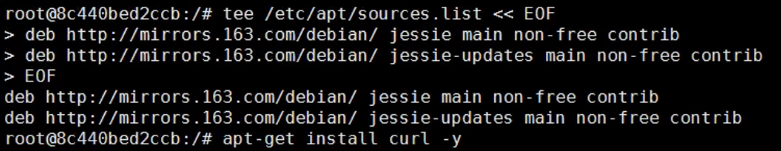

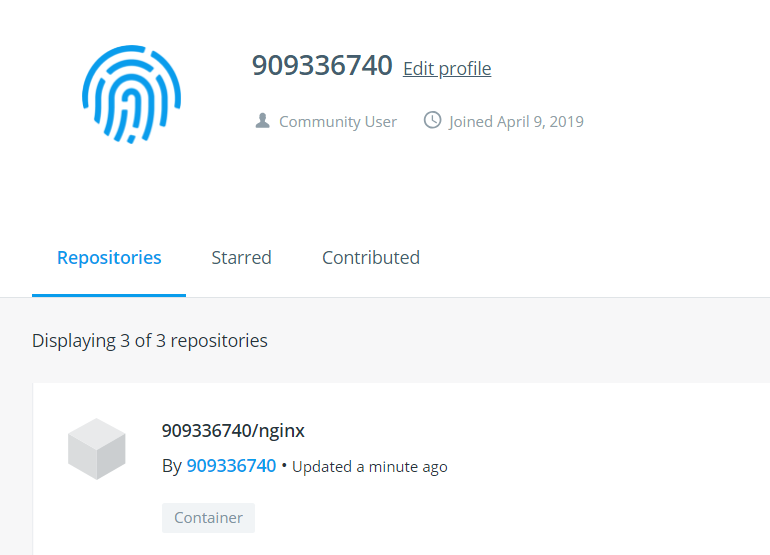

完成

### dockerfile

> **WHAT**：通过指令编排镜像，帮你自动化的构建镜像

4组核心的Dockerfile指令

- USER/WORKDIR指令
- ADD/EXPOSE指令
- RUN/ENV指令
- CMD/ENTRYPOINT指令

### dockerfile 综合实验

> 运行一个docker容器，在浏览器打开demo.od.com能访问百度首页

~~~

~]# mkdir /data/dockerfile
~]# vi /data/dockerfile/Dockerfile
FROM 909336740/nginx:v1.12.2
USER root
ENV WWW /usr/share/nginx/html
ENV CONF /etc/nginx/conf.d
RUN /bin/cp /usr/share/zoneinfo/Asia/Shanghai /etc/localtime &&\ 
    echo 'Asia/Shanghai' >/etc/timezone
WORKDIR $WWW
ADD index.html $WWW/index.html
ADD demo.od.com.conf $CONF/demo.od.com.conf
EXPOSE 80
CMD ["nginx","-g","daemon off;"]
~~~

> **vi**: 编辑文本
>
> **FROM**：从哪里导入
>
> **USER**：用什么用户起
>
> **ENV**：设置环境变量
>
> **RUN**： 修改时区成中国时区'Asia/Shanghai'
>
> **WORKDIR**：指定工作目录，这里指定的是之前ENV指定的WWW 目录，即是/usr/share/nginx/html
>
> **ADD**：添加指定的东西进去
>
> **EXPOSE**：暴露端口
>
> **CMD**：指令的首要目的在于为启动的容器指定默认要运行的程序，程序运行结束，容器也就结束

~~~
dockerfile]# vi demo.od.com.conf
server {
   listen 80;
   server_name demo.od.com;

   root /usr/share/nginx/html;
}

dockerfile]# ll
dockerfile]# wget www.baidu.com -O index.html
dockerfile]# docker build . -t 909336740/nginx:baidu
dockerfile]# docker run --rm -p80:80 909336740/nginx:baidu
~~~

> **ll**：显示当前目录的文件
>
> **wget**：下载文件工具
>
> - **-O**：并将文档写入后面指定的文件（这里是index.html）

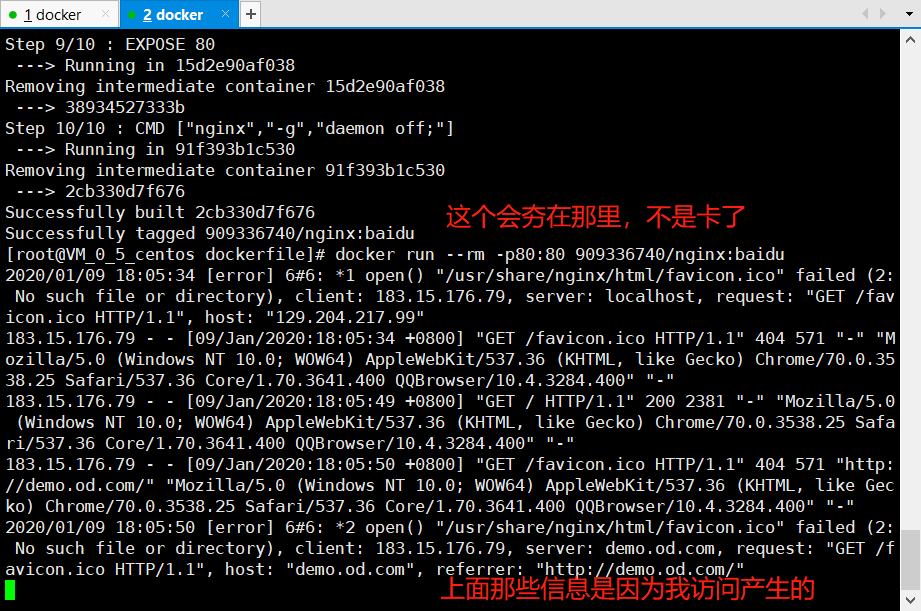

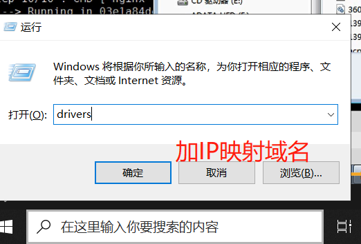

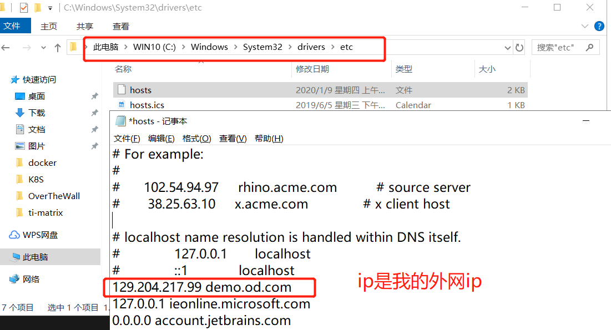

没有保存权限的参考这个https://jingyan.baidu.com/article/624e7459b194f134e8ba5a8e.html

访问[demo.od.com](demo.od.com)

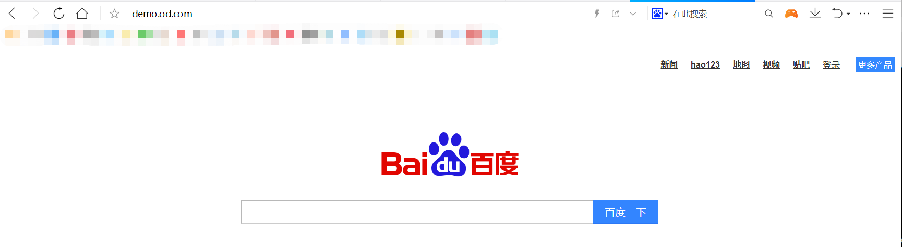

完成

### dockerfile四种网络类型

- Bridge contauner（NAT）   桥接式网络模式(默认)
- None(Close) container   封闭式网络模式，不为容器配置网络
- Host(open) container   开放式网络模式，和宿主机共享网络
- Container(join) container   联合挂载式网络模式，和其他容器共享网络

> 用什么类型的网络要根据我们的业务去决定

### Docker部分完结

> **原理/源码解析：**
>
> - [虚拟机和容器的对比图](https://github.com/ben1234560/k8s_PaaS/blob/master/%E5%8E%9F%E7%90%86%E5%8F%8A%E6%BA%90%E7%A0%81%E8%A7%A3%E6%9E%90/Docker%E5%9F%BA%E7%A1%80.md#%E8%99%9A%E6%8B%9F%E6%9C%BA%E5%92%8C%E5%AE%B9%E5%99%A8%E7%9A%84%E5%AF%B9%E6%AF%94%E5%9B%BE)
> - [深入理解容器镜像](https://github.com/ben1234560/k8s_PaaS/blob/master/%E5%8E%9F%E7%90%86%E5%8F%8A%E6%BA%90%E7%A0%81%E8%A7%A3%E6%9E%90/Docker%E5%9F%BA%E7%A1%80.md#%E6%B7%B1%E5%85%A5%E7%90%86%E8%A7%A3%E5%AE%B9%E5%99%A8%E9%95%9C%E5%83%8F)

恭喜你已经完成了docker的部分，当然你也许还是云里雾里，不用担心，后续我们会继续用到这些内容，如果你对docker的历史、源码等解析有兴趣，推荐书籍：深入剖析kubernetes（书籍），你也可以去下载免费的https://pan.baidu.com/s/1gWAQUVsqs1AdMPvRuaEtNA 提取码：q0ht

