## 第三章——k8s集群

> 我们来回顾一下并学习一些必要知识

[k8s中文社区docs.kubernetes.org.cn](http://docs.kubernetes.org.cn/)

##### K8S核心资源管理方法

~~~
# 任意机器(我是在21)
# 查看名称空间
~]# kubectl get namespace
~]# kubectl get ns
~~~

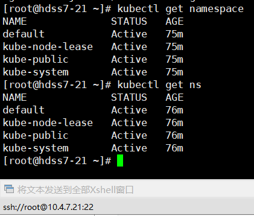

~~~
# 任意机器(我是在21)
~]# kubectl get all [-n default]
~]# kubectl create ns app
# 增
~]# kubectl create ns app
# 删
~]# kubectl delete namespace app
# 查
~]# kubectl get ns
# 创建deployment资源
kubectl create deployment nginx-dp --image=harbor.od.com/public/nginx:v1.7.9 -n kube-public
# 查指定空间
~]# kubectl get deploy -n kube-public
~]# kubectl get pods -o wide -n kube-public
~]# kubectl describe deployment nginx-dp -n kube-public

# 进入pod资源
21 ~]# kubectl get pods -n kube-public
21 ~]# kubectl exec -ti nginx-dp-5dfc689474-9zt9r /bin/bash -n kube-public
~~~

> **kubectl get deploy**：这里的deploy是容器类型，deploy也是deployment
>
> **kubectl exec**：进入容器
>
> - -t：将标准输入控制台作为容器的控制台输入
> - -i：将控制台输入发送到容器
> - 一般是连起来用-it，后面带的是get出来的容器名
> - /bin/bash：终端模式

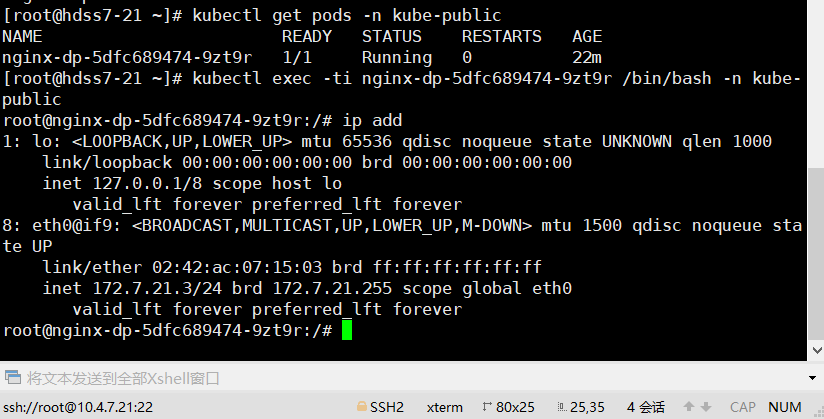

~~~
# 删除pod资源（重启），pod控制器预期你有一个pod，所以你删掉就会重启，后面force是强制删除
21 ~]# kubectl delete pod nginx-dp-5dfc689474-gtfvv -n kube-public [--force --grace-period=0]
# 删掉deploy
21 ~]# kubectl delete deploy nginx-dp -n kube-public
# 查看
21 ~]# kubectl get all -n kube-public
~~~

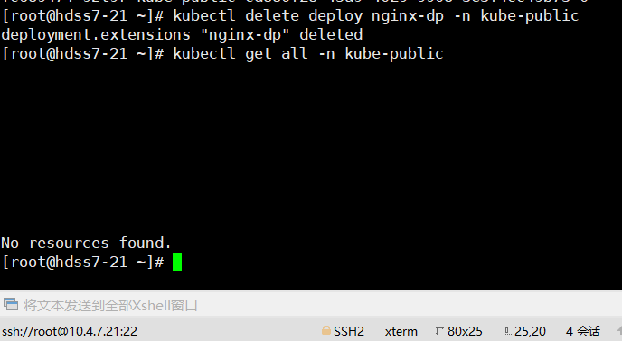

##### 管理service资源

~~~
# 21机器
# 创建
~]# kubectl create deployment nginx-dp --image=harbor.od.com/public/nginx:v1.7.9 -n kube-public
~]# kubectl get all -n kube-public
# 暴露端口
~]# kubectl expose deployment nginx-dp --port=80 -n kube-public
~]# kubectl get all -n kube-public -o wide
~~~

> **kubectl expose**：暴露端口，后面的--port=80 指的是暴露80端口

~~~
# 去22机器
~]# curl 192.168.81.37
~]# ipvsadm -Ln
~~~

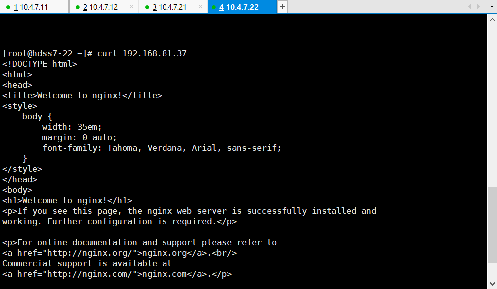

~~~
# 做成两份代理服务器,22机器
~]# kubectl scale deployment nginx-dp --replicas=2 -n kube-public
~]# ipvsadm -Ln
~~~

> **kubectl scale：**    扩容或缩容 Deployment等中Pod数量
>
> - --replicas=2：把Pod数量改为2，即如果之前是1则扩容变成2，如果之前是3则缩容变成2

可以看到下面的Pod已经变成了两个，而上图是只有一个的

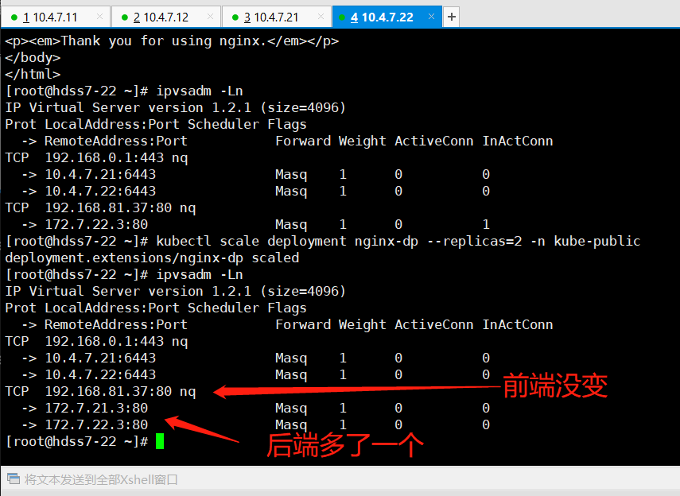

~~~
# 获取资源配置清单，21机器
~]# kubectl get pods -n kube-public
~]# kubectl get pods nginx-dp-5dfc689474-788xp -o yaml -n kube-public
# 解释怎么用
~]# kubectl explain service.metadata
~~~

> 资源清单的内容解释由于太多，这里就不做解析了，感兴趣的朋友可以网上搜下

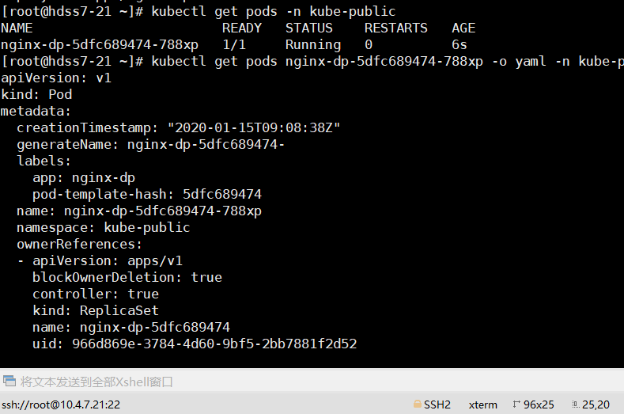

~~~
# 声明式、21机器：
~]# vi nginx-ds-svc.yaml
apiVersion: v1
kind: Service
metadata:
  labels:
    app: nginx-ds
  name: nginx-ds
  namespace: default
spec:
  ports:
  - port: 80
    protocol: TCP
    targetPort: 80
  selector:
    app: nginx-ds
  sessionAffinity: None
  type: ClusterIP
  
~]# kubectl create -f nginx-ds-svc.yaml
# out: service/nginx-ds created
~]# kubectl get svc -n default
~]# kubectl get svc nginx-ds -o yaml
~~~

~~~
# 修改资源，在线方式：
~]# kubectl edit svc nginx-ds
~]# kubectl get svc
# 离线：删了再打开，离线修改有记录
# 删除资源,实验，按照以下方法是无法删除的~去找一下吧
# 陈述式
~]# kubectl delete -f nginx-ds
# 声明式
~]# kubectl delete -f nginx-dp-svc.yaml 
~~~

> 当然删不了也无所谓

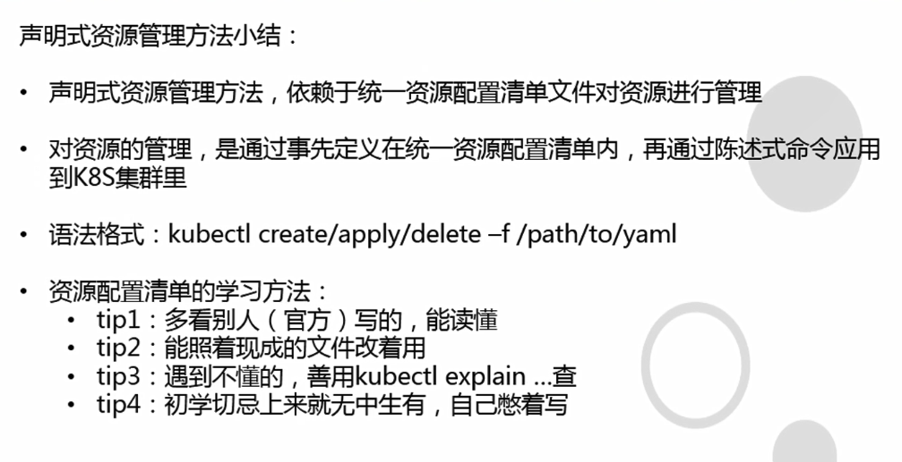

回顾完成

### 安装部署flanneld

> **WHAT**：通过给每台宿主机分配一个子网的方式为容器提供虚拟网络（覆盖网络），该网络中的结点可以看作通过虚拟或逻辑链路而连接起来的
>
> **WHY**：我们生产上的集群宿主机/容器之间必须是互通的，因为只有互通才能形成集群，要是集群间的宿主机和容器都不互通，那就没有做集群的必要了

~~~
# 你可以做如下尝试，21机器：
~]# kubectl get pods -o wide
~]# ping 172.7.21.2
~]# ping 172.7.22.2
~~~

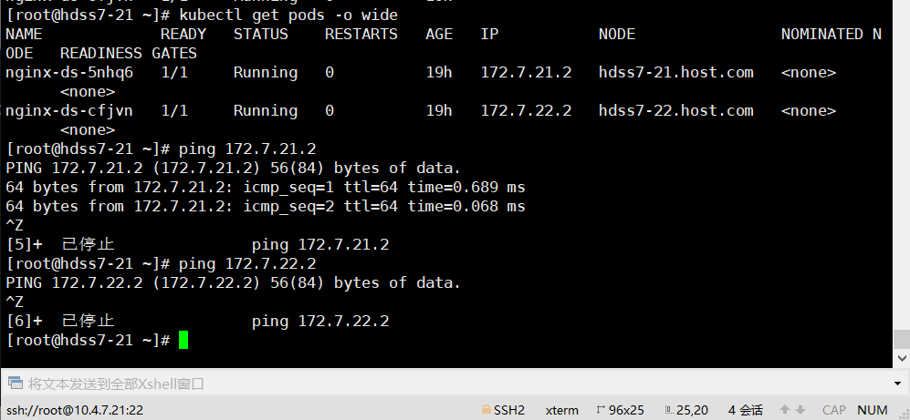

> 你可以发现，两个容器的宿主机之间是不互通的，更别说进入容器里面了。（当然ping10.4.7.22是没问题的）
>
> 这时候我们就需要CNI网络插件，CNI最主要的功能是实现POD资源能够跨宿主机进行通信，当然CNI网络插件有很多种，如Flannel、Calico等，而Flannel是目前市场上最为火热的

~~~~
# 21/22机器：
~]# cd /opt/src/
src]# wget https://github.com/coreos/flannel/releases/download/v0.11.0/flannel-v0.11.0-linux-amd64.tar.gz
src]# mkdir /opt/flannel-v0.11.0
src]# tar xf flannel-v0.11.0-linux-amd64.tar.gz -C /opt/flannel-v0.11.0/
src]# ln -s /opt/flannel-v0.11.0/ /opt/flannel
src]# cd /opt/flannel
flannel]# ll
# out:总用量 34436
flannel]# mkdir cert
flannel]# cd cert/
cert]# scp hdss7-200:/opt/certs/ca.pem . 
cert]# scp hdss7-200:/opt/certs/client.pem .
cert]# scp hdss7-200:/opt/certs/client-key.pem .
cert]# cd ..
# 注意机器名，需要改一处：SUBNET=172.7.21.1/24，需要改成SUBNET=172.7.22.1/24
flannel]# vi subnet.env
FLANNEL_NETWORK=172.7.0.0/16
FLANNEL_SUBNET=172.7.21.1/24
FLANNEL_MTU=1500
FLANNEL_IPMASQ=false

~~~~

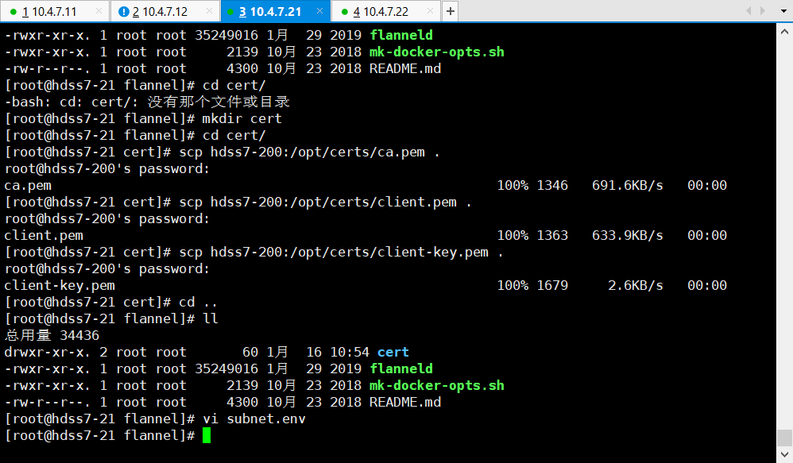

~~~
# 21/22机器,注意，我的网络是eth0，新版的是ens33，如果是ens33，则需要改iface，其它需要改一处机器名：ip=10.4.7.21
flannel]# vi flanneld.sh
#!/bin/sh
./flanneld \
  --public-ip=10.4.7.21 \
  --etcd-endpoints=https://10.4.7.12:2379,https://10.4.7.21:2379,https://10.4.7.22:2379 \
  --etcd-keyfile=./cert/client-key.pem \
  --etcd-certfile=./cert/client.pem \
  --etcd-cafile=./cert/ca.pem \
  --iface=eth0 \
  --subnet-file=./subnet.env \
  --healthz-port=2401
  
flannel]# chmod +x flanneld.sh
flannel]# mkdir -p /data/logs/flanneld
flannel]# cd /opt/etcd
# 下面这一步在一部机器上执行即可，只需执行一次，我在21机器做的：
etcd]# ./etcdctl set /coreos.com/network/config '{"Network": "172.7.0.0/16", "Backend": {"Type": "host-gw"}}'
etcd]# ./etcdctl get /coreos.com/network/config
# out:{"Network": "172.7.0.0/16", "Backend": {"Type": "host-gw"}}

# 有一处要修改，21/22机器：flanneld-7-21]
etcd]# vi /etc/supervisord.d/flannel.ini
[program:flanneld-7-21]
command=/opt/flannel/flanneld.sh                             ; the program (relative uses PATH, can take args)
numprocs=1                                                   ; number of processes copies to start (def 1)
directory=/opt/flannel                                       ; directory to cwd to before exec (def no cwd)
autostart=true                                               ; start at supervisord start (default: true)
autorestart=true                                             ; retstart at unexpected quit (default: true)
startsecs=30                                                 ; number of secs prog must stay running (def. 1)
startretries=3                                               ; max # of serial start failures (default 3)
exitcodes=0,2                                                ; 'expected' exit codes for process (default 0,2)
stopsignal=QUIT                                              ; signal used to kill process (default TERM)
stopwaitsecs=10                                              ; max num secs to wait b4 SIGKILL (default 10)
user=root                                                    ; setuid to this UNIX account to run the program
redirect_stderr=true                                         ; redirect proc stderr to stdout (default false)
stdout_logfile=/data/logs/flanneld/flanneld.stdout.log       ; stderr log path, NONE for none; default AUTO
stdout_logfile_maxbytes=64MB                                 ; max # logfile bytes b4 rotation (default 50MB)
stdout_logfile_backups=4                                     ; # of stdout logfile backups (default 10)
stdout_capture_maxbytes=1MB                                  ; number of bytes in 'capturemode' (default 0)
stdout_events_enabled=false                                  ; emit events on stdout writes (default false)

etcd]# supervisorctl update
etcd]# supervisorctl status
# 查看细节信息
etcd]# tail -fn 200 /data/logs/flanneld/flanneld.stdout.log 
# 两部机器完成后，在21和22机器ping对方，已经可以ping通
~~~

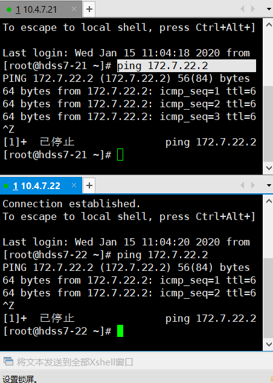

完成

flannel原理：添加静态路由（前提条件，必须处在同一网关之下）

利用10.4.7.x本来互通的前提，172先去找10再转到其下面的172，形成互通

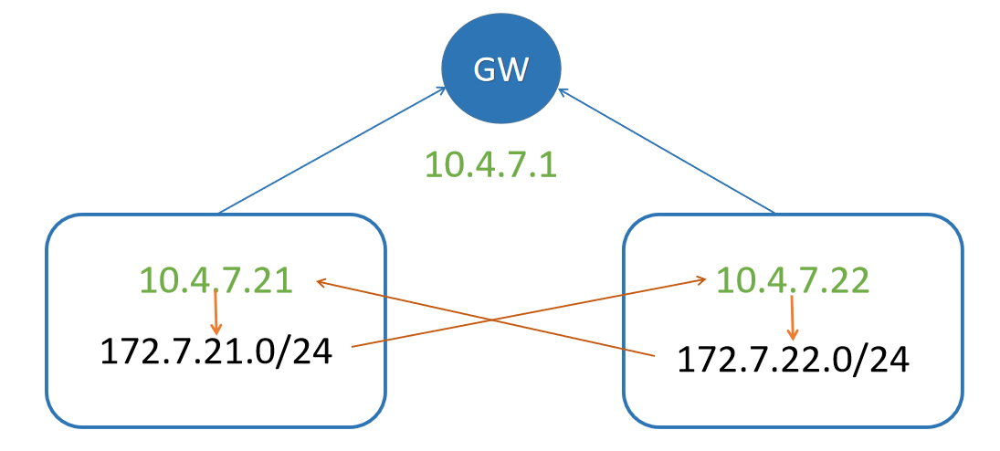

> 再次复习一遍，10的21机器对应的172的21，这样方便知道那些pod在那些机器上

### flannel之SNAT规则优化

> **WHAT**：使得容器之间的透明访问
>
> **WHY**：解决两宿主机容器之间的透明访问，如不进行优化，容器之间的访问，日志记录为宿主机的IP地址

~~~
# 把nginx:curl拉下来，21机器
~]# docker login docker.io/909336740/nginx:curl
~]# docker pull 909336740/nginx:curl
~]# docker images|grep curl
~]# docker tag 34736e20b17b harbor.od.com/public/nginx:curl
~]# docker login harbor.od.com
~]# docker push harbor.od.com/public/nginx:curl
~~~

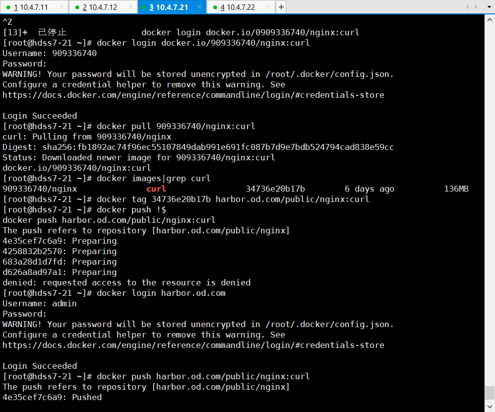

~~~
# 改以下内容，21机器：
cd
~]# vi nginx-ds.yaml
image: harbor.od.com/public/nginx:curl
~]# kubectl apply -f nginx-ds.yaml
~]# kubectl get pods
# 删掉两个pod让它们自动重启以便应用新镜像
~]# kubectl delete pod nginx-ds-5nhq6
# out:pod "nginx-ds-5nhq6" deleted
~]# kubectl delete pod nginx-ds-cfjvn
#out:pod "nginx-ds-cfjvn" deleted
~]# kubectl get pods -o wide
~~~

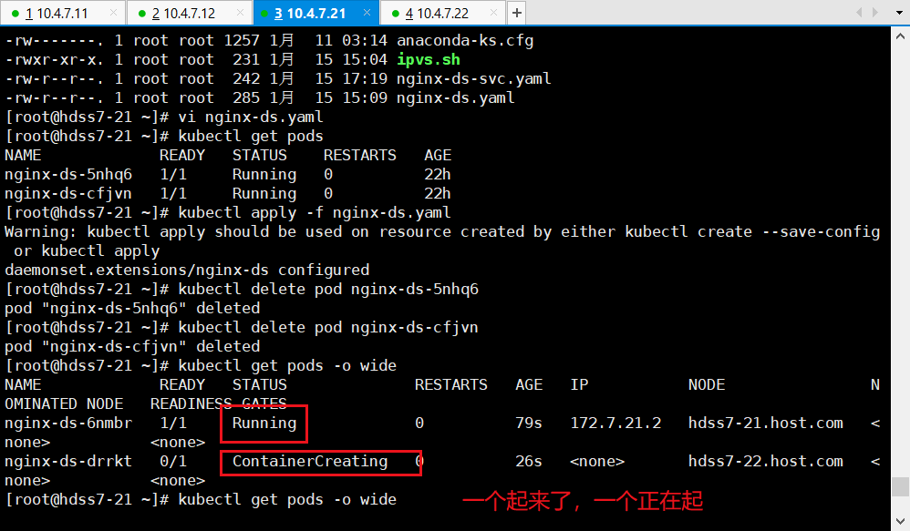

~~~
# 21机器：
~]# kubectl exec -ti nginx-ds-6nmbr /bin/bash
6nmbr:/# curl 172.7.22.2
# 注意这个pod是起在了22网络了，如果网段没有在22上，就curl 172.7.22.2，只要有welcome的网页回应即可，而且log日志也有

# 22机器
etcd]# kubectl get pods -o wide
etcd]# kubectl logs -f nginx-ds-drrkt
~~~

> **kubectl logs -f**：查看Pod日志

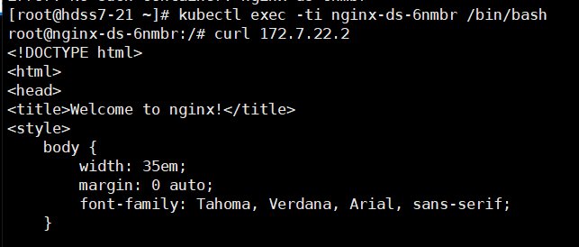

确认启动正常

~~~
# 21机器：
~]# iptables-save |grep -i postrouting
~~~

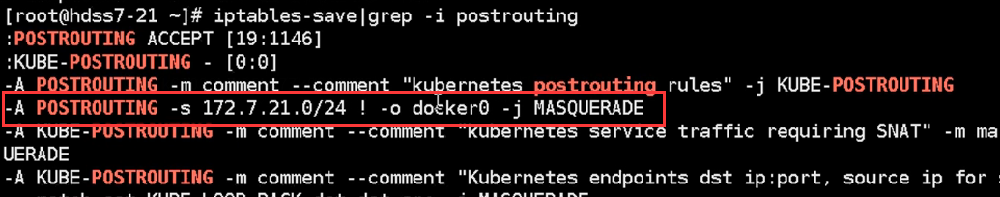

> **iptables：**
>
> - `语法：iptables [-t 表名] 选项 [链名] [条件] [-j 控制类型]`
> - **-A**：在规则链的末尾加入新规则
> - **-s**：匹配来源地址IP/MASK，加叹号"!"表示除这个IP外
> - **-o**：匹配从这块网卡流出的数据
> - **MASQUERADE**：动态伪装，能够自动的寻找外网地址并改为当前正确的外网IP地址
> - 上面红框内的可以理解为：如果是172.7.21.0/24段的docker的ip，网络发包不从docker0桥设备出战的，就进行SNAT转换，而我们需要的是如果出网的地址是172.7.21.0/24或者172.7.0.0/16网络（这是docker的大网络），就不要做源地址NAT转换，因为我们集群内部需要坦诚相见，自己人不需要伪装。

~~~
# 21/22机器，我们开始改：
~]# yum install iptables-services -y
~]# systemctl start iptables
~]# systemctl enable iptables
# 删掉对应的规则，以下需要对应机器，一处修改：-s 172.7.21
~]# iptables -t nat -D POSTROUTING -s 172.7.21.0/24 ! -o docker0 -j MASQUERADE
# 添加对应的规则，以下需要对应机器，一处修改：-s 172.7.21
~]# iptables -t nat -I POSTROUTING -s 172.7.21.0/24 ! -d 172.7.0.0/16 ! -o docker0 -j MASQUERADE
# 上面这条规则可以理解为：只有出网地址不是172.7.21.0/24或者172.7.0.0/16，网络发包不从docker0桥设备出战的，才做SNAT转换
~]# iptables-save |grep -i postrouting
~]# iptables-save > /etc/sysconfig/iptables
# 21机器curl22，22机器curl21
~]# kubectl exec -ti nginx-ds-6nmbr /bin/bash
6nmbr:/# curl 172.7.22.2

### 相关报错
# 如果报错：curl: (7) Failed to connect to 172.7.22.2 port 80: No route to host
# 则执行以下操作，在删掉两台机器21/22的iptables的reject，两边同时执行
~]# iptables-save|grep -i reject
~]# iptables -t filter -D [名字]
~]# iptables-save > /etc/sysconfig/iptables
###
~~~

> **iptables：**
>
> - `语法：iptables [-t 表名] 选项 [链名] [条件] [-j 控制类型]`
> - -D：删除某一条规则
> - -I：在规则链的头部加入新规则
> - -s：匹配来源地址IP/MASK，加叹号"!"表示除这个IP外
> - -d：匹配目标地址
> - -o：匹配从这块网卡流出的数据
> - MASQUERADE：动态伪装，能够自动的寻找外网地址并改为当前正确的外网IP地址

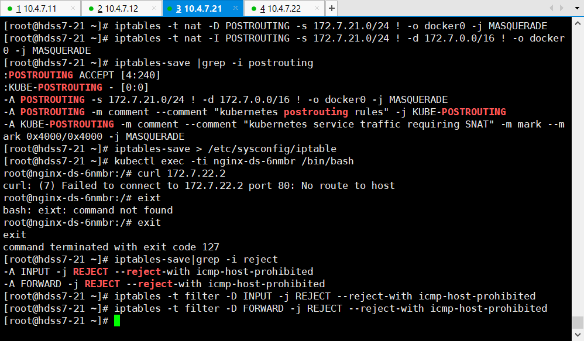

成功图，在22上已经可以明确的看到对方是172.7.21.2了，在21上可以看到对方是172的22：

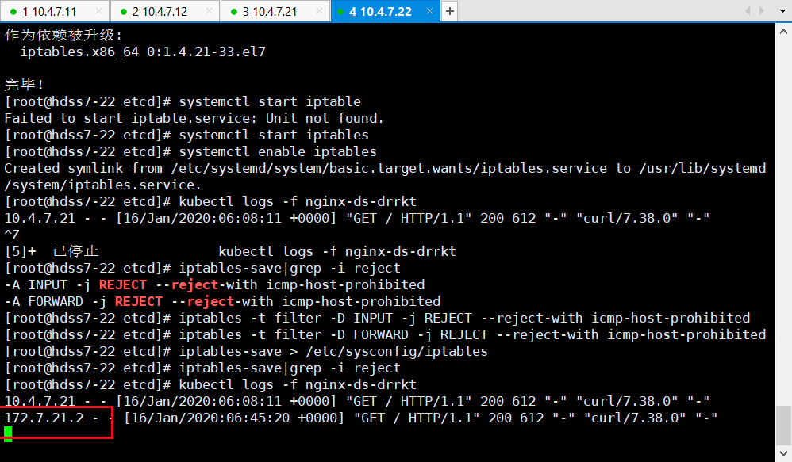

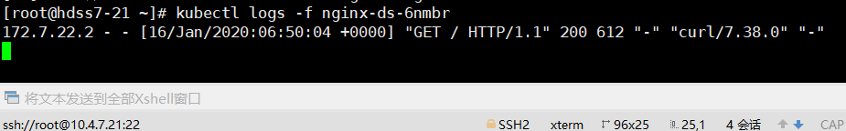

完成

### 安装部署coredns（服务发现）：

> **WHAT**：服务（应用）之间相互定位的过程
>
> **WHY：**
>
> - 服务发现对应的场景：
>   - 服务（应用）的动态性抢
>   - 服务（应用）更新发布频繁
>   - 服务（应用）支持自动伸缩
>
> - kuberntes中的所有pod都是基于Service域名解析后，再负载均衡分发到service后端的各个pod服务中，POD的IP是不断变化的。如何解决：
>   - 抽象出Service资源，通过标签选择器，关联一组POD
>   - 抽象出集群网络，通过固定的“集群IP”，使服务接入点固定
> - 如何管理Service资源的“名称”和“集群网络IP”
>   - 我们前面做了传统的DNS模型：hdss7-21.host.com -> 10.4.7.21
>   - 那么我们可以在K8S里做这样的模型：nginx-ds -> 192.168.0.1

~~~
# 现在我们要开始用交付容器方式交付服务（非二进制），这也是以后最常用的方式
# 200机器
certs]# cd /etc/nginx/conf.d/
conf.d]# vi /etc/nginx/conf.d/k8s-yaml.od.com.conf
server {
    listen       80;
    server_name  k8s-yaml.od.com;

    location / {
        autoindex on;
        default_type text/plain;
        root /data/k8s-yaml;
    }
}

conf.d]# mkdir /data/k8s-yaml
conf.d]# nginx -t
conf.d]# nginx -s reload
~~~

~~~
# 11机器，解析域名：
~]# vi /var/named/od.com.zone
serial 前滚一位
# 最下面添加这个网段，以后也都是在最下面添加，后面我就加这个注释了
k8s-yaml           A    10.4.7.200

~]# systemctl restart named
~]# dig -t A k8s-yaml.od.com @10.4.7.11 +short
# out：10.4.7.200
~~~

> **dig -t A**：指的是找DNS里标记为A的相关记录，@用什么机器IP访问，+short是只返回IP

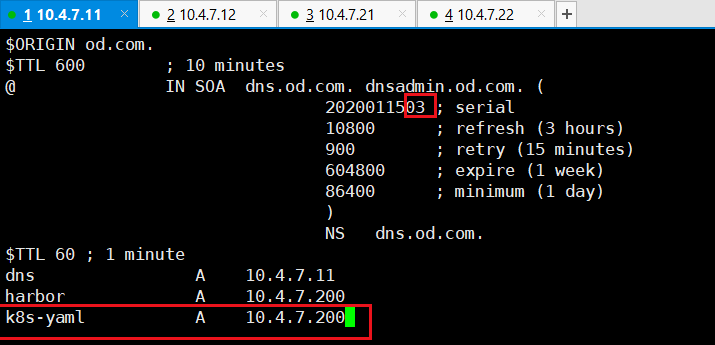

~~~
# 200机器
conf.d]# cd /data/k8s-yaml/
k8s-yaml]# mkdir coredns
~~~

[k8s-yaml.od.com](k8s-yaml.od.com)

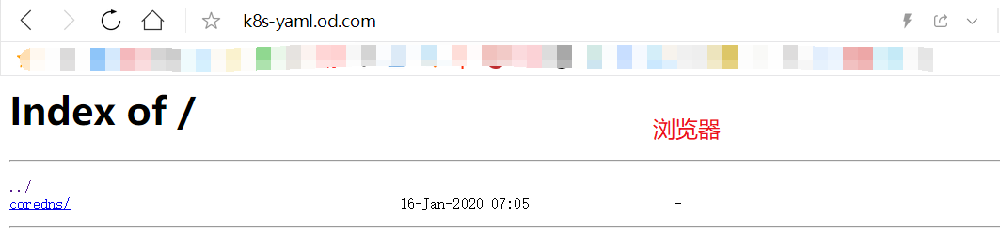

~~~~
# 200机器，下载coredns镜像：
cd /data/k8s-yaml/
k8s-yaml]# docker pull coredns/coredns:1.6.1
k8s-yaml]# docker images|grep coredns
k8s-yaml]# docker tag c0f6e815079e harbor.od.com/public/coredns:v1.6.1
k8s-yaml]# docker push !$
~~~~

> 这里我们需要注意的是，任何我用到的镜像都会推到我的本地私有仓库，原因前面也说了，1、是为了用的时候速度快保证不出现网络问题，2、保证版本是同样的版本，而不是突然被别人修改了
>
> **docker push !$**：push上一个镜像的名字

~~~
# 200机器，准备资源配置清单：
cd /data/k8s-yaml/coredns
coredns]# vi rbac.yaml
apiVersion: v1
kind: ServiceAccount
metadata:
  name: coredns
  namespace: kube-system
  labels:
      kubernetes.io/cluster-service: "true"
      addonmanager.kubernetes.io/mode: Reconcile
---
apiVersion: rbac.authorization.k8s.io/v1
kind: ClusterRole
metadata:
  labels:
    kubernetes.io/bootstrapping: rbac-defaults
    addonmanager.kubernetes.io/mode: Reconcile
  name: system:coredns
rules:
- apiGroups:
  - ""
  resources:
  - endpoints
  - services
  - pods
  - namespaces
  verbs:
  - list
  - watch
---
apiVersion: rbac.authorization.k8s.io/v1
kind: ClusterRoleBinding
metadata:
  annotations:
    rbac.authorization.kubernetes.io/autoupdate: "true"
  labels:
    kubernetes.io/bootstrapping: rbac-defaults
    addonmanager.kubernetes.io/mode: EnsureExists
  name: system:coredns
roleRef:
  apiGroup: rbac.authorization.k8s.io
  kind: ClusterRole
  name: system:coredns
subjects:
- kind: ServiceAccount
  name: coredns
  namespace: kube-system
  
coredns]# vi cm.yaml
apiVersion: v1
kind: ConfigMap
metadata:
  name: coredns
  namespace: kube-system
data:
  Corefile: |
    .:53 {
        errors
        log
        health
        ready
        kubernetes cluster.local 192.168.0.0/16
        forward . 10.4.7.11
        cache 30
        loop
        reload
        loadbalance
       }
       
coredns]# vi dp.yaml
apiVersion: apps/v1
kind: Deployment
metadata:
  name: coredns
  namespace: kube-system
  labels:
    k8s-app: coredns
    kubernetes.io/name: "CoreDNS"
spec:
  replicas: 1
  selector:
    matchLabels:
      k8s-app: coredns
  template:
    metadata:
      labels:
        k8s-app: coredns
    spec:
      priorityClassName: system-cluster-critical
      serviceAccountName: coredns
      containers:
      - name: coredns
        image: harbor.od.com/public/coredns:v1.6.1
        args:
        - -conf
        - /etc/coredns/Corefile
        volumeMounts:
        - name: config-volume
          mountPath: /etc/coredns
        ports:
        - containerPort: 53
          name: dns
          protocol: UDP
        - containerPort: 53
          name: dns-tcp
          protocol: TCP
        - containerPort: 9153
          name: metrics
          protocol: TCP
        livenessProbe:
          httpGet:
            path: /health
            port: 8080
            scheme: HTTP
          initialDelaySeconds: 60
          timeoutSeconds: 5
          successThreshold: 1
          failureThreshold: 5
      dnsPolicy: Default
      volumes:
        - name: config-volume
          configMap:
            name: coredns
            items:
            - key: Corefile
              path: Corefile
              
coredns]# vi svc.yaml
apiVersion: v1
kind: Service
metadata:
  name: coredns
  namespace: kube-system
  labels:
    k8s-app: coredns
    kubernetes.io/cluster-service: "true"
    kubernetes.io/name: "CoreDNS"
spec:
  selector:
    k8s-app: coredns
  clusterIP: 192.168.0.2
  ports:
  - name: dns
    port: 53
    protocol: UDP
  - name: dns-tcp
    port: 53
  - name: metrics
    port: 9153
    protocol: TCP
~~~

~~~~
# 21机器，应用资源配置清单（陈述式）：
~]# kubectl apply -f http://k8s-yaml.od.com/coredns/rbac.yaml
~]# kubectl apply -f http://k8s-yaml.od.com/coredns/cm.yaml
~]# kubectl apply -f http://k8s-yaml.od.com/coredns/dp.yaml
~]# kubectl apply -f http://k8s-yaml.od.com/coredns/svc.yaml
~]# kubectl get all -n kube-system
~~~~

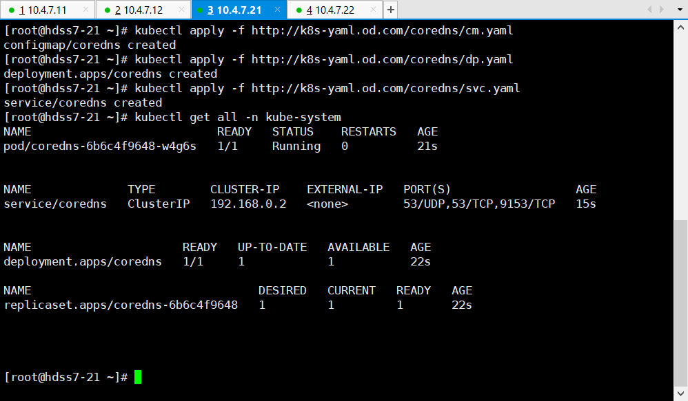

> **CLUSTER-IP为什么是192.168.0.2**：因为我们之前已经写死了这是我们dns的统一接入点
>
> 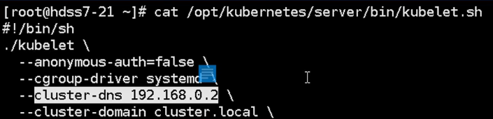

~~~
# 21机器，测试（我的已经存在了，不过不影响）：
~]# kubectl create deployment nginx-dp --image=harbor.od.com/public/nginx:v1.7.9 -n kube-public
~]# kubectl expose deployment nginx-dp --port=80 -n kube-public
~]# kubectl get svc -n kube-public
~]# dig -t A nginx-dp.kube-public.svc.cluster.local. @192.168.0.2 +short
# out：192.168.81.37
~~~

> **dig -t A**：指的是找DNS里标记为A的相关记录，@用什么机器IP访问，+short是只返回IP

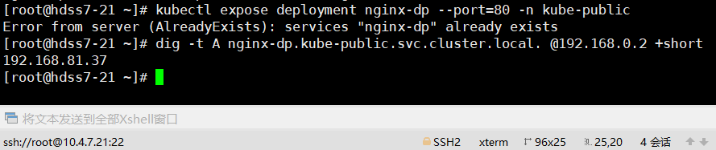

完成集群“内”被自动发现

### K8S的服务暴露ingress

> **WHAT**：K8S API的标准资源类型之一，也是核心资源，它是基于域名和URL路径，把用户的请求转发至指定Service资源的规则
>
> - 将集群外部的请求流量，转发至集群内部，从而实现“服务暴露”
> - nginx + go脚本
>
> **WHY**：上面实现了服务在集群“内”被自动发现，那么需要使得服务在集群“外”被使用和访问，常规的两种方法：
>
> - 使用NodePort型的service
>   - 无法使用kube-proxy的ipvs模型，只能使用iptables模型
> - 使用ingress资源
>   - 只能调度并暴露7蹭应用，特指http和https协议

##### 以trafiker为例

> **WHAT**：为了让部署微服务更加便捷而诞生的现代HTTP反向代理、负载均衡工具。
>
> **WHY**：可以监听你的服务发现/基础架构组件的管理API，并且每当你的微服务被添加、移除、杀死或更新都会被感知，并且可以自动生成它们的配置文件

~~~
# 200机器，部署traefiker（ingress控制器）
cd /data/k8s-yaml/
k8s-yaml]# mkdir traefik
k8s-yaml]# cd traefik/
traefik]# docker pull traefik:v1.7.2-alpine
traefik]# docker images|grep traefik
traefik]# docker tag add5fac61ae5 harbor.od.com/public/traefik:v1.7.2
traefik]# docker push harbor.od.com/public/traefik:v1.7.2
~~~

> 复习：mkdir 创建目录、cd 移动到其它目录、
>
> docker pull 下载镜像、docker tag 打标签、docker push 上传到仓库

~~~
# 200机器，准备资源配置清单(4个yaml)：
traefik]# vi rbac.yaml
apiVersion: v1
kind: ServiceAccount
metadata:
  name: traefik-ingress-controller
  namespace: kube-system
---
apiVersion: rbac.authorization.k8s.io/v1beta1
kind: ClusterRole
metadata:
  name: traefik-ingress-controller
rules:
  - apiGroups:
      - ""
    resources:
      - services
      - endpoints
      - secrets
    verbs:
      - get
      - list
      - watch
  - apiGroups:
      - extensions
    resources:
      - ingresses
    verbs:
      - get
      - list
      - watch
---
kind: ClusterRoleBinding
apiVersion: rbac.authorization.k8s.io/v1beta1
metadata:
  name: traefik-ingress-controller
roleRef:
  apiGroup: rbac.authorization.k8s.io
  kind: ClusterRole
  name: traefik-ingress-controller
subjects:
- kind: ServiceAccount
  name: traefik-ingress-controller
  namespace: kube-system

traefik]# vi ds.yaml
apiVersion: extensions/v1beta1
kind: DaemonSet
metadata:
  name: traefik-ingress
  namespace: kube-system
  labels:
    k8s-app: traefik-ingress
spec:
  template:
    metadata:
      labels:
        k8s-app: traefik-ingress
        name: traefik-ingress
    spec:
      serviceAccountName: traefik-ingress-controller
      terminationGracePeriodSeconds: 60
      containers:
      - image: harbor.od.com/public/traefik:v1.7.2
        name: traefik-ingress
        ports:
        - name: controller
          containerPort: 80
          hostPort: 81
        - name: admin-web
          containerPort: 8080
        securityContext:
          capabilities:
            drop:
            - ALL
            add:
            - NET_BIND_SERVICE
        args:
        - --api
        - --kubernetes
        - --logLevel=INFO
        - --insecureskipverify=true
        - --kubernetes.endpoint=https://10.4.7.10:7443
        - --accesslog
        - --accesslog.filepath=/var/log/traefik_access.log
        - --traefiklog
        - --traefiklog.filepath=/var/log/traefik.log
        - --metrics.prometheus
		
traefik]# vi svc.yaml
kind: Service
apiVersion: v1
metadata:
  name: traefik-ingress-service
  namespace: kube-system
spec:
  selector:
    k8s-app: traefik-ingress
  ports:
    - protocol: TCP
      port: 80
      name: controller
    - protocol: TCP
      port: 8080
      name: admin-web
	  
traefik]# vi ingress.yaml
apiVersion: extensions/v1beta1
kind: Ingress
metadata:
  name: traefik-web-ui
  namespace: kube-system
  annotations:
    kubernetes.io/ingress.class: traefik
spec:
  rules:
  - host: traefik.od.com
    http:
      paths:
      - path: /
        backend:
          serviceName: traefik-ingress-service
          servicePort: 8080
~~~

> 每次有ingress时，我们第一反应就是要去解析域名
>
> 这里为什么我们都可以把什么都丢到80端口，是因为现在已经是Pod了，已经隔离了，无所谓你用什么端口

~~~
# 21/22任意机器（我用的22），应用资源配置清单：
~]# kubectl apply -f http://k8s-yaml.od.com/traefik/rbac.yaml
~]# kubectl apply -f http://k8s-yaml.od.com/traefik/ds.yaml
~]# kubectl apply -f http://k8s-yaml.od.com/traefik/svc.yaml
~]# kubectl apply -f http://k8s-yaml.od.com/traefik/ingress.yaml
# 下面重启docker服务要在21/22节点都执行，否则会有一个起不来
~]# systemctl restart docker.service
~]# kubectl get pods -n kube-system
~]# netstat -luntp|grep 81
~~~

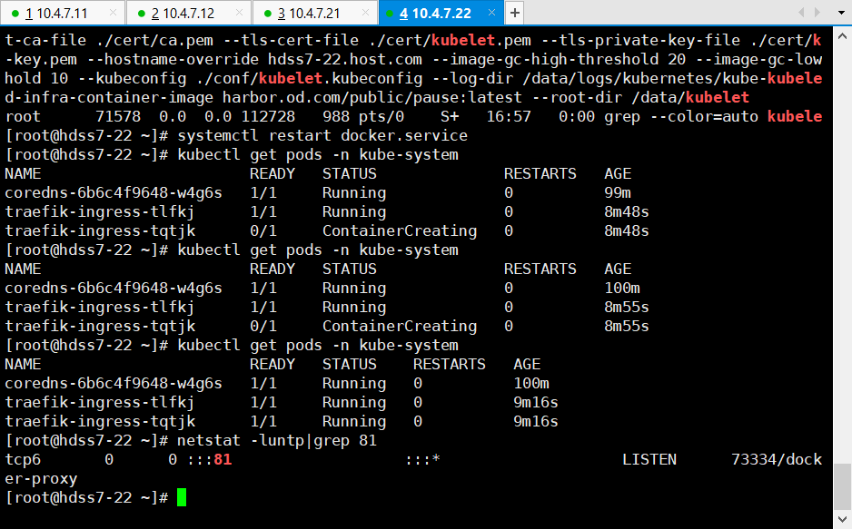

~~~
# 11/12机器，做反代：
~]# vi /etc/nginx/conf.d/od.com.conf
upstream default_backend_traefik {
    server 10.4.7.21:81    max_fails=3 fail_timeout=10s;
    server 10.4.7.22:81    max_fails=3 fail_timeout=10s;
}
server {
    server_name *.od.com;
  
    location / {
        proxy_pass http://default_backend_traefik;
        proxy_set_header Host       $http_host;
        proxy_set_header x-forwarded-for $proxy_add_x_forwarded_for;
    }
}

~]# nginx -t
~]# nginx -s reload

# 11机器,解析域名：
~]# vi /var/named/od.com.zone 
前滚serial
traefik            A    10.4.7.10

~]# systemctl restart named
~~~

> **nginx -t**：检查nginx.conf文件有没有语法错误
>
> **nginx -s reload**：不需要重启nginx的热配置

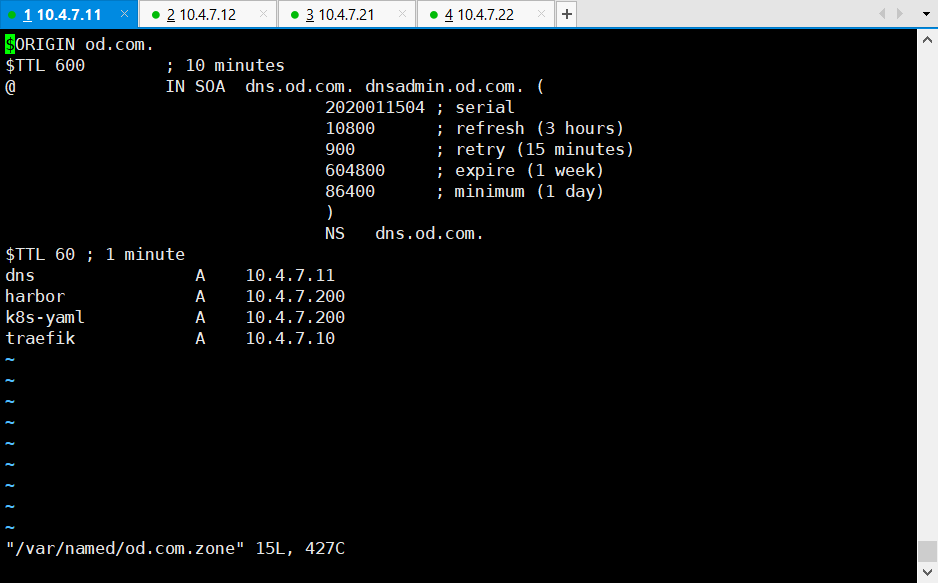

[访问traefik.od.com](traefik.od.com)

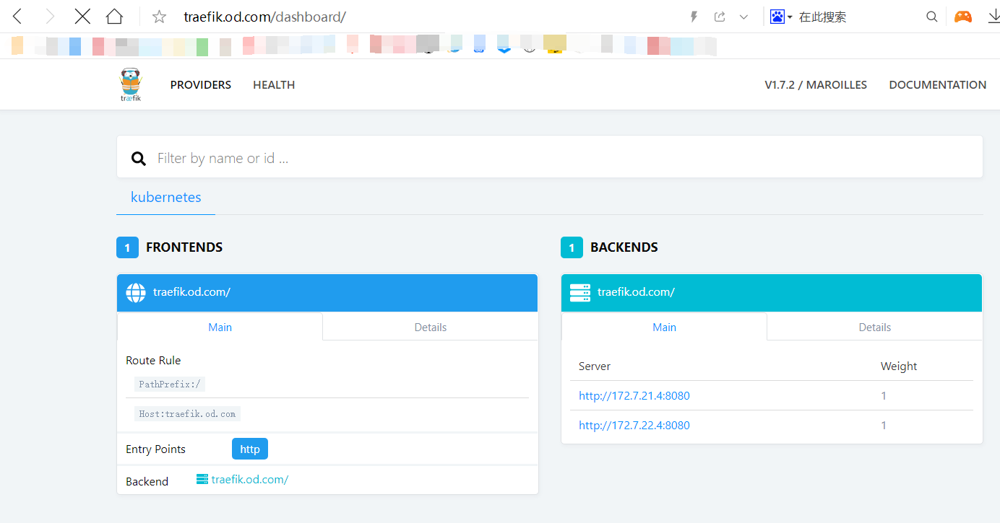

完成

##### 用户访问流程：

当用户输入traefik.od.com时，被dns解析到10.4.7.10，而10则在11上，去找L7层服务，而反代配置的od.com.conf，则是将*.od.com无差别的抛给了ingress，ingress则通过noteselect找到pod

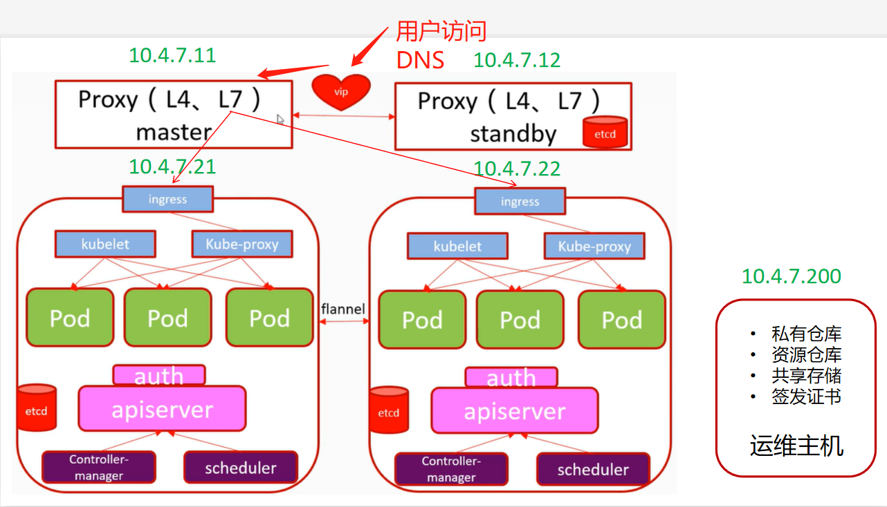

再回顾上面的架构图，我们已经全部安装部署完。

接下来，我们就要开始安装部署K8S的周边生态，使其成为一个**真正的PaaS服务**

<a href="https://github.com/ben1234560/k8s_PaaS/blob/master/%E5%8E%9F%E7%90%86%E5%8F%8A%E6%BA%90%E7%A0%81%E8%A7%A3%E6%9E%90/Kubernetes%E5%9F%BA%E6%9C%AC%E6%A6%82%E5%BF%B5.md#kubernetes%E6%8A%80%E8%83%BD%E5%9B%BE%E8%B0%B1">kubernetes技能图谱</a>

