## 第二章——企业部署实战_K8S【公有云版】

### 前言（推荐使用非公有云版，因为多次适配过后续内容）：

注：公有云版未测试是否适配第三章往后内容，理论上是完全可行的。

**考虑到部分同学机器配置并无法满足多开VMware，这里推出公有云版本（以阿里云为例）。必须有梯子（vpn/翻墙）**

> **WHY：**为什么要有梯子，后面我们会创建一些网站，而国内域云服务器创建的网站需要ICP备案，每次备案都需要等审批非常麻烦。而国外域云服务器创建的网站则不需要备案，用起来非常舒服。
>
> 
>
> **HOW：**梯子推荐lestvpn(非广告，这个一个月要40多rmb，能选代理地址我因为也用chatGPT所以开了，有更便宜的一定要推荐我😭，mac/window都测过可以用)
>
> 下载链接（推荐使用浏览器访问）：https://bitbucket.org/letsgogo/letsgogo_19/src/master/README.md 
>
> 备用链接（推荐使用浏览器访问）：https://github.com/LetsGo666/LetsGo_4
>
> 安装后打开填写我的ID：118149732 你还能多得3天会员！（可以跟朋友互相推荐互相得免费天数）


##### 如果你是新手，机器的名字及各种账户密码一定要和我的一样，先学一遍，再自己改

> **WHAT**：用于管理云平台中多个主机上的容器化的应用，Kubernetes的目标是让部署容器化的应用简单并且高效（powerful）,Kubernetes提供了应用部署，规划，更新，维护的一种机制
>
> **WHY**：为什么使用它，因为它是管理docker容器最主流的编排工具

- Pod
  - Pod是K8S里能够被运行的最小的逻辑单元（原子单元）
  - 1个Pod里面可以运行多个容器，它们共享UTS+NET+IPC名称空间
  - 可以把Pod理解成豌豆荚，而同一Pod内的每个容器是一颗颗豌豆
  - 一个Pod里运行多个容器，又叫边车（SideCar）模式
- Pod控制器（关于更多<a href="https://github.com/ben1234560/k8s_PaaS/blob/master/%E5%8E%9F%E7%90%86%E5%8F%8A%E6%BA%90%E7%A0%81%E8%A7%A3%E6%9E%90/Kubernetes%E5%9F%BA%E6%9C%AC%E6%A6%82%E5%BF%B5.md#%E5%88%9D%E8%AF%86pod">初识Pod</a>）
  - Pod控制器是Pod启动的一种模板，用来保证在K8S里启动的Pod始终按照人们的预期运行（副本数、生命周期、健康状态检查...）
  - Pod内提供了众多的Pod控制器，常用的有以下几种：
    - Deployment
    - DaemonSet
    - ReplicaSet
    - StatefulSet
    - Job
    - Cronjob
- Name
  - 由于K8S内部，使用“资源”来定义每一种逻辑概念（功能），故每种“资源”，都应该有自己的“名称”
  - “资源”有api版本（apiVersion）类别（kind）、元数据（metadata）、定义清单（spec）、状态（status）等配置信息
  - “名称”通常定义在“资源”的“元数据”信息里
- <a href="https://github.com/ben1234560/k8s_PaaS/blob/master/%E5%8E%9F%E7%90%86%E5%8F%8A%E6%BA%90%E7%A0%81%E8%A7%A3%E6%9E%90/Docker%E5%9F%BA%E7%A1%80.md#%E5%85%B3%E4%BA%8Enamespace">namespace</a>
  - 随着项目增多、人员增加、集群规模的扩大，需要一种能够隔离K8S内各种“资源”的方法，这就是名称空间
  - 名称空间可以理解为K8S内部的虚拟集群组
  - 不同名称空间内的“资源”名称可以相同，相同名称空间内的同种“资源”、“名称”不能相同
  - 合理的使用K8S名称空间，使得集群管理员能够更好的对交付到K8S里的服务进行分类管理和浏览
  - K8S内默认存在的名称空间有：default、kube-system、kube-public
  - 查询K8S里特定“资源”要带上相应的名称空间
- Label
  - 标签是K8S特色的管理方式，便于分类管理资源对象
  - 一个标签可以对应多个资源，一个资源也可以有多个标签，它们是多对多的关系
  - 一个资源拥有多个标签，可以实现不同维度的管理
  - 标签的组成：key=value
  - 与标签类似的，还有一种“注解”（annotations）
- Label选择器
  - 给资源打上标签后，可以使用标签选择器过滤指定的标签
  - 标签选择器目前有两个：基于等值关系（等于、不等于）和基于集合关系（属于、不属于、存在）
  - 许多资源支持内嵌标签选择器字段
    - matchLabels
    - matchExpressions
- Service
  - 在K8S的世界里，虽然每个Pod都会被分配一个单独的IP地址，但这个IP地址会随着Pod的销毁而消失
  - Service（服务）就是用来解决这个问题的核心概念
  - 一个Service可以看作一组提供相同服务的Pod的对外访问接口
  - Service作用与哪些Pod是通过标签选择器来定义的
- Ingress
  - Ingress是K8S集群里工作在OSI网络参考模型下，第7层的应用，对外暴露的接口
  - Service只能进行L4流量调度，表现形式是ip+port
  - Ingress则可以调度不同业务域、不同URL访问路径的业务流量

简单理解：Pod可运行的原子，name定义名字，namespace名称空间（放一堆名字），label标签（另外的名字），service提供服务，ingress通信

### K8S架构图（并非传统意义上的PaaS服务，而是IaaS服务）

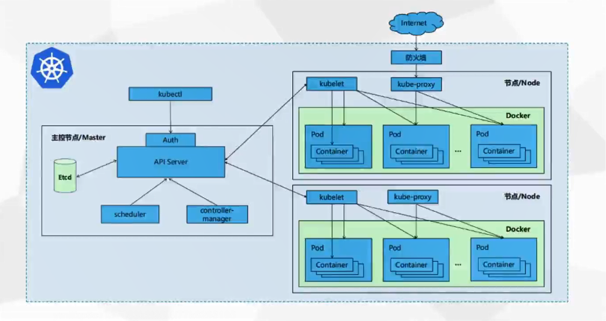

> **kubectl**：Kubernetes集群的命令行接口
>
> **API Server**：的核心功能是对核心对象（例如：Pod，Service，RC）的增删改查操作，同时也是集群内模块之间数据交换的枢纽
>
> **Etcd**：包含在 APIServer 中，用来存储资源信息
>
> **Controller Manager **：负责维护集群的状态，比如故障检测、自动扩展、滚动更新等
>
> **Scheduler**：负责资源的调度，按照预定的调度策略将Pod调度到相应的机器上。可以通过这些有更深的了解：
>
> - <a href="https://github.com/ben1234560/k8s_PaaS/blob/master/%E5%8E%9F%E7%90%86%E5%8F%8A%E6%BA%90%E7%A0%81%E8%A7%A3%E6%9E%90/Kubernetes%E8%B0%83%E5%BA%A6%E6%9C%BA%E5%88%B6.md">Kubernetes调度机制</a>
> - <a href="https://github.com/ben1234560/k8s_PaaS/blob/master/%E5%8E%9F%E7%90%86%E5%8F%8A%E6%BA%90%E7%A0%81%E8%A7%A3%E6%9E%90/Kubernetes%E8%B0%83%E5%BA%A6%E6%9C%BA%E5%88%B6.md#kubernetes%E7%9A%84%E8%B5%84%E6%BA%90%E6%A8%A1%E5%9E%8B%E4%B8%8E%E8%B5%84%E6%BA%90%E7%AE%A1%E7%90%86">Kubernetes的资源模型与资源管理</a>
> - <a href="https://github.com/ben1234560/k8s_PaaS/blob/master/%E5%8E%9F%E7%90%86%E5%8F%8A%E6%BA%90%E7%A0%81%E8%A7%A3%E6%9E%90/Kubernetes%E8%B0%83%E5%BA%A6%E6%9C%BA%E5%88%B6.md#kubernetes%E9%BB%98%E8%AE%A4%E7%9A%84%E8%B0%83%E5%BA%A6%E7%AD%96%E7%95%A5">Kubernetes默认的调度策略</a>
> - <a href="https://github.com/ben1234560/k8s_PaaS/blob/master/%E5%8E%9F%E7%90%86%E5%8F%8A%E6%BA%90%E7%A0%81%E8%A7%A3%E6%9E%90/Kubernetes%E8%B0%83%E5%BA%A6%E6%9C%BA%E5%88%B6.md#%E8%B0%83%E5%BA%A6%E5%99%A8%E7%9A%84%E4%BC%98%E5%85%88%E7%BA%A7%E4%B8%8E%E5%BC%BA%E5%88%B6%E6%9C%BA%E5%88%B6">调度器的优先级与强制机制</a>
>
> **kube-proxy**：负责为Service提供cluster内部的服务发现和负载均衡
>
> **Kubelet**：在Kubernetes中，应用容器彼此是隔离的，并且与运行其的主机也是隔离的，这是对应用进行独立解耦管理的关键点。[Kubelet工作原理解析](https://github.com/ben1234560/k8s_PaaS/blob/master/%E5%8E%9F%E7%90%86%E5%8F%8A%E6%BA%90%E7%A0%81%E8%A7%A3%E6%9E%90/Kubernetes%E8%B0%83%E5%BA%A6%E6%9C%BA%E5%88%B6.md#kubelet)
>
> **Node**：运行容器应用，由Master管理

### 我们部署的K8S架构图

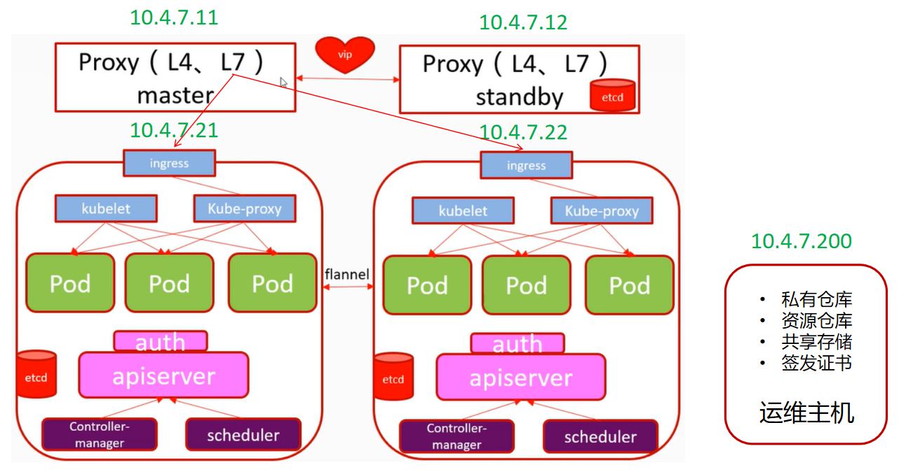

> 可以简单理解成：
>
> 11机器：反向代理
>
> 12机器：反向代理
>
> 21机器：主控+运算节点（即服务群都是跑在21和22上）
>
> 22机器：主控+运算节点（生产上我们会把主控和运算分开）
>
> 200机器：运维主机（放各种文件资源）
>
> 这样控节点有两个，运算节点有两个，就是小型的分布式，现在你可能没办法理解这些内容，我们接着做下去，慢慢的，你就理解了
>
> 这是理论上的架构，考虑到公有云对网络的限制等问题（如ipv6不能随意增加），21、22机器也会追加反向代理。

### 实验机器安装详解

我们将申请5个节点，如下图

|      | 整体  | 11机器 | 12机器 | 21机器 | 22机器 | 200机器 |
| ---- | ----- | ------ | ------ | ------ | ------ | ------- |
| 低配 | 4C32G | 2C2G   | 2C2G   | 2C8G   | 2C8G   | 2C2G    |
| 标配 | 8C64G | 2C4G   | 2C4G   | 2C16G  | 2C16G  | 2C2G    |

> 低配能够满足Jenkins之前的内容，做到Jenkins的时候就已经很卡了，到时候再追加购买新的配置，当然也可以直接购买标配，前期我还是希望各位能在理解上花些时间，慢慢的操作，否则报错都不知道怎么解决

### 如何购买公有云机器（以阿里云为例）

> 注：未选的则是默认选项。

如下图，选择“自定义购买”、“抢占式实例”（这里使用抢占式即可/省钱，担心被回收的可以选择按量付费）、“新加坡”或其它外网服务器地域（外网服务器，方便后续使用网站等时不需要备案/最好准备个梯子，作为一个程序员梯子是必备的）、“可用区”（必须选择其中一个如我选的可用区B，不能随机分配，否则多台机器的内网ip不一致）

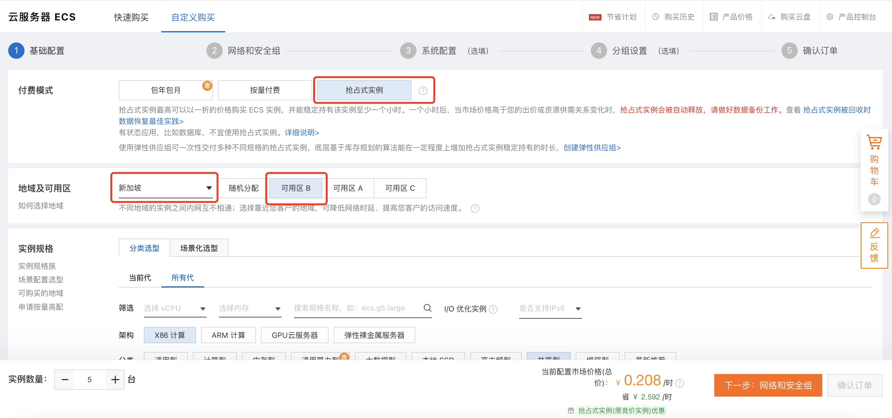

> **WHY：**为什么选新加坡，因为我的梯子可以到新加坡，你选你能代理的外网地址即可
>
> 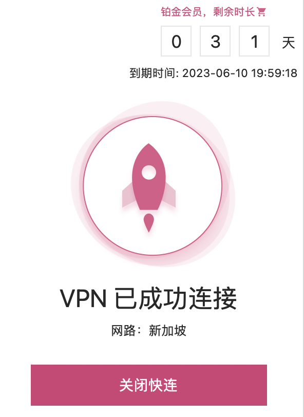

选择“共享型”（也可以选择通用型，共享型会更便宜）、选择2核8G内存的配置，

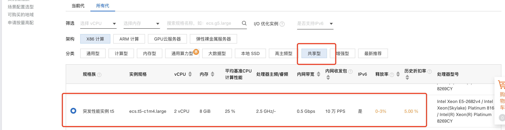

选择CentOS，7.6版本

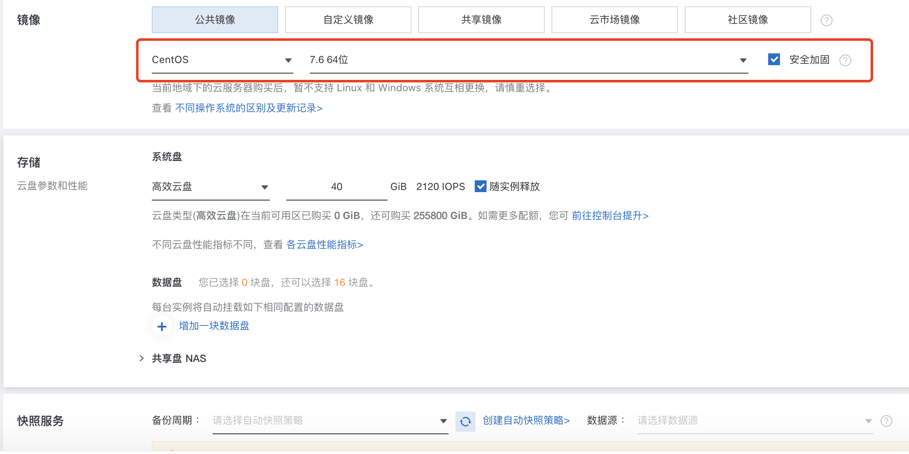

网络分配公网IPv4地址，默认选择，其它不变，这样创建下来的服务器是公用同一安全组配置，如果钱允许的话把网速开到最大

选择“自定义密码“，建议设置相对复杂的密码，如包含大小写，否则容易被攻破使用

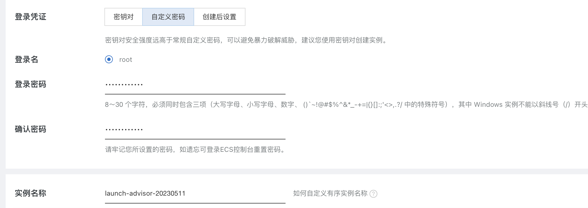

最终订单内容，注意是5台2C8G，一小时仅需0.2

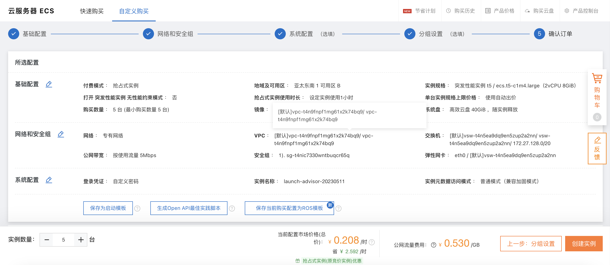

购买完成后的内容，建议给每个实例设置节点含义，如下图的k8s_11、k8s_12


如下是我的内网及节点对应情况

> |        | 11机器         | 12机器         | 21机器         | 22机器         | 200机器        |
> | ------ | -------------- | -------------- | -------------- | -------------- | -------------- |
> | 内网ip | 172.27.139.122 | 172.27.139.119 | 172.27.139.118 | 172.27.139.120 | 172.27.139.121 |
>
> 可以看到网段在172.27.139.0/254，我的11机器内网ip是172.27.139.122，后续将会持续用到，你需要填成你自己的11机器内网ip

### 机器前期准备

使用xshell或者自选的shell连接工具，[xshell下载](https://xshell.en.softonic.com/download)

> 当然我也有提供软件包：https://pan.baidu.com/s/1mkIzua1XQmew240XBbvuFA 提取码：7p6h 。里面还有Xftp，是用来进行本地电脑和虚拟机的文件传输

~~~
# 全部机器，设置名字，11是hdss7-11,12是hdss7-12,以此类推
~]# hostnamectl set-hostname hdss7-11.host.com
~]# exit
# 下面的修改，11机器对应11机器的内网ip，12对应12机器的内网ip，以此类推共两处：IPADDR、GATEWAY
~]# vi /etc/sysconfig/network-scripts/ifcfg-eth0
DEVICE=eth0
BOOTPROTO=dhcp
ONBOOT=yes
IPADDR=172.27.139.122
GATEWAY=172.27.139.254
NETMASK=255.255.255.0
TYPE=Ethernet
PROXY_METHOD=none
BROWSER_ONLY=no
DEFROUTE=yes
IPV4_FAILURE_FATAL=no
IPV6INIT=yes
IPV6_AUTOCONF=yes
IPV6_DEFROUTE=yes
IPV6_FAILURE_FATAL=no
IPV6_ADDR_GEN_MODE=stable-privacy
NAME=eth0
DEVICE=eth0
IPV6_PEERNDS=yes
IPV6_PEERROUTES=yes
IPV6_PRIUACY=no

~]# systemctl restart network
# 结束ping命令用ctrl+c(control+c)，用于发送中断信号给当前正在运行的进程
~]# ping baidu.com
~~~

> **ifcfg-eth0**：有些人的机器可能是ifcfg-esn33。使用ifconfig查看，命令输出中每个网卡接口都有一个名称，例如 "eth0"、"ens33" 等
>
> **systemctl restart**：重启某个服务
>
> **ping**：用于测试网络连接量的程序
>
> 公有云（阿里）的ifcfg-eth0原内容如下：
>
> DEVICE=eth0
> BOOTPROTO=dhcp
> ONBOOT=yes

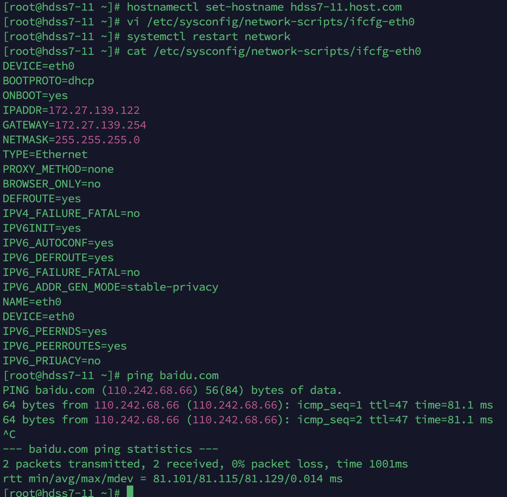


~~~
# 全部机器，查看enforce是否关闭，确保disabled状态，当然可能没有这个命令
~]# getforce
# 查看内核版本，确保在3.8以上版本
~]# uname -a
# 关闭firewalld
~]# systemctl stop firewalld
# 安装epel源及相关工具
~]# yum install epel-release wget net-tools telnet tree nmap sysstat lrzsz dos2unix bind-utils yum-utils -y
# 检查是否安装成功
~]# rpm -q epel-release wget net-tools telnet tree nmap sysstat lrzsz dos2unix bind-utils yum-utils
# out:
epel-release-7-14.noarch
wget-1.14-18.el7_6.1.x86_64
net-tools-2.0-0.25.20131004git.el7.x86_64
telnet-0.17-66.el7.x86_64
tree-1.6.0-10.el7.x86_64
nmap-6.40-19.el7.x86_64
sysstat-10.1.5-20.el7_9.x86_64
lrzsz-0.12.20-36.el7.x86_64
dos2unix-6.0.3-7.el7.x86_64
bind-utils-9.11.4-26.P2.el7_9.13.x86_64
yum-utils-1.1.31-54.el7_8.noarch
~~~

> **uname**:显示系统信息
>
> - **-a/-all**：显示全部
>
> **yum**：提供了查找、安装、删除某一个、一组甚至全部软件包的命令
>
> - **install**：安装
> - **-y**：当安装过程提示选择全部为"yes"

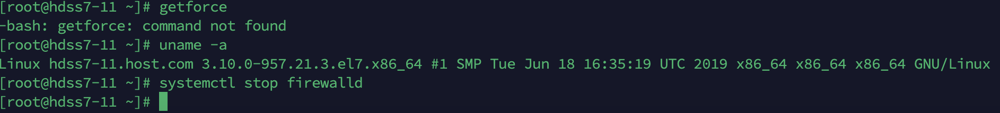

~~~
# 全部机器，安装后续需要的服务工具（我就不区分每个机器所需的了，后面会看到）
# 追加docker的repo源
~]# yum-config-manager --add-repo http://mirrors.aliyun.com/docker-ce/linux/centos/docker-ce.repo
# 安装后续所需的软件包
~]# yum install supervisor docker-compose nginx nginx-mod-stream supervisor keepalived deltarpm docker-ce -y
# 检查安装情况
~]# rpm -q supervisor docker-compose nginx nginx-mod-stream 
# out:
supervisor keepalived deltarpm docker-ce
supervisor-3.4.0-1.el7.noarch
docker-compose-1.18.0-4.el7.noarch
nginx-1.20.1-10.el7.x86_64
nginx-mod-stream-1.20.1-10.el7.x86_64
supervisor-3.4.0-1.el7.noarch
keepalived-1.3.5-19.el7.x86_64
deltarpm-3.6-3.el7.x86_64
docker-ce-23.0.6-1.el7.x86_64
~~~


### K8S前置准备工作——bind9安装部署（DNS服务）

> **WHAT**：DNS（域名系统）说白了，就是把一个域和IP地址做了一下绑定，如你在里机器里面输入 nslookup www.qq.com，出来的Address是一堆IP，IP是不容易记的，所以DNS让IP和域名做一下绑定，这样你输入域名就可以了
>
> **WHY**：我们要用ingress，在K8S里要做7层调度，而且无论如何都要用域名（如之前的那个百度页面的域名，那个是host的方式），但是问题是我们怎么给K8S里的容器绑host，所以我们必须做一个DNS，然后容器服从我们的DNS解析调度

~~~
# 在11机器：
~]# yum install bind -y
~]# rpm -qa bind
# out: bind-9.11.4-9.P2.el7.x86_64
# 配置主配置文件，11机器
~]# vi /etc/named.conf
listen-on port 53 { 172.27.139.122; };  # 原本是127.0.0.1，我的11内网ip是172.29.238.166，你填你的11内网ip
# listen-on-v6 port 53 { ::1; };  # 需要删掉
allow-query     { any; };  # 原本是localhost
forwarders      { 172.27.139.254; };  #另外添加的
dnssec-enable no;  # 原本是yes
dnssec-validation no;  # 原本是yes

# 检查修改情况，没有报错即可（即没有信息）
~]# named-checkconf
~~~

> **rpm**：软件包管理器
>
> - **-qa**：查看已安装的所有软件包
>
> **rpm和yum安装的区别**：前者不检查相依性问题，后者检查（即相关依赖包）
>
> **named.conf文件内容解析：**
>
> - **listen-on**：监听端口，改为监听在内网，这样其它机器也可以用
> - **allow-query**：哪些客户端能通过自建的DNS查
> - **forwarders**：上级DNS是什么

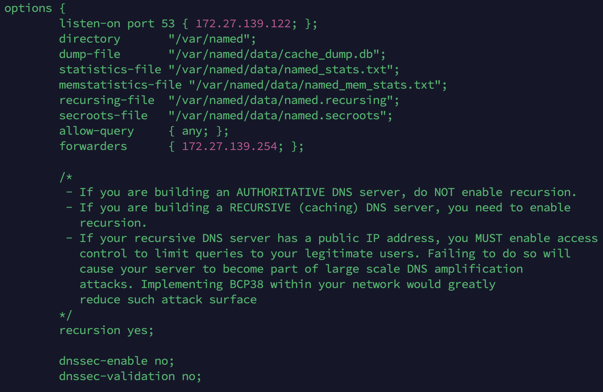


~~~
# 11机器，经验：主机域一定得跟业务是一点关系都没有，如host.com，而业务用的是od.com，因为业务随时可能变
# 区域配置文件，加在最下面，需要修改两处：allow-update
~]# vi /etc/named.rfc1912.zones
zone "host.com" IN {
        type  master;
        file  "host.com.zone";
        allow-update { 172.27.139.122; };
};

zone "od.com" IN {
        type  master;
        file  "od.com.zone";
        allow-update { 172.27.139.122; };
};

~~~

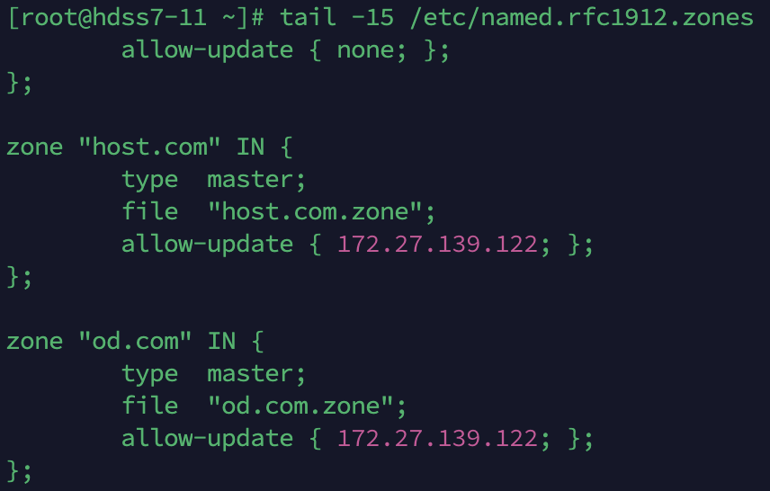

> **注意：**当配置11机器内网ip后，该机器应保存运行状态，重启后其它机器可能无法连接外网。@https://github.com/xinzhuxiansheng感谢建议！

配置域名解析的相关信息

~~~
# 11机器：
# 注意serial行的时间，代表今天的时间+第一条记录：20230511+01，需要修改serial、各个ip、
7-11 ~]# vi /var/named/host.com.zone
$ORIGIN host.com.
$TTL 600	; 10 minutes
@       IN SOA	dns.host.com. dnsadmin.host.com. (
				2023051101 ; serial
				10800      ; refresh (3 hours)
				900        ; retry (15 minutes)
				604800     ; expire (1 week)
				86400      ; minimum (1 day)
				)
			NS   dns.host.com.
$TTL 60	; 1 minute
dns                A    172.27.139.122
HDSS7-11           A    172.27.139.122
HDSS7-12           A    172.27.139.119
HDSS7-21           A    172.27.139.118
HDSS7-22           A    172.27.139.120
HDSS7-200          A    172.27.139.121

7-11 ~]# vi /var/named/od.com.zone
$ORIGIN od.com.
$TTL 600	; 10 minutes
@   		IN SOA	dns.od.com. dnsadmin.od.com. (
				2023051101 ; serial
				10800      ; refresh (3 hours)
				900        ; retry (15 minutes)
				604800     ; expire (1 week)
				86400      ; minimum (1 day)
				)
				NS   dns.od.com.
$TTL 60	; 1 minute
dns                A    172.27.139.122

# 看一下有没有报错
7-11 ~]# named-checkconf
7-11 ~]# systemctl start named
7-11 ~]# netstat -luntp|grep 53
~~~

> **TTL 600**：指定IP包被路由器丢弃之前允许通过的最大网段数量
>
> - **10 minutes**：过期时间10分钟
>
> **SOA**：一个域权威记录的相关信息，后面有5组参数分别设定了该域相关部分
>
> - **dnsadmin.od.com.**  一个假的邮箱
> - **serial**：记录的时间
>
> **$ORIGIN**：即下列的域名自动补充od.com，如dns，外面看来是dns.od.com
>
> **netstat -luntp**：显示 tcp,udp 的端口和进程等相关情况

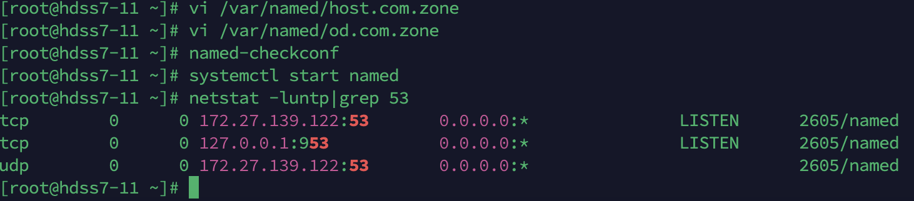

~~~
# 11机器，检查主机域是否解析
7-11 ~]# dig -t A hdss7-21.host.com @172.27.139.122 +short
# out: 172.27.139.118
# 配置服务器能使用这个配置，在最下面追加11机器的内网ip
7-11 ~]# vi /etc/sysconfig/network-scripts/ifcfg-eth0
DNS1=172.27.139.122
7-11 ~]# systemctl restart network
# 重启网络后，马上ping可能无法连接，需要等个十秒钟
7-11 ~]# ping baidu.com
7-11 ~]# ping hdss7-21.host.com
~~~

> **dig -t A**：指的是找DNS里标记为A的相关记录，而后面会带上相关的域，如上面的hdss7-21.host.com，为什么外面配了HDSS7-21后面还会自动接上.host.com就是因为$ORIGIN，后面则是对应的IP
>
> - **+short**：表示只返回IP

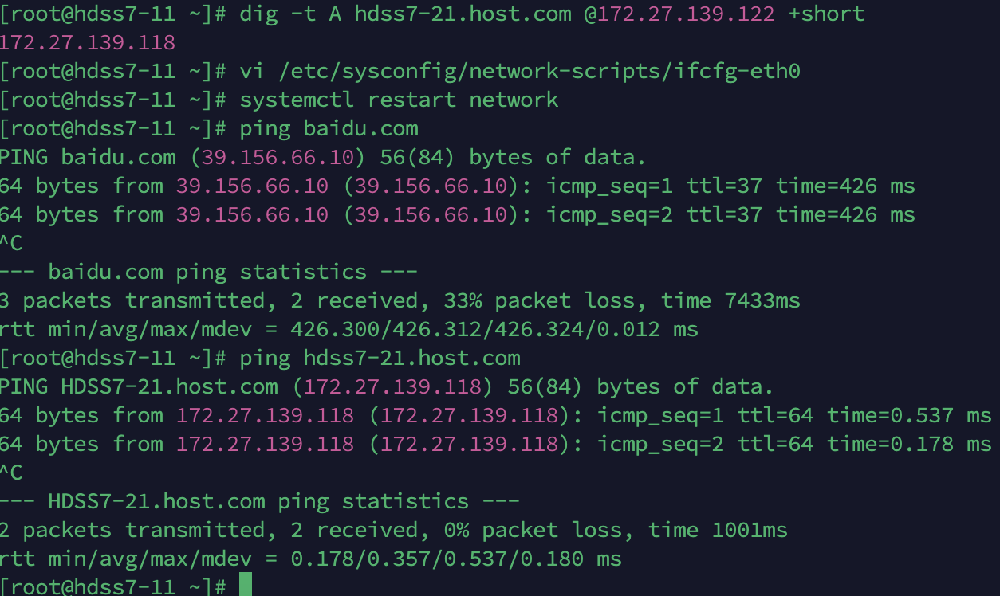

~~~
# 在非11机器上，最下面追加dns1=11机器内网ip
~]# vi /etc/sysconfig/network-scripts/ifcfg-eth0
DNS1=172.27.139.122

~]# systemctl restart network
# 试下网络是否正常
~]# ping baidu.com
# 其它机器尝试ping7-11机器或200机器等任意机器，这时候短域名是可以使用了
7-12 ~]# ping hdss7-11.host.com
7-12 ~]# ping hdss7-200.host.com
~~~

> 让其它机器的DNS全部改成11机器的好处是，全部的机器访问外网就只有通过11端口，更好控制

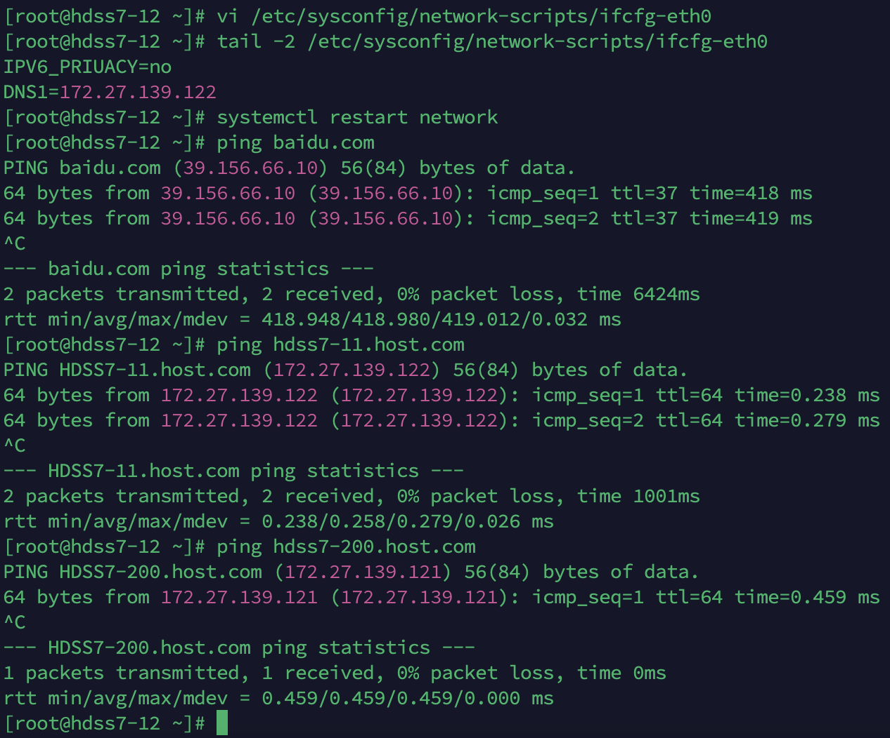

机器准备工作完成:tada:


### K8S前置工作——准备签发证书环境

> **WHAT**： 证书，可以用来审计也可以保障安全，k8S组件启动的时候，则需要有对应的证书，证书的详解你也可以在网上搜到，这里就不细细说明了
>
> **WHY**：当然是为了让我们的组件能正常运行

~~~
# cfssl方式做证书，需要三个软件（如果网络无法连通，则参考下面我已下载好的软件包），按照我们的架构图，我们部署在200机器:
200 ~]# wget https://pkg.cfssl.org/R1.2/cfssl_linux-amd64 -O /usr/bin/cfssl
200 ~]# wget https://pkg.cfssl.org/R1.2/cfssljson_linux-amd64 -O /usr/bin/cfssl-json
200 ~]# wget https://pkg.cfssl.org/R1.2/cfssl-certinfo_linux-amd64 -O /usr/bin/cfssl-certinfo
200 ~]# chmod +x /usr/bin/cfssl*
200 ~]# which cfssl
200 ~]# which cfssl-json
200 ~]# which cfssl-certinfo
~~~

> **wget**：从网络上自动下载文件的自由工具
>
> **chmod**：给对应的文件添加权限（[菜鸟教程](https://www.runoob.com/linux/linux-comm-chmod.html)）
>
> - **+x**：给当前用户增加可执行该文件的权限
>
> **which**：查看相应的东西在哪里

##### 报错：wget报错网络问题

~~~
# 针对下载cfssl网络无法连通的情况，百度云https://pan.baidu.com/s/1arE2LdtAbcR80gmIQtIELw 提取码：ouy1。找到名为”第二章涉及的软件包“中的cfssl的3个文件，上传到/root目录下
200 ~]# cp cfssl_linux-amd64 /usr/bin/cfssl
200 ~]# cp cfssljson_linux-amd64 /usr/bin/cfssl-json
200 ~]# cp cfssl-certinfo_linux-amd64 /usr/bin/cfssl-certinfo
200 ~]# chmod +x /usr/bin/cfssl*
200 ~]# which cfssl
200 ~]# which cfssl-json
200 ~]# which cfssl-certinfo
~~~

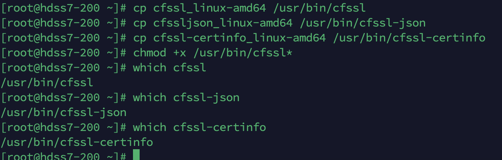


~~~
200 ~]# mkdir /opt/certs
200 ~]# cd /opt/certs
certs]# vi ca-csr.json
{
    "CN": "ben123123",
    "hosts": [
    ],
    "key": {
        "algo": "rsa",
        "size": 2048
    },
    "names": [
        {
            "C": "CN",
            "ST": "beijing",
            "L": "beijing",
            "O": "od",
            "OU": "ops"
        }
    ],
    "ca": {
        "expiry": "1752000h"
    }
}
certs]# cfssl gencert -initca ca-csr.json | cfssl-json -bare ca
certs]# cat ca.pem
# 如果你这时候显示段错误或者json错误，就是之前克隆虚拟机的时候200机器地址和别的机器地址重叠冲突了，需要重建200虚拟机
~~~

> **cd **：切换当前工作目录到 dirName
>
> - 语法：cd [dirName]
>
> **mkdir**：建立名称为 dirName 之子目录
>
> - 语法：mkdir [-p] dirName
> - **-p:** 确保目录存在，不存在则建一个，如mkdir empty/empty1/empty2
>
> **cfssl**：证书工具
>
> - gencert：生成的意思
>
> **ca-csr.json解析：**
>
> - CN：Common Name，浏览器使用该字段验证网址是否合法，一般写域名，非常重要
> - ST：State，省
> - L：Locality，地区
> - O：Organization Name，组织名称
> - OU：Organization Unit Name，组织单位名称
>
> <a href="https://github.com/ben1234560/k8s_PaaS/blob/master/%E5%8E%9F%E7%90%86%E5%8F%8A%E6%BA%90%E7%A0%81%E8%A7%A3%E6%9E%90/Kubernetes%E5%9F%BA%E6%9C%AC%E6%A6%82%E5%BF%B5.md#pod%E4%B8%AD%E5%87%A0%E4%B8%AA%E9%87%8D%E8%A6%81%E5%AD%97%E6%AE%B5%E7%9A%84%E5%90%AB%E4%B9%89%E5%92%8C%E7%94%A8%E6%B3%95">Pod中几个重要字段的含义和用法</a>

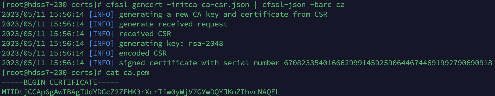


### K8S前置工作——部署docker环境

> **WHAT**：是一个开源的应用容器引擎，让开发者可以打包他们的应用以及依赖包到一个可移植的镜像中，然后发布到任何流行的 Linux或Windows 机器上，也可以实现虚拟化。
>
> **WHY**：Pod里面就是由数个docker容器组成，Pod是豌豆荚，docker容器是里面的豆子。

~~~
# 如我们架构图所示，运算节点是21/22机器（没有docker则无法运行pod），运维主机是200机器（没有docker则没办法下载docker存入私有仓库），所以在三台机器安装（21/22/200）
# 这个前面已经安装 curl -fsSL https://get.docker.com | bash -s docker --mirror Aliyun
# 上面的下载可能网络有问题，需要多试几次，这些部署我已经不同机器试过很多次了，实在不行的使用下面提供的报错解决方法。
~]# mkdir -p /data/docker /etc/docker
# # 注意，172.7.21.1，这里得21是指在hdss7-21得机器，如果是22得机器，就是172.7.22.1，共一处需要改机器名："bip": "172.7.21.1/24"
~]# vi /etc/docker/daemon.json
{
  "data-root": "/data/docker",
  "storage-driver": "overlay2",
  "insecure-registries": ["registry.access.redhat.com","quay.io","harbor.od.com"],
  "registry-mirrors": ["https://q2gr04ke.mirror.aliyuncs.com"],
  "bip": "172.7.21.1/24",
  "exec-opts": ["native.cgroupdriver=systemd"],
  "live-restore": true
}

~]# systemctl start docker
~]# docker version
~]# docker ps -a
~~~

> **mkdir -p：**前面有讲到过（上一级目录没有则创建），而这次后面带了两个目录，意思是同时创建两个目录
>
> **daemon.json：**为什么配aliyuncs的环境，是因为默认是连接到外网的，速度比较慢，所以我们可以直接使用国内的阿里云镜像源，当然还有腾讯云等
>
> **docker version：**查看docker的版本
>
> **daemon.json解析：**重点说一下这个为什么10.4.7.21机器对应着172.7.21.1/24，这里可以看到10的21对应得是172的21，这样做的好处就是，当你的pod出现问题时，你可以马上定位到是在哪台机器出现的问题，是21还是22还是其它的，这点在生产上非常重要，有时候你的dashboard（后面会安装）宕掉了，你没办法只能去机器找，而这时候你又找不到的时候，你老板会拿你祭天的

##### 报错：curl -fsSL https://get.docker.com | bash -s docker --mirror Aliyun

报错信息：

http://mirrors.cloud.aliyuncs.com/centos/7/updates/x86_64/Packages/libxml2-2.9.1-6.el7_9.6.x86_64.rpm: [Errno 14] curl#6 - "Could not resolve host: mirrors.cloud.aliyuncs.com; Unknown error"
Trying other mirror.

Error downloading packages:
  libxml2-2.9.1-6.el7_9.6.x86_64: [Errno 256] No more mirrors to try.
  python-kitchen-1.1.1-5.el7.noarch: [Errno 256] No more mirrors to try.
  yum-utils-1.1.31-54.el7_8.noarch: [Errno 256] No more mirrors to try.
  python-chardet-2.2.1-3.el7.noarch: [Errno 256] No more mirrors to try.
  libxml2-python-2.9.1-6.el7_9.6.x86_64: [Errno 256] No more mirrors to try.

原因：yum源出现问题

解决方法：

~~~
mv /etc/yum.repos.d/epel.repo /etc/yum.repos.d/epel.repo.bak
curl -o /etc/yum.repos.d/CentOS-Base.repo http://mirrors.aliyun.com/repo/Centos-7.repo  # 这一步必须成功，没成功的再执行一遍即可
yum update -y  # 这一步耗时较长
yum install epel-release -y
yum install -y yum-utils
yum-config-manager --add-repo http://mirrors.aliyun.com/docker-ce/linux/centos/docker-ce.repo
yum install -y docker-ce
~~~

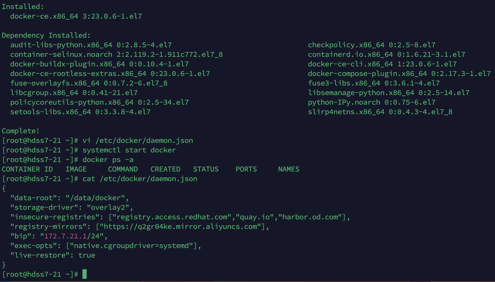


### K8S前置工作——部署harbor仓库

> **WHAT **：harbor仓库是可以部署到本地的私有仓库，也就是你可以把镜像推到这个仓库，然后需要用的时候再下载下来，这样的好处是：1、下载速度快，用到的时候能马上下载下来2、不用担心镜像改动或者下架等。
>
> **WHY**：因为我们的部署K8S涉及到很多镜像，制作相关包的时候如果网速问题会导致失败重来，而且我们在公司里也会建自己的仓库，所以必须按照harbor仓库

~~~
# 如架构图，我们安装在200机器：
200 ~]# mkdir /opt/src  && cd /opt/src
# 可以去这个地址下载，也可以直接用我用的软件包
https://github.com/goharbor/harbor/releases/tag/v1.8.3
200 src]# wget https://storage.googleapis.com/harbor-releases/release-1.8.0/harbor-offline-installer-v1.8.3.tgz
7-200 src]# tar xf harbor-offline-installer-v1.8.3.tgz -C /opt/
~~~

> **tag**：可以加入，解开备份文件内的文件
>
> - **x**：解压
> - **f**： 使用档案名字
> - **-C**：切换到指定的目录
> - 整条命令合起来就是，把tgz文件以tgz文件名为名字解压到opt目录下，并保存tgz文件原样
>
> **关于版本**：一般人都是喜欢用比较新的版本，我们当然也支持比较新的版本，但对于公司而已，稳定是最要紧的，v1.8.3是用的比较稳定的版本，而后续的各个组件也会有更加新的版本，你可以尝试新版本，但有些由于兼容问题不能用新的，后续那些不能用我会标记清楚。

~~~
# 200机器：
200 src]# cd /opt/
200 opt]# mv harbor/ harbor-v1.8.3
200 opt]# ln -s /opt/harbor-v1.8.3/ /opt/harbor
200 opt]# cd harbor
200 harbor]# ll
# 修改域名、端口、挂载卷及日志存放地址
200 harbor]# vi harbor.yml  # 如果这里是用的2.8.0版本，则需要cp harbor.yml.tmpl harbor.yml
hostname: harbor.od.com  # 原reg.mydomain.com
http:
  port: 180  # 原80
data_volume: /data/harbor
location: /data/harbor/logs

200 harbor]# mkdir -p /data/harbor/logs
# 这个前面已经安装 yum install docker-compose -y
200 harbor]# rpm -qa docker-compose
# out: docker-compose-1.18.0-4.el7.noarch
# yum install docker-compose 包无法下载的，可以查看下面提供的报错解决方法
200 harbor]# ./install.sh
~~~

> **提示**：harbor v2.3.3版本安装也需要将https相关的配置注释掉
>
> 如图#https:
>
> 
>
> 感谢@https://github.com/xinzhuxiansheng
>
> **mv**：为文件或目录改名、或将文件或目录移入其它位置。
>
> - 这里的命令是有斜杠的，所以是移动到某个目录下
>
> **ln**：为某一个文件在另外一个位置建立一个同步的链接
>
> - `语法:ln [参数][源文件或目录][目标文件或目录]`
> - `**-s：**软连接，可以对整个目录进行链接`
>
> **harbor.yml解析：**
>
> - port为什么改成180：因为后面我们要装nginx，nginx用的80，所以要把它们错开
> - data_volume：数据卷，即docker镜像放在哪里
> - location：日志文件
> - **./install.sh**：启动shell脚本

##### 报错：yum install docker-compose -y报错No package docker-compose available.

使用我提供的官方软件包（放在百度网盘），放到harbor路径下

~~~sh
200 harbor]# sudo cp docker-compose-Linux-x86_64 /usr/local/bin/docker-compose
200 harbor]# sudo chmod +x /usr/local/bin/docker-compose
200 harbor]# docker-compose --version
# out: docker-compose version 1.29.2, build 5becea4c
200 harbor]# ./install.sh
~~~

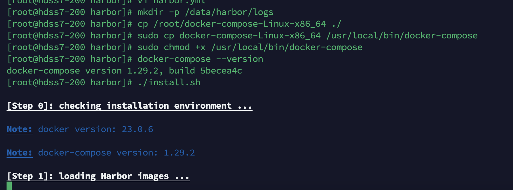

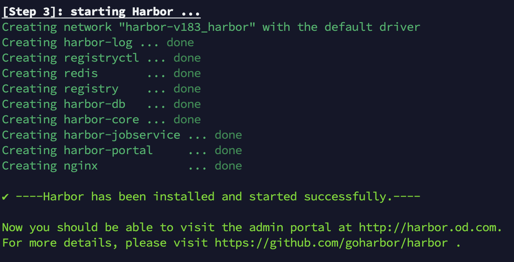


~~~
# 200机器：
200 harbor]# docker-compose ps
# out:
      Name                     Command               State             Ports          
--------------------------------------------------------------------------------------
harbor-core         /harbor/start.sh                 Up                               
harbor-db           /entrypoint.sh postgres          Up      5432/tcp                 
harbor-jobservice   /harbor/start.sh                 Up                               
harbor-log          /bin/sh -c /usr/local/bin/ ...   Up      127.0.0.1:1514->10514/tcp
harbor-portal       nginx -g daemon off;             Up      80/tcp                   
nginx               nginx -g daemon off;             Up      0.0.0.0:180->80/tcp      
redis               docker-entrypoint.sh redis ...   Up      6379/tcp                 
registry            /entrypoint.sh /etc/regist ...   Up      5000/tcp                 
registryctl         /harbor/start.sh                 Up 
200 harbor]# docker ps -a
# 这个前面已经安装 yum install nginx -y  # 报错的参考下面报错对应的解决方法

###相关报错问题：
yum的时候报：/var/run/yum.pid 已被锁定，PID 为 1610 的另一个程序正在运行。
另外一个程序锁定了 yum；等待它退出……
网上统一的解决办法：直接在终端运行 rm -f /var/run/yum.pid 将该文件删除，然后再次运行yum。
###
~~~

##### 报错：yum install nginx -y没有对应包

~~~
200 ~]# yum install nginx -y
Loaded plugins: fastestmirror
Loading mirror speeds from cached hostfile
 * base: mirrors.aliyun.com
 * extras: mirrors.aliyun.com
 * updates: mirrors.aliyun.com
No package nginx available.
Error: Nothing to do
~~~

解决方法

~~~
# 编写nginx.repo
200 harbor]# sudo vi /etc/yum.repos.d/nginx.repo
[nginx]
name=nginx repo
baseurl=http://nginx.org/packages/centos/7/$basearch/
gpgcheck=0
enabled=1

# 保存退出后即可安装nginx了
200 harbor]# sudo yum install nginx -y
~~~


解决完接着走

~~~
200 harbor]# vi /etc/nginx/conf.d/harbor.od.com.conf
server {
    listen       80;
    server_name  harbor.od.com;

    client_max_body_size 1000m;

    location / {
        proxy_pass http://127.0.0.1:180;
    }
}

200 harbor]# nginx -t
200 harbor]# systemctl start nginx
200 harbor]# systemctl enable nginx
~~~

> **nginx -t**：测试*nginx*.conf配置文件中是否存在语法错误
>
> **systemctl enable nginx**：开机自动启动

追加域名解析

~~~
# 在11机器解析域名：
~]# vi /var/named/od.com.zone
# 注意serial前滚一个序号
# 最下面添加域名
harbor             A    172.27.139.121
~]# systemctl restart named
~]# dig -t A harbor.od.com +short
# out:172.29.238.162
~~~

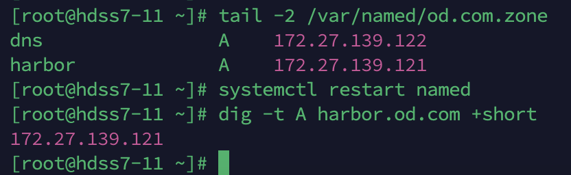

~~~
# 200机器上curl：
harbor]# curl harbor.od.com
~~~

> 注意：
>
> getenforce得是关闭状态，而不是enforcing，否则会报502
> 暂时关闭setenforce 0
> 永久关闭，改配置文件 vi /etc/selinux/config
> SELINUX=disabled

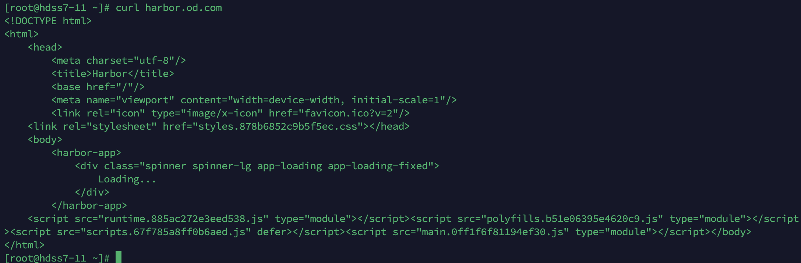

公有云的安全组添加tcp 180端口权限


在本机（window/mac）hosts，在文件末尾添加新的 DNS 域名解析（确保能telnet通），如：

~~~
公网ip harbo.od.com  # 公网ip对应200机器的公网ip
~~~

[访问harbor.od.com:180](harbor.od.com:180)

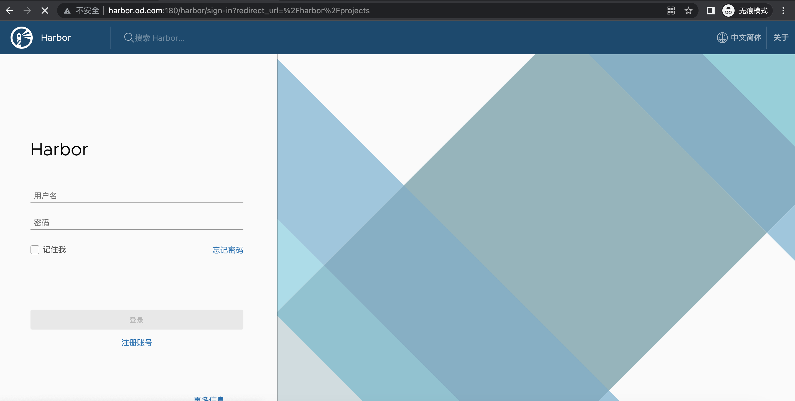

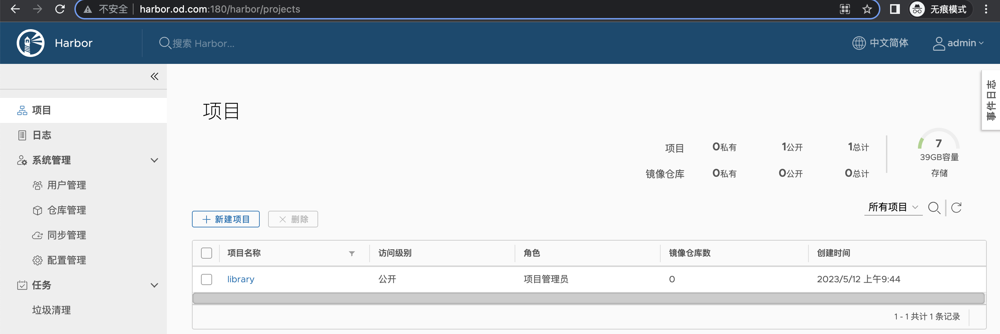

~~~
账号：admin
密码：Harbor12345
新建一个public公开项目，登陆报错请参考下面的报错解决方法，一般是网络问题，如果接口方式也无法解决，直接重装更快
~~~

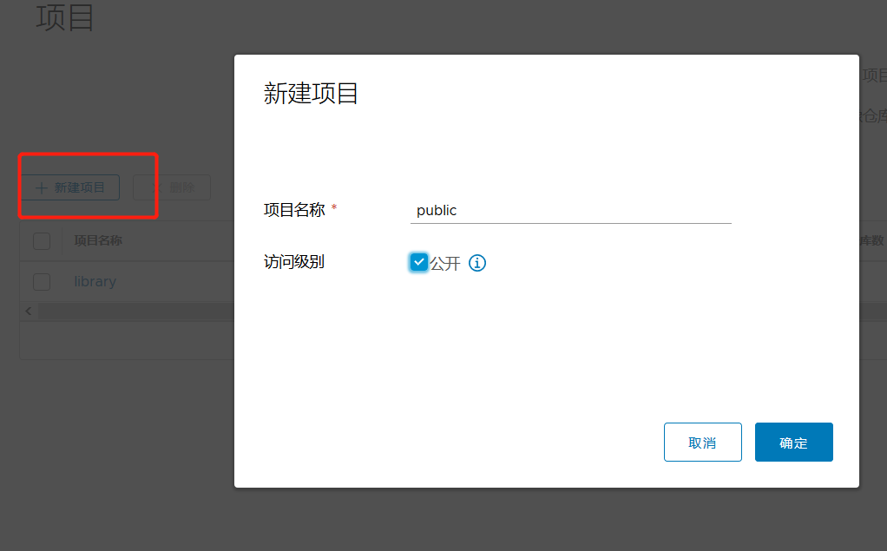

~~~
# 200机器，尝试下是否能push成功到harbor仓库
harbor]# docker pull nginx:1.7.9
harbor]# docker images|grep 1.7.9
harbor]# docker tag 84581e99d807 harbor.od.com/public/nginx:v1.7.9
harbor]# docker login harbor.od.com
账号：admin
密码：Harbor12345
harbor]# docker push harbor.od.com/public/nginx:v1.7.9
# 报错：如果发现登录不上去了，过一阵子再登录即可，大约5分钟左右
~~~

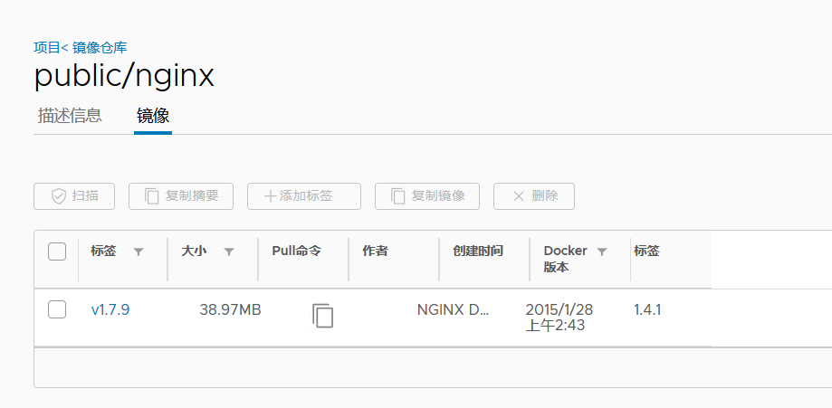

##### 报错：用正确的admin及密码仍提示密码错误

排查：cat /data/harbor/logs/* |grep -i erro

重新安装一次harbor或直接用命令行操作创建public

~~~
# 针对1.8.2版本，新版本需要新版本的操作指令，部署后api控制中心在这里http://harbor.od.com:180/devcenter
# 创建public
~]curl -u "admin:Harbor12345" -X POST "http://harbor.od.com/api/projects" -H "Content-Type: application/json" -d '{"project_name":"public","metadata":{"public":"true"}}'
# 确认是否创建成功
~]curl -u "admin:Harbor12345" -X GET "http://harbor.od.com/api/projects"
~~~

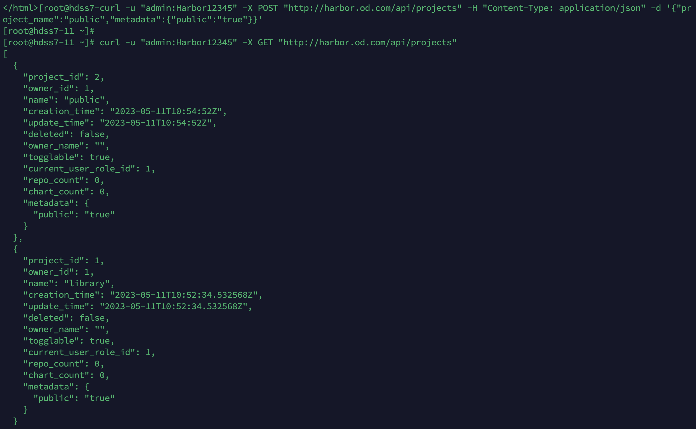

检查推送nginx是否成功

~~~
# 必须已经下载好jq了，yum install jq -y
# 获取public的id，一般是2
curl -u "admin:Harbor12345" -X GET "http://harbor.od.com/api/projects?name=public" | jq '.[0].project_id'
# 使用id=2进行api接口的调用
curl -u "admin:Harbor12345" -X GET "http://harbor.od.com/api/repositories?project_id=2" | jq '.[].name'
~~~

成功，此时你已成功建立了自己的本地私有仓库:tada:，或许你会考虑建立自己的独立站，enjoin!


### 安装部署主控节点服务etcd

> 注意, 一定要同步每个虚拟机的时间, 时区和时间要保持一致, 可以通过以下的命令来操作, 最好所有的虚拟机都执行一次, 最好的方法是写进`/etc/rc.local`中

  ```bash
timedatectl set-timezone Asia/Shanghai
timedatectl set-ntp true
  ```

> **WHAT**：一个高可用强一致性的服务发现存储仓库，关于服务发现，其本质就是知道了集群中是否有进程在监听udp和tcp端口（如上面部署的harbor就是监听180端口），并且通过名字就可以查找和连接。
>
> - **一个强一致性、高可用的服务存储目录**：基于Raft算法的etcd天生就是这样
> - **一种注册服务和监控服务健康状态的机制**：在etcd中注册服务，并且对注册的服务设置`key TTL`（TTL上面有讲到），定时保持服务的心跳以达到监控健康状态的效果
> - **一种查找和连接服务的机制**：通过在etcd指定的主题下注册的服务也能在对应的主题下查找到，为了确保连接，我们可以在每个服务机器上都部署一个Proxy模式的etcd，这样就可以确保能访问etcd集群的服务都能互相连接
>
> **WHY**：我们需要让服务快速透明地接入到计算集群中，让共享配置信息快速被集群中的所有机器发现

看我们的结构图，可以看到我们在12/21/22机器都部署了etcd

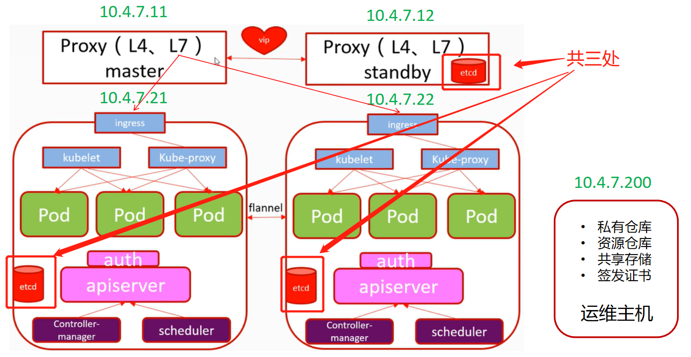

~~~
# 我们开始制作证书，200机器：
certs]# cd /opt/certs/
certs]# vi /opt/certs/ca-config.json
{
    "signing": {
        "default": {
            "expiry": "1752000h"
        },
        "profiles": {
            "server": {
                "expiry": "1752000h",
                "usages": [
                    "signing",
                    "key encipherment",
                    "server auth"
                ]
            },
            "client": {
                "expiry": "1752000h",
                "usages": [
                    "signing",
                    "key encipherment",
                    "client auth"
                ]
            },
            "peer": {
                "expiry": "1752000h",
                "usages": [
                    "signing",
                    "key encipherment",
                    "server auth",
                    "client auth"
                ]
            }
        }
    }
}

# 下面hosts添加11、12、21、22机器的内网ip
certs]# vi etcd-peer-csr.json
{
    "CN": "k8s-etcd",
    "hosts": [
        "172.27.139.122",
        "172.27.139.119",
        "172.27.139.118",
        "172.27.139.120"
    ],
    "key": {
        "algo": "rsa",
        "size": 2048
    },
    "names": [
        {
            "C": "CN",
            "ST": "beijing",
            "L": "beijing",
            "O": "od",
            "OU": "ops"
        }
    ]
}

certs]# cfssl gencert -ca=ca.pem -ca-key=ca-key.pem -config=ca-config.json -profile=peer etcd-peer-csr.json |cfssl-json -bare etcd-peer
certs]# ll
~~~

> 关于这些json文件是怎么写出来的，答案：官网抄的然后修改，这些没什么重要的你也不需要太在意，后面重要的会说明是从哪里抄出来的
>
> **ca-config.json解析：**
>
> - expiry：有效期为200年
> - profiles-server：启动server的时候需要配置证书
> - profiles-client：client去连接server的时候需要证书
> - profiles-peer：双向证书，服务端找客户端需要证书，客户端找服务端需要证书
>
> **etcd-peer-csr解析：**
>
> - hosts：etcd有可能部署到哪些组件的IP都要填进来
>
> **cfssl gencert**：生成证书

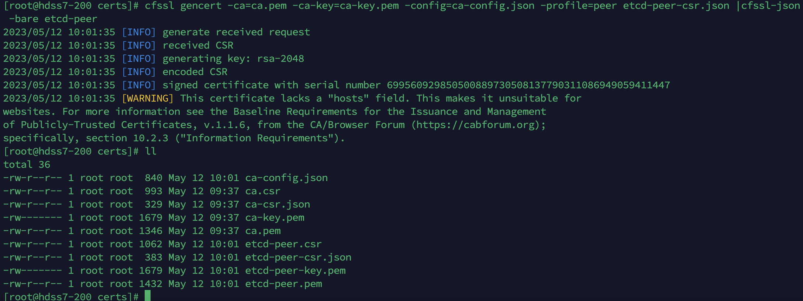

~~~
# 12/21/22机器，安装etcd：
~]# mkdir /opt/src
~]# cd /opt/src/
# 创建用户
src]# useradd -s /sbin/nologin -M etcd
src]# id etcd

# 到GitHub下载或者直接用我给得安装包 https://github.com/etcd-io/etcd/releases/tag/v3.1.20，百度云https://pan.baidu.com/s/1arE2LdtAbcR80gmIQtIELw 提取码：ouy1
src]# wget https://github.com/etcd-io/etcd/releases/download/v3.1.20/etcd-v3.1.20-linux-amd64.tar.gz
src]# tar xf etcd-v3.1.20-linux-amd64.tar.gz -C /opt
src]# cd /opt
opt]# mv etcd-v3.1.20-linux-amd64/ etcd-v3.1.20
opt]# ln -s /opt/etcd-v3.1.20/ /opt/etcd
opt]# cd etcd
~~~

> **tag**：可以加入，解开备份文件内的文件
>
> - **x**：解压
> - **f** ：使用档案名字
> - **-C**：切换到指定的目录
> - 整条命令合起来就是，把tgz文件以tgz文件名为名字解压到opt目录下，并保存tgz文件原样
>
> **ln**：为某一个文件在另外一个位置建立一个同步的链接
>
> - `语法:ln [参数][源文件或目录][目标文件或目录]`
> - **-s**：软连接，可以对整个目录进行链接
>
> **useradd**：建立用户帐号
>
> **-s**：指定用户登入后所使用的shell
>
> **-M**：不要自动建立用户的登入目录

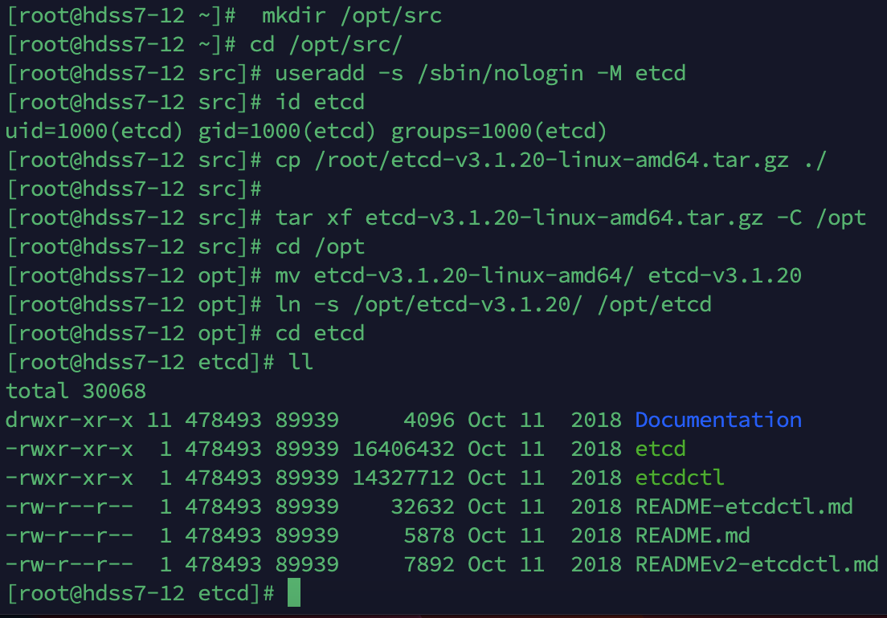

~~~
# 12/21/22机器：
etcd]# mkdir -p /opt/etcd/certs /data/etcd /data/logs/etcd-server
etcd]# cd certs/
certs]# scp hdss7-200:/opt/certs/ca.pem .
# 输入200虚机密码
certs]# scp hdss7-200:/opt/certs/etcd-peer*.pem .
certs]# cd ..
# 3台机器，如果是21机器，这下面得12都得改成21，对应的ip换成21的内网ip，initial-cluster则是全部机器都有不需要改，一共5处：etcd-server-7-12、listen-peer-urls后、client-urls后、advertise-peer-urls后、advertise-client-urls后，可以用:%s/旧ip/新ip/g命令进行批量更换(退出insert后粘贴)
etcd]# vi /opt/etcd/etcd-server-startup.sh
#!/bin/sh
./etcd --name etcd-server-7-12 \
       --data-dir /data/etcd/etcd-server \
       --listen-peer-urls https://172.27.139.119:2380 \
       --listen-client-urls https://172.27.139.119:2379,http://127.0.0.1:2379 \
       --quota-backend-bytes 8000000000 \
       --initial-advertise-peer-urls https://172.27.139.119:2380 \
       --advertise-client-urls https://172.27.139.119:2379,http://127.0.0.1:2379 \
       --initial-cluster  etcd-server-7-12=https://172.27.139.119:2380,etcd-server-7-21=https://172.27.139.118:2380,etcd-server-7-22=https://172.27.139.120:2380 \
       --ca-file ./certs/ca.pem \
       --cert-file ./certs/etcd-peer.pem \
       --key-file ./certs/etcd-peer-key.pem \
       --client-cert-auth  \
       --trusted-ca-file ./certs/ca.pem \
       --peer-ca-file ./certs/ca.pem \
       --peer-cert-file ./certs/etcd-peer.pem \
       --peer-key-file ./certs/etcd-peer-key.pem \
       --peer-client-cert-auth \
       --peer-trusted-ca-file ./certs/ca.pem \
       --log-output stdout

etcd]# chmod +x etcd-server-startup.sh
etcd]# chown -R etcd.etcd /opt/etcd-v3.1.20/
etcd]# chown -R etcd.etcd /data/etcd/
etcd]# chown -R etcd.etcd /data/logs/etcd-server/
etcd]# ll
~~~

> **scp**：用于 *Linux* 之间复制文件和目录
>
> **带***：表示模糊匹配任意内容
>
> **chmod**：添加权限
>
> - **+x**：给当前用户添加可执行该文件的权限权限
>
> **chown**：指定文件的拥有者改为指定的用户或组
>
> - **-R**：处理指定目录以及其子目录下的所有文件
> - 这里即是把/opt/etcd...等的拥有者给etcd用户
>
> **ll**：列出权限、大小、名称等信息

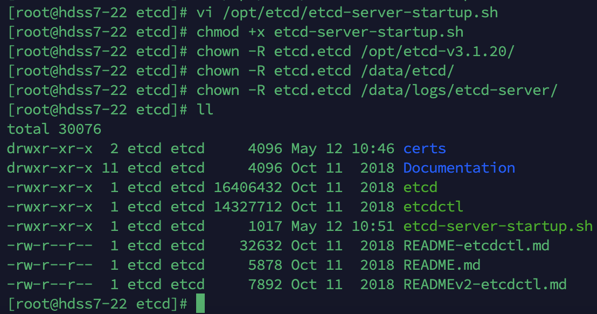

~~~
# 12/21/22机器，我们同时需要supervisor（守护进程工具）来确保etcd是启动的，后面还会不断用到：
# 这个我们前面已经装了 yum install supervisor -y
etcd]# systemctl start supervisord
etcd]# systemctl enable supervisord
# 注意修改下面得7-12，对应上机器，如21机器就是7-21，一共一处：[program:etcd-server-7-12]
etcd]# vi /etc/supervisord.d/etcd-server.ini
[program:etcd-server-7-12]
command=/opt/etcd/etcd-server-startup.sh                        ; the program (relative uses PATH, can take args)
numprocs=1                                                      ; number of processes copies to start (def 1)
directory=/opt/etcd                                             ; directory to cwd to before exec (def no cwd)
autostart=true                                                  ; start at supervisord start (default: true)
autorestart=true                                                ; retstart at unexpected quit (default: true)
startsecs=30                                                    ; number of secs prog must stay running (def. 1)
startretries=3                                                  ; max # of serial start failures (default 3)
exitcodes=0,2                                                   ; 'expected' exit codes for process (default 0,2)
stopsignal=QUIT                                                 ; signal used to kill process (default TERM)
stopwaitsecs=10                                                 ; max num secs to wait b4 SIGKILL (default 10)
user=etcd                                                       ; setuid to this UNIX account to run the program
redirect_stderr=true                                            ; redirect proc stderr to stdout (default false)
stdout_logfile=/data/logs/etcd-server/etcd.stdout.log           ; stdout log path, NONE for none; default AUTO
stdout_logfile_maxbytes=64MB                                    ; max # logfile bytes b4 rotation (default 50MB)
stdout_logfile_backups=4                                        ; # of stdout logfile backups (default 10)
stdout_capture_maxbytes=1MB                                     ; number of bytes in 'capturemode' (default 0)
stdout_events_enabled=false                                     ; emit events on stdout writes (default false)

etcd]# supervisorctl update
# out：etcd-server-7-21: added process group
etcd]# supervisorctl status
# out: etcd-server-7-12                 RUNNING   pid 16582, uptime 0:00:59
etcd]# netstat -luntp|grep etcd
# 必须是监听了2379和2380这两个端口才算成功
tcp        0      0 172.27.139.119:2379     0.0.0.0:*               LISTEN      14903/./etcd        
tcp        0      0 127.0.0.1:2379          0.0.0.0:*               LISTEN      14903/./etcd        
tcp        0      0 172.27.139.119:2380     0.0.0.0:*               LISTEN      14903/./etcd 
~~~

> **systemctl enable**：开机启动
>
> **update**：更新
>
> **netstat -luntp：**查看端口和进程情况
>
> 现在你可以感觉到，supervisor守护进程也仅仅是你配好ini文件即可

~~~
# 任意节点（12/21/22）检测集群健康状态的两种方法
22 etcd]# ./etcdctl cluster-health
22 etcd]# ./etcdctl member list
~~~

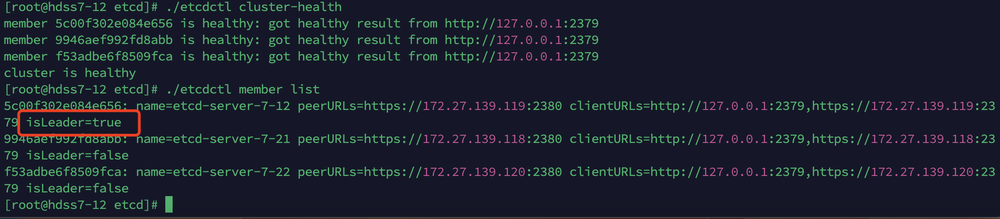

> 这里你再哪个机器先update，哪个机器就是leader

完成


### 部署API-server集群

[kubernetes官网](https://github.com/kubernetes/kubernetes)

根据架构图，我们把运算节点部署在21和22机器

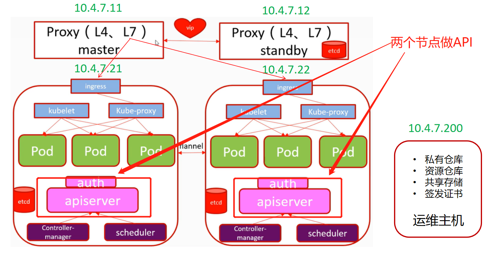

~~~
# 21/22机器
etcd]# cd /opt/src/
# 可以去官网下载也可以用我的包，百度云盘https://pan.baidu.com/s/1arE2LdtAbcR80gmIQtIELw 提取码：ouy1
src]# wget https://dl.k8s.io/v1.15.2/kubernetes-server-linux-amd64.tar.gz
src]# mv kubernetes-server-linux-amd64.tar.gz kubernetes-server-linux-amd64-v1.15.2.tar.gz

src]# tar xf kubernetes-server-linux-amd64-v1.15.2.tar.gz -C /opt/
src]# cd /opt
opt]# mv kubernetes/ kubernetes-v1.15.2
opt]# ln -s /opt/kubernetes-v1.15.2/ /opt/kubernetes
opt]# cd kubernetes
# 删掉不需要的文件
kubernetes]# rm -rf kubernetes-src.tar.gz
kubernetes]# cd server/bin
bin]# rm -f *.tar
bin]# rm -f *_tag
bin]# ll
~~~

> **tar xf -C**：解压到某个文件夹
>
> **mv**：移动到哪里
>
> **ln -s**：建立软连接
>
> **rm**：删除一个文件或者目录
>
> - **-r**：将目录及以下之档案亦逐一删除
> - **-f**：直接删除，无需逐一确认（你可以试试先不加-f去删除）
> - 加起来就是强制删除
>
> ***.tar**： 这里的*的意思是模糊法，即只要你的结尾是.tar的都匹配上加上rm，就是把所有.tar结尾的文件都删除


~~~
# 200机器，签发client证书：
200 ~]# cd /opt/certs/
200 certs]# vi client-csr.json
{
    "CN": "k8s-node",
    "hosts": [
    ],
    "key": {
        "algo": "rsa",
        "size": 2048
    },
    "names": [
        {
            "C": "CN",
            "ST": "beijing",
            "L": "beijing",
            "O": "od",
            "OU": "ops"
        }
    ]
}

200 certs]#  cfssl gencert -ca=ca.pem -ca-key=ca-key.pem -config=ca-config.json -profile=client client-csr.json |cfssl-json -bare client
200 certs]# ll
~~~


~~~
# 200机器，给API-server做证书，其中"127.0.0.1"和"192.168.0.1"不变，下面4个ip分别是当前网段.10做虚拟vip、21机器ip、22机器ip以及预留的23机器ip（后续如果需要则扩容，也可以不填）
200 certs]# vi apiserver-csr.json
{
    "CN": "k8s-apiserver",
    "hosts": [
        "127.0.0.1",
        "192.168.0.1",
        "kubernetes.default",
        "kubernetes.default.svc",
        "kubernetes.default.svc.cluster",
        "kubernetes.default.svc.cluster.local",
        "172.27.139.10",
        "172.27.139.118",
        "172.27.139.120",
        "172.27.139.123"
    ],
    "key": {
        "algo": "rsa",
        "size": 2048
    },
    "names": [
        {
            "C": "CN",
            "ST": "beijing",
            "L": "beijing",
            "O": "od",
            "OU": "ops"
        }
    ]
}

200 certs]# cfssl gencert -ca=ca.pem -ca-key=ca-key.pem -config=ca-config.json -profile=server apiserver-csr.json |cfssl-json -bare apiserver
200 certs]# ll
~~~

> 请确保作为虚拟vip172.27.139.10并不真实存在，ping 172.27.139.10应该是不通的

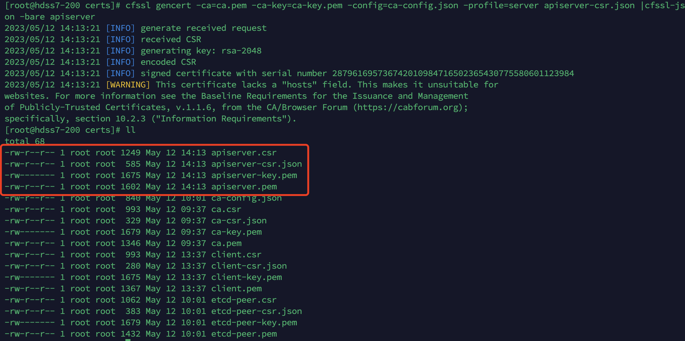

~~~
# 21/22机器：
cd /opt/kubernetes/server/bin
bin]# mkdir cert
bin]# cd cert/
# 把证书考过来，一共6个
cert]# scp hdss7-200:/opt/certs/c*.pem .
cert]# scp hdss7-200:/opt/certs/apiserver*.pem .
~~~

> **scp**：用于 *Linux* 之间复制文件和目录
>
> **带***：表示模糊匹配任意内容

~~~
# 21/22机器：
cert]# ll
total 24
-rw------- 1 root root 1675 May 12 14:22 apiserver-key.pem
-rw-r--r-- 1 root root 1602 May 12 14:22 apiserver.pem
-rw------- 1 root root 1679 May 12 14:24 ca-key.pem
-rw-r--r-- 1 root root 1346 May 12 14:24 ca.pem
-rw------- 1 root root 1675 May 12 14:24 client-key.pem
-rw-r--r-- 1 root root 1367 May 12 14:24 client.pem
cert]# pwd
/opt/kubernetes/server/bin/cert
~~~

~~~
# 21/22机器：
cd /opt/kubernetes/server/bin
bin]# mkdir conf
bin]# cd conf/
conf]# vi audit.yaml
apiVersion: audit.k8s.io/v1beta1 # This is required.
kind: Policy
# Don't generate audit events for all requests in RequestReceived stage.
omitStages:
  - "RequestReceived"
rules:
  # Log pod changes at RequestResponse level
  - level: RequestResponse
    resources:
    - group: ""
      # Resource "pods" doesn't match requests to any subresource of pods,
      # which is consistent with the RBAC policy.
      resources: ["pods"]
  # Log "pods/log", "pods/status" at Metadata level
  - level: Metadata
    resources:
    - group: ""
      resources: ["pods/log", "pods/status"]

  # Don't log requests to a configmap called "controller-leader"
  - level: None
    resources:
    - group: ""
      resources: ["configmaps"]
      resourceNames: ["controller-leader"]

  # Don't log watch requests by the "system:kube-proxy" on endpoints or services
  - level: None
    users: ["system:kube-proxy"]
    verbs: ["watch"]
    resources:
    - group: "" # core API group
      resources: ["endpoints", "services"]

  # Don't log authenticated requests to certain non-resource URL paths.
  - level: None
    userGroups: ["system:authenticated"]
    nonResourceURLs:
    - "/api*" # Wildcard matching.
    - "/version"

  # Log the request body of configmap changes in kube-system.
  - level: Request
    resources:
    - group: "" # core API group
      resources: ["configmaps"]
    # This rule only applies to resources in the "kube-system" namespace.
    # The empty string "" can be used to select non-namespaced resources.
    namespaces: ["kube-system"]

  # Log configmap and secret changes in all other namespaces at the Metadata level.
  - level: Metadata
    resources:
    - group: "" # core API group
      resources: ["secrets", "configmaps"]

  # Log all other resources in core and extensions at the Request level.
  - level: Request
    resources:
    - group: "" # core API group
    - group: "extensions" # Version of group should NOT be included.

  # A catch-all rule to log all other requests at the Metadata level.
  - level: Metadata
    # Long-running requests like watches that fall under this rule will not
    # generate an audit event in RequestReceived.
    omitStages:
      - "RequestReceived"
      
conf]# cd ..
# 下面有3处ip需要改，--etcd-servers分别改成12、21、22机器的IP
bin]# vi /opt/kubernetes/server/bin/kube-apiserver.sh
#!/bin/bash
./kube-apiserver \
  --apiserver-count 2 \
  --audit-log-path /data/logs/kubernetes/kube-apiserver/audit-log \
  --audit-policy-file ./conf/audit.yaml \
  --authorization-mode RBAC \
  --client-ca-file ./cert/ca.pem \
  --requestheader-client-ca-file ./cert/ca.pem \
  --enable-admission-plugins NamespaceLifecycle,LimitRanger,ServiceAccount,DefaultStorageClass,DefaultTolerationSeconds,MutatingAdmissionWebhook,ValidatingAdmissionWebhook,ResourceQuota \
  --etcd-cafile ./cert/ca.pem \
  --etcd-certfile ./cert/client.pem \
  --etcd-keyfile ./cert/client-key.pem \
  --etcd-servers https://172.27.139.119:2379,https://172.27.139.118:2379,https://172.27.139.120:2379 \
  --service-account-key-file ./cert/ca-key.pem \
  --service-cluster-ip-range 192.168.0.0/16 \
  --service-node-port-range 3000-29999 \
  --target-ram-mb=1024 \
  --kubelet-client-certificate ./cert/client.pem \
  --kubelet-client-key ./cert/client-key.pem \
  --log-dir  /data/logs/kubernetes/kube-apiserver \
  --tls-cert-file ./cert/apiserver.pem \
  --tls-private-key-file ./cert/apiserver-key.pem \
  --v 2
  
bin]# chmod +x kube-apiserver.sh
# 一处修改：[program:kube-apiserver-7-21]，22机器则改成7-22
bin]# vi /etc/supervisord.d/kube-apiserver.ini
[program:kube-apiserver-7-21]
command=/opt/kubernetes/server/bin/kube-apiserver.sh            ; the program (relative uses PATH, can take args)
numprocs=1                                                      ; number of processes copies to start (def 1)
directory=/opt/kubernetes/server/bin                            ; directory to cwd to before exec (def no cwd)
autostart=true                                                  ; start at supervisord start (default: true)
autorestart=true                                                ; retstart at unexpected quit (default: true)
startsecs=30                                                    ; number of secs prog must stay running (def. 1)
startretries=3                                                  ; max # of serial start failures (default 3)
exitcodes=0,2                                                   ; 'expected' exit codes for process (default 0,2)
stopsignal=QUIT                                                 ; signal used to kill process (default TERM)
stopwaitsecs=10                                                 ; max num secs to wait b4 SIGKILL (default 10)
user=root                                                       ; setuid to this UNIX account to run the program
redirect_stderr=true                                            ; redirect proc stderr to stdout (default false)
stdout_logfile=/data/logs/kubernetes/kube-apiserver/apiserver.stdout.log        ; stderr log path, NONE for none; default AUTO
stdout_logfile_maxbytes=64MB                                    ; max # logfile bytes b4 rotation (default 50MB)
stdout_logfile_backups=4                                        ; # of stdout logfile backups (default 10)
stdout_capture_maxbytes=1MB                                     ; number of bytes in 'capturemode' (default 0)
stdout_events_enabled=false                                     ; emit events on stdout writes (default false)

bin]# mkdir -p /data/logs/kubernetes/kube-apiserver
bin]# supervisorctl update
# 查看21/22两台机器是否跑起来了，可能比较慢在STARTING，等10秒
bin]# supervisorctl status
~~~

> **mkdir -p**：创建目录，没有上一级目录则创建
>
> **supervisorctl update**：更新supervisorctl
>
> **audit.yaml解析：**
>
> - 可以参考这篇文章[点击跳转](https://www.baidu.com/link?url=tFECOG31lKlcqDWeAZGF1VyjhzVAN9vUKHKEKKw5G8y0AC8MKpJxSZeL647MIFdw&wd=&eqid=dafe84b80019e4a3000000065e51d2e2)，当然这里的audit.yaml可能会有些不一样，但是我们后面用到的yaml文件就很相似了

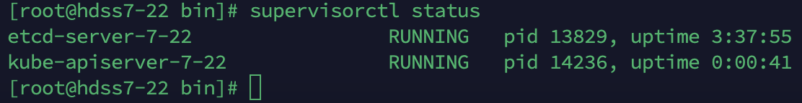

> <a href="https://github.com/ben1234560/k8s_PaaS/blob/master/%E5%8E%9F%E7%90%86%E5%8F%8A%E6%BA%90%E7%A0%81%E8%A7%A3%E6%9E%90/Kubernetes%E5%9F%BA%E6%9C%AC%E6%A6%82%E5%BF%B5.md#pod%E7%9A%84%E5%87%A0%E7%A7%8D%E7%8A%B6%E6%80%81">Pod的几种状态</a>

完成


### 安装部署主控节点L4反代服务

根据我们架构图，在11/12机器上做反代

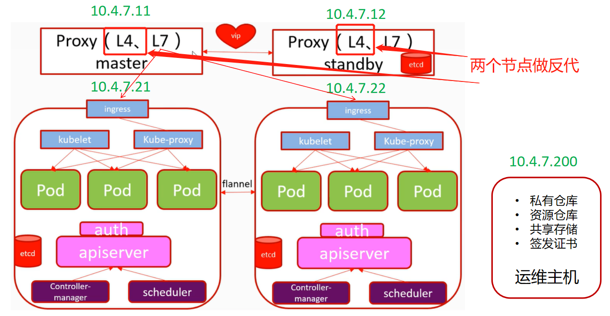

安装nginx时另一个注意事项 <a href="https://github.com/ben1234560/k8s_PaaS/issues/16">点击链接  </a>

（感谢 https://github.com/nangongchengfeng/）

~~~
# 11/12机器及21/22机器（考虑到公有云的网络情况，我们将21/22机器同时也作为备反代节点）
# 这个前面已经安装 yum install nginx nginx-mod-stream -y
# 添加在最下面，server处需要改成自己的21、22机器IP
~]# vi /etc/nginx/nginx.conf
stream {
    upstream kube-apiserver {
        server 172.27.139.118:6443     max_fails=3 fail_timeout=30s;
        server 172.27.139.120:6443     max_fails=3 fail_timeout=30s;
    }
    server {
        listen 7443;
        proxy_connect_timeout 2s;
        proxy_timeout 900s;
        proxy_pass kube-apiserver;
    }
}

~]# nginx -t
~]# systemctl start nginx
~]# systemctl enable nginx

# 这个前面已经安装 yum install keepalived -y
# keepalived 监控端口脚本
~]# vi /etc/keepalived/check_port.sh
#!/bin/bash
CHK_PORT=$1
if [ -n "$CHK_PORT" ];then
        PORT_PROCESS=`ss -lnt|grep $CHK_PORT|wc -l`
        if [ $PORT_PROCESS -eq 0 ];then
                echo "Port $CHK_PORT Is Not Used,End."
                exit 1
        fi
else
        echo "Check Port Cant Be Empty!"
fi

~]# chmod +x /etc/keepalived/check_port.sh
~~~

> 由于7443端口未监听，Nginx 启动报 [emerg] bind() failed的可以参考[这个方法](https://blog.csdn.net/RunSnail2018/article/details/81185138)（感谢https://gitee.com/wangming91/）
>
> 上述代码解析：`upstream` 块：定义了名为 `kube-apiserver` 的上游服务器组。在这个例子中，该组由两个服务器组成，指定了上游服务器的 IP 地址和端口。`server` 块：定义了一个代理服务器，它监听本地端口 `7443`，并将请求代理到上游服务器组 `kube-apiserver`
>
> 通过这个配置，当有请求发送到代理服务器的 `7443` 端口时，Nginx 将会将请求转发到 `kube-apiserver` 上游服务器组中的一个服务器上进行处理。这可以用于代理和负载均衡对 `kube-apiserver` 的请求。
>
> **yum install -y**：安装并自动yes
>
> **nginx -t**：确定nginx.conf有没有语法错误
>
> **systemctl start**：启动服务
>
> **systemctl enable**：开机自启

~~~
# 仅以下分主从操作：
# 把原有内容都删掉，命令行快速按打出dG
# 注意，下面的vrrp_instance下的interface，我的机器是eth0配置了网卡，有的版本是ens33配置网卡，可以用ifconfig查看，第一行就是，如果你是ens33，改这个interface ens33
# keepalived 主（即11机器），修改router_id、mcast_src_ip两处为11机器的ip，修改virtual_ipaddress为虚拟vip 10:
11 ~]# vi /etc/keepalived/keepalived.conf
! Configuration File for keepalived

global_defs {
   router_id 172.27.139.122

}

vrrp_script chk_nginx {
    script "/etc/keepalived/check_port.sh 7443"
    interval 2
    weight -20
}

vrrp_instance VI_1 {
    state MASTER
    interface eth0
    virtual_router_id 251
    priority 100
    advert_int 1
    mcast_src_ip 172.27.139.122
    nopreempt

    authentication {
        auth_type PASS
        auth_pass 11111111
    }
    track_script {
         chk_nginx
    }
    virtual_ipaddress {
        172.27.139.10
    }
}

# keepalived从（即12/21/22机器），修改router_id、mcast_src_ip两处为12或21或22机器的ip，修改virtual_ipaddress为虚拟vip 10:
12/21/22 ~]# vi /etc/keepalived/keepalived.conf
! Configuration File for keepalived
global_defs {
	router_id 172.27.139.119
}
vrrp_script chk_nginx {
	script "/etc/keepalived/check_port.sh 7443"
	interval 2
	weight -20
}
vrrp_instance VI_1 {
	state BACKUP
	interface eth0
	virtual_router_id 251
	mcast_src_ip 172.27.139.119
	priority 90
	advert_int 1
	authentication {
		auth_type PASS
		auth_pass 11111111
	}
	track_script {
		chk_nginx
	}
	virtual_ipaddress {
		172.27.139.10
	}
}
~~~

启动keepalived

~~~
# 11/12/21/22机器
~]# systemctl start keepalived
~]# systemctl enable keepalived
# 在11/12/21/22机器
11 ~]# ip add
~~~

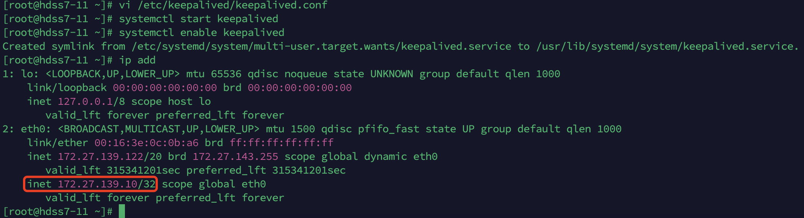

确保21/22机器能够telnet通虚拟vip 10的7443端口

~~~
21 ~]# telnet 172.27.139.10 7443
Trying 172.27.139.10...
Connected to 172.27.139.10.
Escape character is '^]'.

22 ~]# telnet 172.27.139.10 7443
Trying 172.27.139.10...
Connected to 172.27.139.10.
Escape character is '^]'.
~~~

完成


### 安装部署controller-manager（节点控制器/调度器服务）

让我们再搬出我们的架构图

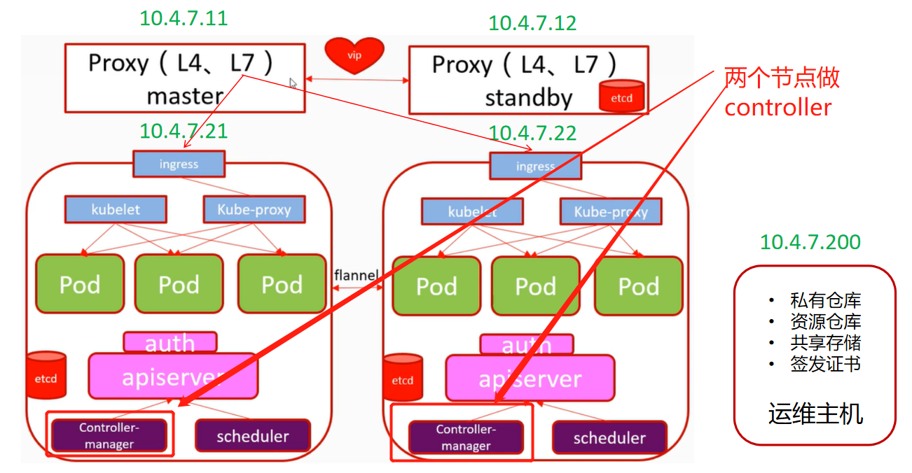

~~~
# 21/22机器：
bin]# vi /opt/kubernetes/server/bin/kube-controller-manager.sh
#!/bin/sh
./kube-controller-manager \
  --cluster-cidr 172.7.0.0/16 \
  --leader-elect true \
  --log-dir /data/logs/kubernetes/kube-controller-manager \
  --master http://127.0.0.1:8080 \
  --service-account-private-key-file ./cert/ca-key.pem \
  --service-cluster-ip-range 192.168.0.0/16 \
  --root-ca-file ./cert/ca.pem \
  --v 2

bin]# chmod +x /opt/kubernetes/server/bin/kube-controller-manager.sh
bin]# mkdir -p /data/logs/kubernetes/kube-controller-manager
# 注意22机器，下面要改成7-22，一处修改：manager-7-21]
bin]# vi /etc/supervisord.d/kube-conntroller-manager.ini
[program:kube-controller-manager-7-21]
command=/opt/kubernetes/server/bin/kube-controller-manager.sh                     ; the program (relative uses PATH, can take args)
numprocs=1                                                                        ; number of processes copies to start (def 1)
directory=/opt/kubernetes/server/bin                                              ; directory to cwd to before exec (def no cwd)
autostart=true                                                                    ; start at supervisord start (default: true)
autorestart=true                                                                  ; retstart at unexpected quit (default: true)
startsecs=30                                                                      ; number of secs prog must stay running (def. 1)
startretries=3                                                                    ; max # of serial start failures (default 3)
exitcodes=0,2                                                                     ; 'expected' exit codes for process (default 0,2)
stopsignal=QUIT                                                                   ; signal used to kill process (default TERM)
stopwaitsecs=10                                                                   ; max num secs to wait b4 SIGKILL (default 10)
user=root                                                                         ; setuid to this UNIX account to run the program
redirect_stderr=true                                                              ; redirect proc stderr to stdout (default false)
stdout_logfile=/data/logs/kubernetes/kube-controller-manager/controller.stdout.log  ; stderr log path, NONE for none; default AUTO
stdout_logfile_maxbytes=64MB                                                      ; max # logfile bytes b4 rotation (default 50MB)
stdout_logfile_backups=4                                                          ; # of stdout logfile backups (default 10)
stdout_capture_maxbytes=1MB                                                       ; number of bytes in 'capturemode' (default 0)
stdout_events_enabled=false                                                       ; emit events on stdout writes (default false)

bin]# supervisorctl update
bin]# vi /opt/kubernetes/server/bin/kube-scheduler.sh
#!/bin/sh
./kube-scheduler \
  --leader-elect  \
  --log-dir /data/logs/kubernetes/kube-scheduler \
  --master http://127.0.0.1:8080 \
  --v 2
  
bin]# chmod +x /opt/kubernetes/server/bin/kube-scheduler.sh
bin]# mkdir -p /data/logs/kubernetes/kube-scheduler
# 注意改机器号，一处修改：scheduler-7-21]
bin]# vi /etc/supervisord.d/kube-scheduler.ini
[program:kube-scheduler-7-21]
command=/opt/kubernetes/server/bin/kube-scheduler.sh                     ; the program (relative uses PATH, can take args)
numprocs=1                                                               ; number of processes copies to start (def 1)
directory=/opt/kubernetes/server/bin                                     ; directory to cwd to before exec (def no cwd)
autostart=true                                                           ; start at supervisord start (default: true)
autorestart=true                                                         ; retstart at unexpected quit (default: true)
startsecs=30                                                             ; number of secs prog must stay running (def. 1)
startretries=3                                                           ; max # of serial start failures (default 3)
exitcodes=0,2                                                            ; 'expected' exit codes for process (default 0,2)
stopsignal=QUIT                                                          ; signal used to kill process (default TERM)
stopwaitsecs=10                                                          ; max num secs to wait b4 SIGKILL (default 10)
user=root                                                                ; setuid to this UNIX account to run the program
redirect_stderr=true                                                     ; redirect proc stderr to stdout (default false)
stdout_logfile=/data/logs/kubernetes/kube-scheduler/scheduler.stdout.log ; stderr log path, NONE for none; default AUTO
stdout_logfile_maxbytes=64MB                                             ; max # logfile bytes b4 rotation (default 50MB)
stdout_logfile_backups=4                                                 ; # of stdout logfile backups (default 10)
stdout_capture_maxbytes=1MB                                              ; number of bytes in 'capturemode' (default 0)
stdout_events_enabled=false                                              ; emit events on stdout writes (default false)

bin]# supervisorctl update
bin]# supervisorctl status
etcd-server-7-21                 RUNNING   pid 14765, uptime 4:30:28
kube-apiserver-7-21              RUNNING   pid 16088, uptime 0:53:15
kube-controller-manager-7-21     RUNNING   pid 18734, uptime 0:01:56
kube-scheduler-7-21              RUNNING   pid 18958, uptime 0:00:47

bin]# ln -s /opt/kubernetes/server/bin/kubectl /usr/bin/kubectl
# 查看集群健康情况，21/22机器：
bin]# kubectl get cs
NAME                 STATUS    MESSAGE              ERROR
scheduler            Healthy   ok                   
controller-manager   Healthy   ok                   
etcd-2               Healthy   {"health": "true"}   
etcd-1               Healthy   {"health": "true"}   
etcd-0               Healthy   {"health": "true"} 
~~~

> **ln -s**：建立软链接
>
> **supervisorctl status**：查看supervisor的情况
>
> **supervisorctl update**：更新supervisor
>
> **kubectl get**：获取列出一个或多个资源的信息
>
> - 上面一条命令的意思是：    列出所有cs信息

完成


