## 第五章——K8S结合CI&CD持续交付和集中管理配置

#### 交付Dubbo服务到K8S前言

> **WHAT**：阿里巴巴开源的一个高性能优秀的[服务框架](https://baike.baidu.com/item/%E6%9C%8D%E5%8A%A1%E6%A1%86%E6%9E%B6)，使得应用可通过高性能的 RPC 实现服务的输出和输入功能，可以和 [1]  [Spring](https://baike.baidu.com/item/Spring)框架无缝集成。
>
> **WHY**：用它来当作我们现实生产中的App业务，交付到我们的PaaS里

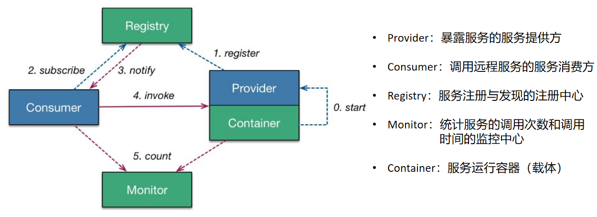

#### 交付架构图

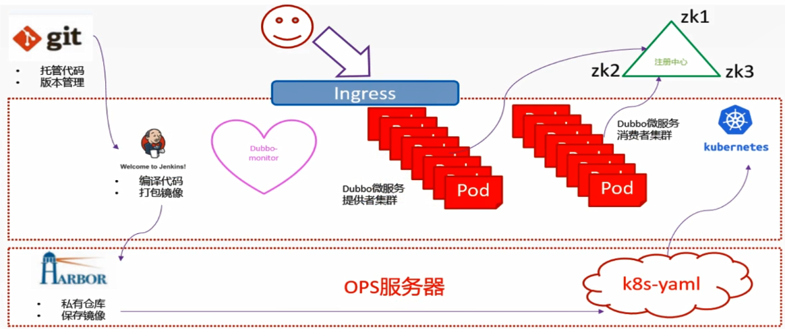

> **zk（zookeeper）**：dubbo服务的注册中心是通过zk来做的，我们用3个zk组成一个集群，就跟etcd一样，有一个leader两个从，leader死了由其它来决定谁变成leader，因为zk是有状态的服务，所以我们放它放在集群外（红框外），集群内都是无状态的。
>
> **dubbo微服务**：在集群内通过点点点扩容（dashboard），即当有秒杀或者什么的时候就可以扩展，过了则缩容。
>
> **git**：开发把代码传到git上，这里我们用gitee（码云）来做，也可以用GitHub来着，没什么区别
>
> **Jenkins**：用Jenkins把git的代码拉下来并编译打包成镜像，然后提送到harbor
>
> **OPS服务器（7-200机器）**：然后将harbor的镜像通过yaml应用到k8s里，现在我们是需要些yaml文件，后面会用spinnaker来做成点点点的方式
>
> **笑脸（用户）**：外部访问通过ingress转发到集群内的dubbo消费者（web服务），然后就可以访问
>
> **最终目标**：实现所有事情都是点点点

梳理目前机器服务角色

| 主机名             | 角色                      | IP         |
| :----------------- | ------------------------- | ---------- |
| HDSS7-11.host.com  | k8s代理节点1，zk1         | 10.4.7.11  |
| HDSS7-12.host.com  | k8s代理节点1，zk1         | 10.4.7.12  |
| HDSS7-21.host.com  | k8s运算节点1，zk3         | 10.4.7.21  |
| HDSS7-22.host.com  | k8s运算节点2，jenkins     | 10.4.7.22  |
| HDSS7-200.host.com | k8s运维节点（docker仓库） | 10.4.7.200 |

### 安装部署zookeeper

> **WHAT**：主要是用来解决分布式应用中经常遇到的一些数据管理问题，如：统一命名服务、状态同步服务、集群管理、分布式应用配置项的管理等。简单来说zookeeper=文件系统+监听通知机制。[推荐文章](https://blog.csdn.net/java_66666/article/details/81015302)
>
> **WHY**：我们的dubbo服务要注册到zk里，把配置放到zk上，一旦配置信息发生变化，zk将获取到新的配置信息应用到系统中。

~~~
# 11/12/21机器：
mkdir /opt/src  # 这步是没有src文件夹才会这么做
cd /opt/src
src]# 由于zk依赖java环境，下载我上传的jdk-8u221-linux-x64.tar.gz放到这个目录
# 最好用我上传的，或者yum install -y java-1.8.0-openjdk*
src]# mkdir /usr/java
src]# tar xf jdk-8u221-linux-x64.tar.gz -C /usr/java
src]# ll /usr/java/
src]# ln -s /usr/java/jdk1.8.0_221/ /usr/java/jdk
# 粘贴到最下面
src]# vi /etc/profile
export JAVA_HOME=/usr/java/jdk
export PATH=$JAVA_HOME/bin:$JAVA_HOME/bin:$PATH
export CLASSPATH=$CLASSPATH:$JAVA_HOME/lib:$JAVA_HOME/lib/tools.jar

src]# source /etc/profile
src]# java -version
# out: java version "1.8.0_221"...

# 安装zookeeper
src]# wget https://archive.apache.org/dist/zookeeper/zookeeper-3.4.14/zookeeper-3.4.14.tar.gz
# 这个下载速度是真的慢，你最好用我上传的包
src]# tar xf zookeeper-3.4.14.tar.gz -C /opt
src]# cd /opt
opt]# ln -s /opt/zookeeper-3.4.14/ /opt/zookeeper
opt]# mkdir -pv /data/zookeeper/data /data/zookeeper/logs
opt]# vi /opt/zookeeper/conf/zoo.cfg
tickTime=2000
initLimit=10
syncLimit=5
dataDir=/data/zookeeper/data
dataLogDir=/data/zookeeper/logs
clientPort=2181
server.1=zk1.od.com:2888:3888
server.2=zk2.od.com:2888:3888
server.3=zk3.od.com:2888:3888

~~~

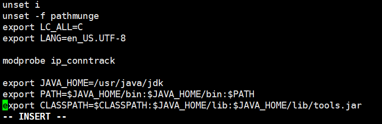

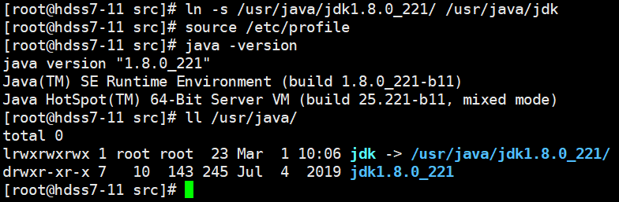

~~~
# 11机器添加解析：
~]# vi /var/named/od.com.zone
serial 前滚一个
# 最下面添加
zk1                A   10.4.7.11
zk2                A   10.4.7.12
zk3                A   10.4.7.21

~]# systemctl restart named
~]# dig -t A zk1.od.com @10.4.7.11 +short
# out: 10.4.7.11
~~~

~~~
# 配置myid，11/12/21机器：
# 注意，11机器配1，12机器配2，21机器配3,需要修改共一处：1
opt]# vi /data/zookeeper/data/myid
1

opt]# /opt/zookeeper/bin/zkServer.sh start
opt]# ps aux|grep zoo
opt]# netstat -luntp|grep 2181
~~~

> **ps aux** ：查看进程情况的命令

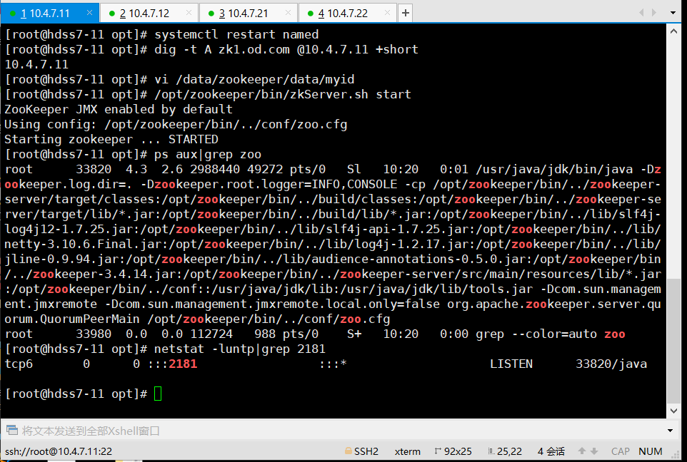

完成

### 安装部署Jenkins

> **WHAT**：[Jenkins中文网](https://www.baidu.com/link?url=W22nPpmtH_sl0ovap9ypYFgfeS67PEutnmslKb9EZvm&wd=&eqid=de484ea10012b26f000000045e534b70)，引用一句话：构建伟大，无所不能
>
> **WHY**：我们的之前的镜像是从网上下载下来然后push到harbor里面被应用到K8S里，那么我们自己开发的代码怎么做成镜像呢？就需要用到Jenkins

~~~
# 200机器：
~]# docker pull jenkins/jenkins:2.190.3
~]# docker images|grep jenkins
~]# docker tag 22b8b9a84dbe harbor.od.com/public/jenkins:v2.190.3
~]# docker push harbor.od.com/public/jenkins:v2.190.3
# 下面的密钥生产你要填自己的邮箱
~]# ssh-keygen -t rsa -b 2048 -C "909336740@qq.com" -N "" -f /root/.ssh/id_rsa
# 拿到公钥配置到gitee里面去
~]# cat /root/.ssh/id_rsa.pub
# =============公钥配置到gitee的dubbo-demo-web，gitee的配置可以看下图，用我上传的代码包
~]# mkdir /data/dockerfile
~]# cd /data/dockerfile
dockerfile]# mkdir jenkins
dockerfile]# cd jenkins
jenkins]# vi Dockerfile
FROM harbor.od.com/public/jenkins:v2.190.3
USER root
RUN /bin/cp /usr/share/zoneinfo/Asia/Shanghai /etc/localtime &&\ 
    echo 'Asia/Shanghai' >/etc/timezone
ADD id_rsa /root/.ssh/id_rsa
ADD config.json /root/.docker/config.json
ADD get-docker.sh /get-docker.sh
RUN echo "    StrictHostKeyChecking no" >> /etc/ssh/ssh_config &&\
    /get-docker.sh

jenkins]# cp /root/.ssh/id_rsa .
jenkins]# cp /root/.docker/config.json .
jenkins]# curl -fsSL get.docker.com -o get-docker.sh
jenkins]# chmod +x get-docker.sh
~~~

> 配置公钥和私钥是为了让我们的机器能找到我们的git，也让我们的git代码不被别人随意使用。
>
> 以下是gitee操作方法

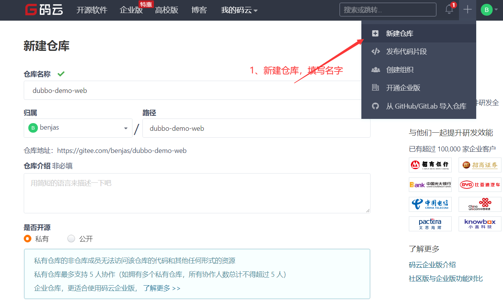

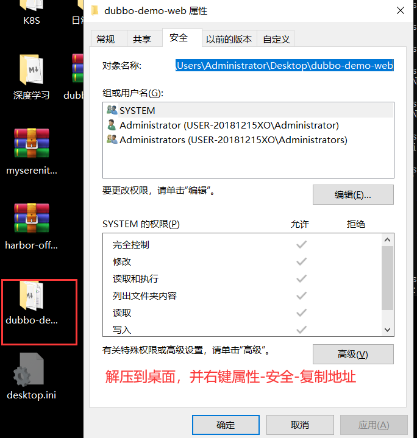

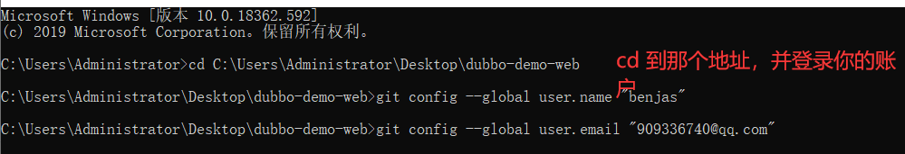

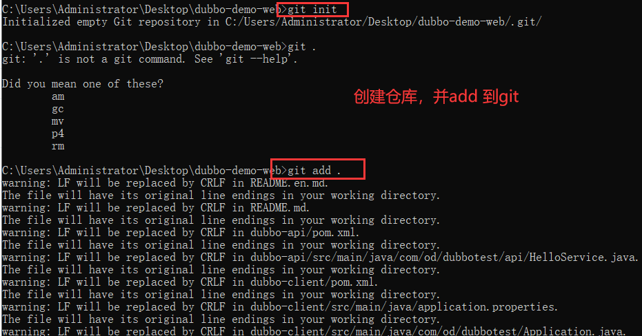

~~~
> git add . # 全部提交当前目录所有新增文件
# 然后再执行下面的步骤即可到你的gitee里面看了
> git commit -m "first commit"
> git remote add origin https://gitee.com/benjas/dubbo-demo-web-test.git
> git push -u origin master
~~~

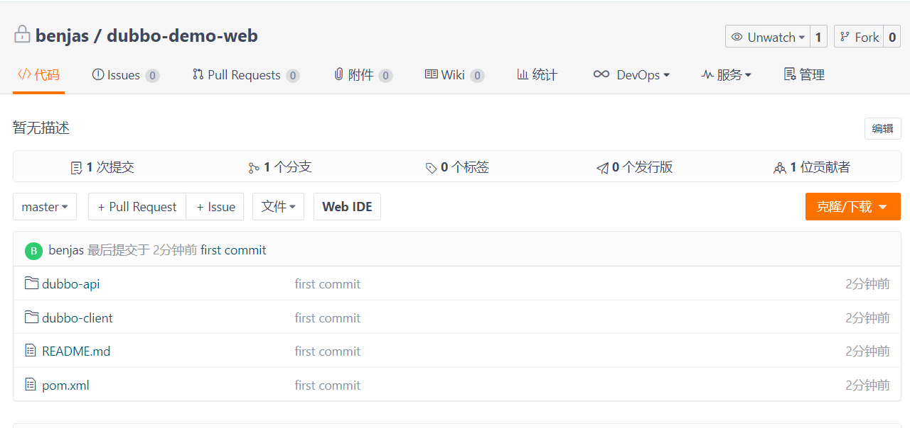

目录结构必须和我的一样

然后把公钥配置进去，点击添加

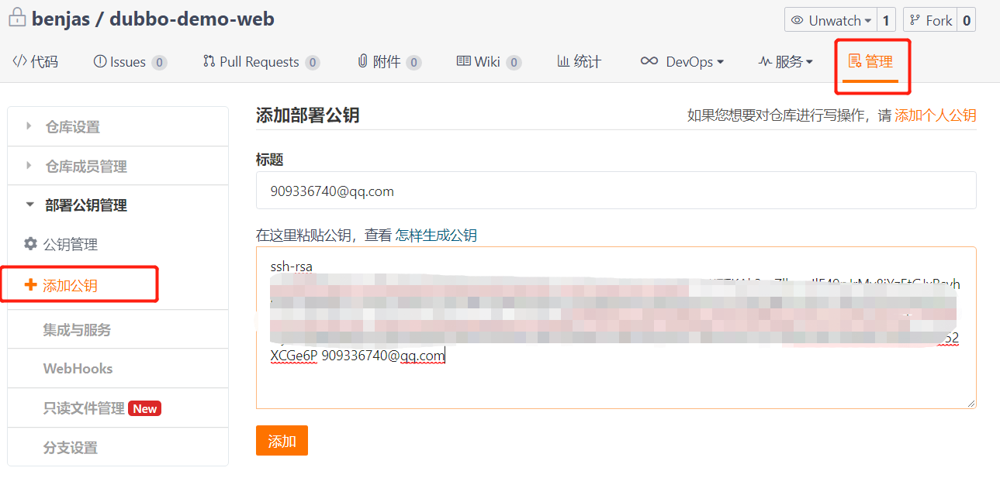

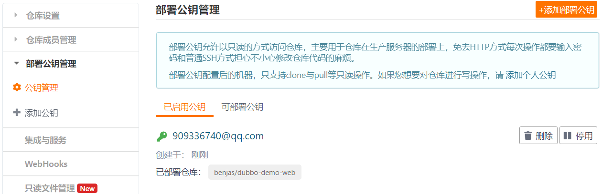

成功

新建一个infra私有仓库

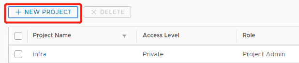

~~~
# 200机器，开始build镜像：
jenkins]# docker build . -t harbor.od.com/infra/jenkins:v2.190.3
jenkins]# docker push harbor.od.com/infra/jenkins:v2.190.3
jenkins]# docker run --rm harbor.od.com/infra/jenkins:v2.190.3 ssh -T git@gitee.com
~~~

> 如果因为网络原因一直build失败的请往下看（我第三次部署的时候，build了3次才成功），成功也会冒红字，但是有Successfully

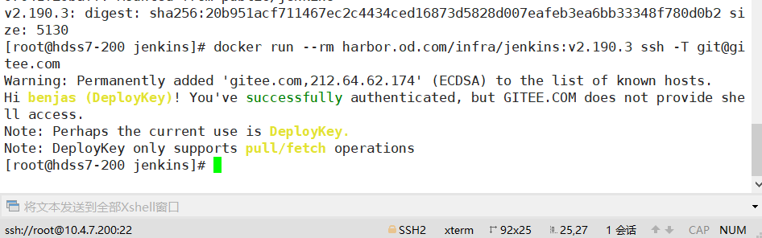

成功

##### build一直失败解决办法：直接用我做好的镜像

~~~
# 200机器：
cd /data/dockerfile/jenkins
jenkins]# 把我放在里面的包下载到这里
jenkins]# docker load < jenkins-v2.190.3-with-docker.tar
jenkins]# docker images
~~~

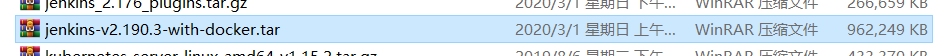

~~~
# 200机器：
jenkins]# docker tag a25e4f7b2896 harbor.od.com/public/jenkins:v2.176.2
jenkins]# docker push harbor.od.com/public/jenkins:v2.176.2
jenkins]# vi Dockerfile
FROM harbor.od.com/public/jenkins:v2.176.2
# 删掉 ADD get-docker.sh/get-docker.sh，如下图
~~~

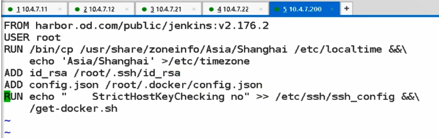

~~~
# 200机器:
jenkins]# docker build . -t harbor.od.com/infra/jenkins:v2.176.2
jenkins]# docker push harbor.od.com/infra/jenkins:v2.190.3
jenkins]# docker run --rm harbor.od.com/infra/jenkins:v2.190.3 ssh -T git@gitee.com
~~~

成功标识

~~~
# 21机器，创建名称空间，对应私有化仓库：
~]# kubectl create ns infra
~]# kubectl create secret docker-registry harbor --docker-server=harbor.od.com --docker-username=admin --docker-password=Harbor12345 -n infra
~~~

> **kubectl create secret**创建私有仓库
>
> - 后面跟着的是对应的仓库、用户名、用户密码、仓库名称infra

~~~
# 三部机器，21/22/200，准备共享存储：
~]# yum install nfs-utils -y
~~~

~~~
# 200机器，做共享存储的客户端：
jenkins]# vi /etc/exports
/data/nfs-volume 10.4.7.0/24(rw,no_root_squash)

jenkins]# mkdir /data/nfs-volume
jenkins]# systemctl start nfs
jenkins]# systemctl enable nfs
jenkins]# cd /data/k8s-yaml/
k8s-yaml]# mkdir jenkins
cd jenkins
# 200机器，准备资源配置清单：
jenkins]# vi dp.yaml
kind: Deployment
apiVersion: extensions/v1beta1
metadata:
  name: jenkins
  namespace: infra
  labels: 
    name: jenkins
spec:
  replicas: 1
  selector:
    matchLabels: 
      name: jenkins
  template:
    metadata:
      labels: 
        app: jenkins 
        name: jenkins
    spec:
      volumes:
      - name: data
        nfs: 
          server: hdss7-200
          path: /data/nfs-volume/jenkins_home
      - name: docker
        hostPath: 
          path: /run/docker.sock
          type: ''
      containers:
      - name: jenkins
        image: harbor.od.com/infra/jenkins:v2.190.3
        imagePullPolicy: IfNotPresent
        ports:
        - containerPort: 8080
          protocol: TCP
        env:
        - name: JAVA_OPTS
          value: -Xmx512m -Xms512m
        volumeMounts:
        - name: data
          mountPath: /var/jenkins_home
        - name: docker
          mountPath: /run/docker.sock
      imagePullSecrets:
      - name: harbor
      securityContext: 
        runAsUser: 0
  strategy:
    type: RollingUpdate
    rollingUpdate: 
      maxUnavailable: 1
      maxSurge: 1
  revisionHistoryLimit: 7
  progressDeadlineSeconds: 600
  
jenkins]# vi svc.yaml
kind: Service
apiVersion: v1
metadata: 
  name: jenkins
  namespace: infra
spec:
  ports:
  - protocol: TCP
    port: 80
    targetPort: 8080
  selector:
    app: jenkins

jenkins]# vi ingress.yaml
kind: Ingress
apiVersion: extensions/v1beta1
metadata: 
  name: jenkins
  namespace: infra
spec:
  rules:
  - host: jenkins.od.com
    http:
      paths:
      - path: /
        backend: 
          serviceName: jenkins
          servicePort: 80
          
jenkins]# mkdir /data/nfs-volume/jenkins_home
# 网页查看：
k8s-yaml.od.com下有jenkins目录
# 21机器，测试：
~]# file /run/docker.sock
# out: /run/docker.sock.socket
~~~

~~~
# 应用资源配置清单,21机器:
~]# kubectl apply -f http://k8s-yaml.od.com/jenkins/dp.yaml
~]# kubectl apply -f http://k8s-yaml.od.com/jenkins/svc.yaml
~]# kubectl apply -f http://k8s-yaml.od.com/jenkins/ingress.yaml
~]# kubectl get pods -n infra
~]# kubectl get all -n infra
~~~

> 如果是pending状态，一般是你的内存占用过多，你的dashboard可能开不起来了，但是不打紧，照用

infra名称空间

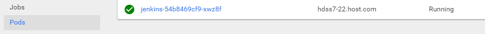

启动成功

~~~
# 11机器，解析域名：
~]# vi /var/named/od.com.zone
serial 前滚一个,到07
# 最下面添加
jenkins            A   10.4.7.10

~]# systemctl restart named
~]# dig -t A jenkins.od.com @10.4.7.11 +short
#10.4.7.10
~~~

[访问jenkins.od.com](jenkins.od.com)

~~~
# 200机器找密码，上面的密码在initialAdminPassword里：
cd /data/nfs-volume/jenkins_home
jenkins_home]# cat secrets/initialAdminPassword
# cat到的密码粘到上面去
~~~

Skip Plugin Installations进来

~~~
# jenkins账号密码设置，一定要跟我的一样，后面要用到的：
账号：admin
密码：admin123
full name：admin
# 然后save->save->start using Jenkins即可
~~~

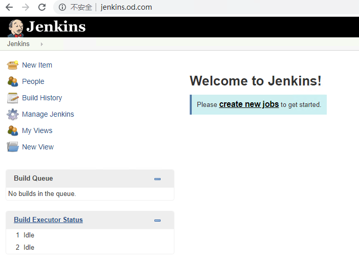

~~~
# 进来后要做两件事情，第一件事就是调整两安全选项：
1、allow anonymous read acces 允许匿名用户访问
2、Prevent cross site request forgery exploits 允许跨域
~~~

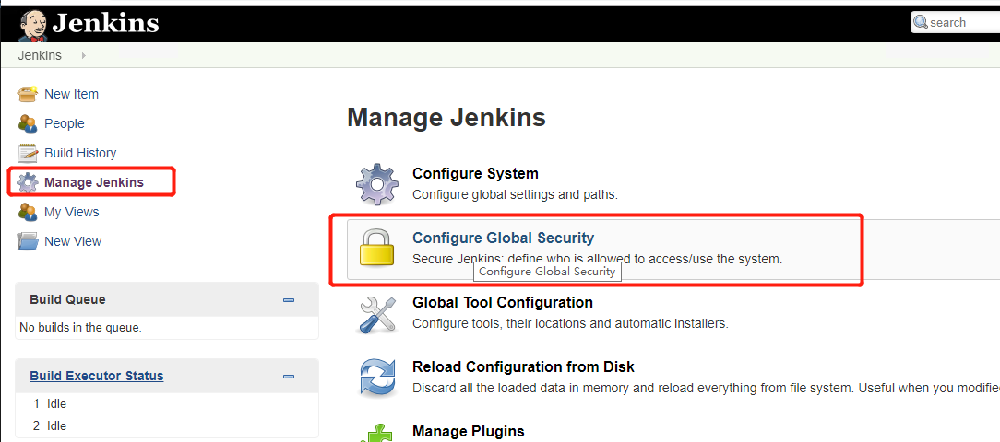

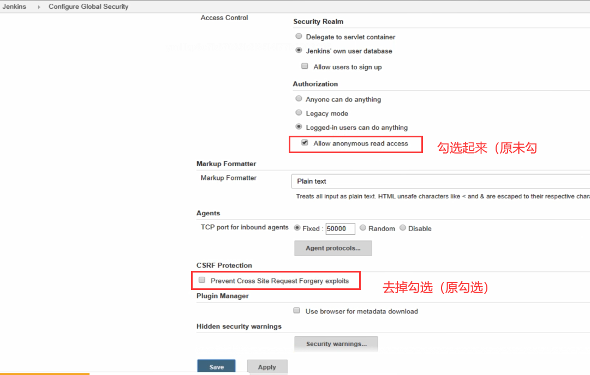

#### 安装蓝海

> **WHAT**：从仪表板到各个Pipeline运行的查看分支和结果，使用可视编辑器修改Pipeline作为代码
>
> - 连续交付（CD）Pipeline的复杂可视化，允许快速和直观地了解Pipeline的状态（下面回顾构建镜像流程的时候有使用到）
> - ...
>
> **WHY**：当然是为了让我们能更清晰明了的看到构建的情况

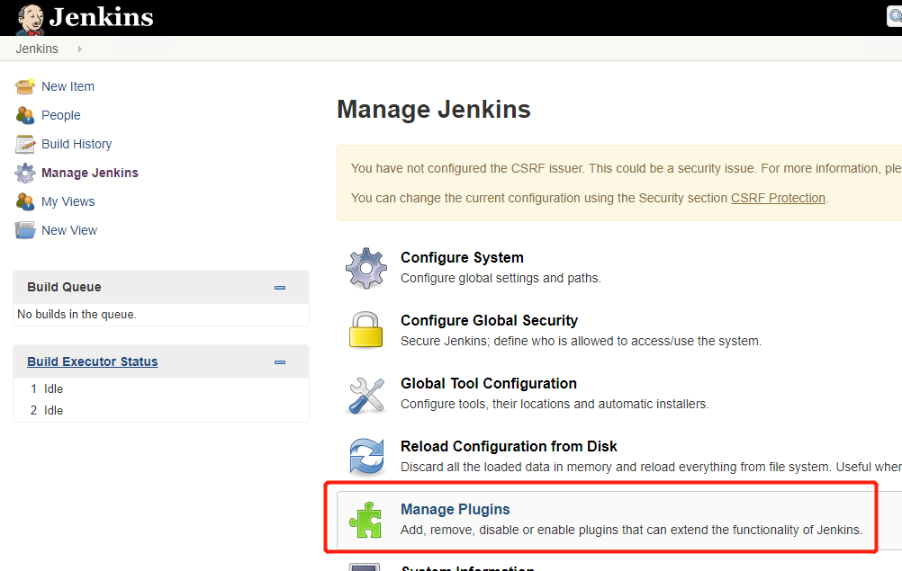

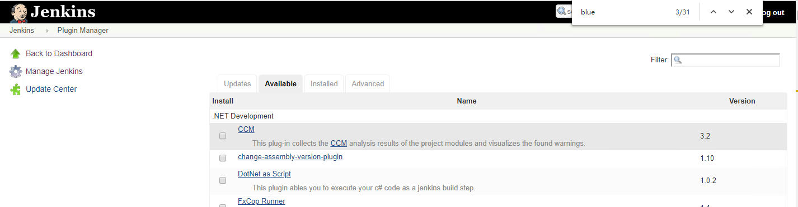

> 这里如果没有内容的点一下check out，因为读取的慢的问题
>
> **ctrl+f**呼出页面搜索

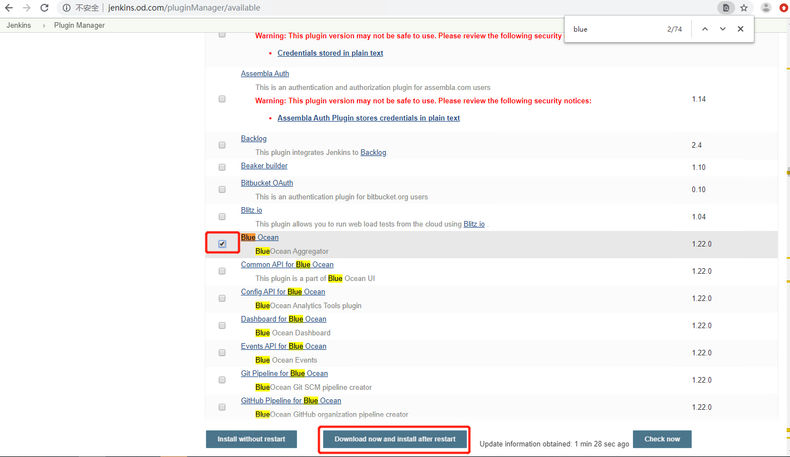

由于安装还是比较慢的，把这个勾选上就可以去做别的事情了

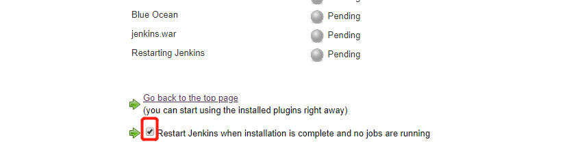

重启完后会出现open blue ocean，表示安装成功

> 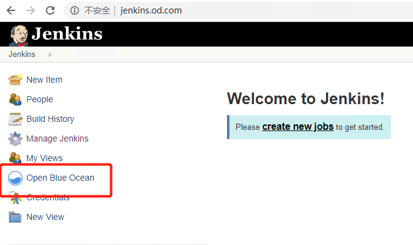

完成（而且你再去搜索blue是搜不到的了）

#### 一直下载不了BlueOcean怎么办

方法一（退出再下载法，此方法依然依靠网络）：

回到上一页

再点击下载

可以看到之前Failure的内容又开始下载了，而且有一部分已经成功

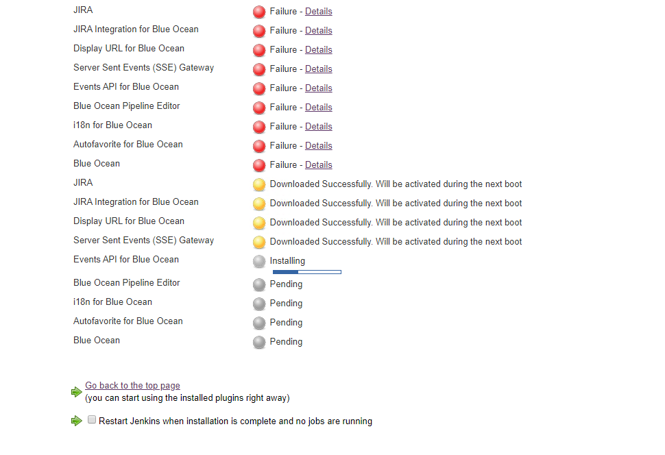

方法二（离线包解压）：

把我上传的jenkins_2.176_plugins.tar.gz下载解压到200机器的/data/nfs-voluem/jenkins_home/plugins/

然后去删掉Jenkins的pod让它自动重启，就有了

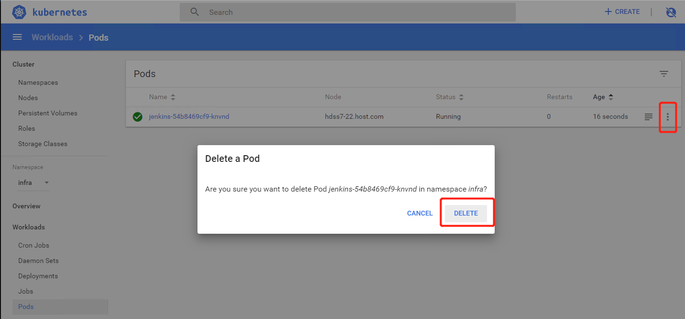

> #### 唠嗑：
>
> dashboard目前常用的两个版本：v1.8.3，v1.10.1
>
> Jenkins：把源码编译成可执行的二进制码

### 安装maven

> **WHAT**：一个项目管理工具，可以对 Java 项目进行构建、依赖管理。
>
> **WHY**：构建项目镜像时需要

[使用官网的](https://archive.apache.org/dist/maven/maven-3/)，或者用我上传的

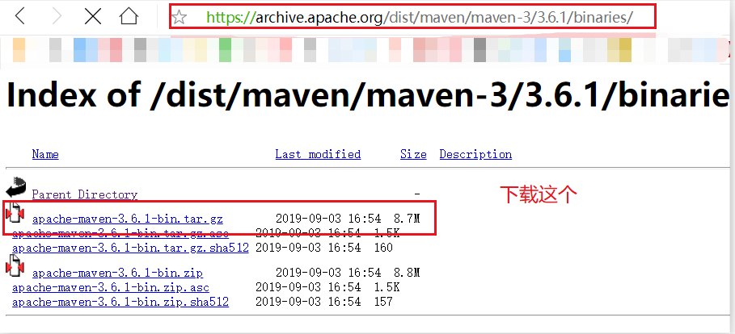

~~~
# 200机器：
src]# 网上下载或者用我上传的，拉到这里
src]# ll
src]# mkdir /data/nfs-volume/jenkins_home/maven-3.6.1-8u232
# 上面这个8u232的232是根据下图种的Jenkins版本的232来确定的
~~~

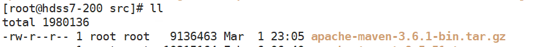

> 下图是EXEC到dashboard里的Jenkins，然后输入java -version

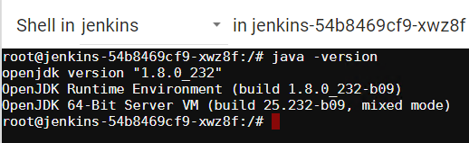

确保你的Jenkins是没问题的

~~~
# 进入harbo
docker login harbor.od.com
# 是否能连接gitee
ssh -i /root/.ssh/id_rsa -T git@gitee.com
~~~

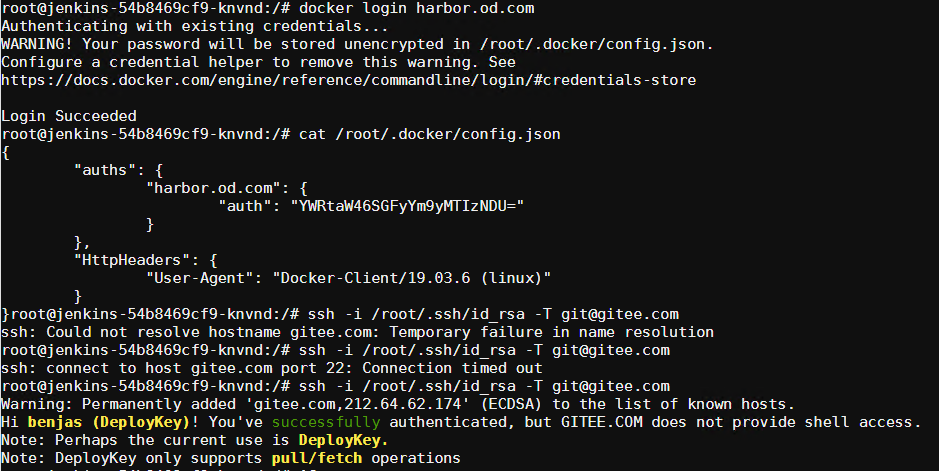

~~~
# 200机器：
src]# tar xfv apache-maven-3.6.1-bin.tar.gz -C /data/nfs-volume/jenkins_home/maven-3.6.1-8u232
src]# cd /data/nfs-volume/jenkins_home/maven-3.6.1-8u232
maven-3.6.1-8u232]# ll
# out: apache-maven-3.6.1
maven-3.6.1-8u232]# mv apache-maven-3.6.1/ ../
maven-3.6.1-8u232]# mv ../apache-maven-3.6.1/* .
maven-3.6.1-8u232]# ll
~~~

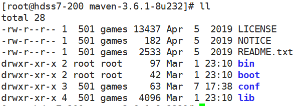

~~~
# 200机器,修改镜像源成阿里源，增加以下内容：
maven-3.6.1-8u232]# vi conf/settings.xml
    <mirror>
      <id>nexus-aliyun</id>
      <mirrorOf>*</mirrorOf>
      <name>Nexus aliyun</name>
      <url>https://maven.aliyun.com/repository/public</url>
    </mirror>
~~~

##### 其它知识（不需要操作）:

~~~
# 200机器,切换jdk的多个版本的方法：
cd /data/nfs-volume/jenkins_home/
jenkins_home]# 把jdk的另外版本下载下来，直接用我的包
jenkins_home]# tar xf jdk-7u80-linux-x64.tar.gz -C ./
jenkins_home]# cd maven-3.6.1-8u232/
cd bin/
bin]# file mvn
# out: mvn: POSIX shell script, ASCII text executable
bin]# vi mvn
#编辑JAVA_HOME 即可指定jdk版本
~~~

### 制作dubbo微服务的底包镜像

~~~
# 200机器：
cd /data/nfs-volume/jenkins_home/
jenkins_home]# docker pull docker.io/909336740/jre8:8u112
jenkins_home]# docker images|grep jre 
jenkins_home]# docker push harbor.od.com/public/jre:8u112
jenkins_home]# cd /data/dockerfile
dockerfile]# mkdir jre8
jre8]# cd jre8
jre8]# vi Dockerfile
FROM harbor.od.com/public/jre:8u112
RUN /bin/cp /usr/share/zoneinfo/Asia/Shanghai /etc/localtime &&\
    echo 'Asia/Shanghai' >/etc/timezone
ADD config.yml /opt/prom/config.yml
ADD jmx_javaagent-0.3.1.jar /opt/prom/
WORKDIR /opt/project_dir
ADD entrypoint.sh /entrypoint.sh
CMD ["/entrypoint.sh"]

jre8]# wget https://repo1.maven.org/maven2/io/prometheus/jmx/jmx_prometheus_javaagent/0.3.1/jmx_prometheus_javaagent-0.3.1.jar -O jmx_javaagent-0.3.1.jar
jre8]# vi config.yml
---
rules:
  - pattern: '.*'

jre8]# vi entrypoint.sh
#!/bin/sh
M_OPTS="-Duser.timezone=Asia/Shanghai -javaagent:/opt/prom/jmx_javaagent-0.3.1.jar=$(hostname -i):${M_PORT:-"12346"}:/opt/prom/config.yml"
C_OPTS=${C_OPTS}
JAR_BALL=${JAR_BALL}
exec java -jar ${M_OPTS} ${C_OPTS} ${JAR_BALL}

jre8]# chmod +x entrypoint.sh
jre8]# ll
~~~

> **Dockerfile解析**：
>
> - RUN 把时区改成上海时区
> - ADD 给一个监控
> - ADD 收集jmx的信息
> - WORKDIR 工作目录
> - CMD 默认执行脚本

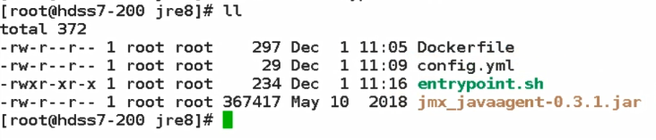

harbor创建base仓库

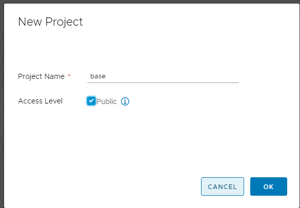

~~~
# 200机器，开始build镜像：
jre8]# docker build . -t harbor.od.com/base/jre8:8u112
jre8]# docker push harbor.od.com/base/jre8:8u112
~~~

> 回顾一下我们的交付架构图

### 使用Jenkins持续构建交付dubbo服务的提供者

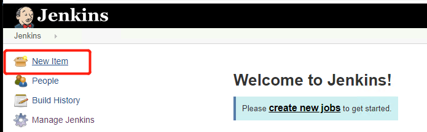

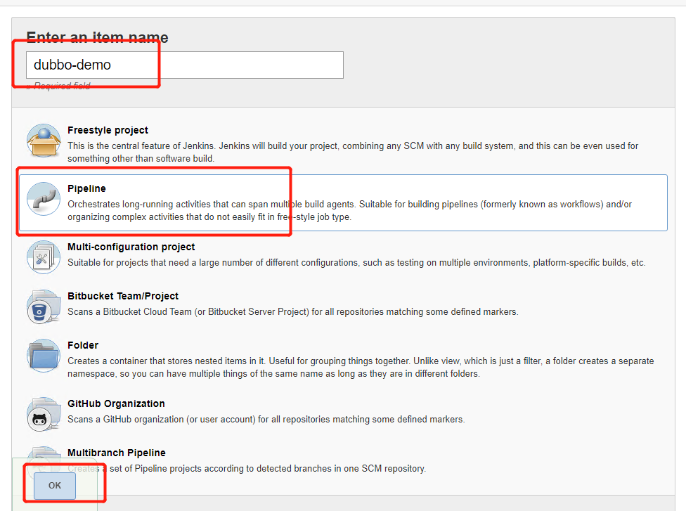

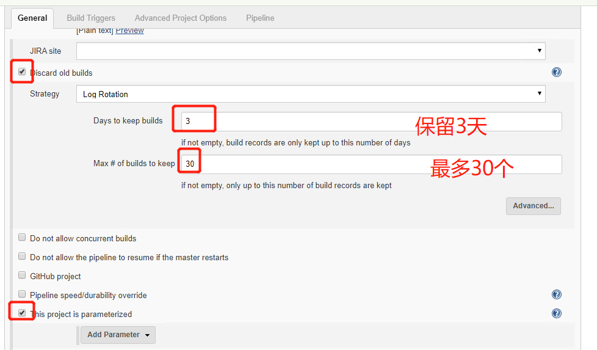

构建十个参数

1. 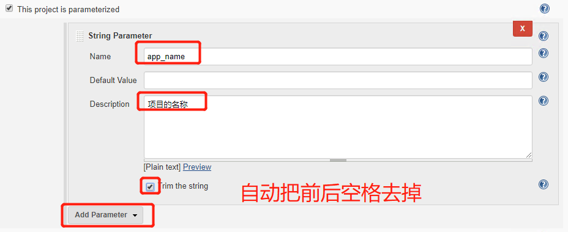
2. 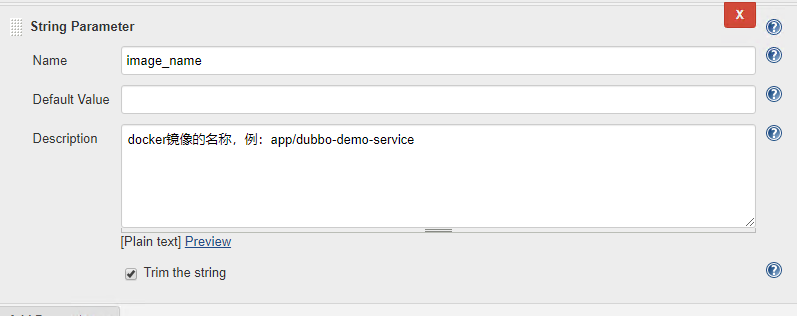
3. 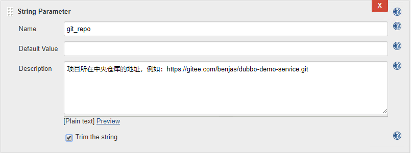
4. 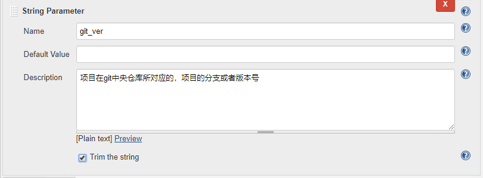
5. 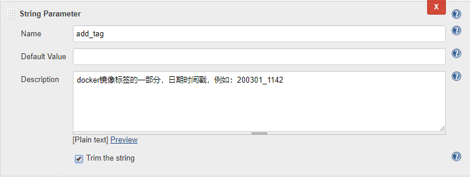
6. 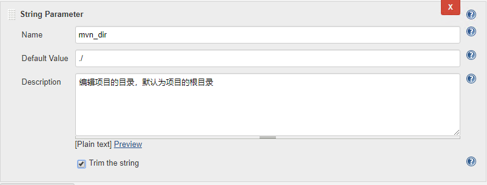
7. 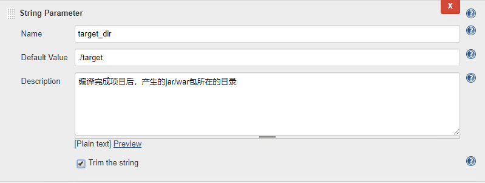
8. 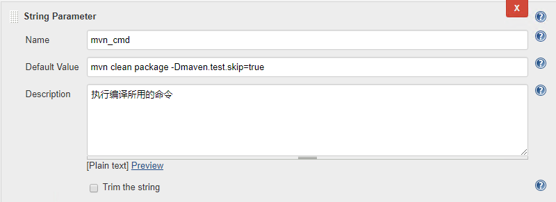
9. 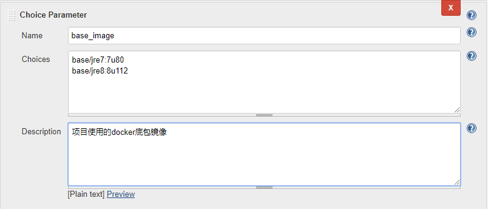
10. 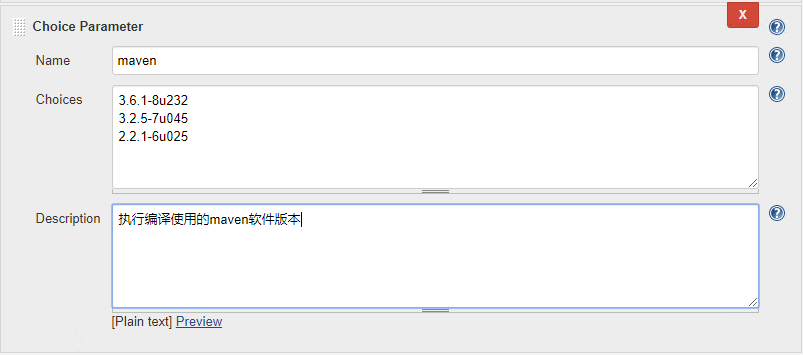
11.  把以下内容填写下面的Adnanced Project Options

~~~shell
pipeline {
  agent any 
    stages {
      stage('pull') { //get project code from repo 
        steps {
          sh "git clone ${params.git_repo} ${params.app_name}/${env.BUILD_NUMBER} && cd ${params.app_name}/${env.BUILD_NUMBER} && git checkout ${params.git_ver}"
        }
      }
      stage('build') { //exec mvn cmd
        steps {
          sh "cd ${params.app_name}/${env.BUILD_NUMBER}  && /var/jenkins_home/maven-${params.maven}/bin/${params.mvn_cmd}"
        }
      }
      stage('package') { //move jar file into project_dir
        steps {
          sh "cd ${params.app_name}/${env.BUILD_NUMBER} && cd ${params.target_dir} && mkdir project_dir && mv *.jar ./project_dir"
        }
      }
      stage('image') { //build image and push to registry
        steps {
          writeFile file: "${params.app_name}/${env.BUILD_NUMBER}/Dockerfile", text: """FROM harbor.od.com/${params.base_image}
ADD ${params.target_dir}/project_dir /opt/project_dir"""
          sh "cd  ${params.app_name}/${env.BUILD_NUMBER} && docker build -t harbor.od.com/${params.image_name}:${params.git_ver}_${params.add_tag} . && docker push harbor.od.com/${params.image_name}:${params.git_ver}_${params.add_tag}"
        }
      }
    }
}
~~~

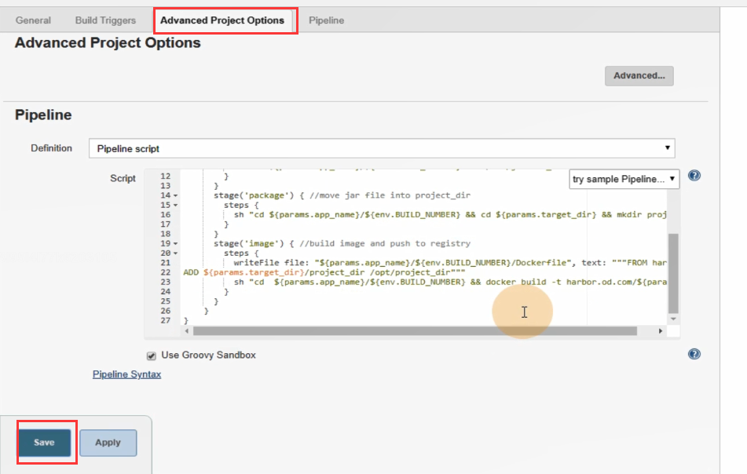

> 注释（流水线脚本）：
>
> pull: 把项目克隆到仓库
>
> build: 到指定的地方创建
>
> package: 用完mvn后打包到project_dir
>
> image: 弄到我们的docker仓库

~~~
填入对应的参数：
app_name:       dubbo-demo-service
image_name:     app/dubbo-demo-service
git_repo:       https://gitee.com/benjas/dubbo-demo-service.git
git_ver:        master
add_tag:        200301_2352
mvn_dir:        ./
target_dir:     ./dubbo-server/target
mvn_cmd:        mvn clean package -Dmaven.test.skip=true
base_image:     base/jre8:8u112
maven:          3.6.1-8u232
# 注意看脚注，点击Build进行构建，等待构建完成。
~~~

> **git_repo**：注意的地址是写你的地址
>
> **add_tag**：写现在的日期

[^dubbo-service包]: dubbo-service包在我上传的文件夹里面，你下载后拉到你新建的git仓库里面（公开），然后配上你的地址（记得之前的web是配了公钥的，否则找不到，公钥的方法在上面的章节），目录结构长这个样子

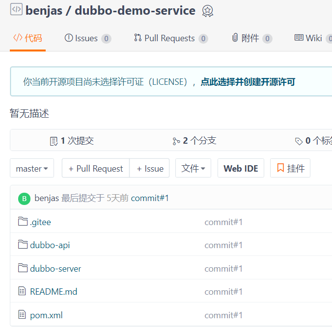

Harbor创建对应的app空间

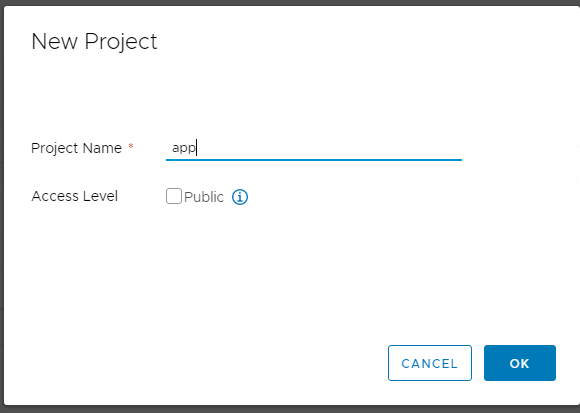

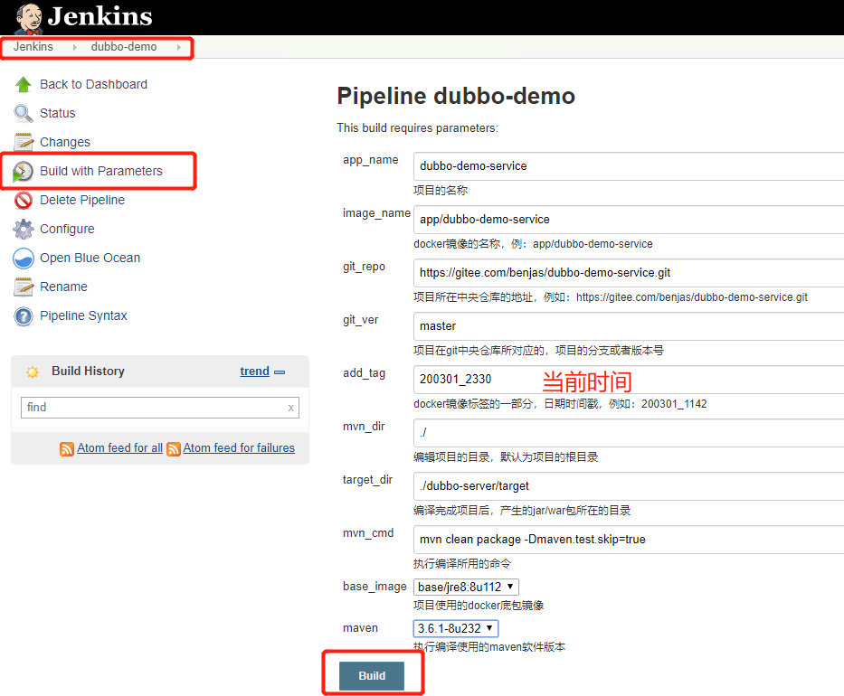

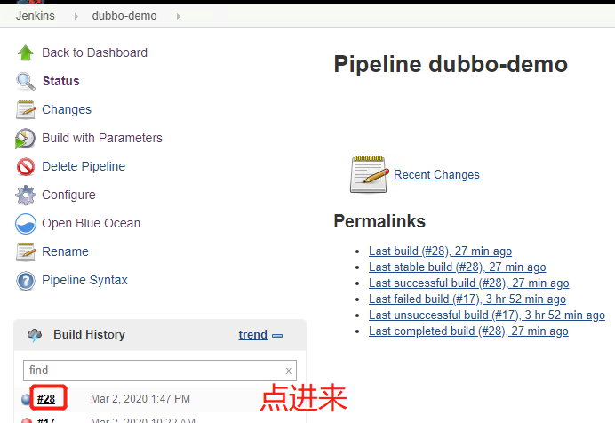

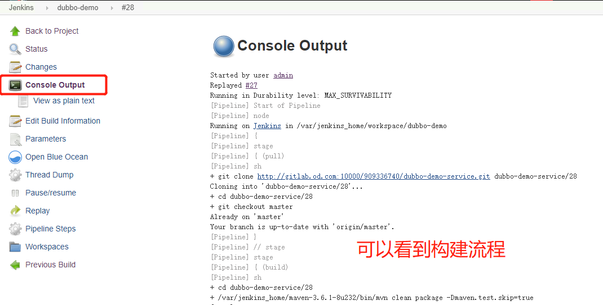

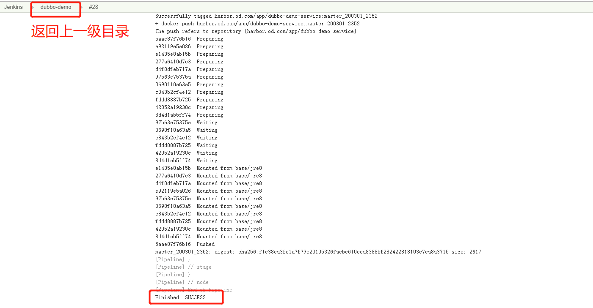

[查看harbor](harbor.od.com)

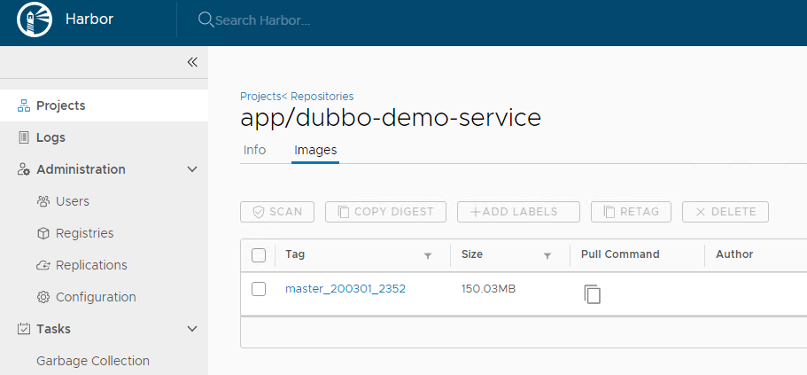

#### 报错：

1、

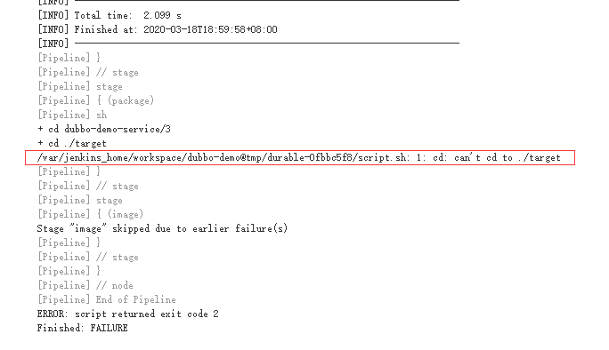

原因：你构建的参数写错了，再去检查一遍

2、连接不了gitee，一直显示失败（网络波动问题），如图

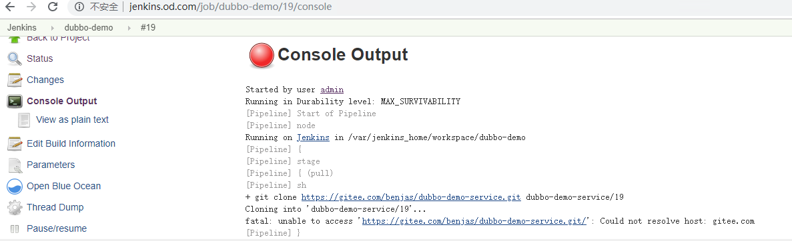

解决办法：安装本地gitlab

~~~
# 200机器：
~]# yum install curl policycoreutils openssh-server openssh-clients policycoreutils-python -y
~]# cd /usr/local/src
src]# 去该网址把文件下载下来https://mirrors.tuna.tsinghua.edu.cn/gitlab-ce/yum/el7/
src]# ls
gitlab-ce-11.11.8-ce.0.el7.x86_64.rpm
src]# rpm -ivh gitlab-ce-11.11.8-ce.0.el7.x86_64.rpm
# 修改如下内容：
src]# vim /etc/gitlab/gitlab.rb
external_url "http://gitlab.od.com:10000"
nginx['listen_port'] = 10000

# 11机器解析：
~]# vi /var/named/od.com.zone
serial前滚一位
gitlab             A    10.4.7.200

opt]# systemctl restart named
opt]# dig -t A jenkins.od.com @10.4.7.11 +short
# out:10.4.7.200

# 200机器继续，下面这步要很久，最后会有Running handlers complete的字眼，然后回车即可
src]# gitlab-ctl reconfigure
src]# gitlab-ctl status
run: alertmanager: (pid 17983) 14s; run: log: (pid 17689) 90s
run: gitaly: (pid 17866) 20s; run: log: (pid 16947) 236s
run: gitlab-monitor: (pid 17928) 18s; run: log: (pid 17591) 108s
run: gitlab-workhorse: (pid 17897) 19s; run: log: (pid 17451) 141s
run: logrotate: (pid 17500) 127s; run: log: (pid 17515) 124s
run: nginx: (pid 17468) 138s; run: log: (pid 17482) 134s
run: node-exporter: (pid 17911) 19s; run: log: (pid 17567) 114s
run: postgres-exporter: (pid 17998) 13s; run: log: (pid 17716) 84s
run: postgresql: (pid 17109) 217s; run: log: (pid 17130) 216s
run: prometheus: (pid 17949) 17s; run: log: (pid 17654) 96s
run: redis: (pid 16888) 244s; run: log: (pid 16902) 243s
run: redis-exporter: (pid 17936) 18s; run: log: (pid 17624) 102s
run: sidekiq: (pid 17395) 155s; run: log: (pid 17412) 152s
run: unicorn: (pid 17337) 166s; run: log: (pid 17368) 162s
~~~

然后把代码传进来

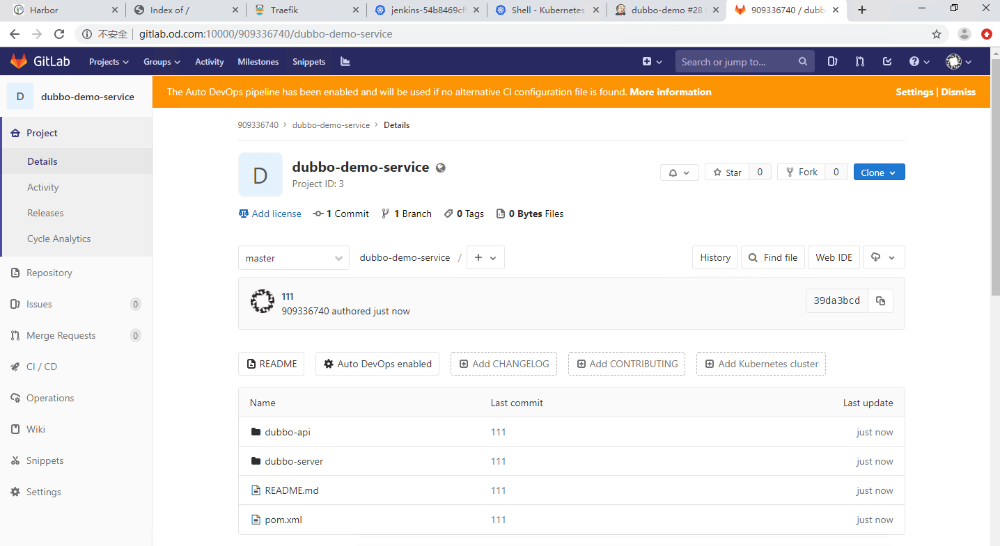

完成

> 期间如果clone下来的时候密码一直不对，就用ssh密钥的方法免密登录，最后添加200的公钥到gitlab，build镜像的时候修改git_repo即可
>
> ~~~
> git_repo:      http://gitlab.od.com:10000/909336740/dubbo-demo-service.git
> ~~~
>
> 

2、连接成功了但是一直下载不了文件然后报错（网络波动问题），如图

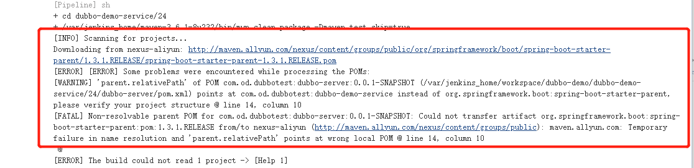

解决办法：多build几次，不行就把aliyun删掉（vi conf/settings.xml），用原始的源下载

> PS：我第一次一次过，第三次的时候，如图，我把27那些删掉，因为设置了只能30个，怕爆了，最终在28次的时候成功了
>
> 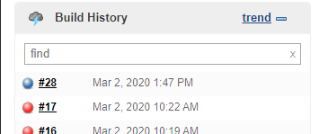
>
> 如何删除
>
> 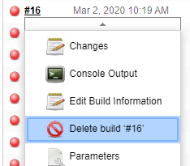

这件事情告诉我们，尽量不用公网的，特别是生产的时候分分钟几百万的访问，卡这么久，老板得祭天

服务站镜像包已制作完成，现在开始制作资源配置清单。

~~~
# 200机器，服务者的资源清单只需要一个：
jre8]# mkdir /data/k8s-yaml/dubbo-demo-service
jre8]# vi /data/k8s-yaml/dubbo-demo-service/dp.yaml
kind: Deployment
apiVersion: extensions/v1beta1
metadata:
  name: dubbo-demo-service
  namespace: app
  labels: 
    name: dubbo-demo-service
spec:
  replicas: 1
  selector:
    matchLabels: 
      name: dubbo-demo-service
  template:
    metadata:
      labels: 
        app: dubbo-demo-service
        name: dubbo-demo-service
    spec:
      containers:
      - name: dubbo-demo-service
        image: harbor.od.com/app/dubbo-demo-service:master_200301_2352
        ports:
        - containerPort: 20880
          protocol: TCP
        env:
        - name: JAR_BALL
          value: dubbo-server.jar
        imagePullPolicy: IfNotPresent
      imagePullSecrets:
      - name: harbor
      restartPolicy: Always
      terminationGracePeriodSeconds: 30
      securityContext: 
        runAsUser: 0
      schedulerName: default-scheduler
  strategy:
    type: RollingUpdate
    rollingUpdate: 
      maxUnavailable: 1
      maxSurge: 1
  revisionHistoryLimit: 7
  progressDeadlineSeconds: 600
~~~

> 上面spec里的image包要对上你现在harbor的名字
>
> 时间要改成当前的时间，这个是为了做标记，如果出现问题了可以说这个包是什么时候包，是不是自己部的，防止背锅

~~~
# 21机器，应用资源配置清单：
~]# kubectl create ns app
~]# kubectl create secret docker-registry harbor --docker-server=harbor.od.com --docker-username=admin --docker-password=Harbor12345 -n app
# out: secret/harbor created

# 11机器：
cd /opt/zookeeper
zookeeper~]# bin/zkServer.sh status
### out:
ZooKeeper JMX enabled by default
Using config: /opt/zookeeper/bin/../conf/zoo.cfg
Mode: follower
###
zookeeper]# bin/zkCli.sh -server localhost:2181
# 连接到zk，发现里面只有zk没有dubbo
[zk: localhost:2181(CONNECTED) 0] ls /
#out: [zookeeper]
# 22机器，应用dubbo：
~]# kubectl apply -f http://k8s-yaml.od.com/dubbo-demo-service/dp.yaml
# out: deployment.extensions/dubbo-demo-service created
~~~

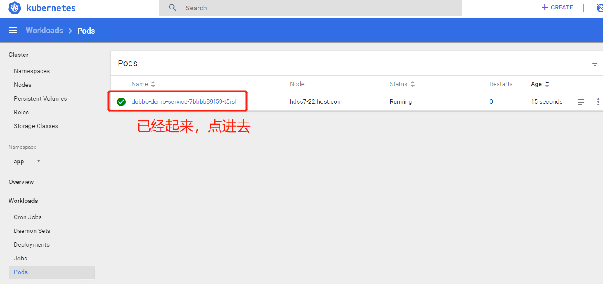

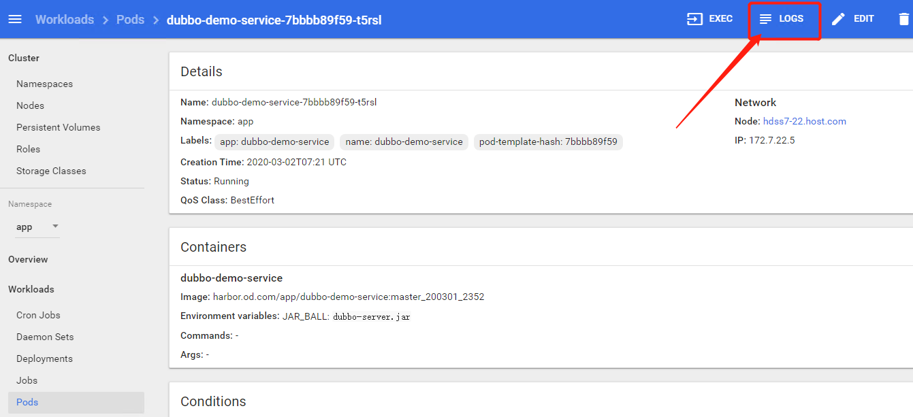

> 相关报错：
>
> 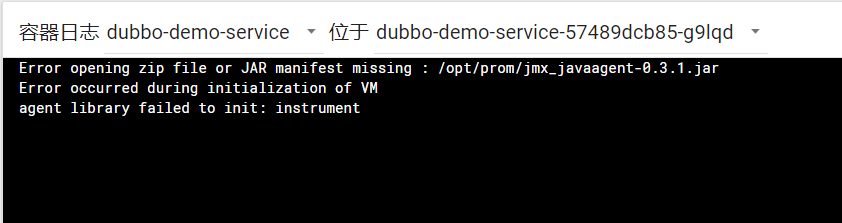
>
> 原因：因为你的文件不见了
>
> 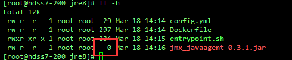

~~~
# 11机器查看，这时候已经不止zk，还有dubbo：
[zk: localhost:2181(CONNECTED) 0] ls /
#out: [dubbo, zookeeper]
[zk: localhost:2181(CONNECTED) 1] ls /dubbo
[com.od.dubbotest.api.HelloService]
~~~

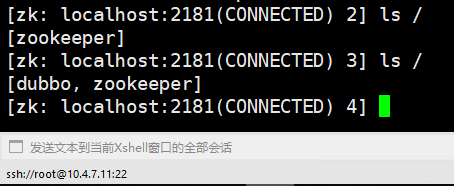

> 此时dubbo服务已经注册到JK交付中心，项目已经交付成功

### 借助BlueOcean插件回顾Jenkins流水线构建原理

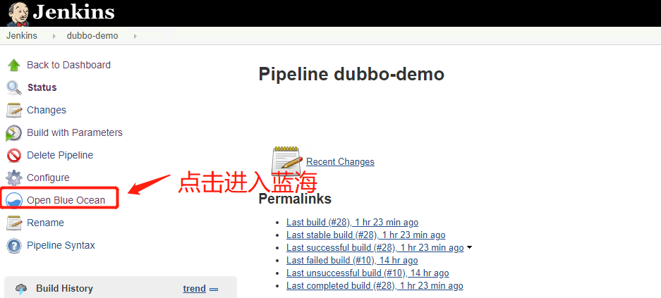

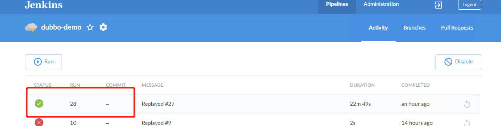

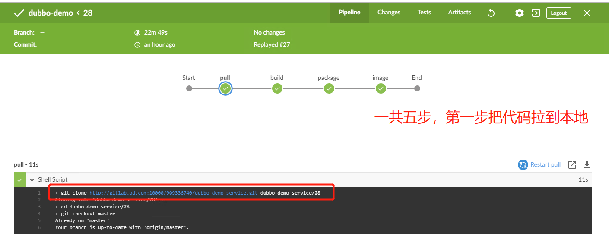

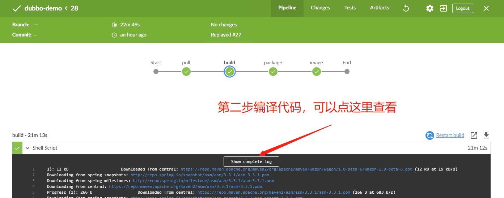

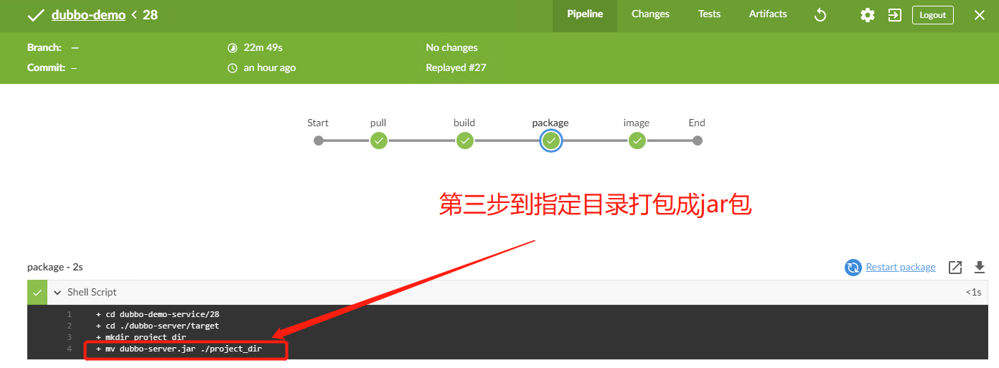

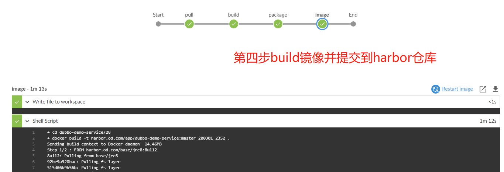

> **一般dockerfile是由谁写**：有一些公司是运维用Jenkins写，也有些公司是开发自己写的

> **Jenkins流水线构建就这五步**：拉取代码——>编译代码——>到指定目录打包jar——>构建镜像

此时提供者已经在harbor里，我们还需要把它发到我们的k8s里（还有消费者还没操作）

问题来了，如果有很多的提供者和消费者需要注册进来zk，总不能每次都用命令行连接到zk然后ls / 去查看，所以需要一个图形化界面，也就是下面的dubbo-monitor

### 交付dubbo-monitor到k8s集群：

> **WHAT**上面已经讲到，注册到zk里的时候不能总是打开机器进去查看，我们得有个图形化界面

~~~
# 200机器，下载包：
cd /opt/src
src]# wget https://github.com/Jeromefromcn/dubbo-monitor/archive/master.zip
src]# unzip master.zip
# 没有unzip的，yum install unzip -y
src]# mv dubbo-monitor-master /opt/src/dubbo-monitor
src]# ll
~~~

~~~
# 修改源码，200机器：
src]# vi /opt/src/dubbo-monitor/dubbo-monitor-simple/conf/dubbo_origin.properties
dubbo.application.name=dubbo-monitor
dubbo.application.owner=ben1234560
dubbo.registry.address=zookeeper://zk1.od.com:2181?backup=zk2.od.com:2181,zk3.od.com:2181
dubbo.protocol.port=20880
dubbo.jetty.port=8080
dubbo.jetty.directory=/dubbo-monitor-simple/monitor
dubbo.charts.directory=/dubbo-monitor-simple/charts
dubbo.statistics.directory=/dubbo-monitor-simple/statistics
~~~

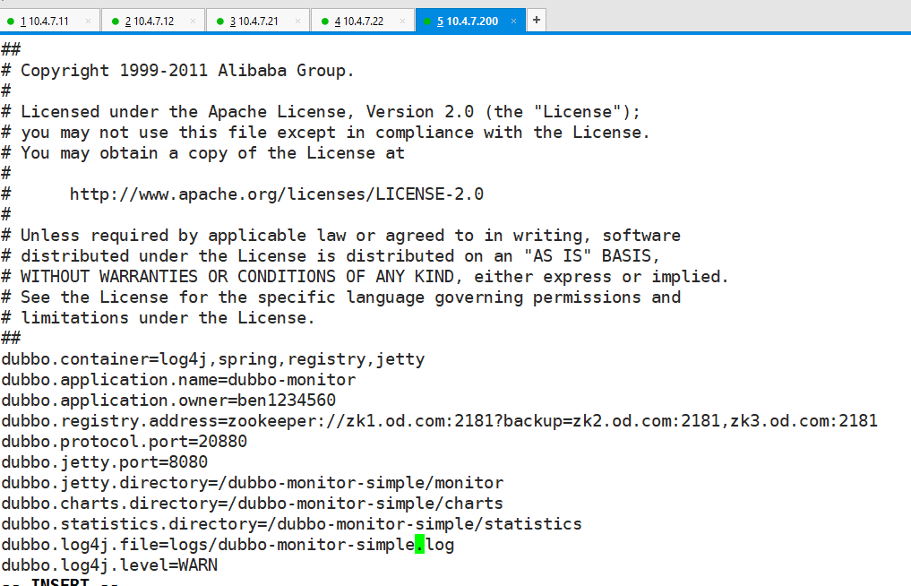

~~~
# 200机器，修改使用内存配置文件：
cd /opt/src/dubbo-monitor/dubbo-monitor-simple/bin
# 修改，原本是：-Xmx2g -Xms2g -Xmn256m PermSize=128m -Xms1g -Xmx1g -XX:PermSize=128m
bin]# vi start.sh
if [ -n "$BITS" ]; then
    JAVA_MEM_OPTS=" -server -Xmx128m -Xms128m -Xmn32m -XX:PermSize=16m -Xss256k -XX:+DisableExplicitGC -XX:+UseConcMarkSweepGC -XX:+CMSParallelRemarkEnabled -XX:+UseCMSCompactAtFullCollection -XX:LargePageSizeInBytes=128m -XX:+UseFastAccessorMethods -XX:+UseCMSInitiatingOccupancyOnly -XX:CMSInitiatingOccupancyFraction=70 "
else
    JAVA_MEM_OPTS=" -server -Xms128m -Xmx128m -XX:PermSize=16m -XX:SurvivorRatio=2 -XX:+UseParallelGC "
fi

echo -e "Starting the $SERVER_NAME ...\c"
exec java $JAVA_OPTS $JAVA_MEM_OPTS $JAVA_DEBUG_OPTS $JAVA_JMX_OPTS -classpath $CONF_DIR:$LIB_JARS com.alibaba.dubbo.container.Main > $STDOUT_FILE 2>&1

# 再往下的全部内容删掉，如图
~~~

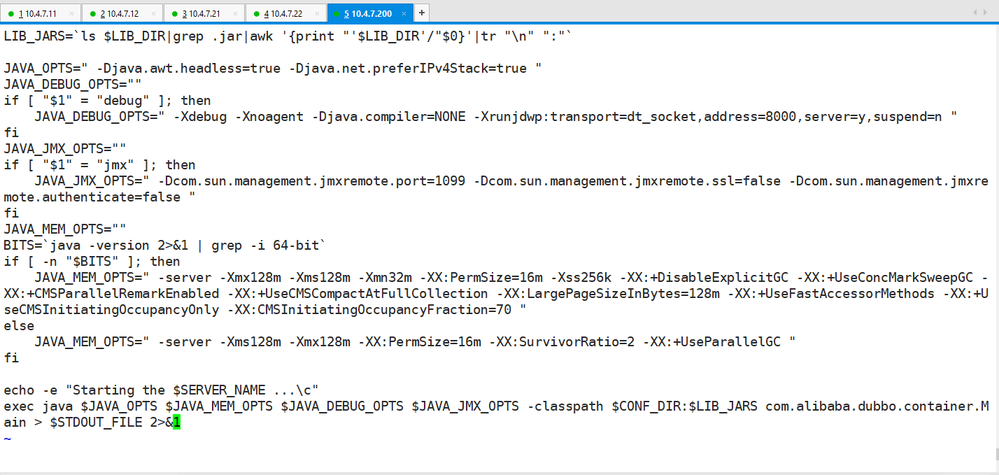

~~~
# 200机器，build：
cd /opt/src
src]# cp -a dubbo-monitor /data/dockerfile/
src]# cd /data/dockerfile/dubbo-monitor
dubbo-monitor]# docker build . -t harbor.od.com/infra/dubbo-monitor:latest
# out：Successfully built ...  Successfully tagged ...
dubbo-monitor]# docker push harbor.od.com/infra/dubbo-monitor:latest
~~~

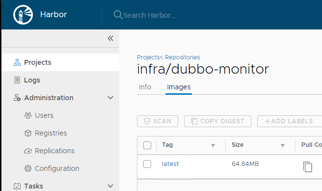

~~~
# 200机器，配置资源清单：
dubbo-monitor]# mkdir /data/k8s-yaml/dubbo-monitor
dubbo-monitor]# cd /data/k8s-yaml/dubbo-monitor
dubbo-monitor]# vi dp.yaml
kind: Deployment
apiVersion: extensions/v1beta1
metadata:
  name: dubbo-monitor
  namespace: infra
  labels: 
    name: dubbo-monitor
spec:
  replicas: 1
  selector:
    matchLabels: 
      name: dubbo-monitor
  template:
    metadata:
      labels: 
        app: dubbo-monitor
        name: dubbo-monitor
    spec:
      containers:
      - name: dubbo-monitor
        image: harbor.od.com/infra/dubbo-monitor:latest
        ports:
        - containerPort: 8080
          protocol: TCP
        - containerPort: 20880
          protocol: TCP
        imagePullPolicy: IfNotPresent
      imagePullSecrets:
      - name: harbor
      restartPolicy: Always
      terminationGracePeriodSeconds: 30
      securityContext: 
        runAsUser: 0
      schedulerName: default-scheduler
  strategy:
    type: RollingUpdate
    rollingUpdate: 
      maxUnavailable: 1
      maxSurge: 1
  revisionHistoryLimit: 7
  progressDeadlineSeconds: 600

dubbo-monitor]# vi svc.yaml
kind: Service
apiVersion: v1
metadata: 
  name: dubbo-monitor
  namespace: infra
spec:
  ports:
  - protocol: TCP
    port: 8080
    targetPort: 8080
  selector: 
    app: dubbo-monitor

dubbo-monitor]# ingress.yaml
kind: Ingress
apiVersion: extensions/v1beta1
metadata: 
  name: dubbo-monitor
  namespace: infra
spec:
  rules:
  - host: dubbo-monitor.od.com
    http:
      paths:
      - path: /
        backend: 
          serviceName: dubbo-monitor
          servicePort: 8080
~~~

> 每次创建完yaml后，你都可以去k8s-yaml.od.com网址看下有没有在里面了

~~~
# 应用资源清单前，先解析域名，11机器：
11 ~]# vim /var/named/od.com.zone
# serial 前滚一个
dubbo-monitor      A    10.4.7.10

11 ~]# systemctl restart named
11 ~]# dig -t A dubbo-monitor.od.com @10.4.7.11 +short
# out: 10.4.7.10
~~~

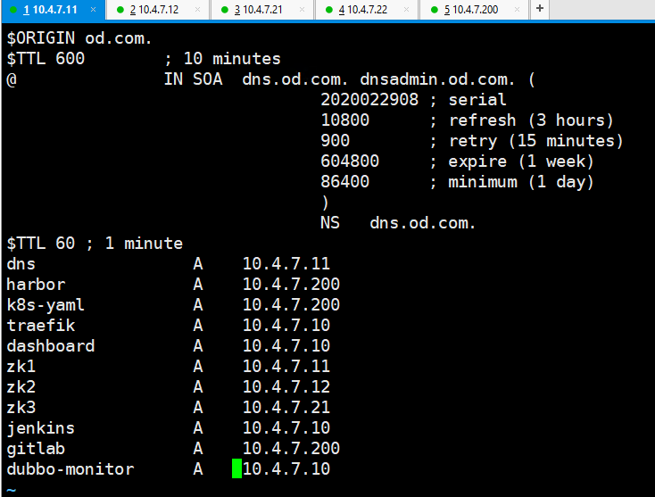

~~~
# 22机器，应用资源配置清单：
22 ~]# kubectl apply -f http://k8s-yaml.od.com/dubbo-monitor/dp.yaml
22 ~]# kubectl apply -f http://k8s-yaml.od.com/dubbo-monitor/svc.yaml
22 ~]# kubectl apply -f http://k8s-yaml.od.com/dubbo-monitor/ingress.yaml
~~~

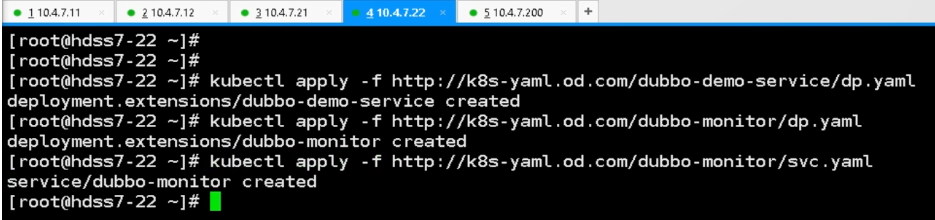

[访问网站 http://dubbo-monitor.od.com](http://dubbo-monitor.od.com)

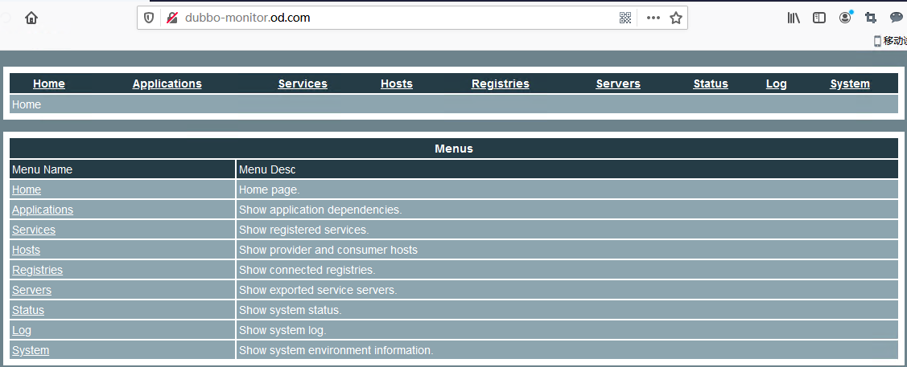

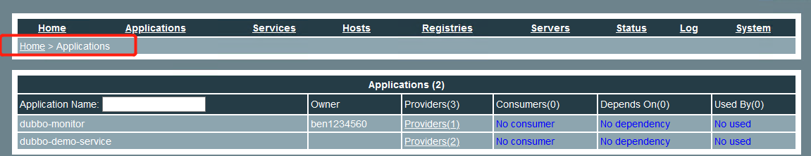

界面版的交付页面完成。

> 相关小问题：
>
> 发现pod有问题，因为之前的配置文件没修改好，镜像是起不来的
>
> 
>
> 解决办法：修改好配置文件，新build镜像，然后修改dp.yaml指定镜像，然后apply -f 应用，再删掉这个pod即可

#### 交付dubbo服务的消费者到K8S

登录Jenkins，账号：admin，密码：admin123

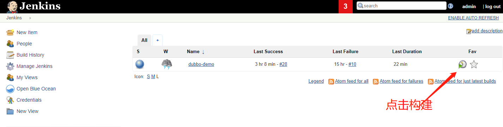

~~~
# 填入指定参数
app_name:       dubbo-demo-consumer
image_name:     app/dubbo-demo-consumer
git_repo:        http://gitlab.od.com:10000/909336740/dubbo-demo-web.git
git_ver:        master
add_tag:        200302_1700
mvn_dir:        ./
target_dir:     ./dubbo-client/target
mvn_cmd:        mvn clean package -e -q -Dmaven.test.skip=true
base_image:     base/jre8:8u112
maven:          3.6.1-8u232
# 点击Build进行构建，等待构建完成，mvn_cmd 里的 -e -q是让输出输出的多点，可以看里面的内容
~~~

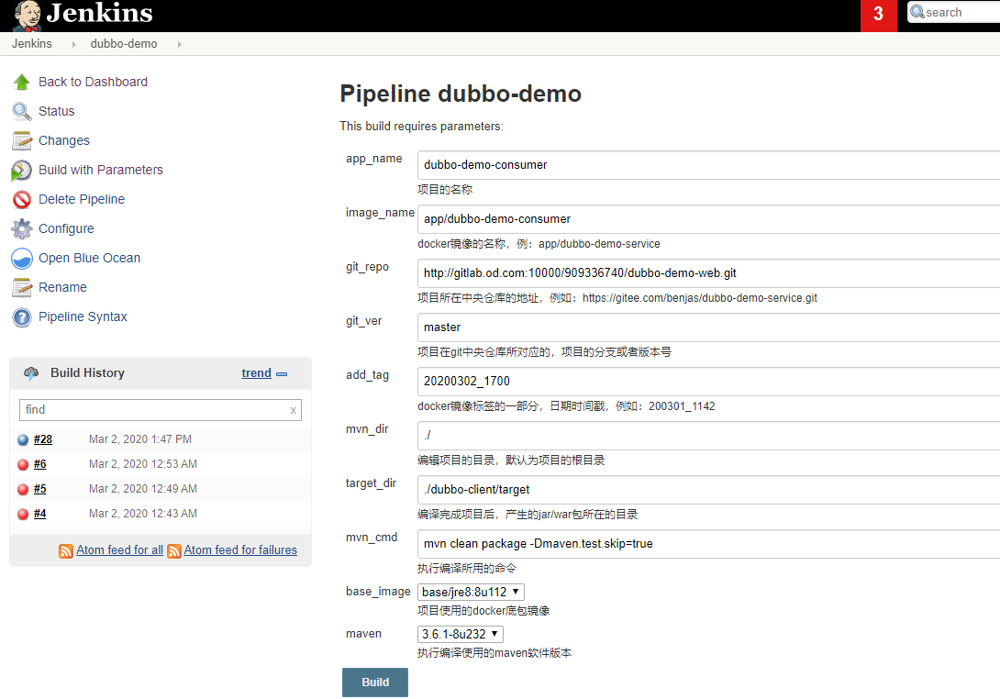

> 这里的git_repo你应该用公网的gitee或者GitHub，我因为省钱买的网络有些问题的机器，所以只能一直用gitlab

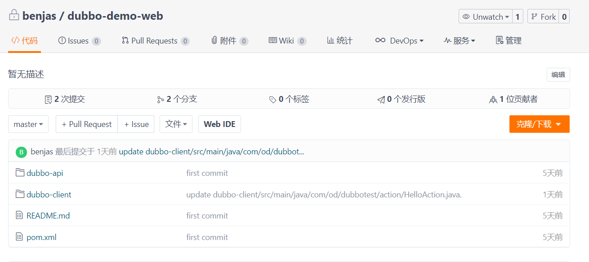

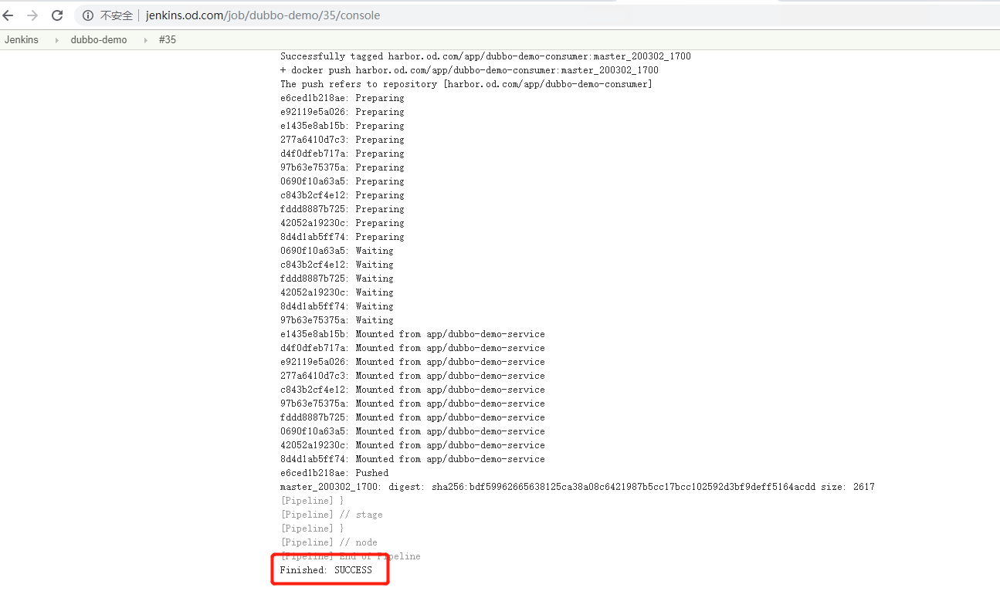

> 第一次编译比较久（因为要远程下载下来），需要耐心等待，3分钟左右，最终会success，此时harbor里面已经有了

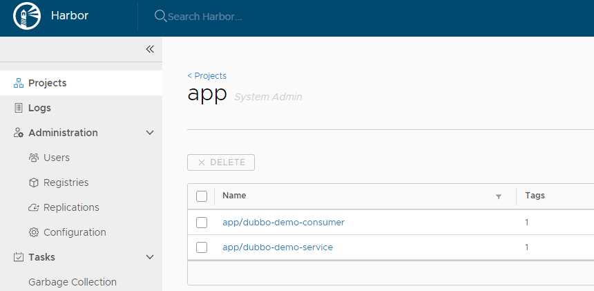

> 可以去蓝海看构建过程，进入方法上面回顾的时候有

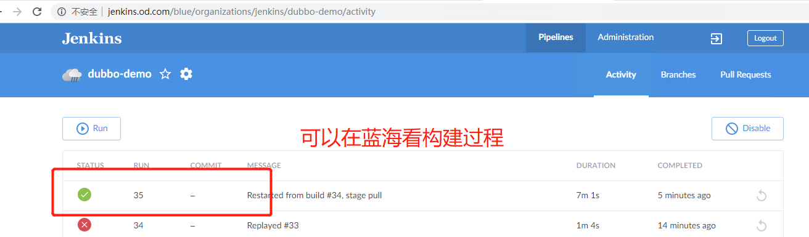

~~~
# 200机器，准备资源配置清单：
mkdir /data/k8s-yaml/dubbo-demo-consumer
cd /data/k8s-yaml/dubbo-demo-consumer
dubbo-demo-consumer]# vi dp.yaml
kind: Deployment
apiVersion: extensions/v1beta1
metadata:
  name: dubbo-demo-consumer
  namespace: app
  labels: 
    name: dubbo-demo-consumer
spec:
  replicas: 1
  selector:
    matchLabels: 
      name: dubbo-demo-consumer
  template:
    metadata:
      labels: 
        app: dubbo-demo-consumer
        name: dubbo-demo-consumer
    spec:
      containers:
      - name: dubbo-demo-consumer
        image: harbor.od.com/app/dubbo-demo-consumer:master_200302_1700
        ports:
        - containerPort: 8080
          protocol: TCP
        - containerPort: 20880
          protocol: TCP
        env:
        - name: JAR_BALL
          value: dubbo-client.jar
        imagePullPolicy: IfNotPresent
      imagePullSecrets:
      - name: harbor
      restartPolicy: Always
      terminationGracePeriodSeconds: 30
      securityContext: 
        runAsUser: 0
      schedulerName: default-scheduler
  strategy:
    type: RollingUpdate
    rollingUpdate: 
      maxUnavailable: 1
      maxSurge: 1
  revisionHistoryLimit: 7
  progressDeadlineSeconds: 600

dubbo-demo-consumer]# vi svc.yaml
kind: Service
apiVersion: v1
metadata: 
  name: dubbo-demo-consumer
  namespace: app
spec:
  ports:
  - protocol: TCP
    port: 8080
    targetPort: 8080
  selector: 
    app: dubbo-demo-consumer

dubbo-demo-consumer]# vi ingress.yaml
kind: Ingress
apiVersion: extensions/v1beta1
metadata: 
  name: dubbo-demo-consumer
  namespace: app
spec:
  rules:
  - host: demo.od.com
    http:
      paths:
      - path: /
        backend: 
          serviceName: dubbo-demo-consumer
          servicePort: 8080
~~~

> 有ingress了，所以应用之前，我们得解析一下域名

~~~
# 11机器，解析域名：
11 ~]# vi /var/named/od.com.zone
serial 前滚一个序号
demo               A    10.4.7.10

11 ~]# systemctl restart named
11 ~]# dig -t A demo.od.com @10.4.7.11 +short
#out: 10.4.7.10
~~~

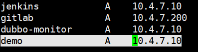

~~~
# 22机器（22还是21都无所谓），应用资源配置清单：
22 ~]# kubectl apply -f http://k8s-yaml.od.com/dubbo-demo-consumer/dp.yaml
22 ~]# kubectl apply -f http://k8s-yaml.od.com/dubbo-demo-consumer/svc.yaml
22 ~]# kubectl apply -f http://k8s-yaml.od.com/dubbo-demo-consumer/ingress.yaml
~~~

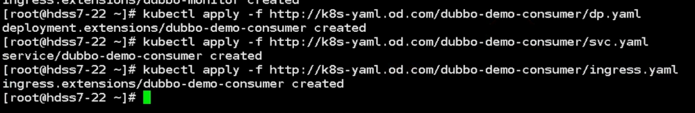

[刷新dubbo-monitor-application界面](http://dubbo-monitor.od.com/applications.html)

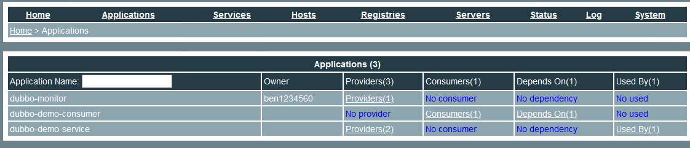

~~~
在浏览器输入以下网址
http://demo.od.com/hello?name=ben1234560
~~~

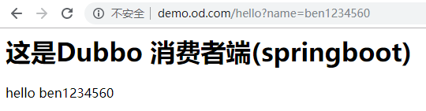

成功

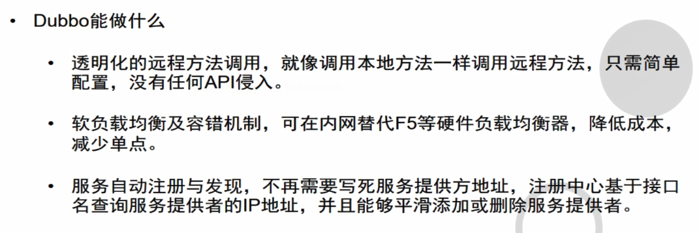

> 最重要的是软负载均衡及扩容，也就是可以随意扩容后端或前端，你可以这么试试，先把服务者pod控制器改成3个

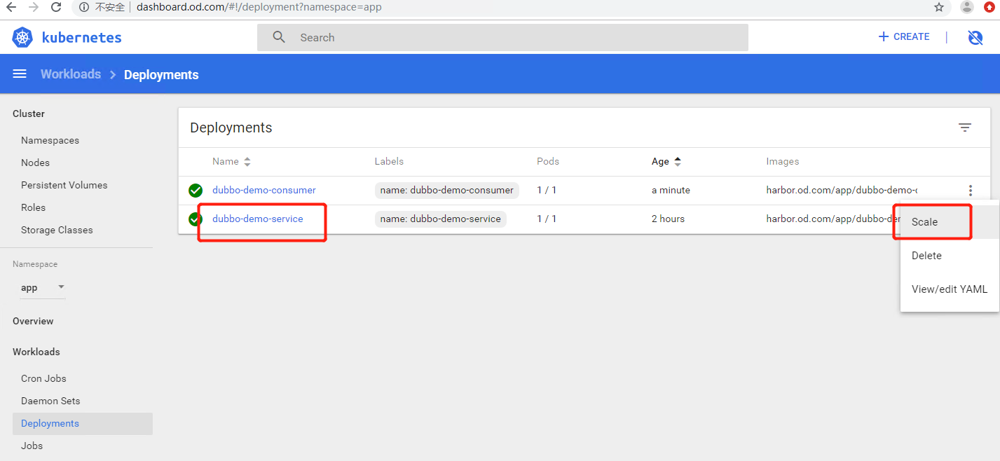

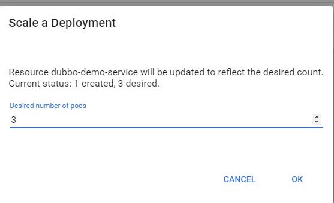

> 把消费者pod改成两个

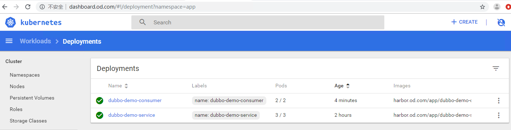

> 这样一共就是5个，完成扩容

然后缩容，先把消费者改成1个，再把服务者也改成一个

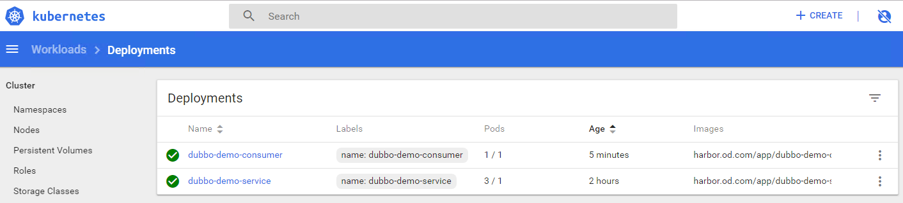

> 刷新页面，完成缩容

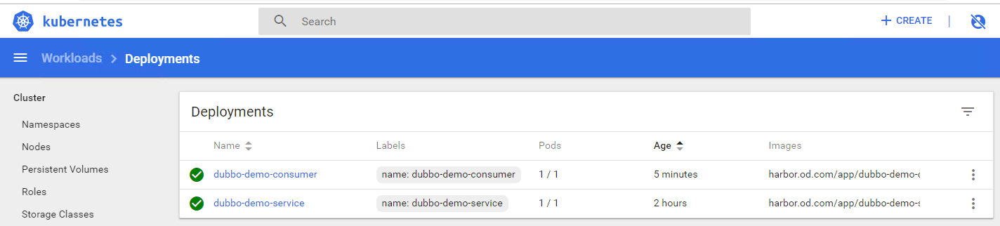

> 这样的好处就是你可以随意无缝隙的扩容缩容，当用户访问量高的时候扩容，访问量小的时候缩容
>

### 实现dubbo集群的日常维护

> **WHAT**：日常中肯定有代码迭代的情况，开发更新了代码，我们迭代App

我们改了下面红框内的一些内容，模拟开发代码的迭代

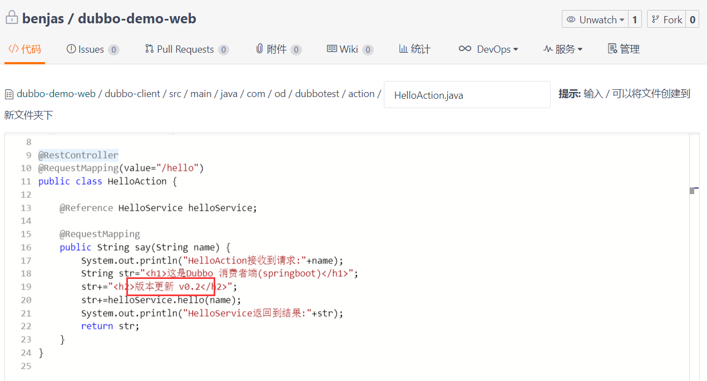

更改完后提交到仓库

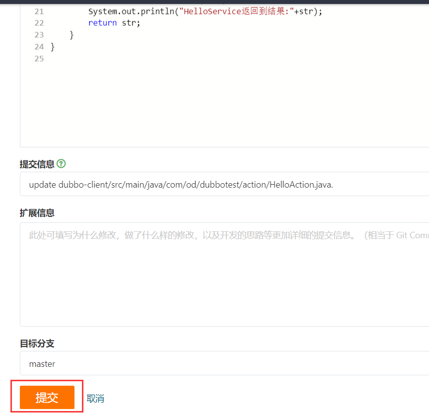

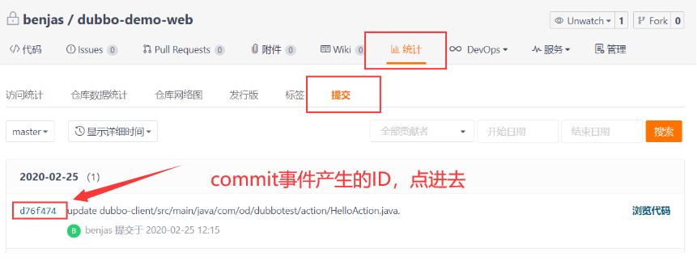

再用Jenkins构建

~~~
# 填入指定参数
app_name:       dubbo-demo-consumer
image_name:     app/dubbo-demo-consumer
git_repo:       https://gitee.com/benjas/dubbo-demo-web.git
git_ver:        d76f474
add_tag:        200302_2311
mvn_dir:        ./
target_dir:     ./dubbo-client/target
mvn_cmd:        mvn clean package -e -q -Dmaven.test.skip=true
base_image:     base/jre8:8u112
maven:          3.6.1-8u232
# 点击Build进行构建，等待构建完成，mvn_cmd 里的 -e -q是让输出输出的多点，可以看里面的内容
~~~

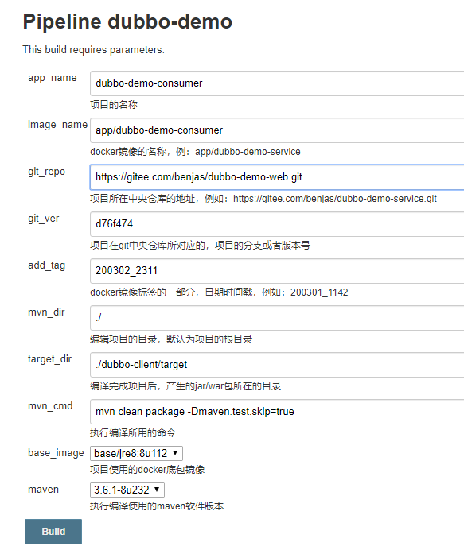

harbor里面有了新的镜像

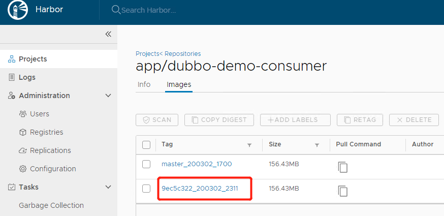

> 注意，我这里的版本号是我在gitlab做的（因为网络真的不想），上面是为了演示用公网的git，所以正确的应该是这个名字d76f474_200302_2311

在dashboard里面改镜像名

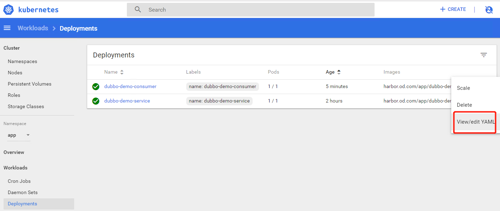

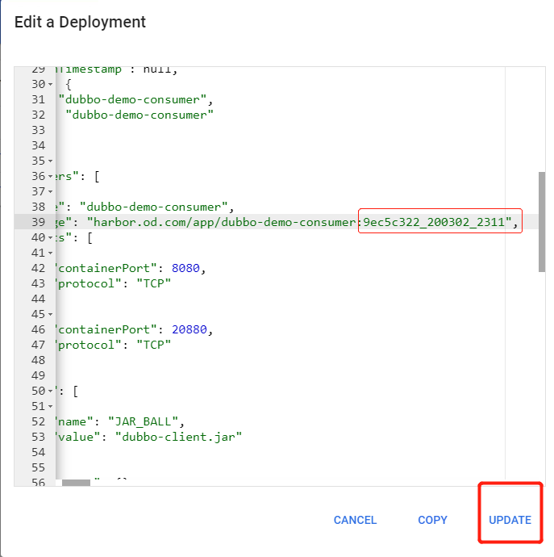

> 同样，这个gitlab的，其实应该是d76f474_200302_2311

~~~
再去下面这个网址，刷新
http://demo.od.com/hello?name=ben1234560
~~~

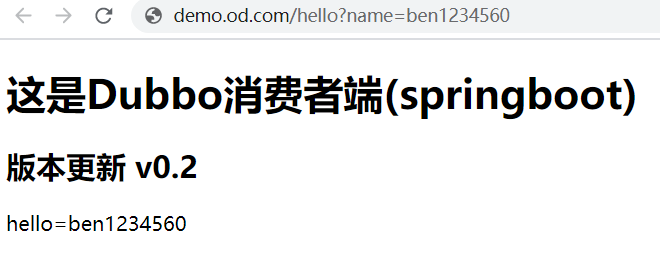

这样你就完成了版本迭代

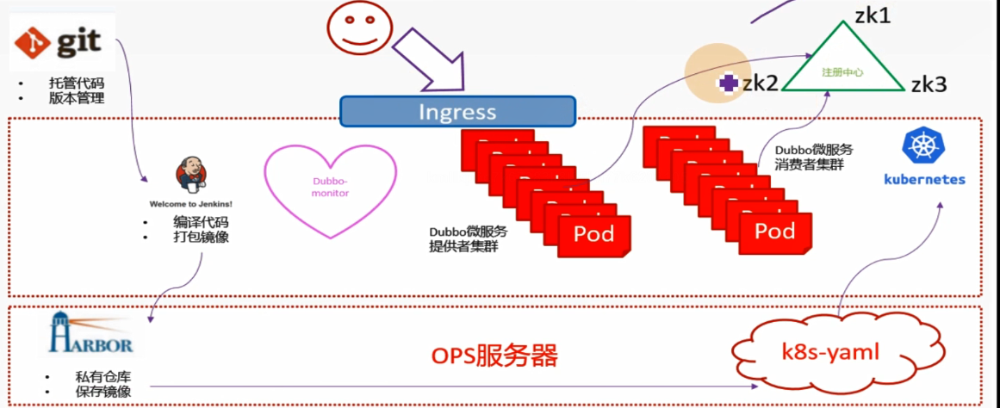

[^回顾]: 此时我们在看一下这张图，git我们用了，Jenkins编译打包了，ingress资源清单，dubbo微服务起了，zk注册中心做了，harbor私有仓库完成了，k8s-yaml网址有了，kubernetes连接了，所有东西都实现了点点点，就差OPS服务器的自动化。我们需要Jenkins打包后到harbor仓库里后，自动变成yaml到K8S里。

> 我们的目标是实现自动化，解放生产力。

### 实战K8S集群毁灭性测试

> **WHAT**：生产中总会遇到突然宕机等情况，我们需要来模拟一下

生产上，保证服务都是起两份以上，所有我们给consumer和service都起两份

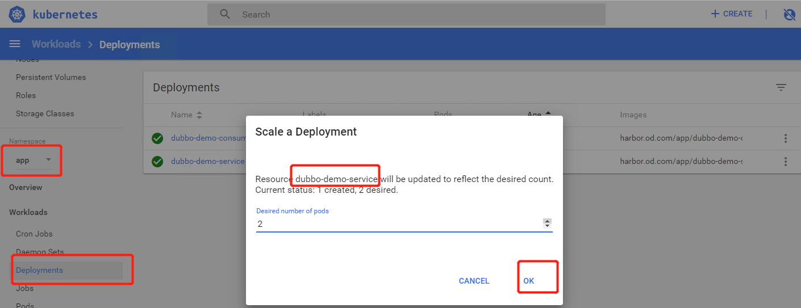

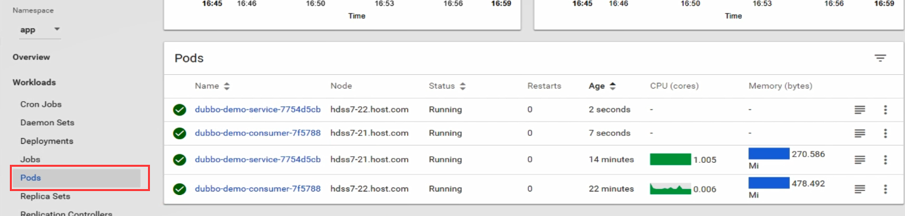

我们可以看到21和22分别都有两台，这是schedule做的资源分配

接下来，我们模拟一台服务器炸了

~~~
# 21机器：
~]# halt
~~~

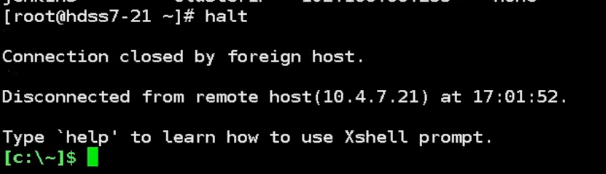

> 再去demo网址，发现已经进不去了，dashboard已经503了

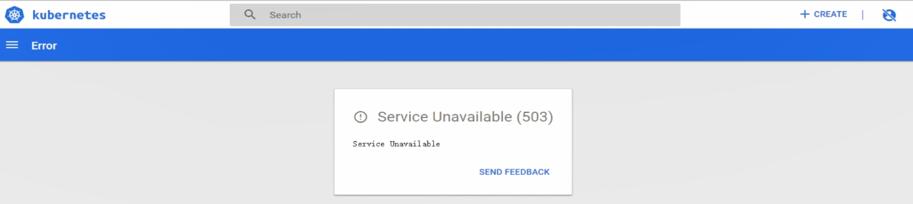

> 宿主机爆炸，我们的第一件事情，就是把离线的主机删了（如果不删掉，那么k8s会认为是网络抖动或者什么问题，会不断的重连）

~~~
# 22机器，删除离线主机：
~]# kubeclt delete node hdss7-21.host.com
# out: node "hdss7-21.host.com" deleted
~~~

> 删除了后，k8s有自愈机制，会在22节点自己起来
>
> 我们在去网址查看（时间可能慢一些，当然你不断刷新的时候可能发现偶尔会有报错，然后又刷新就又好了，下面会讲到）

> 此时可以看到dashboard已经在起来的状态，我们的配置比较差，所以起来的比较慢
>
> 现在看到已经起来了，但是下面还有一个backoff状态pod，应该是负载的问题，也就是引发上面的网址有时候刷新是报错状态，因为nginx的负载

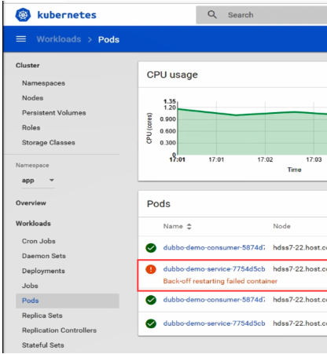

我们去改一下nginx

~~~
# 11机器，去到最下面把21节点注释掉：
vi /etc/nginx/nginx.conf
# server.10.4.7.21:6443
~~~

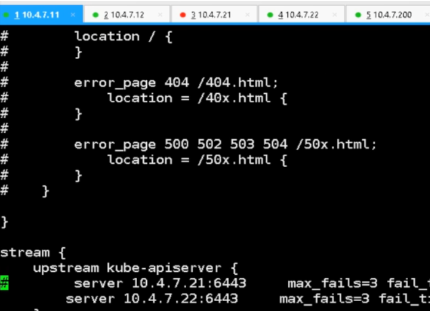

~~~
# 11机器，traefik的21节点也注释掉：
~]# Vi /etc/ningx/conf.d/od.com.conf
# server 10.4.7.21.81     max_fails=3 fail_timeout=10s;

~]# nginx -s reload
~~~

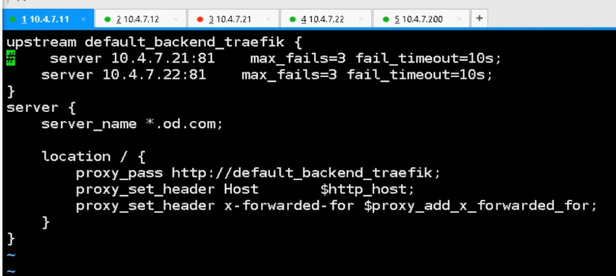

这时候你去刷新网址，已经不会出现偶尔报错的状况了，容器也已经起来了

现在，我们已经完成了服务器（主机）炸了后的应急解决

#### 集群恢复：

~~~
# 21机器，重新连接21机器：
~]# supervisorctl status
~]# kubectl get nodes
~]# kubectl label node hdss7-21.host.com node-role.kubernetes.io/master=
# out: node/hdss7-21.host.comt labeled
~]# kubectl label node hdss7-21.host.com node-role.kubernetes.io/node=
# out: node/hdss7-21.host.com labeled
~~~

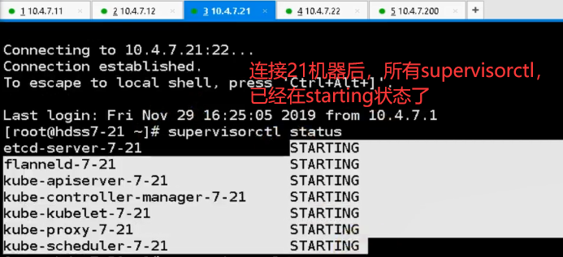

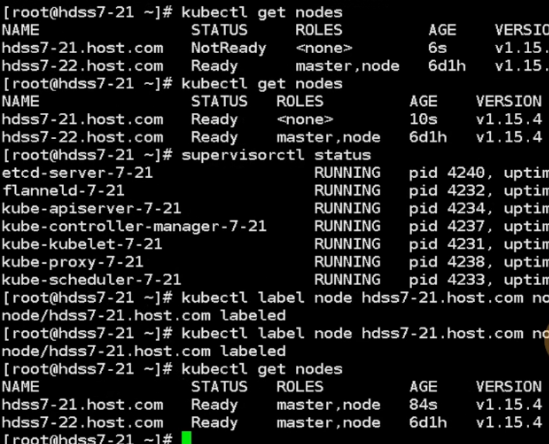

> 所有已经起来了，我们在把负载的注释改回来

~~~
# 11机器，修改负载：
~]# vi /etc/nginx/nginx.conf
server.10.4.7.21:6443

~]# vi /etc/ningx/conf.d/od.com.conf
server 10.4.7.21.81     max_fails=3 fail_timeout=10s;

nginx -s reload
~~~

> 这时候我们看一下dubbo服务都起在哪里

~~~
# 21机器：
~]# kubectl get pods -n app -o wide
~~~

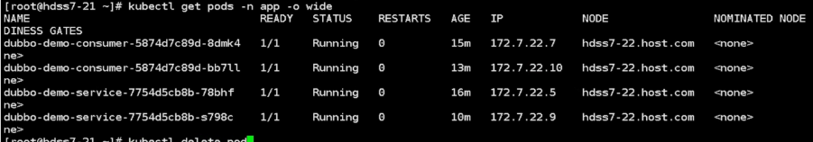

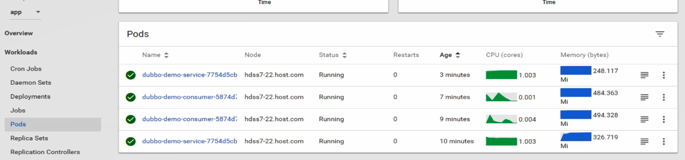

> 可以看到都是在22机器上运行，我们有计划的做一下调度（资源平衡）

~~~
# 删掉一个consumer和一个service，21机器：
~]# kubectl delete pods dubbo-demo-consumer-5874d7c89d-8dmk4 -n app
~]# kubectl delete pods dubbo-demo-service-7754d5cb8b-78bhf -n app
~~~

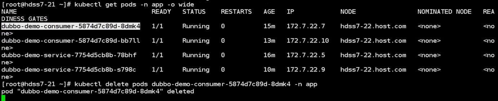

~~~
# 21机器，可以看到21机器和22机器都分别是两个了：
~]# kubectl get pods -n app -o wide
~~~

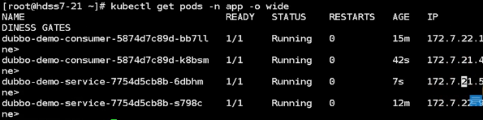

此时我们去dashboard看一下，发现不可用

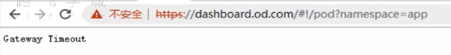

~~~
# 21机器,把dashboard删掉让k8S重新调度：
~]# kubectl get pods -n kube-system
~]# kubectl delete pods kubernetes-dashboard-76dcdb4677-kv8mq -n kube-system
~~~

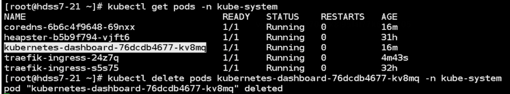

成功，是不是比较简单，这就是分布式的能力

~~~
# 21机器，查看一下iptables规则有没有问题
zookeeper]# iptables-save |grep -i postrouting
# 把有问题的规则删了
zookeeper]# iptables -t nat -D POSTROUTING -s 172.7.21.0/24 ! -o docker0 -j MASQUERADE
# 修改规则并启动
zookeeper]# iptables -t nat -I POSTROUTING -s 172.7.21.0/24 ! -d 172.7.0.0/16 ! -o docker0 -j MASQUERADE
zookeeper]# iptables-save |grep -i postrouting
~~~

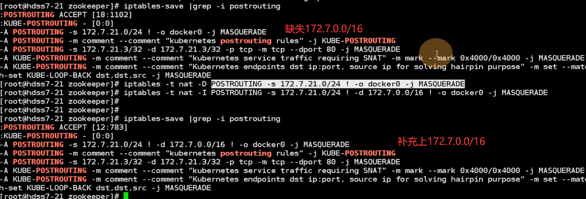

修改完成

