## 第六章——在K8S中集成Apollo配置中心

> **前言**：
>
> **运维八荣八耻**：
>
> - 以可配置为荣，以硬编码为耻
> - 以互备为荣，以单点为耻
> - 以随时重启为荣，以不能迁移为耻
> - 以整体交付为荣，以部分交付为耻
> - 以无状态为荣，以有状态为耻
> - 以标准化为荣，以特殊化为耻
> - 以自动化工具为荣，以手动和人肉为耻
> - 以无人值守为荣，以人工介入为耻
>
> **目前我们交付进K8S集群的两个dubbo微服务和monitor，它们的配置都是写死在容器里的**
>
> **配置管理的现状**：
>
> - 配置散乱格式不标准（XML、ini、conf、yaml...）
> - 主要采用本地静态配置，应用多副本集下配置修改麻烦
> - 易引发生产事故（测试环境、生产环境配置混用）
> - 配置缺乏安全审计和版本控制功能（config review）
> - 不同环境的应用，配置不同，造成多次打包，测试失败
>
> **配置中心是什么？**：
>
> - 顾名思义，就是集中管理应用程序配置的“中心”


> 常见的配置中心：
>
> - SprigCloudConfig
> - K8S ConfigMap
> - Apollo：基于SprigCloudConfig
> - ...
>
> 目前具有争议的一般是使用Apollo还是SprigCloudConfig，看对比图，所以我们使用Apollo，而且Apollo是基于SprigCloudConfig，也就是你交付了Apollo也相当于交付了微服务

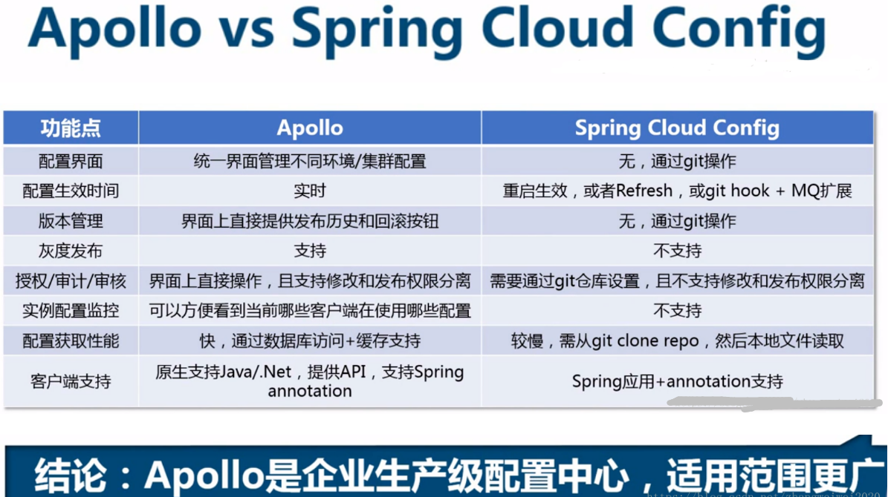

### configmap使用详解

> **WHAT**：就是为了让镜像 和 配置文件解耦，以便实现镜像的可移植性和可复用性，因为一个configMap其实就是一系列配置信息的集合，将来可直接注入到Pod中的容器使用
>
> **WHY**：为了配合Apollo使用

使用configmap管理应用配置，需要先拆分环境，拆分未test和pro环境来模拟实际工作

先把dubbo的服务（消费者/服务站/监视者）都scale成0，这样就没有容器在里面跑了

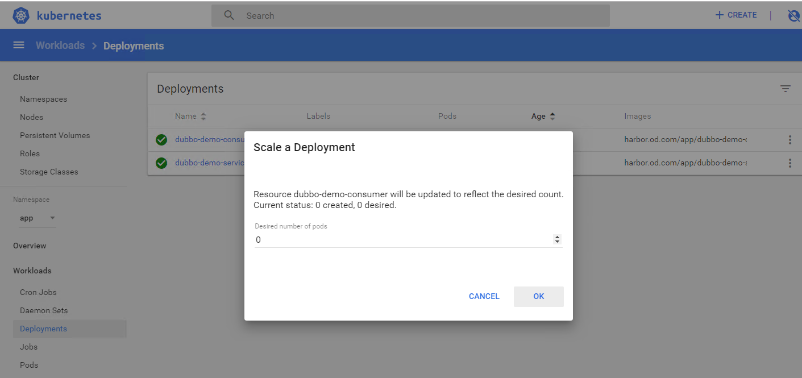

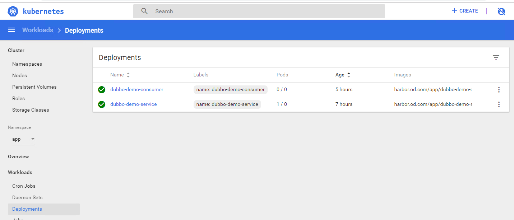

拆分zk成测试环境和生产环境来模拟实际情况，如下：

| 主机名            | 角色                 | ip        |
| ----------------- | -------------------- | --------- |
| HDSS7-11.host.com | zk1.od.com(Test环境) | 10.4.7.11 |
| HDSS7-12.host.com | zk2.od.com(Prod环境) | 10.4.7.12 |

之前是11、12、21一共3台，我们先把21拆了

~~~
# 11/12/21机器，停掉zookeeper并删掉相关data文件和log文件的内容：
~]# cd /opt/zookeeper
zookeeper]# bin/zkServer.sh stop
# 停不掉就 kill -9 id 杀掉
zookeeper]# ps aux|grep zoo
zookeeper]# cd /data/zookeeper/data/
data]# rm -fr ./*
cd ../logs/
logs]# rm -fr ./*
~~~

> **kill -9**：强制杀死该进程


~~~
# 11/12机器，修改zoo.cfg配置：
zookeeper]# cd /opt/zookeeper/conf
zookeeper]# vi zoo.cfg
# 把下面的三行都删掉，不需要组成集群，如图
~~~


~~~
# 11/12机器，启动zk：
cd /opt/zookeeper/
zookeeper]# bin/zkServer.sh start
zookeeper]# ps aux|grep zoo
zookeeper]# bin/zkServer.sh status
~~~

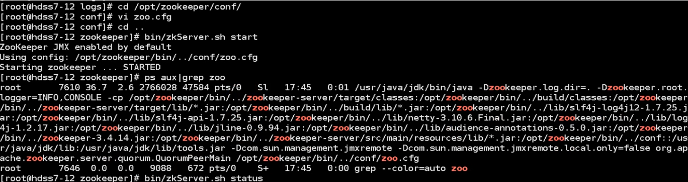

Mode: standalone 模式，拆分完成

~~~
# 200机器，准备资源配置清单：
~]# vi /data/k8s-yaml/dubbo-monitor/cm.yaml
apiVersion: v1
kind: ConfigMap
metadata:
  name: dubbo-monitor-cm
  namespace: infra
data:
  dubbo.properties: |
    dubbo.container=log4j,spring,registry,jetty
    dubbo.application.name=simple-monitor
    dubbo.application.owner=ben1234560
    dubbo.registry.address=zookeeper://zk1.od.com:2181
    dubbo.protocol.port=20880
    dubbo.jetty.port=8080
    dubbo.jetty.directory=/dubbo-monitor-simple/monitor
    dubbo.charts.directory=/dubbo-monitor-simple/charts
    dubbo.statistics.directory=/dubbo-monitor-simple/statistics
    dubbo.log4j.file=/dubbo-monitor-simple/logs/dubbo-monitor.log
    dubbo.log4j.level=WARN

~]# vi /data/k8s-yaml/dubbo-monitor/dp2.yaml
kind: Deployment
apiVersion: extensions/v1beta1
metadata:
  name: dubbo-monitor
  namespace: infra
  labels: 
    name: dubbo-monitor
spec:
  replicas: 1
  selector:
    matchLabels: 
      name: dubbo-monitor
  template:
    metadata:
      labels: 
        app: dubbo-monitor
        name: dubbo-monitor
    spec:
      containers:
      - name: dubbo-monitor
        image: harbor.od.com/infra/dubbo-monitor:latest
        ports:
        - containerPort: 8080
          protocol: TCP
        - containerPort: 20880
          protocol: TCP
        imagePullPolicy: IfNotPresent
        volumeMounts:
          - name: configmap-volume
            mountPath: /dubbo-monitor-simple/conf
      volumes:
        - name: configmap-volume
          configMap:
            name: dubbo-monitor-cm
      imagePullSecrets:
      - name: harbor
      restartPolicy: Always
      terminationGracePeriodSeconds: 30
      securityContext: 
        runAsUser: 0
      schedulerName: default-scheduler
  strategy:
    type: RollingUpdate
    rollingUpdate: 
      maxUnavailable: 1
      maxSurge: 1
  revisionHistoryLimit: 7
  progressDeadlineSeconds: 600
~~~


~~~
# 对比两个dp有什么不同，200机器：
cd /data/k8s-yaml/dubbo-monitor/
dubbo-monitor]# vimdiff dp.yaml dp2.yaml
#:qall 退出
~~~

> **vimdiff **：编辑同一文件的不同历史版本，对各文件的内容进行比对与调整
>
> 没有vimdiff 的下载 yum install vim -y

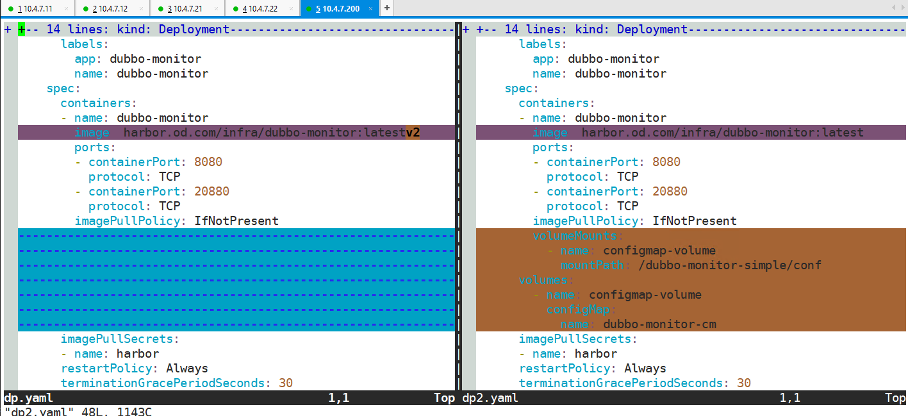

> 这里两个文件不同的地方，注意，这里的image的版本因为我的操作问题所以一个v2一个没有v，你的应该是都没有的

~~~
# 200机器，替换dp：
dubbo-monitor]# mv dp.yaml /tmp/
dubbo-monitor]# mv dp2.yaml dp.yaml
~~~

> **mv**：如果mv后是目录，则是移动，如果是文件名，则是更改名字

~~~
# 应用资源配置清单，22机器：
~]# kubectl apply -f http://k8s-yaml.od.com/dubbo-monitor/cm.yaml
~]# kubectl apply -f http://k8s-yaml.od.com/dubbo-monitor/dp.yaml
# 看一下相关容器有没有起来
~~~

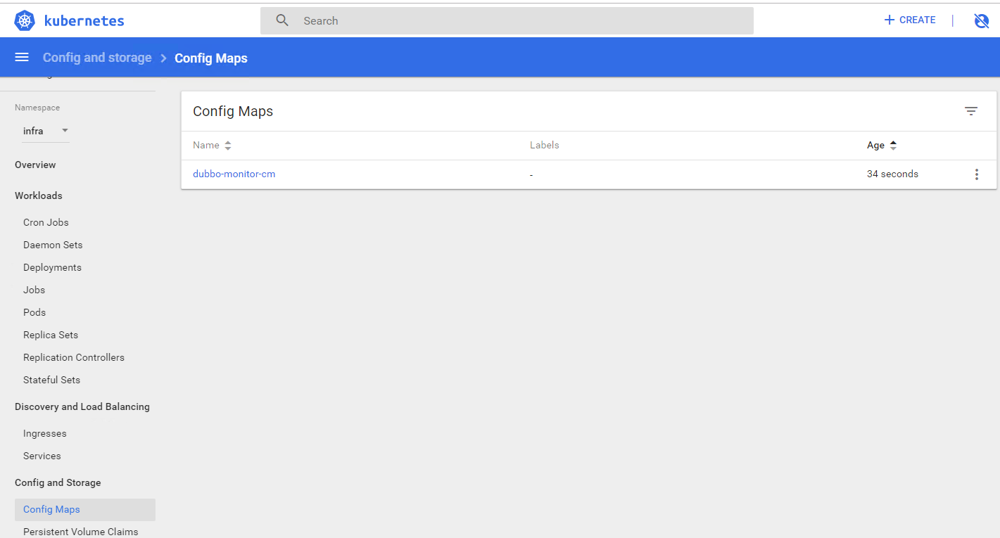


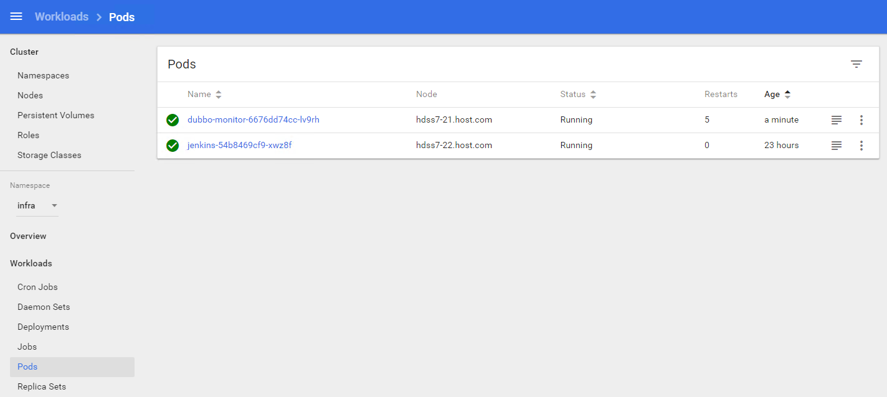

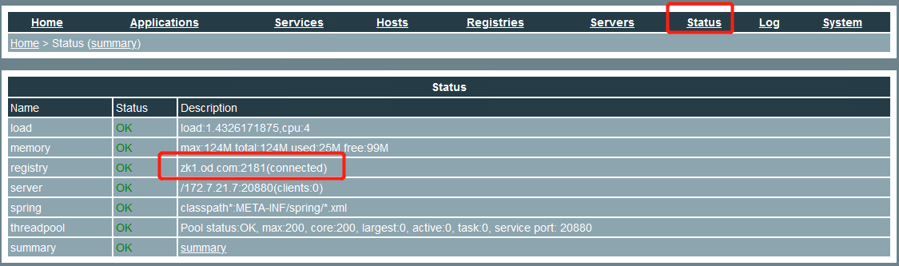

我们改成zk2

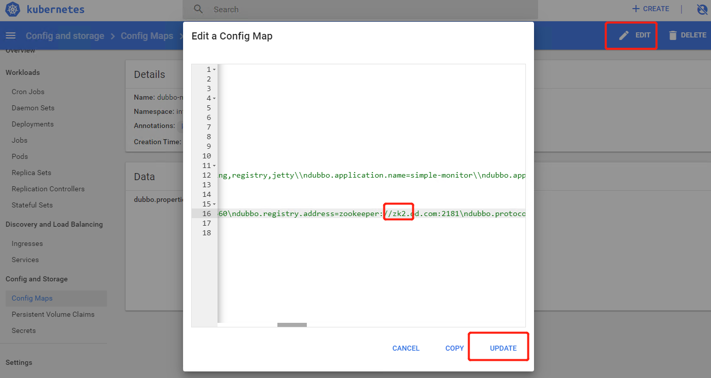

在删掉这个pod重启

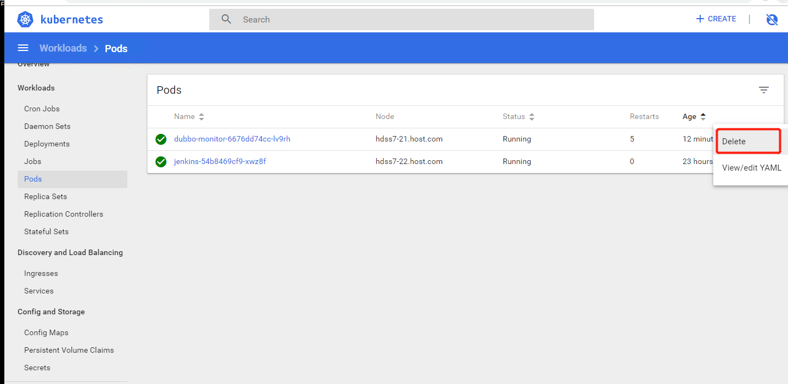

刷新页面变成zk2了

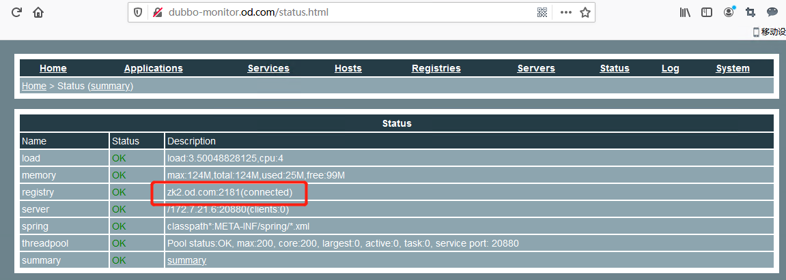

完成


#### 报错信息

> flannel重启报错问题

~~~
# flannel重启需要增加以下内容，添加在最下面:
21 ~]# vi /etc/sipervisord.d/flannel.ini
killasgroup=true
stopasgroup=true
~~~

#### 如何排错：

~~~
# 查看时间是否正常
date

# 查看kubernetes的报错
21 ~]# tail -fn 200/data/logs/kubernetes/kube-kubelet/kubelet.stdout.log

# 可以重启docker 和 kubelet
21 ~]# systemctl restart docker 
21 ~]# ps aux|grep kubelet
21 ~]# kill -9 id

# 查看supervisor的状态
21 ~]# supervisorctl status

# 查看路由状态，是否能ping通其它机器
21 ~]# route -n
21 ~]# ping 172.7.22.2

# 查看flannel情况
21 ~]# tail -fn 200 /data/logs/flanneld/flanneld.stdout.log
# 12flannel主机器上get网络，如果error则加入backend
12 ~]# ./etcdctl get /coreos.com/network/config

# 报错iptables，让机器一重启就自动使用，21/22机器
~]# service iptables save
# out: [ok]
~~~

#### cm对象的另一种创建方法（可不做）：

~~~
# 22机器：
cd /opt/kubernetes/server/bin/conf
# 当前目录下要又kubelet.kubeconfig的文件
conf]# kubectl create cm kubelet-cm --from-file=./kubelet.kubeconfig
#out: configmap/kubelet-cm created
~~~

可以在dashoboard的default名称空间下Config Maps看到

随后记得删除


#### 官方Apollo框架：

> **WHAT**：请参考[官方总体设计](https://www.apolloconfig.com/#/zh/design/apollo-design)，Apollo框架的特性也已经在上面跟Spring Cloud做了对比。更多的解释可以参考[官方特性文档](https://github.com/apolloconfig/apollo#features)
>
> **WHY**：用该框架实现比Spring Cloud更优的能力，更多对比可参考[Nacos、Apollo、Spring Cloud Config微服务配置中心对比](https://www.jianshu.com/p/2f0ae9c7f2e1)


#### 简化Apollo框架：

> **WHY**：
>
> 参考[官方微服务架构](https://mp.weixin.qq.com/s/-hUaQPzfsl9Lm3IqQW3VDQ)使用Apollo架构V1
>
> Meta Server：
>
> - Portal通过域名访问MetaServer获取AdminService的地址列表
> - Client通过域名访问MetaServer获取ConfigService的地址列表
> - 相当于一个Eureka Proxy
> - 逻辑角色，和ConfigService住在一起部署
>
> Eureka：
>
> - 用于服务发现和注册
> - Config/AdminService注册实例并定期报心跳
> - 和ConfigService住在一起部署
>
> 可以看到Eureka和Zookeeper是一样的功能，所以不再搭建重复的功能服务。
>
> 而为什么使用Zookeeper，总得来说Eureka基于AP保证高可用，遇到问题，时可以牺牲其一致性来保证系统服务的**高可用性**，既返回旧数据。Zookeeper基于CP，追求**数据一致性**。实际业务使用什么要基于业务考量。


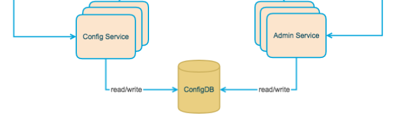

> Client通过推拉结合和ConfigService交互，然后ConfigService去拿ConfigDB里面的配置给Client端返回去。
>
> Portal是Apollo的一个仪表盘，通过调用AdminService去同步修改ConfigDB里面的配置
>
> 先交付ConfigService，然后交付AdminService，最后加portal


### 交付Apollo-ConfigService到K8S

[官网https://github.com/ctripcorp/apollo/](https://github.com/ctripcorp/apollo/)

##### 安装部署MySQL数据库（作为`ConfigDB`/`PortalDB`）

~~~~
# 更新yum源，11机器：
~]# vi /etc/yum.repos.d/MariaDB.repo
[mariadb]
name = MariaDB
baseurl = https://mirrors.ustc.edu.cn/mariadb/yum/10.1/centos7-amd64/
gpgkey=https://mirrors.ustc.edu.cn/mariadb/yum/RPM-GPG-KEY-MariaDB
gpgcheck=1

# 导入GPG-KEY
~]# rpm --import https://mirrors.ustc.edu.cn/mariadb/yum/RPM-GPG-KEY-MariaDB
~]# yum list mariadb --show-duplicates
# out: mariadb.x86_64
~]# yum makecache
# out:Metadata Cache Created
# 更新数据库版本
~]# yum list mariadb-server --show-duplicates
~]# yum install mariadb-server -y
# 编辑基础配置
# 增加部分内容
~] vi /etc/my.cnf.d/server.cnf
[mysqld]
character_set_server = utf8mb4
collation_server = utf8mb4_general_ci
init_connect = "SET NAMES 'utf8mb4'"
~~~~

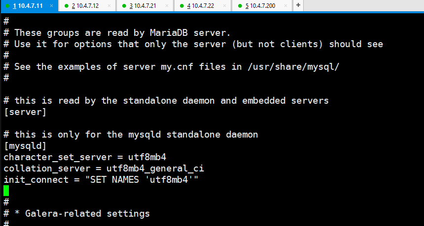

~~~
# 11机器，修改基础配置,并启动：
# 在改内容下增加，字符集
~]# vi /etc/my.cnf.d/mysql-clients.cnf
[mysql]
default-character-set = utf8mb4

~]# systemctl start mariadb
~~~

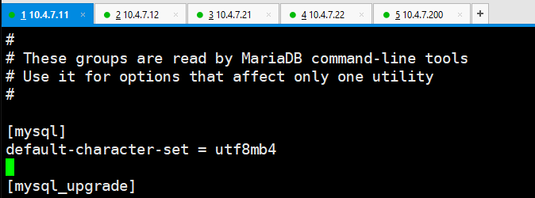

~~~
# 11机器，设置,mysql密码：
~]# mysqladmin -uroot password
# 这里是设置密码：123456
~]# mysql -uroot -p
# 这里是输入密码
none)]> \s
# 确定SERVER\DB\CLIENT\CONN 都是utf8
~~~

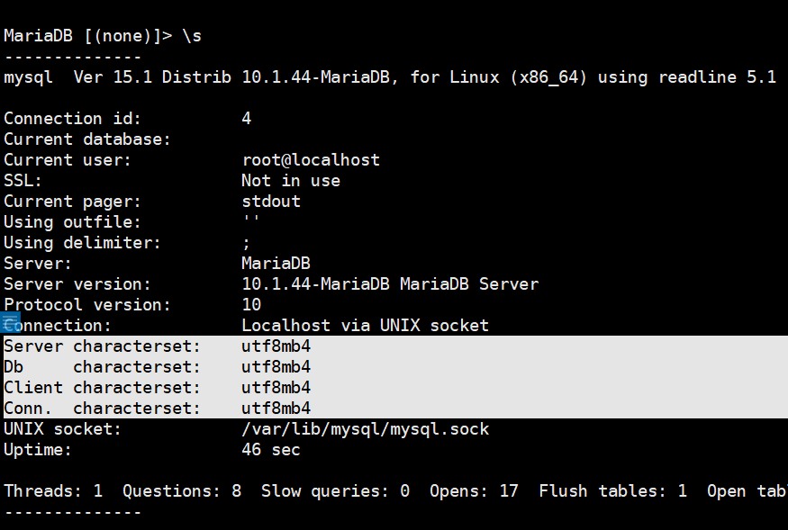

~~~
# 11机器：
none)]> show databases;
none)]> drop database test;
none)]> exit
# 查看数据库是否正常
~]# ps aux|grep mysql
~]# netstat luntp|grep 3306
~]# wget https://raw.githubusercontent.com/ctripcorp/apollo/1.5.1/scripts/db/migration/configdb/V1.0.0__initialization.sql -O apolloconfig.sql
~]# cat apolloconfig.sql
~]# mysql -uroot -p < apolloconfig.sql
# 输入密码
~] mysql -uroot -p
# 输密码
none)]> show databases;
~~~

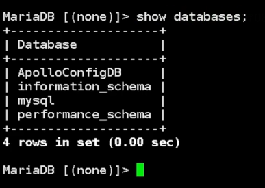

~~~
# 11机器，创建其它权限用户而不是直接给root权限：
none)]> use ApolloConfigDB;
ApolloConfigDB]> show tables;
ApolloConfigDB]> grant INSERT,DELETE,UPDATE,SELECT on ApolloConfigDB.* to 'apolloconfig'@'10.4.7.%' identified by "123456";
ApolloConfigDB]> select user,host from mysql.user;
~~~

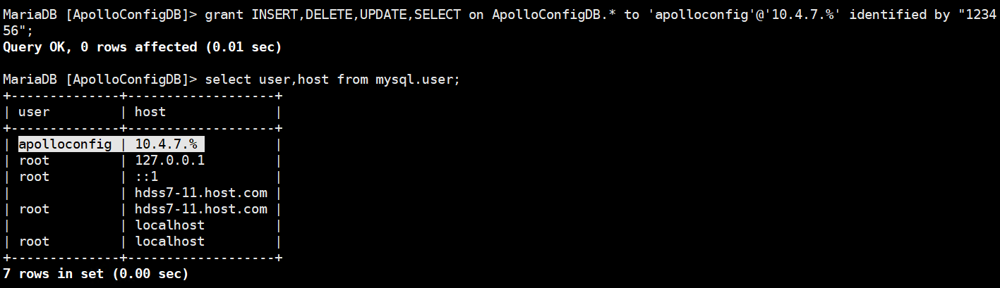

~~~
# 11机器,修改初始数据：
ApolloConfigDB]> show tables;
ApolloConfigDB]> select * from ServerConfig\G
ApolloConfigDB]> update ApolloConfigDB.ServerConfig set ServerConfig.Value="http://config.od.com/eureka" where ServerConfig.Key="eureka.service.url";
ApolloConfigDB]> select * from ServerConfig\G
~~~

原：

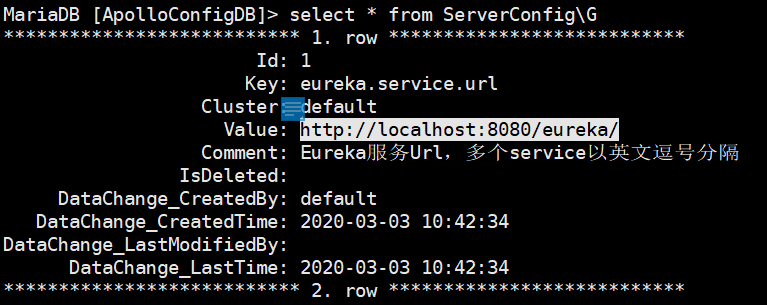

改后

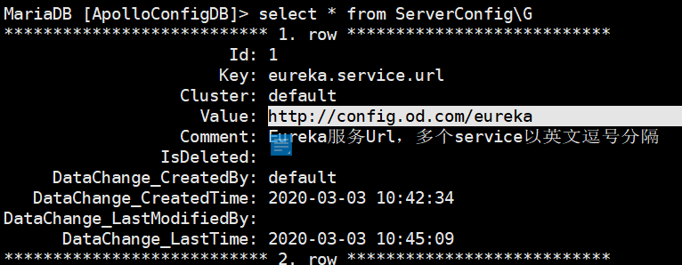

~~~
# 11机器，解析域名：
~]# vi /var/named/od.com.zone
serial 前滚一位
config             A    10.4.7.10

~]# systemctl restart named
~~~

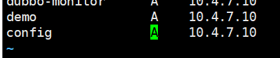

~~~
# 21机器，测试下21机器能不能查到(11机器是肯定能查到的)：
~]# dig -t A config.od.com @192.168.0.2 +short
# out:10.4.7.10
~~~

[包的官网地址](https://github.com/ctripcorp/apollo/releases/tag/v1.5.1)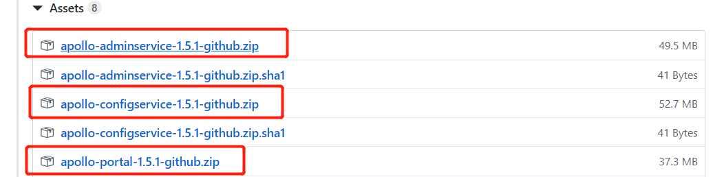

~~~
# 200机器，制作docker镜像：
cd /opt/src
src]# wget https://github.com/ctripcorp/apollo/releases/download/v1.5.1/apollo-configservice-1.5.1-github.zip
# 或者去官网下载或者用我的上传的包
src]# mkdir /data/dockerfile/apollo-configservice
src]# unzip -o apollo-configservice-1.5.1-github.zip -d /data/dockerfile/apollo-configservice
src]# cd /data/dockerfile/apollo-configservice/
apollo-configservice]# rm -rf apollo-configservice-1.5.1-sources.jar
apollo-configservice]# ll
~~~

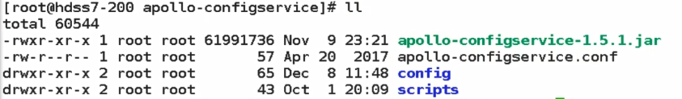

~~~
# 11机器，解析域名：
~]# vi /var/named/od.com.zone
serial 前滚一位
mysql              A    10.4.7.11

~]# systemctl restart named
~]# dig -t A mysql.od.com @10.4.7.11 +short
# out: 10.4.7.11
~~~

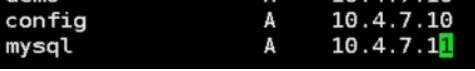

~~~~
# 200机器，修改账户密码：
cd /data/dockerfile/apollo-configservice/config
config]# vi application-github.properties
spring.datasource.url = jdbc:mysql://mysql.od.com:3306/ApolloConfigDB?characterEncoding=utf8
spring.datasource.username = apolloconfig
spring.datasource.password = 123456
~~~~

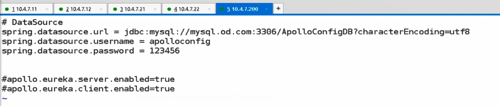

~~~
# 200机器：
cd /data/dockerfile/apollo-configservice/scripts
scripts]# rm -f shutdown.sh
# 全部删掉，换成以下内容
scripts]# vi startup.sh
#!/bin/bash
SERVICE_NAME=apollo-configservice
## Adjust log dir if necessary
LOG_DIR=/opt/logs/apollo-config-server
## Adjust server port if necessary
SERVER_PORT=8080
APOLLO_CONFIG_SERVICE_NAME=$(hostname -i)
SERVER_URL="http://${APOLLO_CONFIG_SERVICE_NAME}:${SERVER_PORT}"

## Adjust memory settings if necessary
export JAVA_OPTS="-Xms128m -Xmx128m -Xss256k -XX:MetaspaceSize=128m -XX:MaxMetaspaceSize=384m -XX:NewSize=256m -XX:MaxNewSize=256m -XX:SurvivorRatio=8"

## Only uncomment the following when you are using server jvm
#export JAVA_OPTS="$JAVA_OPTS -server -XX:-ReduceInitialCardMarks"

########### The following is the same for configservice, adminservice, portal ###########
export JAVA_OPTS="$JAVA_OPTS -XX:ParallelGCThreads=4 -XX:MaxTenuringThreshold=9 -XX:+DisableExplicitGC -XX:+ScavengeBeforeFullGC -XX:SoftRefLRUPolicyMSPerMB=0 -XX:+ExplicitGCInvokesConcurrent -XX:+HeapDumpOnOutOfMemoryError -XX:-OmitStackTraceInFastThrow -Duser.timezone=Asia/Shanghai -Dclient.encoding.override=UTF-8 -Dfile.encoding=UTF-8 -Djava.security.egd=file:/dev/./urandom"
export JAVA_OPTS="$JAVA_OPTS -Dserver.port=$SERVER_PORT -Dlogging.file=$LOG_DIR/$SERVICE_NAME.log -XX:HeapDumpPath=$LOG_DIR/HeapDumpOnOutOfMemoryError/"

# Find Java
if [[ -n "$JAVA_HOME" ]] && [[ -x "$JAVA_HOME/bin/java" ]]; then
    javaexe="$JAVA_HOME/bin/java"
elif type -p java > /dev/null 2>&1; then
    javaexe=$(type -p java)
elif [[ -x "/usr/bin/java" ]];  then
    javaexe="/usr/bin/java"
else
    echo "Unable to find Java"
    exit 1
fi

if [[ "$javaexe" ]]; then
    version=$("$javaexe" -version 2>&1 | awk -F '"' '/version/ {print $2}')
    version=$(echo "$version" | awk -F. '{printf("%03d%03d",$1,$2);}')
    # now version is of format 009003 (9.3.x)
    if [ $version -ge 011000 ]; then
        JAVA_OPTS="$JAVA_OPTS -Xlog:gc*:$LOG_DIR/gc.log:time,level,tags -Xlog:safepoint -Xlog:gc+heap=trace"
    elif [ $version -ge 010000 ]; then
        JAVA_OPTS="$JAVA_OPTS -Xlog:gc*:$LOG_DIR/gc.log:time,level,tags -Xlog:safepoint -Xlog:gc+heap=trace"
    elif [ $version -ge 009000 ]; then
        JAVA_OPTS="$JAVA_OPTS -Xlog:gc*:$LOG_DIR/gc.log:time,level,tags -Xlog:safepoint -Xlog:gc+heap=trace"
    else
        JAVA_OPTS="$JAVA_OPTS -XX:+UseParNewGC"
        JAVA_OPTS="$JAVA_OPTS -Xloggc:$LOG_DIR/gc.log -XX:+PrintGCDetails"
        JAVA_OPTS="$JAVA_OPTS -XX:+UseConcMarkSweepGC -XX:+UseCMSCompactAtFullCollection -XX:+UseCMSInitiatingOccupancyOnly -XX:CMSInitiatingOccupancyFraction=60 -XX:+CMSClassUnloadingEnabled -XX:+CMSParallelRemarkEnabled -XX:CMSFullGCsBeforeCompaction=9 -XX:+CMSClassUnloadingEnabled  -XX:+PrintGCDateStamps -XX:+PrintGCApplicationConcurrentTime -XX:+PrintHeapAtGC -XX:+UseGCLogFileRotation -XX:NumberOfGCLogFiles=5 -XX:GCLogFileSize=5M"
    fi
fi

printf "$(date) ==== Starting ==== \n"

cd `dirname $0`/..
chmod 755 $SERVICE_NAME".jar"
./$SERVICE_NAME".jar" start

rc=$?;

if [[ $rc != 0 ]];
then
    echo "$(date) Failed to start $SERVICE_NAME.jar, return code: $rc"
    exit $rc;
fi

tail -f /dev/null
~~~

> [Apollo官方文档](https://github.com/ctripcorp/apollo/blob/1.5.1/scripts/apollo-on-kubernetes/apollo-config-server/scripts/startup-kubernetes.sh)
>
> 上述代码是从Apollo官网拉下来的，不过第7行多了一行APOLLO_CONFIG_SERVICE_NAME=$(hostname -i)
>
> 其中export JAVA_OPTS修改了下资源，改小了

~~~
# 200机器，给权限：
scripts]# chmod u+x startup.sh
scripts]# ll
~~~


~~~
# 200机器，做dockerfile：
cd /data/dockerfile/apollo-configservice
apollo-configservice]# vi Dockerfile
FROM 909336740/jre8:8u112

ENV VERSION 1.5.1

RUN ln -sf /usr/share/zoneinfo/Asia/Shanghai /etc/localtime &&\
    echo "Asia/Shanghai" > /etc/timezone

ADD apollo-configservice-${VERSION}.jar /apollo-configservice/apollo-configservice.jar
ADD config/ /apollo-configservice/config
ADD scripts/ /apollo-configservice/scripts

CMD ["/apollo-configservice/scripts/startup.sh"]
~~~

> [参考Apollo官网文档](https://github.com/ctripcorp/apollo/blob/1.5.1/scripts/apollo-on-kubernetes/apollo-config-server/Dockerfile)


~~~
# 200机器,制作容器：
apollo-configservice]# docker build . -t harbor.od.com/infra/apollo-configservice:v1.5.1
apollo-configservice]# docker push harbor.od.com/infra/apollo-configservice:v1.5.1
~~~

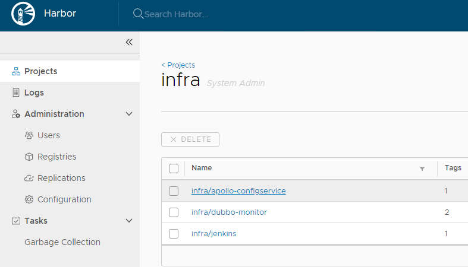

~~~
# 制作资源配置清单，200机器：
~]# mkdir /data/k8s-yaml/apollo-configservice
~]# cd /data/k8s-yaml/apollo-configservice
apollo-configservice]# vi cm.yaml
apiVersion: v1
kind: ConfigMap
metadata:
  name: apollo-configservice-cm
  namespace: infra
data:
  application-github.properties: |
    # DataSource
    spring.datasource.url = jdbc:mysql://mysql.od.com:3306/ApolloConfigDB?characterEncoding=utf8
    spring.datasource.username = apolloconfig
    spring.datasource.password = 123456
    eureka.service.url = http://config.od.com/eureka
  app.properties: |
    appId=100003171

apollo-configservice]# vi dp.yaml
kind: Deployment
apiVersion: extensions/v1beta1
metadata:
  name: apollo-configservice
  namespace: infra
  labels: 
    name: apollo-configservice
spec:
  replicas: 1
  selector:
    matchLabels: 
      name: apollo-configservice
  template:
    metadata:
      labels: 
        app: apollo-configservice 
        name: apollo-configservice
    spec:
      volumes:
      - name: configmap-volume
        configMap:
          name: apollo-configservice-cm
      containers:
      - name: apollo-configservice
        image: harbor.od.com/infra/apollo-configservice:v1.5.1
        ports:
        - containerPort: 8080
          protocol: TCP
        volumeMounts:
        - name: configmap-volume
          mountPath: /apollo-configservice/config
        terminationMessagePath: /dev/termination-log
        terminationMessagePolicy: File
        imagePullPolicy: IfNotPresent
      imagePullSecrets:
      - name: harbor
      restartPolicy: Always
      terminationGracePeriodSeconds: 30
      securityContext: 
        runAsUser: 0
      schedulerName: default-scheduler
  strategy:
    type: RollingUpdate
    rollingUpdate: 
      maxUnavailable: 1
      maxSurge: 1
  revisionHistoryLimit: 7
  progressDeadlineSeconds: 600

apollo-configservice]# vi svc.yaml
kind: Service
apiVersion: v1
metadata: 
  name: apollo-configservice
  namespace: infra
spec:
  ports:
  - protocol: TCP
    port: 8080
    targetPort: 8080
  selector: 
    app: apollo-configservice

apollo-configservice]# vi ingress.yaml
kind: Ingress
apiVersion: extensions/v1beta1
metadata: 
  name: apollo-configservice
  namespace: infra
spec:
  rules:
  - host: config.od.com
    http:
      paths:
      - path: /
        backend: 
          serviceName: apollo-configservice
          servicePort: 8080
~~~

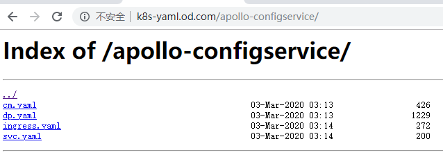

~~~
# 应用资源配置清单，22机器：
~]# kubectl apply -f http://k8s-yaml.od.com/apollo-configservice/cm.yaml
~]# kubectl apply -f http://k8s-yaml.od.com/apollo-configservice/dp.yaml
~]# kubectl apply -f http://k8s-yaml.od.com/apollo-configservice/svc.yaml
~]# kubectl apply -f http://k8s-yaml.od.com/apollo-configservice/ingress.yaml
~~~

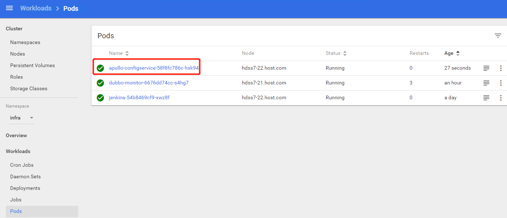

资源给的少，可能稍微慢了一些，点进去->点右上角的LOGS，日志有点多，记得点击右下角的翻页

[浏览器访问config.od.com](config.od.com)

鼠标对着起来的Apollo，可以看到右下角有网址

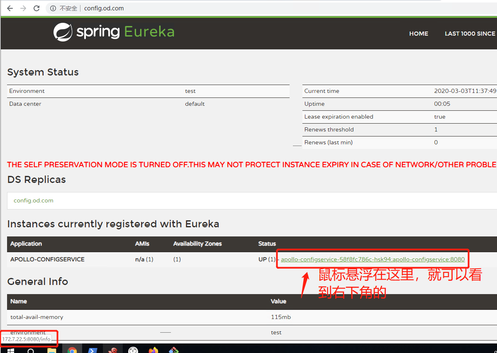

~~~
# 22机器，curl：
~]# curl http://172.7.22.5:8080/info
~~~


成功


### Apollo-ConfigService连接数据库IP分析

~~~
# 11机器：
~]# mysql -uroot -p
none)]> show processlist;
~~~

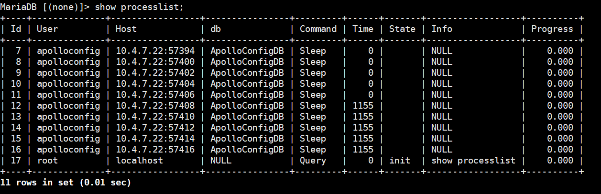

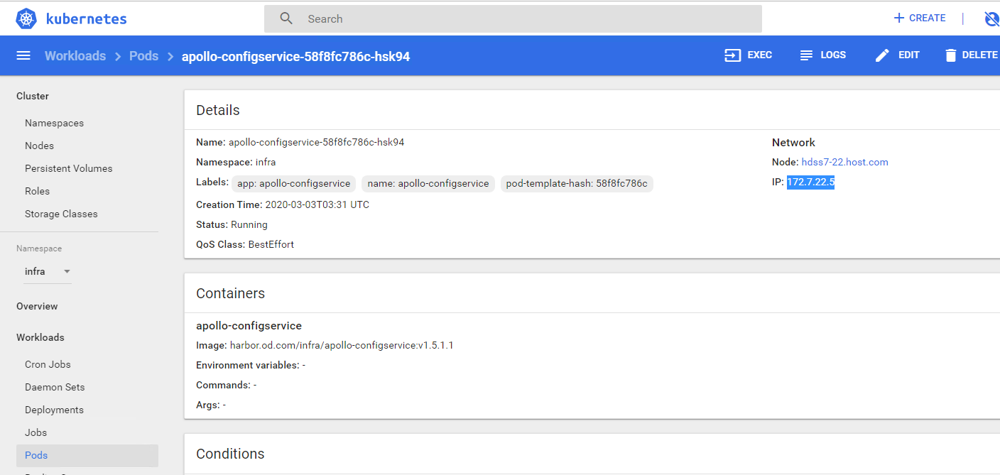

> 原本是172.7.22.5，连接到数据的是10.4.7.22，因为做了NAT转换，它带了面具
>


### 交付Apollo-adminservice

[官网下载https://github.com/ctripcorp/apollo/releases/tag/v1.5.1](https://github.com/ctripcorp/apollo/releases/tag/v1.5.1)

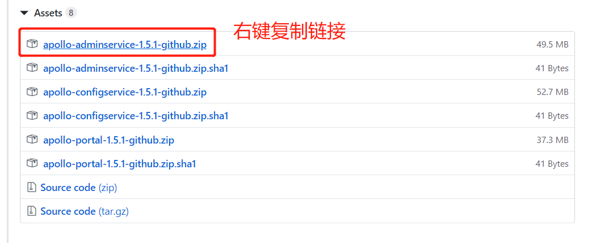

~~~
# 200机器：
cd /opt/src
src]# wget https://github.com/ctripcorp/apollo/releases/download/v1.5.1/apollo-adminservice-1.5.1-github.zip
src]# mkdir /data/dockerfile/apollo-adminservice
src]# unzip -o apollo-adminservice-1.5.1-github.zip -d /data/dockerfile/apollo-adminservice
src]# cd /data/dockerfile/apollo-adminservice
apollo-adminservice]# rm -fr apollo-adminservice-1.5.1-sources.jar
apollo-adminservice]# rm -f apollo-adminservice.conf
apollo-adminservice]# cd scripts/
scripts]# rm -f shutdown.sh
# 删掉原来的全部内容，添加以下新的内容
scripts]# vi startup.sh
#!/bin/bash
SERVICE_NAME=apollo-adminservice
## Adjust log dir if necessary
LOG_DIR=/opt/logs/apollo-admin-server
## Adjust server port if necessary
SERVER_PORT=8080
APOLLO_ADMIN_SERVICE_NAME=$(hostname -i)
# SERVER_URL="http://localhost:${SERVER_PORT}"
SERVER_URL="http://${APOLLO_ADMIN_SERVICE_NAME}:${SERVER_PORT}"

## Adjust memory settings if necessary
#export JAVA_OPTS="-Xms2560m -Xmx2560m -Xss256k -XX:MetaspaceSize=128m -XX:MaxMetaspaceSize=384m -XX:NewSize=1536m -XX:MaxNewSize=1536m -XX:SurvivorRatio=8"

## Only uncomment the following when you are using server jvm
#export JAVA_OPTS="$JAVA_OPTS -server -XX:-ReduceInitialCardMarks"

########### The following is the same for configservice, adminservice, portal ###########
export JAVA_OPTS="$JAVA_OPTS -XX:ParallelGCThreads=4 -XX:MaxTenuringThreshold=9 -XX:+DisableExplicitGC -XX:+ScavengeBeforeFullGC -XX:SoftRefLRUPolicyMSPerMB=0 -XX:+ExplicitGCInvokesConcurrent -XX:+HeapDumpOnOutOfMemoryError -XX:-OmitStackTraceInFastThrow -Duser.timezone=Asia/Shanghai -Dclient.encoding.override=UTF-8 -Dfile.encoding=UTF-8 -Djava.security.egd=file:/dev/./urandom"
export JAVA_OPTS="$JAVA_OPTS -Dserver.port=$SERVER_PORT -Dlogging.file=$LOG_DIR/$SERVICE_NAME.log -XX:HeapDumpPath=$LOG_DIR/HeapDumpOnOutOfMemoryError/"

# Find Java
if [[ -n "$JAVA_HOME" ]] && [[ -x "$JAVA_HOME/bin/java" ]]; then
    javaexe="$JAVA_HOME/bin/java"
elif type -p java > /dev/null 2>&1; then
    javaexe=$(type -p java)
elif [[ -x "/usr/bin/java" ]];  then
    javaexe="/usr/bin/java"
else
    echo "Unable to find Java"
    exit 1
fi

if [[ "$javaexe" ]]; then
    version=$("$javaexe" -version 2>&1 | awk -F '"' '/version/ {print $2}')
    version=$(echo "$version" | awk -F. '{printf("%03d%03d",$1,$2);}')
    # now version is of format 009003 (9.3.x)
    if [ $version -ge 011000 ]; then
        JAVA_OPTS="$JAVA_OPTS -Xlog:gc*:$LOG_DIR/gc.log:time,level,tags -Xlog:safepoint -Xlog:gc+heap=trace"
    elif [ $version -ge 010000 ]; then
        JAVA_OPTS="$JAVA_OPTS -Xlog:gc*:$LOG_DIR/gc.log:time,level,tags -Xlog:safepoint -Xlog:gc+heap=trace"
    elif [ $version -ge 009000 ]; then
        JAVA_OPTS="$JAVA_OPTS -Xlog:gc*:$LOG_DIR/gc.log:time,level,tags -Xlog:safepoint -Xlog:gc+heap=trace"
    else
        JAVA_OPTS="$JAVA_OPTS -XX:+UseParNewGC"
        JAVA_OPTS="$JAVA_OPTS -Xloggc:$LOG_DIR/gc.log -XX:+PrintGCDetails"
        JAVA_OPTS="$JAVA_OPTS -XX:+UseConcMarkSweepGC -XX:+UseCMSCompactAtFullCollection -XX:+UseCMSInitiatingOccupancyOnly -XX:CMSInitiatingOccupancyFraction=60 -XX:+CMSClassUnloadingEnabled -XX:+CMSParallelRemarkEnabled -XX:CMSFullGCsBeforeCompaction=9 -XX:+CMSClassUnloadingEnabled  -XX:+PrintGCDateStamps -XX:+PrintGCApplicationConcurrentTime -XX:+PrintHeapAtGC -XX:+UseGCLogFileRotation -XX:NumberOfGCLogFiles=5 -XX:GCLogFileSize=5M"
    fi
fi

printf "$(date) ==== Starting ==== \n"

cd `dirname $0`/..
chmod 755 $SERVICE_NAME".jar"
./$SERVICE_NAME".jar" start

rc=$?;

if [[ $rc != 0 ]];
then
    echo "$(date) Failed to start $SERVICE_NAME.jar, return code: $rc"
    exit $rc;
fi

tail -f /dev/null
~~~

> [startup.sh官方地址](https://github.com/ctripcorp/apollo/blob/1.5.1/scripts/apollo-on-kubernetes/apollo-admin-server/scripts/startup-kubernetes.sh)
>
> 修改处为：
>
> SERVER_PORT=8080  # 因为docker网络空间是互相隔离，用8080即可
>
> APOLLO_ADMIN_SERVICE_NAME=$(hostname -i)

~~~
# 200机器，制作dockerfile：
cd /data/dockerfile/apollo-adminservice
apollo-adminservice]# ll
apollo-adminservice]# vi Dockerfile
FROM 909336740/jre8:8u112

ENV VERSION 1.5.1

RUN ln -sf /usr/share/zoneinfo/Asia/Shanghai /etc/localtime &&\
    echo "Asia/Shanghai" > /etc/timezone

ADD apollo-adminservice-${VERSION}.jar /apollo-adminservice/apollo-adminservice.jar
ADD config/ /apollo-adminservice/config
ADD scripts/ /apollo-adminservice/scripts

CMD ["/apollo-adminservice/scripts/startup.sh"]

apollo-adminservice]# docker build . -t harbor.od.com/infra/apollo-adminservice:v1.5.1
apollo-adminservice]# docker push harbor.od.com/infra/apollo-adminservice:v1.5.1
~~~

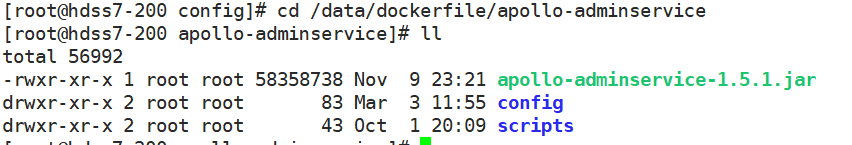

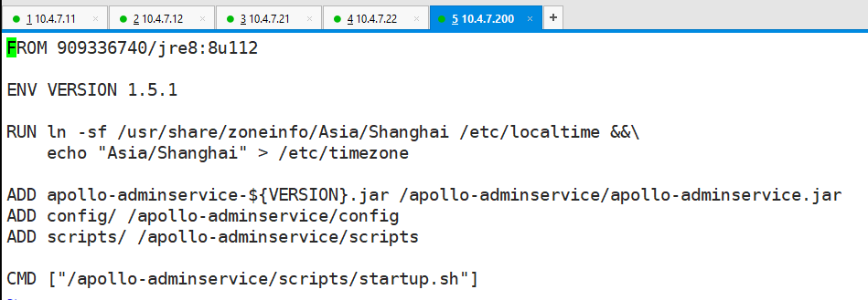

看以下harbor仓库有没有

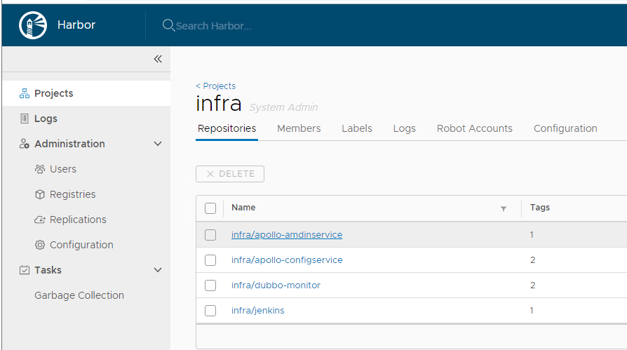

##### 重新复习一下交付过程：搞定镜像-搞定资源配置清单-应用资源配置清单

~~~
# 200机器，制作资源配置清单：
mkdir /data/k8s-yaml/apollo-adminservice
cd /data/k8s-yaml/apollo-adminservice
apollo-adminservice]# vi cm.yaml
apiVersion: v1
kind: ConfigMap
metadata:
  name: apollo-adminservice-cm
  namespace: infra
data:
  application-github.properties: |
    # DataSource
    spring.datasource.url = jdbc:mysql://mysql.od.com:3306/ApolloConfigDB?characterEncoding=utf8
    spring.datasource.username = apolloconfig
    spring.datasource.password = 123456
    eureka.service.url = http://config.od.com/eureka
  app.properties: |
    appId=100003172

apollo-adminservice]# vi dp.yaml
kind: Deployment
apiVersion: extensions/v1beta1
metadata:
  name: apollo-adminservice
  namespace: infra
  labels: 
    name: apollo-adminservice
spec:
  replicas: 1
  selector:
    matchLabels: 
      name: apollo-adminservice
  template:
    metadata:
      labels: 
        app: apollo-adminservice 
        name: apollo-adminservice
    spec:
      volumes:
      - name: configmap-volume
        configMap:
          name: apollo-adminservice-cm
      containers:
      - name: apollo-adminservice
        image: harbor.od.com/infra/apollo-adminservice:v1.5.1
        ports:
        - containerPort: 8080
          protocol: TCP
        volumeMounts:
        - name: configmap-volume
          mountPath: /apollo-adminservice/config
        terminationMessagePath: /dev/termination-log
        terminationMessagePolicy: File
        imagePullPolicy: IfNotPresent
      imagePullSecrets:
      - name: harbor
      restartPolicy: Always
      terminationGracePeriodSeconds: 30
      securityContext: 
        runAsUser: 0
      schedulerName: default-scheduler
  strategy:
    type: RollingUpdate
    rollingUpdate: 
      maxUnavailable: 1
      maxSurge: 1
  revisionHistoryLimit: 7
  progressDeadlineSeconds: 600
~~~

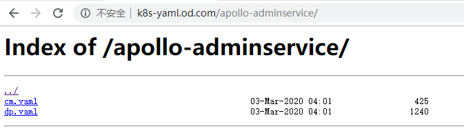

~~~
# 22机器，应用资源配置清单：
~]# kubectl apply -f http://k8s-yaml.od.com/apollo-adminservice/cm.yaml
~]# kubectl apply -f http://k8s-yaml.od.com/apollo-adminservice/dp.yaml
~~~


~~~
# 11机器，查看数据库连接IP：
~]# mysql -uroot -p
none)]> show processlist;
~~~

多了更多的22连接

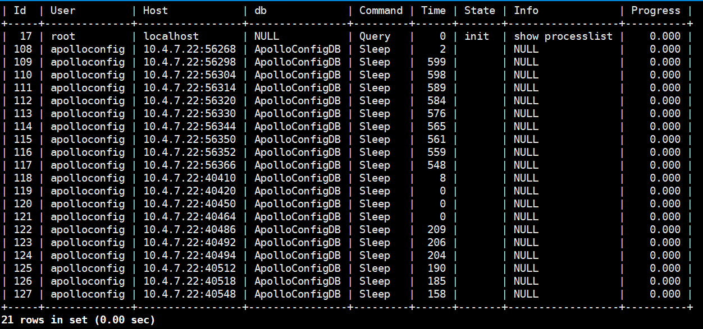

[config.od.com访问地址](config.od.com)

鼠标对着起来的Apollo，可以看到右下角有网址

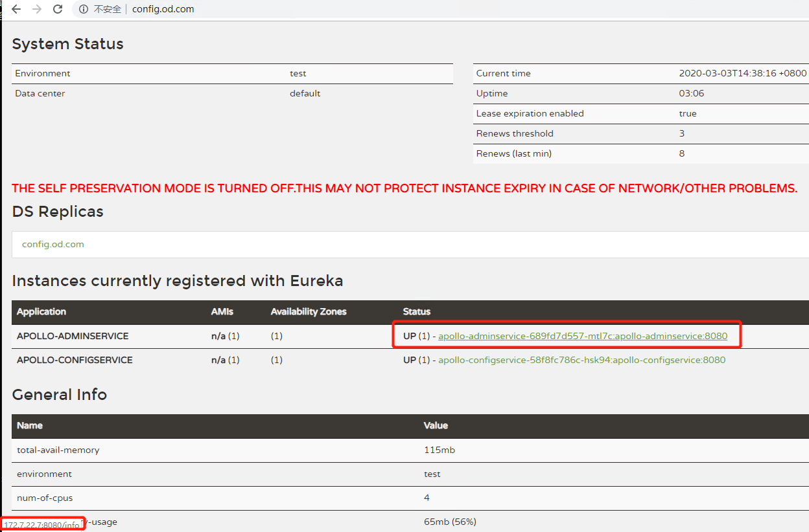

~~~
# 22机器，curl：
~]# curl http://172.7.22.7:8080/info
~~~

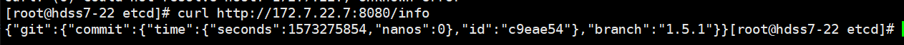

[^课外题1]: 交付完config和admin后，我们发现，交付到K8S里面的服务如此之容易，那么问题来了，交付到K8S和交付到物理机或者虚拟机里，那里有很大的区别，为什么K8S更好。
[^课外题2]: 尝试用点点点的方式在dashboard里面扩容adminservice和configservice


### 交付Apollo-Portal前，数据库初始化

[官网地址](https://github.com/ctripcorp/apollo/releases/tag/v1.5.1)

~~~
# 200机器，制作镜像-下载包并整理：
cd /opt/src/
~]# wget https://github.com/ctripcorp/apollo/releases/download/v1.5.1/apollo-portal-1.5.1-github.zip
src]# mkdir /data/dockerfile/apollo-portal
src]# unzip -o apollo-portal-1.5.1-github.zip -d /data/dockerfile/apollo-portal
src]# cd /data/dockerfile/apollo-portal
apollo-portal]# rm -f apollo-portal-1.5.1-sources.jar
apollo-portal]# rm -f apollo-portal.conf
apollo-portal]# rm -f scripts/shutdown.sh
~~~

[sql官网网址-需要raw](https://github.com/ctripcorp/apollo/blob/master/scripts/apollo-on-kubernetes/db/portal-db/apolloportaldb.sql)

~~~
# 11机器，数据库初始化：
~]# wget https://raw.githubusercontent.com/ctripcorp/apollo/master/scripts/apollo-on-kubernetes/db/portal-db/apolloportaldb.sql -O apolloportal.sql
~]# ll
~~~

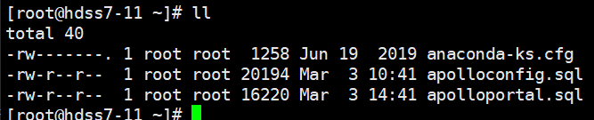

~~~
# 11机器：
~]# mysql -uroot -p
none)]> source ./apolloportal.sql
none)]> show databases;
none)]> use ApolloPortalDB
ApolloportalDB]> show tables;
ApolloportalDB]> grant INSERT,DELETE,UPDATE,SELECT on ApolloPortalDB.* to "apolloportal"@"10.4.7.%" identified by "123456";
ApolloportalDB]> select user,host from mysql.user;
ApolloportalDB]> select * from ServerConfig\G
ApolloportalDB]> update ServerConfig set Value='[{"orgId":"ben01","orgName":"Linux学院"},{"orgId":"ben02","orgName":"云计算学院"},{"orgId":"ben03","orgName":"Python学院"}]' where Id=2;
ApolloportalDB]> select * from ServerConfig\G
~~~

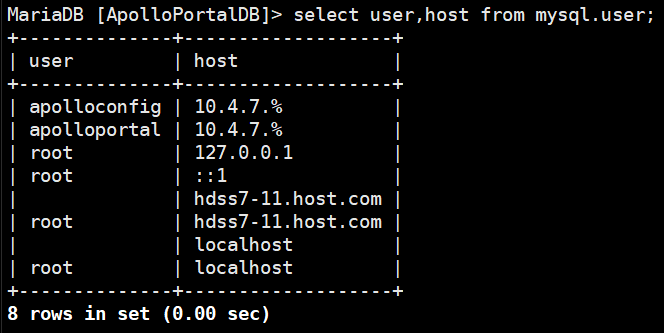

原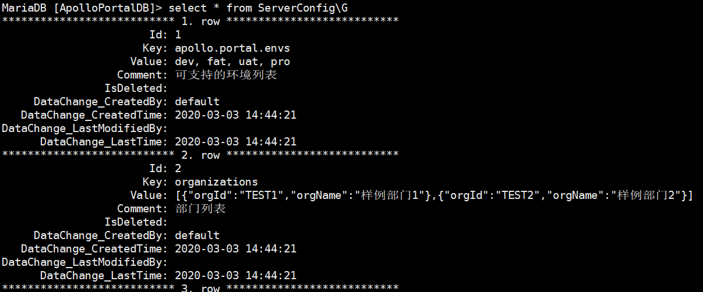

改后


完成


### 制作Portal的docker镜像，并交付

~~~
# 200机器，更新startup:
cd /data/dockerfile/apollo-portal/scripts/
# 全部删掉换成下面的
scripts]# vi startup.sh
#!/bin/bash
SERVICE_NAME=apollo-portal
## Adjust log dir if necessary
LOG_DIR=/opt/logs/apollo-portal-server
## Adjust server port if necessary
SERVER_PORT=8080
APOLLO_PORTAL_SERVICE_NAME=$(hostname -i)
# SERVER_URL="http://localhost:$SERVER_PORT"
SERVER_URL="http://${APOLLO_PORTAL_SERVICE_NAME}:${SERVER_PORT}"

## Adjust memory settings if necessary
#export JAVA_OPTS="-Xms2560m -Xmx2560m -Xss256k -XX:MetaspaceSize=128m -XX:MaxMetaspaceSize=384m -XX:NewSize=1536m -XX:MaxNewSize=1536m -XX:SurvivorRatio=8"

## Only uncomment the following when you are using server jvm
#export JAVA_OPTS="$JAVA_OPTS -server -XX:-ReduceInitialCardMarks"

########### The following is the same for configservice, adminservice, portal ###########
export JAVA_OPTS="$JAVA_OPTS -XX:ParallelGCThreads=4 -XX:MaxTenuringThreshold=9 -XX:+DisableExplicitGC -XX:+ScavengeBeforeFullGC -XX:SoftRefLRUPolicyMSPerMB=0 -XX:+ExplicitGCInvokesConcurrent -XX:+HeapDumpOnOutOfMemoryError -XX:-OmitStackTraceInFastThrow -Duser.timezone=Asia/Shanghai -Dclient.encoding.override=UTF-8 -Dfile.encoding=UTF-8 -Djava.security.egd=file:/dev/./urandom"
export JAVA_OPTS="$JAVA_OPTS -Dserver.port=$SERVER_PORT -Dlogging.file=$LOG_DIR/$SERVICE_NAME.log -XX:HeapDumpPath=$LOG_DIR/HeapDumpOnOutOfMemoryError/"

# Find Java
if [[ -n "$JAVA_HOME" ]] && [[ -x "$JAVA_HOME/bin/java" ]]; then
    javaexe="$JAVA_HOME/bin/java"
elif type -p java > /dev/null 2>&1; then
    javaexe=$(type -p java)
elif [[ -x "/usr/bin/java" ]];  then
    javaexe="/usr/bin/java"
else
    echo "Unable to find Java"
    exit 1
fi

if [[ "$javaexe" ]]; then
    version=$("$javaexe" -version 2>&1 | awk -F '"' '/version/ {print $2}')
    version=$(echo "$version" | awk -F. '{printf("%03d%03d",$1,$2);}')
    # now version is of format 009003 (9.3.x)
    if [ $version -ge 011000 ]; then
        JAVA_OPTS="$JAVA_OPTS -Xlog:gc*:$LOG_DIR/gc.log:time,level,tags -Xlog:safepoint -Xlog:gc+heap=trace"
    elif [ $version -ge 010000 ]; then
        JAVA_OPTS="$JAVA_OPTS -Xlog:gc*:$LOG_DIR/gc.log:time,level,tags -Xlog:safepoint -Xlog:gc+heap=trace"
    elif [ $version -ge 009000 ]; then
        JAVA_OPTS="$JAVA_OPTS -Xlog:gc*:$LOG_DIR/gc.log:time,level,tags -Xlog:safepoint -Xlog:gc+heap=trace"
    else
        JAVA_OPTS="$JAVA_OPTS -XX:+UseParNewGC"
        JAVA_OPTS="$JAVA_OPTS -Xloggc:$LOG_DIR/gc.log -XX:+PrintGCDetails"
        JAVA_OPTS="$JAVA_OPTS -XX:+UseConcMarkSweepGC -XX:+UseCMSCompactAtFullCollection -XX:+UseCMSInitiatingOccupancyOnly -XX:CMSInitiatingOccupancyFraction=60 -XX:+CMSClassUnloadingEnabled -XX:+CMSParallelRemarkEnabled -XX:CMSFullGCsBeforeCompaction=9 -XX:+CMSClassUnloadingEnabled  -XX:+PrintGCDateStamps -XX:+PrintGCApplicationConcurrentTime -XX:+PrintHeapAtGC -XX:+UseGCLogFileRotation -XX:NumberOfGCLogFiles=5 -XX:GCLogFileSize=5M"
    fi
fi

printf "$(date) ==== Starting ==== \n"

cd `dirname $0`/..
chmod 755 $SERVICE_NAME".jar"
./$SERVICE_NAME".jar" start

rc=$?;

if [[ $rc != 0 ]];
then
    echo "$(date) Failed to start $SERVICE_NAME.jar, return code: $rc"
    exit $rc;
fi

tail -f /dev/null
~~~

> [portal_startup官网地址](https://github.com/ctripcorp/apollo/blob/1.5.1/scripts/apollo-on-kubernetes/apollo-portal-server/scripts/startup-kubernetes.sh)
>
> 仅有以下两处不同：
>
> SERVER_PORT=8080
> APOLLO_PORTAL_SERVICE_NAME=$(hostname -i)

~~~
# 200机器，制作dockerfile：
cd /data/dockerfile/apollo-portal/
apollo-portal]# vi Dockerfile
FROM 909336740/jre8:8u112

ENV VERSION 1.5.1

RUN ln -sf /usr/share/zoneinfo/Asia/Shanghai /etc/localtime &&\
    echo "Asia/Shanghai" > /etc/timezone

ADD apollo-portal-${VERSION}.jar /apollo-portal/apollo-portal.jar
ADD config/ /apollo-portal/config
ADD scripts/ /apollo-portal/scripts

CMD ["/apollo-portal/scripts/startup.sh"]

apollo-portal]# docker build . -t harbor.od.com/infra/apollo-portal:v1.5.1
apollo-portal]# docker push harbor.od.com/infra/apollo-portal:v1.5.1
~~~

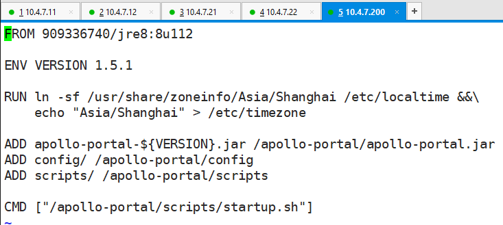

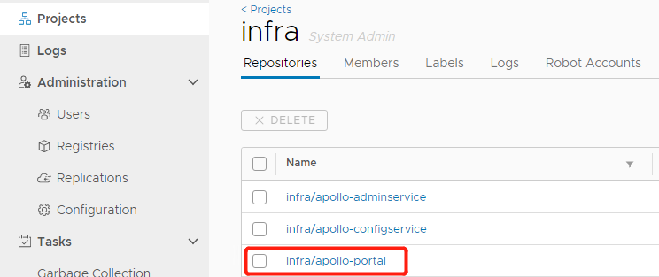

~~~
# 200机器：
mkdir /data/k8s-yaml/apollo-portal
cd /data/k8s-yaml/apollo-portal
apollo-portal]# vi cm.yaml
apiVersion: v1
kind: ConfigMap
metadata:
  name: apollo-portal-cm
  namespace: infra
data:
  application-github.properties: |
    # DataSource
    spring.datasource.url = jdbc:mysql://mysql.od.com:3306/ApolloPortalDB?characterEncoding=utf8
    spring.datasource.username = apolloportal
    spring.datasource.password = 123456
  app.properties: |
    appId=100003173
  apollo-env.properties: |
    dev.meta=http://config.od.com

apollo-portal]# vi dp.yaml
kind: Deployment
apiVersion: extensions/v1beta1
metadata:
  name: apollo-portal
  namespace: infra
  labels: 
    name: apollo-portal
spec:
  replicas: 1
  selector:
    matchLabels: 
      name: apollo-portal
  template:
    metadata:
      labels: 
        app: apollo-portal 
        name: apollo-portal
    spec:
      volumes:
      - name: configmap-volume
        configMap:
          name: apollo-portal-cm
      containers:
      - name: apollo-portal
        image: harbor.od.com/infra/apollo-portal:v1.5.1
        ports:
        - containerPort: 8080
          protocol: TCP
        volumeMounts:
        - name: configmap-volume
          mountPath: /apollo-portal/config
        terminationMessagePath: /dev/termination-log
        terminationMessagePolicy: File
        imagePullPolicy: IfNotPresent
      imagePullSecrets:
      - name: harbor
      restartPolicy: Always
      terminationGracePeriodSeconds: 30
      securityContext: 
        runAsUser: 0
      schedulerName: default-scheduler
  strategy:
    type: RollingUpdate
    rollingUpdate: 
      maxUnavailable: 1
      maxSurge: 1
  revisionHistoryLimit: 7
  progressDeadlineSeconds: 600

apollo-portal]# vi svc.yaml
kind: Service
apiVersion: v1
metadata: 
  name: apollo-portal
  namespace: infra
spec:
  ports:
  - protocol: TCP
    port: 8080
    targetPort: 8080
  selector: 
    app: apollo-portal

apollo-portal]# vi ingress.yaml
kind: Ingress
apiVersion: extensions/v1beta1
metadata: 
  name: apollo-portal
  namespace: infra
spec:
  rules:
  - host: portal.od.com
    http:
      paths:
      - path: /
        backend: 
          serviceName: apollo-portal
          servicePort: 8080
~~~

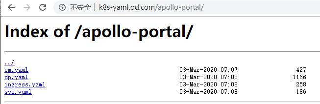

~~~
# 11机器，解析域名：
~]# vi /var/named/od.com.zone
serial 前滚一位
portal             A    10.4.7.10

~]# systemctl restart named
~]# dig -t A portal.od.com @10.4.7.11 +short
# out: 10.4.7.10
~~~

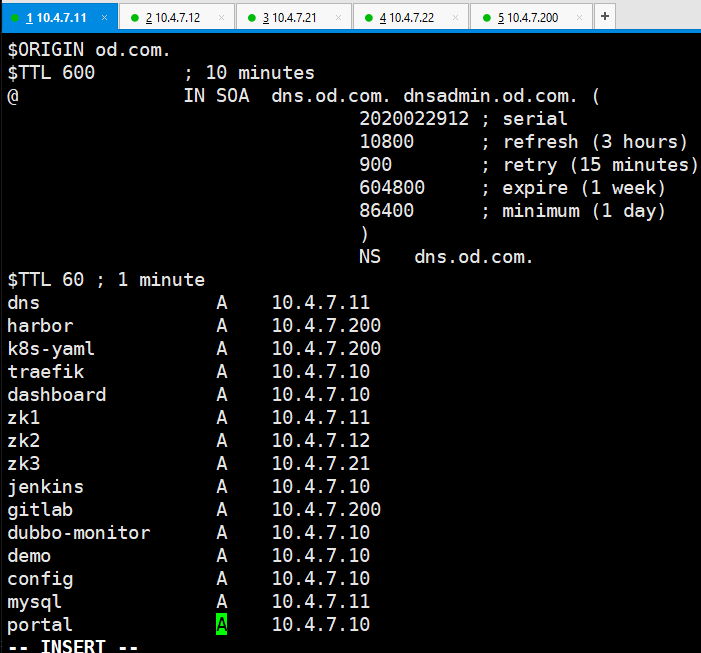

~~~
# 22机器，应用资源配置清单：
~]# kubectl apply -f http://k8s-yaml.od.com/apollo-portal/cm.yaml
~]# kubectl apply -f http://k8s-yaml.od.com/apollo-portal/dp.yaml
~]# kubectl apply -f http://k8s-yaml.od.com/apollo-portal/svc.yaml
~]# kubectl apply -f http://k8s-yaml.od.com/apollo-portal/ingress.yaml
~~~

可以查看起来的portal的logs日志，可能稍微有些慢

[浏览器输入portal.od.com](portal.od.com)

```
Username: apollo
Password: admin
```

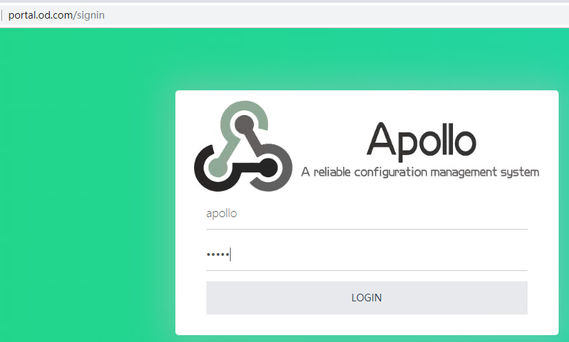

> 第一件事，修改密码，任何开源软件的第一件事，就是修改默认密码
>

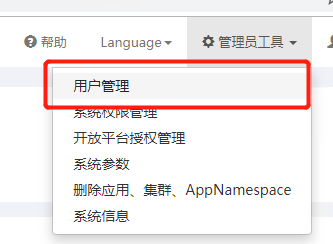

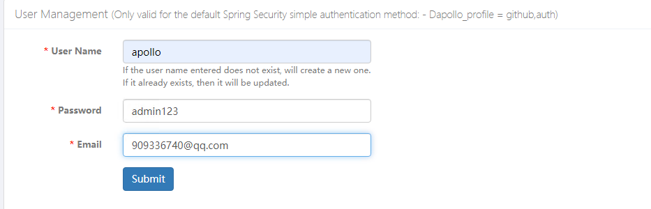


去看一下对接数据库情况

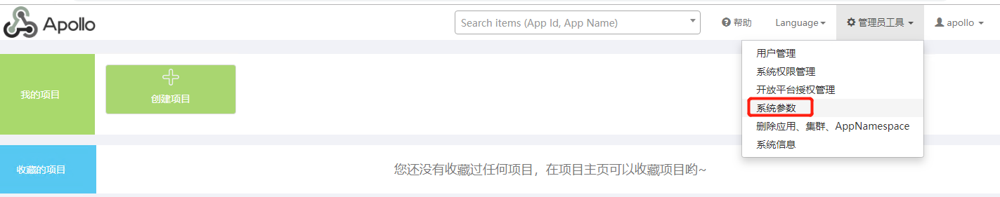

~~~

~~~

试试查询，查询key，也试试使用保存更新

~~~
key:organizations
value:[{"orgId":"ben01","orgName":"Linux学院"},{"orgId":"ben02","orgName":"云计算学院"},{"orgId":"ben03","orgName":"Python学院"},{"orgId":"ben03","orgName":"大数据学院"}]
~~~

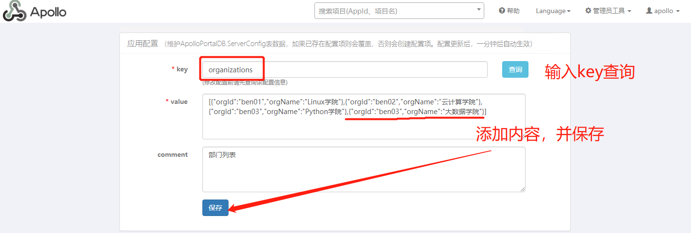

~~~
# 11机器，查询是否更新：
~]# mysql -uroot -p
none)]> use ApolloPortalDB;
ApolloPortalDB]> select * from ServerConfig\G
~~~

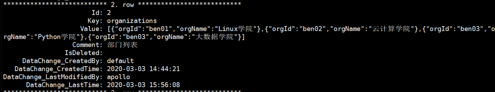

成功

使用Apollo，创建项目，提交

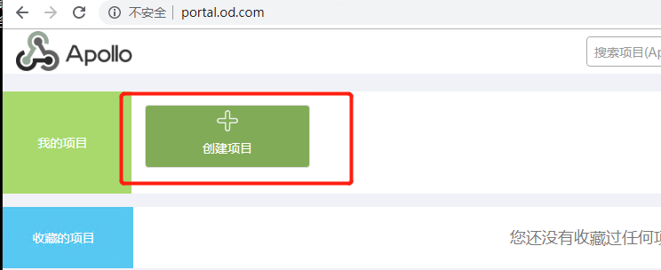

~~~
# 填入对应参数，并提交：
AppId:dubbo-demo-service
~~~

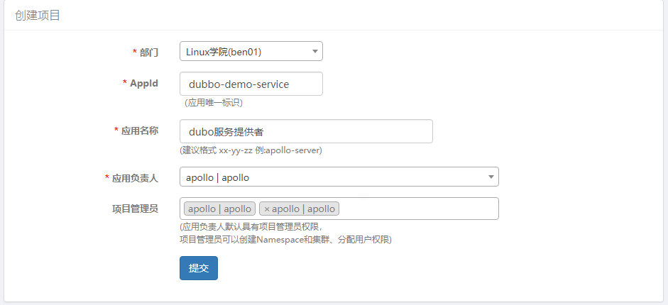

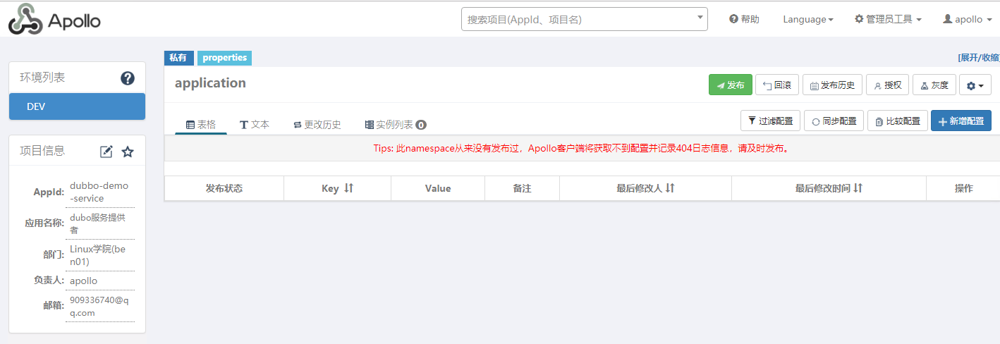

完成


### dubbo服务提供者连接Apollo实战

首先我们在git新建一个Apollo分支，以下是操作方法

**git创建分支并上传代码（或者直接fork我），注意，下图配的是gitlab里面web的，现在你要操作的是自己git的service，因为service没截图，所以我用web的替代**

1. 切换身份

   ~~~
   # 上传项目的文件夹打开，然后cd到附近的新建的apollo文件夹，克隆项目并切换身份：
   $ git http://gitlab.od.com:10000/909336740/dubbo-demo-web.git
   $ cd dubbo-demo-web/
   $ git branch apollo
   $ git checkout apollo
   ~~~

   

   将Apollo分支的文件全部拉来这个文件夹，选择替换重名文件

   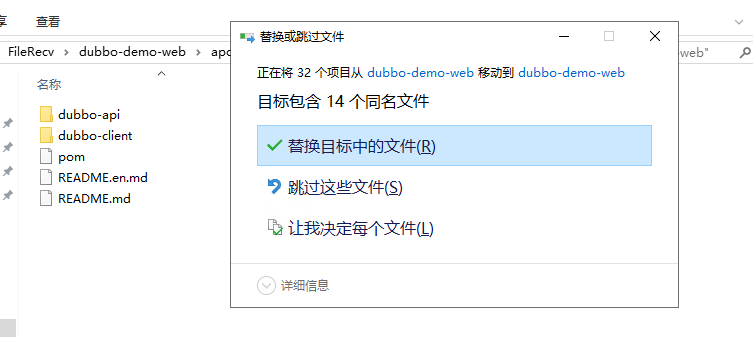

2. 把apollo的代码全部拉过去覆盖，并上传代码

   ~~~
   $ git add .
   $ git commit -m "apollo commit#1"
   $ git push -u origin apollo
   ~~~

   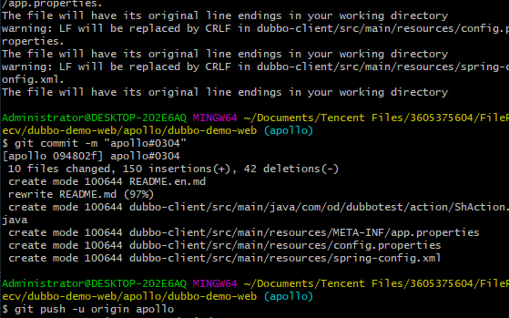

   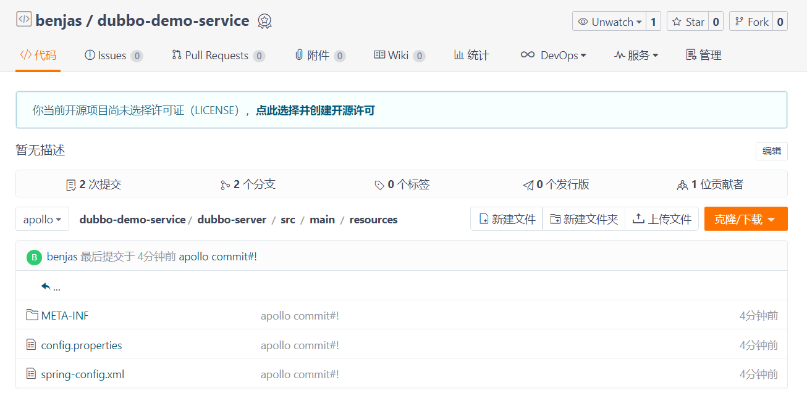

   完成，当然你可以直接fork我的

   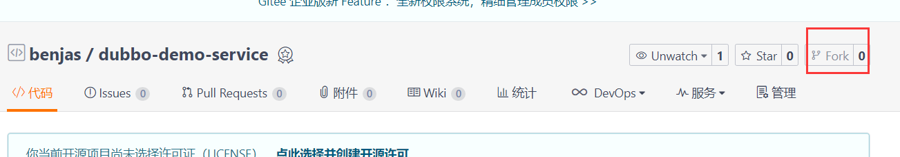


#### 继续主线

在Apollo portal里创建相应两个配置项


新增配置项，并提交

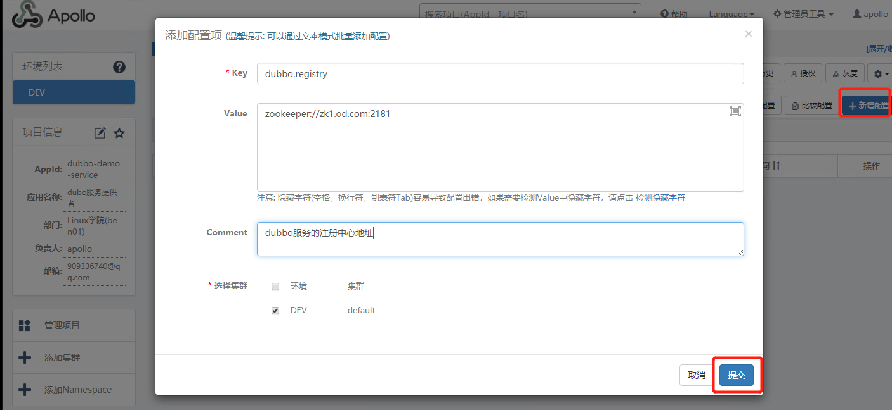

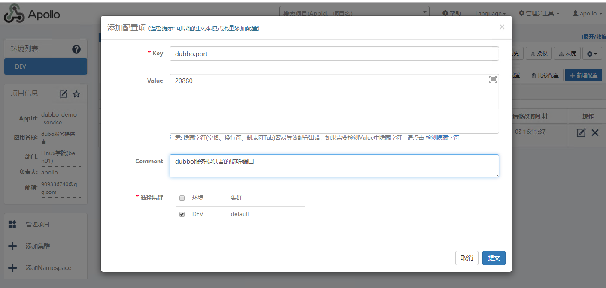

发布

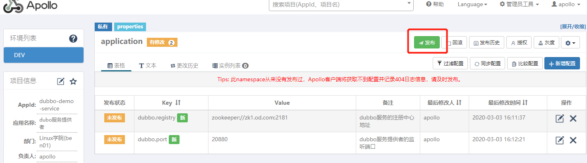

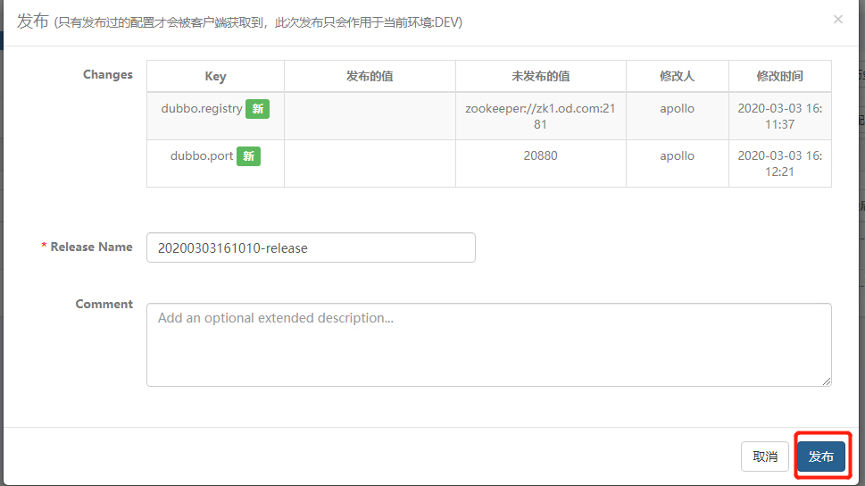

我们已经配置好了，然后需要用Jenkins制作镜像

~~~
# 填入对应参数
app_name: dubbo-demo-service
image_name: app/dubbo-demo-service
git_repo: https://gitee.com/benjas/dubbo-demo-service.git
git_ver: apollo
add_tag: 200303_1615
target_dir: ./dubbo-server/target
base_image: base/jre8:8u112
~~~

> 注意，我这里用的是gitlab，因为网络问题，你用自己的公网git即可


去#38的console里查看情况

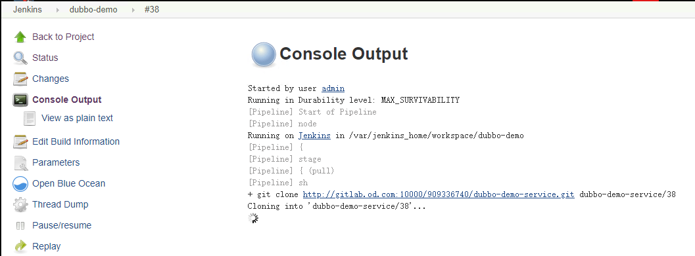

#### 报错问题：


该报错的原因是mirrors没有改对

~~~
# 200机器：
cd /data/nfs-volume/jenkins_home/maven-3.6.1-8u232/conf
conf]# vi settings.xml
~~~

修改完上面的内容后保存再去重新构建


#### 继续主线

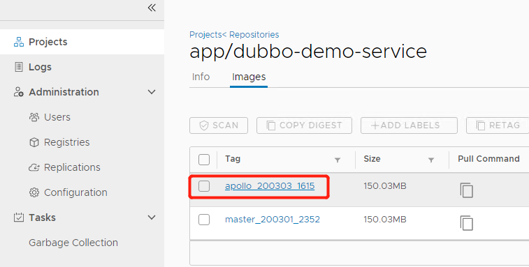

镜像制作完成

~~~
# 200机器，修改指定的镜像，并添加部分内容：
cd /data/k8s-yaml/dubbo-demo-service/
dubbo-demo-service]# vi dp.yaml
        image: harbor.od.com/app/dubbo-demo-service:apollo_200303_1615
        ports:
        - containerPort: 20880
          protocol: TCP
        env:
        - name: JAR_BALL
          value: dubbo-server.jar
        - name: C_OPTS
          value: -Denv=dev -Dapollo.meta=http://config.od.com
        imagePullPolicy: IfNotPresent
~~~

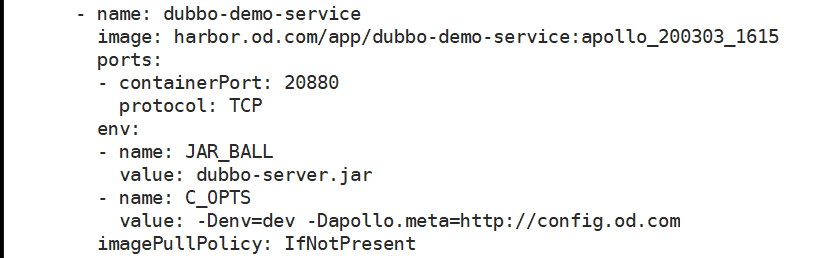

~~~
# 22机器，应用：
~]# kubectl apply -f http://k8s-yaml.od.com/dubbo-demo-service/dp.yaml
# out: deployment.extensions/dubbo-demo-service configured
~~~

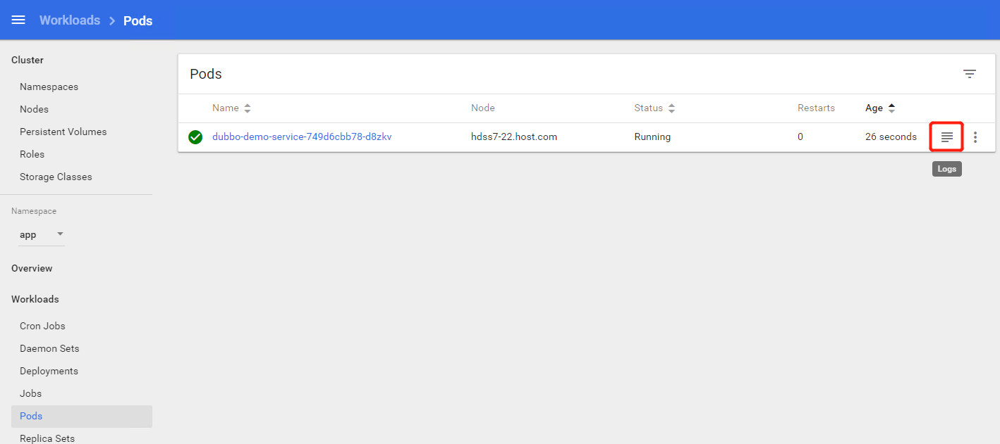

去LOGS查看，可以看到连接了Apollo

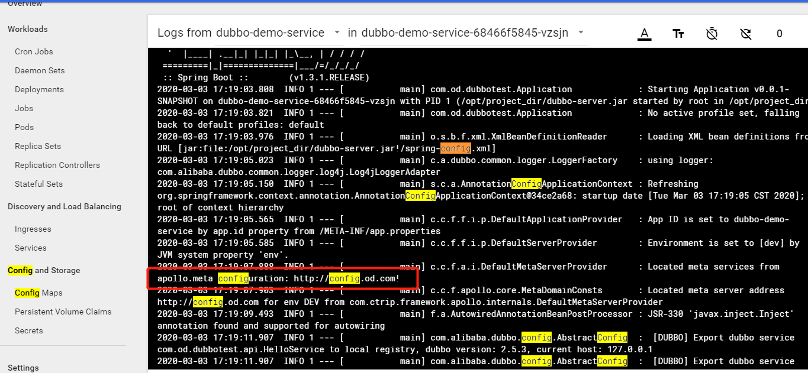

> PS：这里的pod名字你可能觉得不一样，因为我镜像弄错了，重新改了一遍

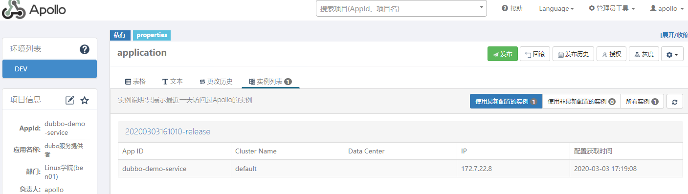

当你把service扩容成两个后

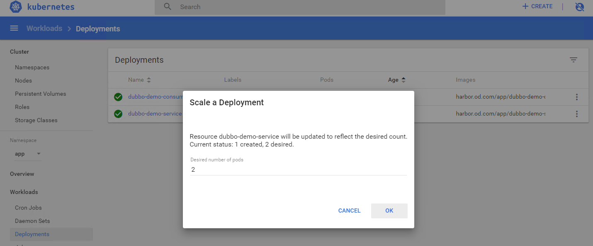

可以看到变成两个实例

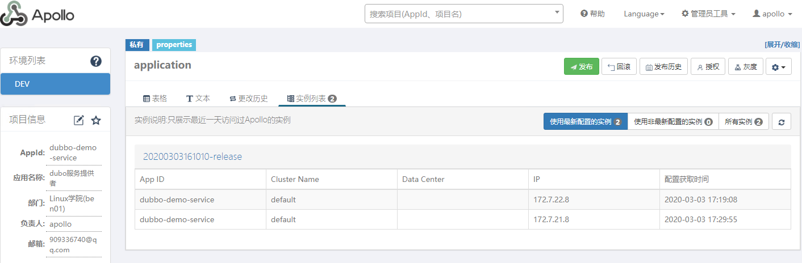

在monitor里可以看到端口是20880（注意必须连接的是zk1，怎么修改上面有，先改cm，然后删掉pod让它自动重启）

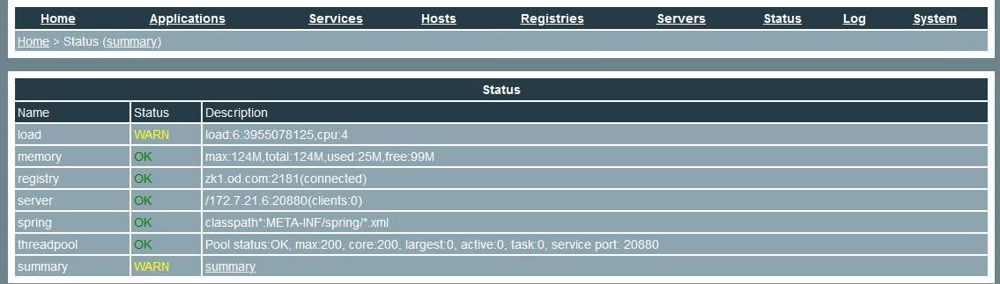

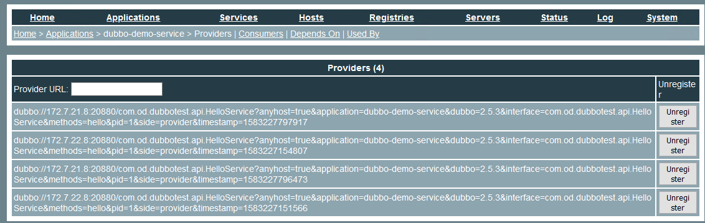

我们去Apollo改一下端口，改成20881，并发布

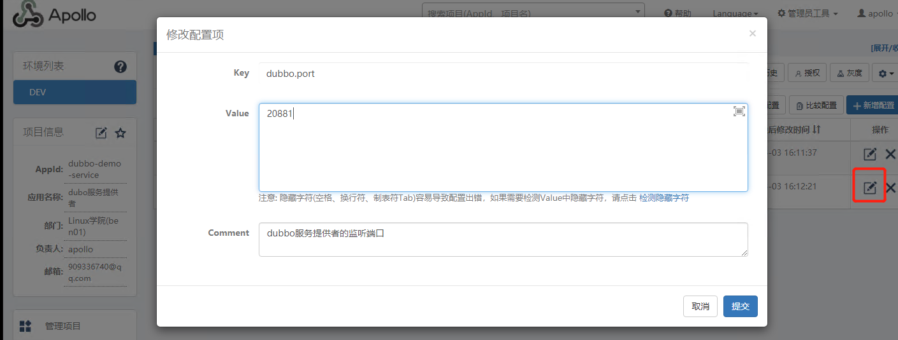

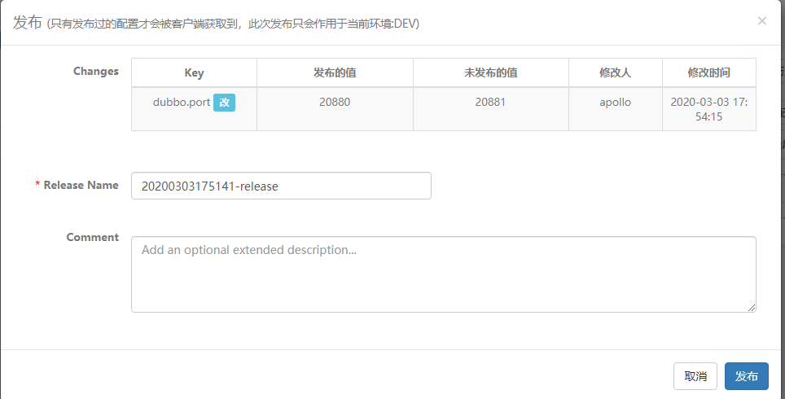

重启两个service的pods（就是删掉让它们自动重启）


刷新dubbo-monitor，可以看到端口已经变成20881

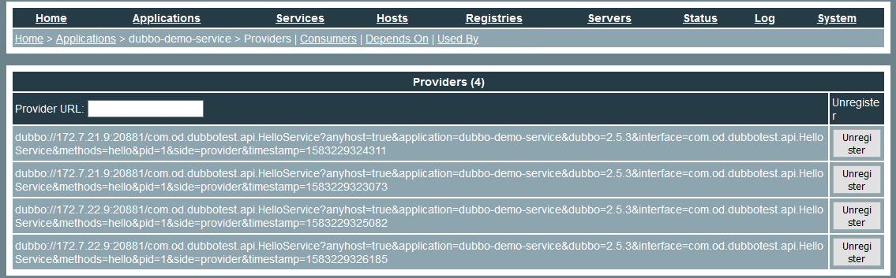

还可以改成zk2

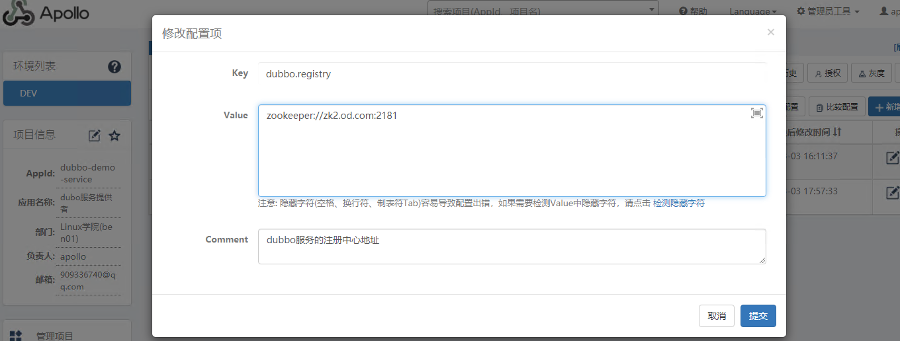

> 作业：改成zk2后，需要删掉对应的pod，然后让其也在zk2，然后还需要把monitor也改成zk2，方法在上面有。这个作业一定要做，不然下面会报错，具体是哪里报错我会提示

最后我改回来了20880端口，但是依然用的zk2

完成


### dubbo服务消费者连接Apollo实战

同样，我是有Apollo分支的，操作方法和上面的service服务一样

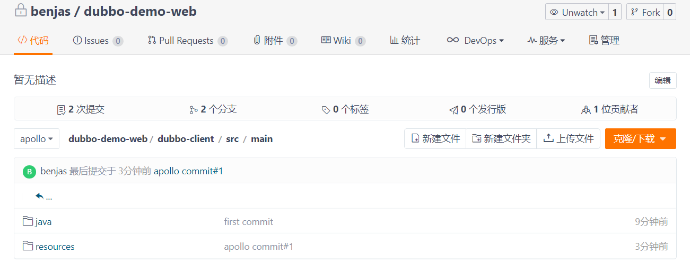

创建项目

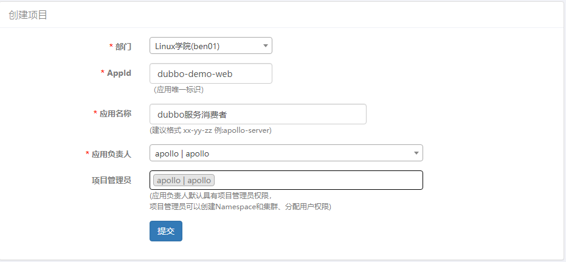

新增配置，并发布


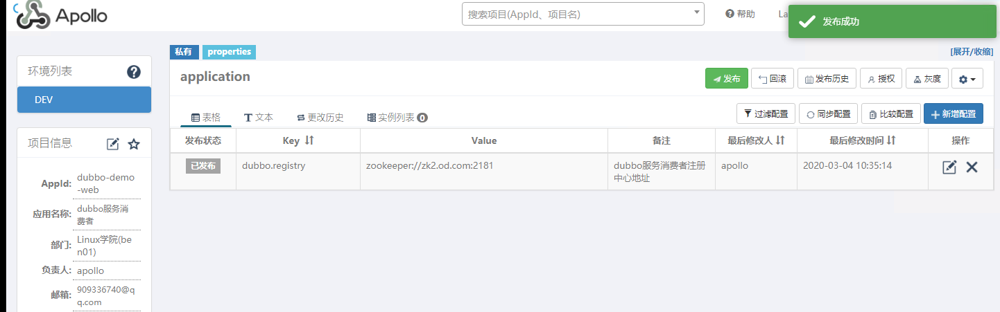

用Jenkins构建dubbo消费者

~~~
# 填入对应参数
app_name: dubbo-demo-consumer
image_name: app/dubbo-demo-consumer
git_repo: http://gitlab.od.com:10000/909336740/dubbo-demo-web.git
git_ver: apollo
add_tag: 200304_1040
target_dir: ./dubbo-client/target
base_image: base/jre8:8u112
~~~

> 注意，我这里用的是gitlab，因为网络问题，你用自己的公网git即可

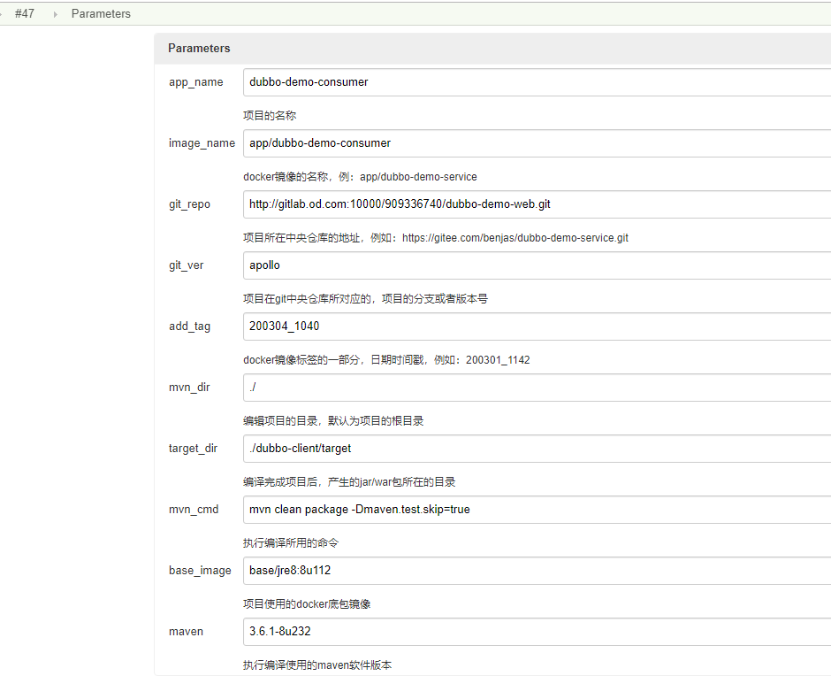

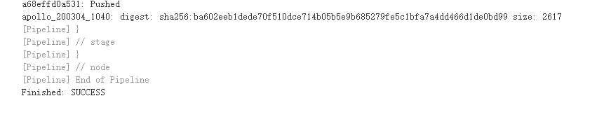

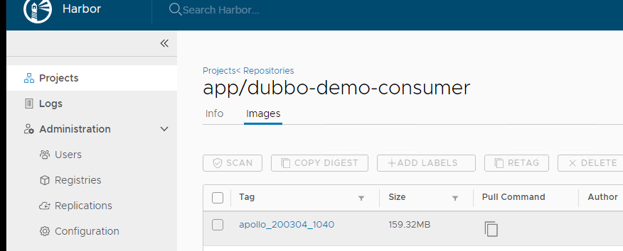

~~~
# 200机器，修改配置：
cd /data/k8s-yaml/dubbo-demo-consumer/
dubbo-demo-consumer]# vi dp.yaml
        image: harbor.od.com/app/dubbo-demo-service:apollo_200304_1040
        ports:
        - containerPort: 8080
          protocol: TCP
        - containerPort: 20880
          protocol: TCP
        env:
        - name: JAR_BALL
          value: dubbo-client.jar
        - name: C_OPTS
          value: -Denv=dev -Dapollo.meta=http://config.od.com
        imagePullPolicy: IfNotPresent
~~~


~~~
# 应用资源配置清单，22机器：
~]# kubectl apply -f http://k8s-yaml.od.com/dubbo-demo-consumer/dp.yaml
# out: deployment.extensions/dubbo-demo-consumer configured
~~~

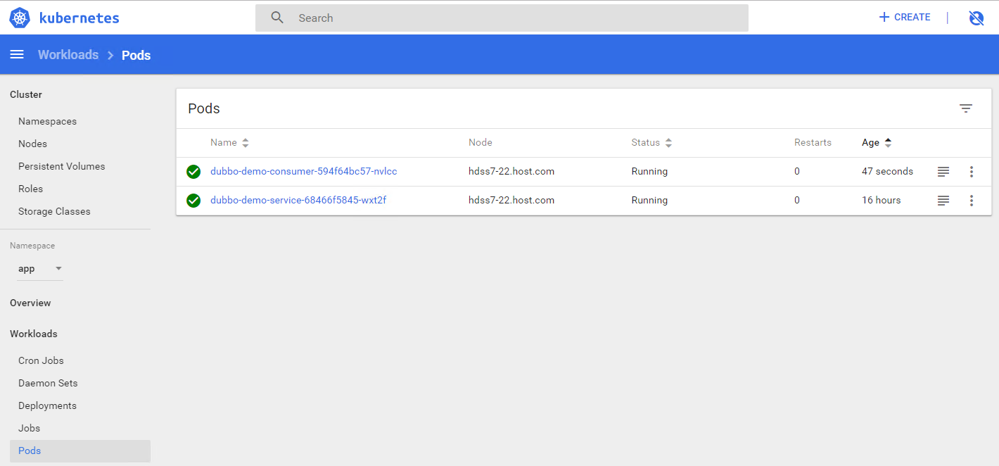

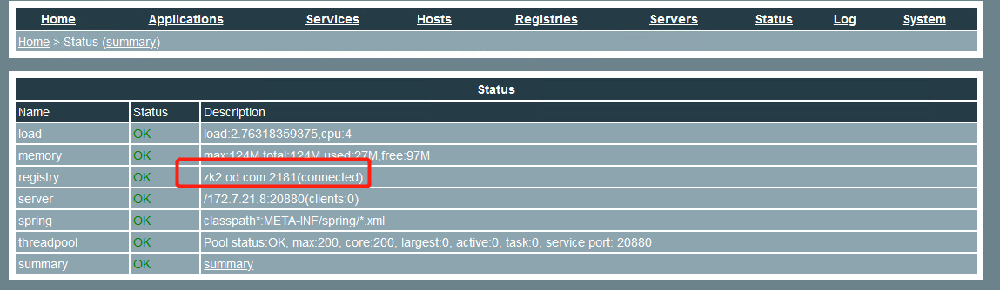

再去Applications可以看到已经起来了

~~~
# 浏览器访问demo.od.com/hello?name=apollo
~~~

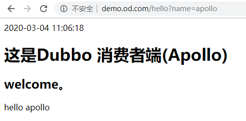

> 如果你登录的是这个界面，那么你没有做作业：改service的zk1成zk2，这个consumer已经是zk2的，而service还是zk1，当然不能响应
>
> 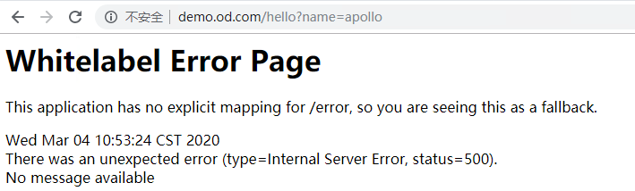


#### 实现代码迭代

修改代码，然后commit

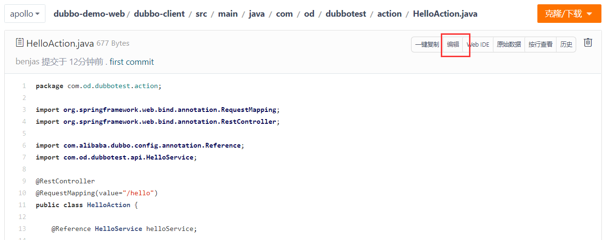

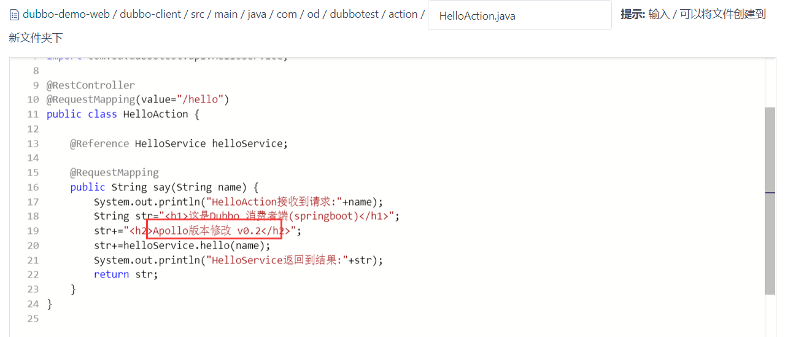

Jenkins构建

~~~
# 填入对应参数
app_name: dubbo-demo-consumer
image_name: app/dubbo-demo-consumer
git_repo: http://gitlab.od.com:10000/909336740/dubbo-demo-web.git
git_ver: apollo
add_tag: 200304_1145
target_dir: ./dubbo-client/target
base_image: base/jre8:8u112
~~~

> 注意，我这里用的是gitlab，因为网络问题，你用自己的公网git即可

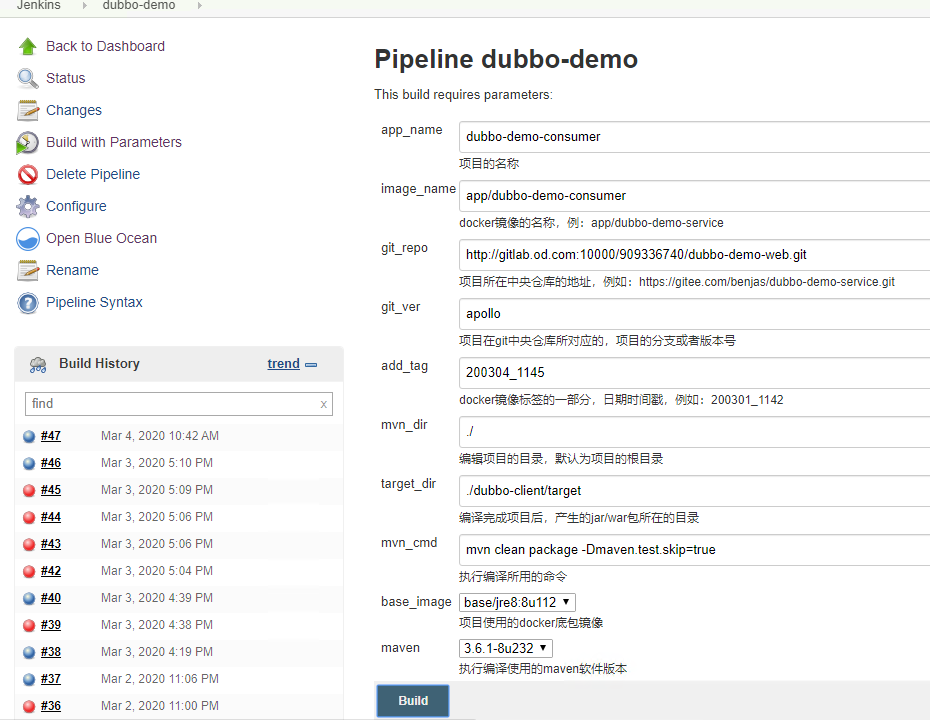

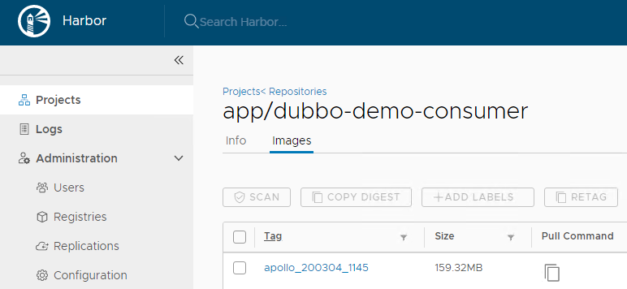

~~~
# 200机器修改使用的镜像：
cd /data/k8s-yaml/dubbo-demo-consumer/
dubbo-demo-consumer]# vi dp.yaml
image: harbor.od.com/app/dubbo-demo-service:apollo_191208_1640
~~~


~~~
# 22机器应用：
~]# kubectl apply -f http://k8s-yaml.od.com/dubbo-demo-consumer/dp.yaml
# out: deployment.extensions/dubbo-demo-consumer configured
~~~

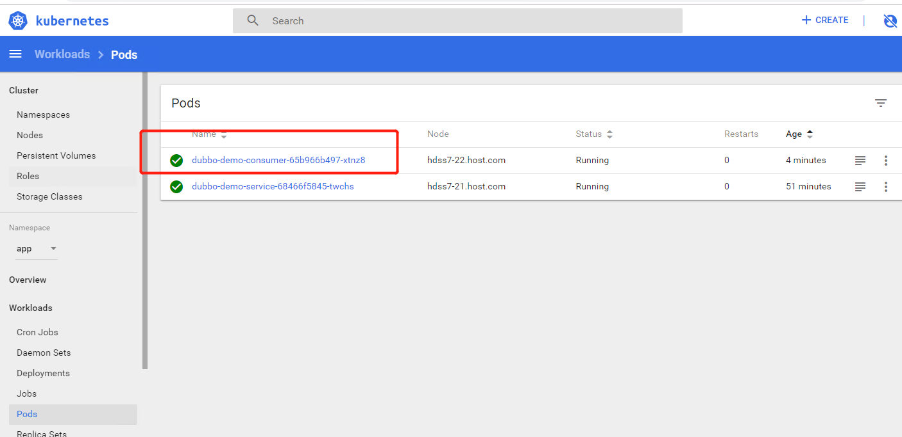

~~~
# 浏览器访问demo.od.com/hello?name=apollo
~~~

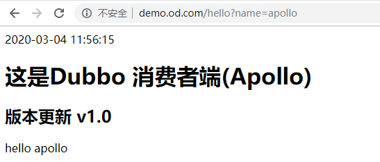


### 实战Apollo分环境管理dubbo服务-交付Apollo-configservice

> 我们要实现测试环境和生产环境只需要打包一个镜像
>

先开始分环境

~~~
# 11机器，解析域名：
~]# vi /var/named/od.com.zone
serial 前滚一位
zk-test            A    10.4.7.11
zk-prod            A    10.4.7.12

~]# systemctl restart named
~]# dig -t A zk-test.od.com +short
# out: 10.4.7.11
~]# dig -t A zk-prod.od.com +short
# out: 10.4.7.12
~~~

关闭deployment里的消费者和服务者（改成scale 0，先消费者后服务者）


~~~
# 创建两个名称空间， 21机器：
~]# kubectl create ns test
# out:namespace/test created
~]# kubectl create secret docker-registry harbor --docker-server=harbor.od.com --docker-username=admin --docker-password=Harbor12345 -n test
# out:secret/harbor created
~]# kubectl create ns prod
# out:namespace/prod created
~]# kubectl create secret docker-registry harbor --docker-server=harbor.od.com --docker-username=admin --docker-password=Harbor12345 -n prod
# out:secret/harbor created
~~~

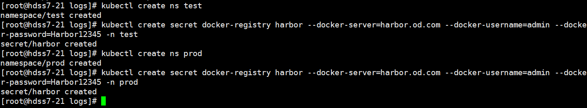

去看一下dashboard里面的Namespaces

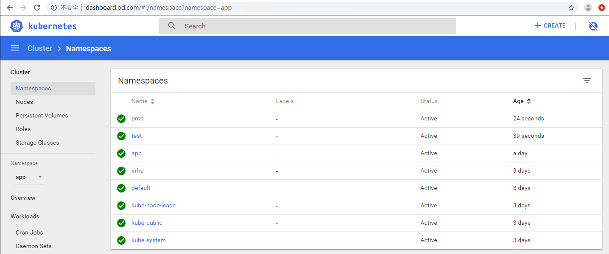

把admin、portal、config都scale成0

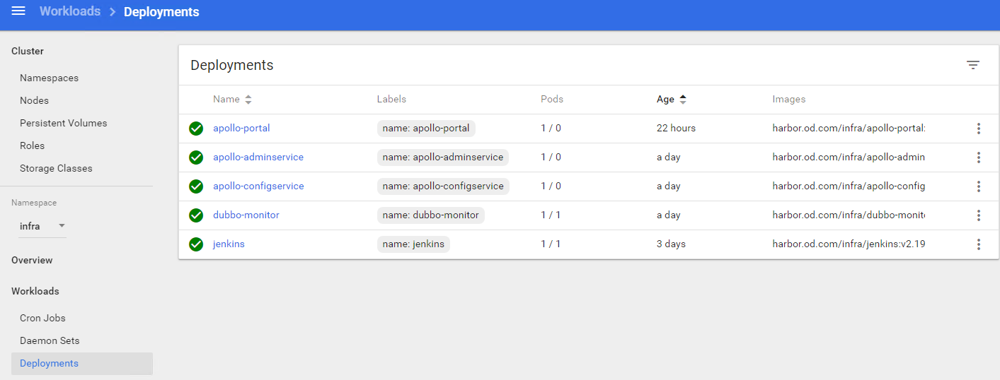

~~~
# 11机器，建库：
~]# vi apolloconfig.sql
# 增加Test关键字
~~~

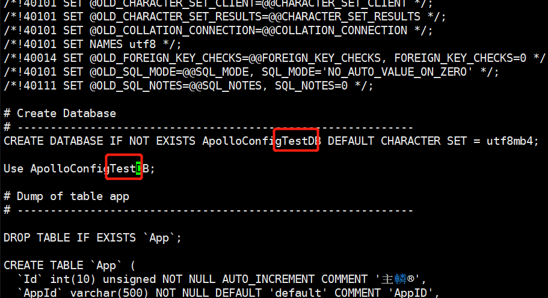

~~~
# 11机器，测试环境：
~]# mysql -uroot -p < apolloconfig.sql
~]# mysql -uroot -p
none)]> show databases;
none)]> use ApolloConfigTestDB;
ApolloConfigTestDB]> select * from ServerConfig\G
ApolloConfigTestDB]> update ApolloConfigTestDB.ServerConfig set ServerConfig.Value="http://config-test.od.com/eureka" where ServerConfig.Key="eureka.service.url";
ApolloConfigTestDB]> select * from ServerConfig\G
ApolloConfigTestDB]> grant INSERT,DELETE,UPDATE,SELECT on ApolloConfigTestDB.* to "apolloconfig"@"10.4.7.%" identified by "123456";
~~~

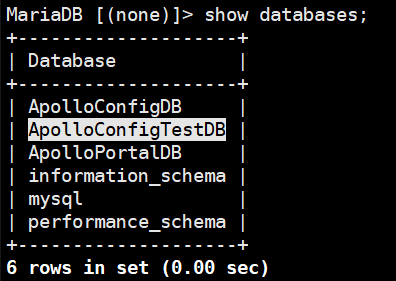

~~~
# 11机器，生产环境：
~]# vi apolloconfig.sql
# 修改成Prod关键字
~]# mysql -uroot -p < apolloconfig.sql
~]# mysql -uroot -p
none)]> show databases;
none)]> use ApolloConfigProdDB;
ApolloConfigProdDB]> select * from ServerConfig\G
ApolloConfigProdDB]> update ApolloConfigProdDB.ServerConfig set ServerConfig.Value="http://config-prod.od.com/eureka" where ServerConfig.Key="eureka.service.url";
ApolloConfigProdDB]> select * from ServerConfig\G
ApolloConfigProdDB]> grant INSERT,DELETE,UPDATE,SELECT on ApolloConfigProdDB.* to "apolloconfig"@"10.4.7.%" identified by "123456";
~~~

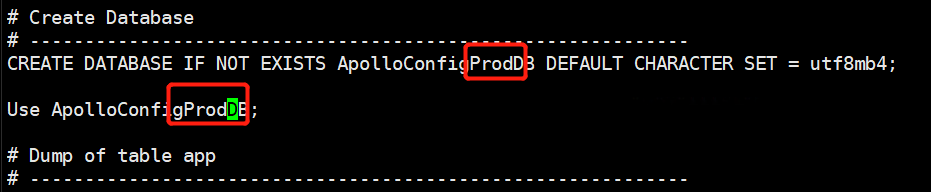

~~~~
# 11机器，修改支持类型：
none)]> use ApolloPortalDB;
ApolloPortalDB]> show tables;
ApolloPortalDB]> select * from ServerConfig\G
ApolloPortalDB]> update ServerConfig set Value='fat,pro' where Id=1;
ApolloPortalDB]> select * from Serverconfig\G
~~~~

改后

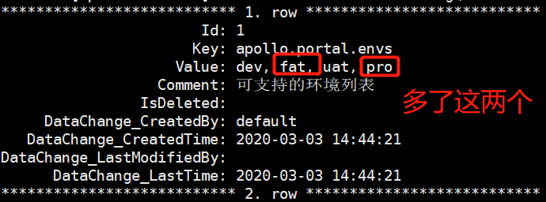

> PS按理来说你应该只有dev，但是好像Apollo更新了，一开始就有4种支持的类型，只要你确保有fat和pro即可

~~~
# 200机器：
cd /data/k8s-yaml/apollo-portal/
# 需改以下内容
apollo-portal]# vi cm.yaml
  apollo-env.properties: |
    fat.meta=http://config-test.od.com
    pro.meta=http://config-prod.od.com
~~~

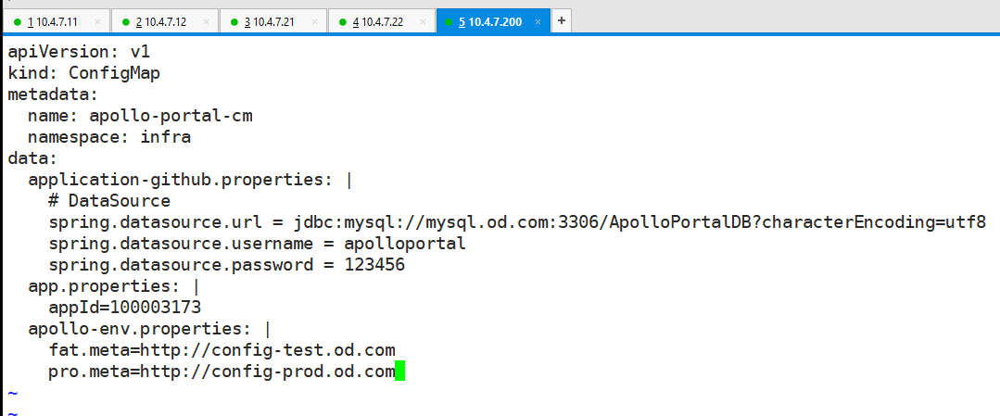

~~~
# 22机器，应用：
~]# kubectl apply -f http://k8s-yaml.od.com/apollo-portal/cm.yaml
# out: configmap/apollo-portal configured
~~~

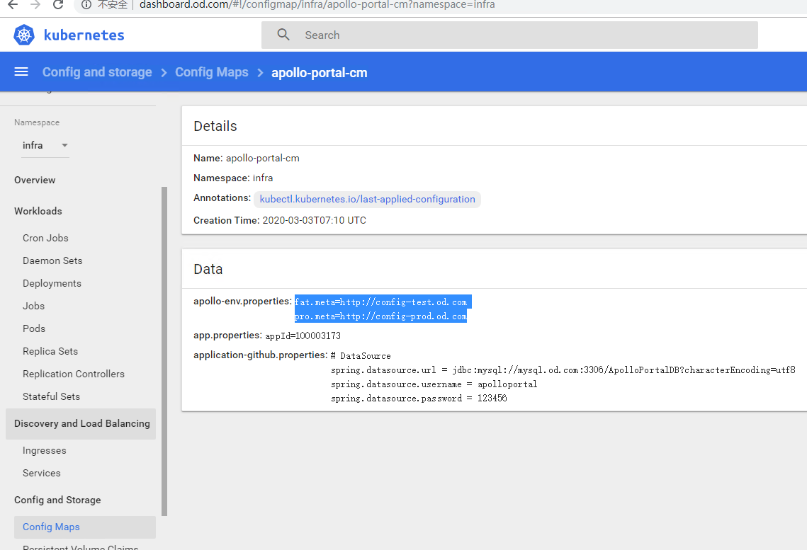

完成


### 实战使用Apollo分环境管理dubbo服务——交付Apollo-portal和adminservice

~~~
# 制作资源配置清单,200机器：
cd /data/k8s-yaml/
k8s-yaml]# mkdir -pv test/{apollo-configservice,apollo-adminservice,dubbo-demo-service,dubbo-demo-consumer}
k8s-yaml]# mkdir -pv prod/{apollo-configservice,apollo-adminservice,dubbo-demo-service,dubbo-demo-consumer}
k8s-yaml]# cd test/apollo-configservice/
apollo-configservice]# cp -a /data/k8s-yaml/apollo-configservice/cm.yaml .
apollo-configservice]# cp -a /data/k8s-yaml/apollo-configservice/svc.yaml .
apollo-configservice]# cp -a /data/k8s-yaml/apollo-configservice/dp.yaml .
apollo-configservice]# cp -a /data/k8s-yaml/apollo-configservice/ingress.yaml .
# 修改成test，三处
apollo-configservice]# vi cm.yaml
  namespace: test
    spring.datasource.url = jdbc:mysql://mysql.od.com:3306/ApolloConfigTestDB?characterEncoding=utf8
    spring.service.url = http://config-test.od.com/eureka

# 修改成test，一处
apollo-configservice]# vi dp.yaml
  namespace: test

# 修改成test，一处
apollo-configservice]# vi svc.yaml
  namespace: test

# 修改成test，两处
apollo-configservice]# vi ingress.yaml
  namespace: test
  - host: config-test.od.com
~~~


~~~
# 11机器，解析域名：
~]# vi /var/named/od.com.zone
serial 前滚一位
config-test        A    10.4.7.10
config-prod        A    10.4.7.10

~]# systemctl restart named
~~~

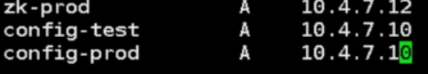

~~~
# 应用资源配置清单，22机器：
~]# kubectl apply -f http://k8s-yaml.od.com/test/apollo-configservice/cm.yaml
~]# kubectl apply -f http://k8s-yaml.od.com/test/apollo-configservice/dp.yaml
~]# kubectl apply -f http://k8s-yaml.od.com/test/apollo-configservice/svc.yaml
~]# kubectl apply -f http://k8s-yaml.od.com/test/apollo-configservice/ingress.yaml
~~~


~~~~
# 200机器，制作prod的：
cd /data/k8s-yaml/prod/apollo-configservice/
apollo-configservice]# cp ../../test/apollo-configservice/*.yaml .
# 修改成prod，三处
apollo-configservice]# vi cm.yaml
  namespace: prod
    spring.datasource.url = jdbc:mysql://mysql.od.com:3306/ApolloConfigProdDB?characterEncoding=utf8
    spring.service.url = http://config-prod.od.com/eureka

# 修改成prod，一处
apollo-configservice]# vi dp.yaml
  namespace: prod

# 修改成prod，一处
apollo-configservice]# vi svc.yaml
  namespace: prod

# 修改成prod，两处
apollo-configservice]# vi ingress.yaml
  namespace: prod
  - host: config-prod.od.com
~~~~


~~~~
# 应用资源清单，22机器：
~]# kubectl apply -f http://k8s-yaml.od.com/prod/apollo-configservice/cm.yaml
~]# kubectl apply -f http://k8s-yaml.od.com/prod/apollo-configservice/dp.yaml
~]# kubectl apply -f http://k8s-yaml.od.com/prod/apollo-configservice/svc.yaml
~]# kubectl apply -f http://k8s-yaml.od.com/prod/apollo-configservice/ingress.yaml
~~~~

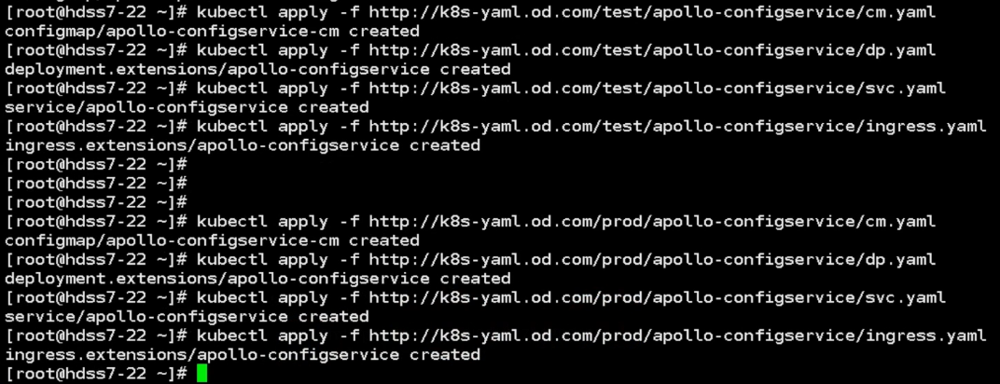

确认你的nslookup.exe 有没有（一般是有的）

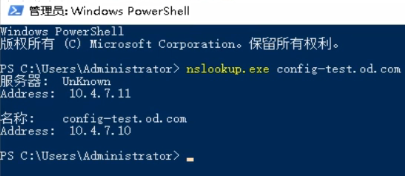

~~~
# 访问config-test.od.com
config.od.com已经没了
~~~

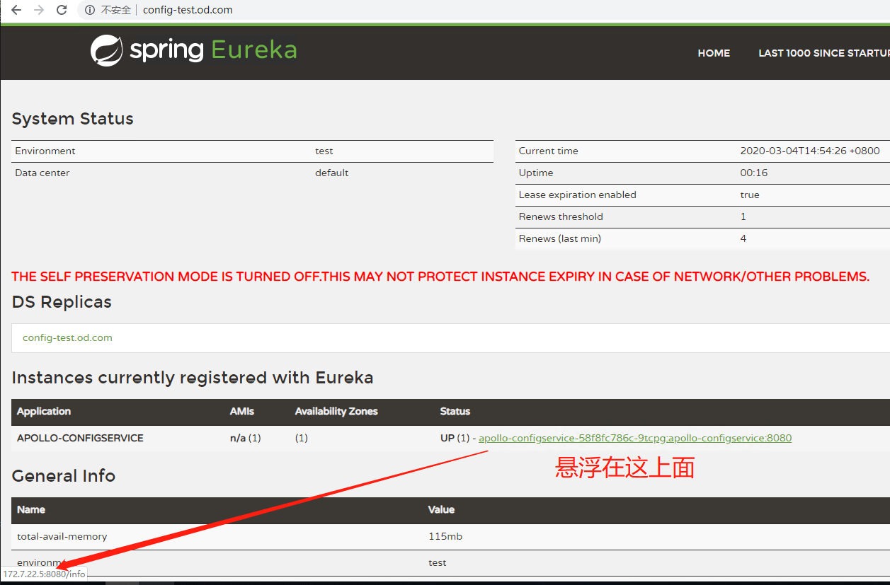

~~~~
# 访问config-prod.od.com
prod可能还没好，接着往下面做，test能起来，prod肯定也能起来
~~~~

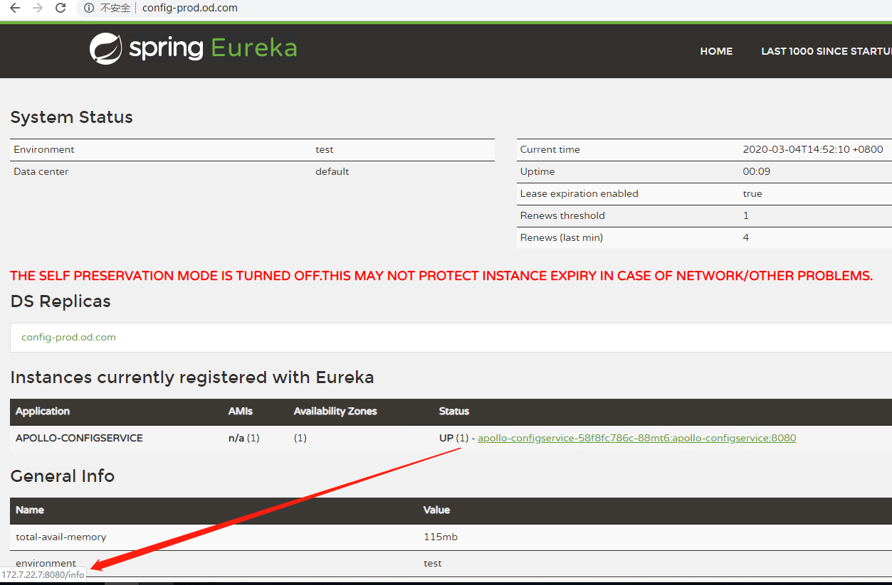

> 可以看到test和prod在两个不同的容器里，这就是我们模拟的分环境

~~~
# 200机器：
cd /data/k8s-yaml/test/apollo-adminservice/
apollo-adminservice]# cp -a /data/k8s-yaml/apollo-adminservice/*.yaml .
# 修改成test，三处
apollo-adminservice]# vi cm.yaml
  namespace: test
    spring.datasource.url = jdbc:mysql://mysql.od.com:3306/ApolloConfigTestDB?
    spring.service.url = http://config-test.od.com/eureka

# 修改成test，一处
apollo-adminservice]# vi dp.yaml
  namespace: test

apollo-adminservice]# cd ../../prod/apollo-adminservice
apollo-adminservice]# cp -a ../../test/apollo-adminservice/*.yaml .
# 修改成prod，三处
apollo-adminservice]# vi cm.yaml
  namespace: prod
    spring.datasource.url = jdbc:mysql://mysql.od.com:3306/ApolloConfigProdDB?characterEncoding=utf8
    spring.service.url = http://config-prod.od.com/eureka

# 修改成prod，一处
apollo-adminservice]# vi dp.yaml
  namespace: prod
~~~


~~~
# 应用，22机器：
~]# kubectl apply -f http://k8s-yaml.od.com/test/apollo-adminservice/cm.yaml
~]# kubectl apply -f http://k8s-yaml.od.com/test/apollo-adminservice/dp.yaml
~]# kubectl apply -f http://k8s-yaml.od.com/prod/apollo-adminservice/cm.yaml
~]# kubectl apply -f http://k8s-yaml.od.com/prod/apollo-adminservice/dp.yaml
~~~


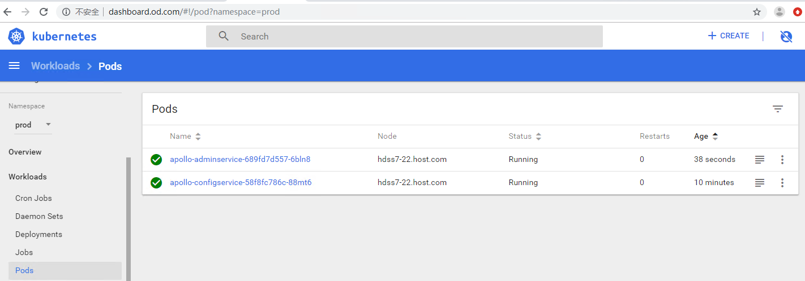

~~~
# 11机器，清除数据：
mysql -uroot -p
none)]> use ApolloPortalDB;
ApolloProtalDB]> select * from App;
ApolloProtalDB]> select * from AppNamespace;
ApolloProtalDB]> truncate table App;
ApolloProtalDB]> truncate table AppNamespace;
~~~

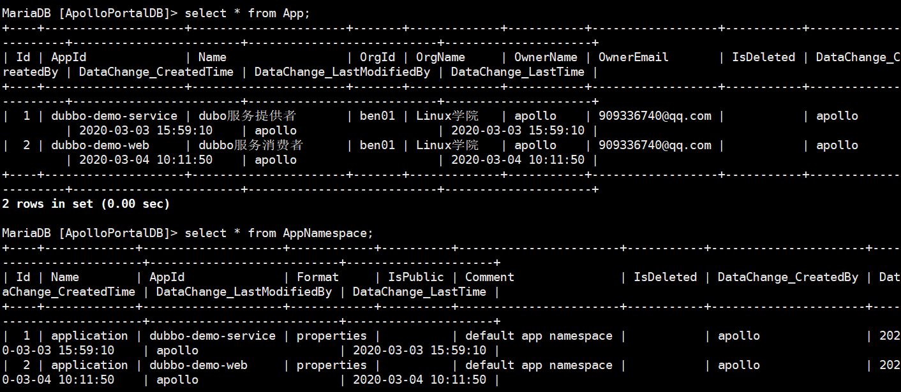

把portal scale成1

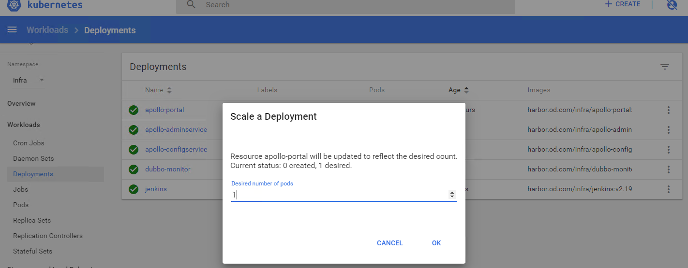

使用查询功能查询下

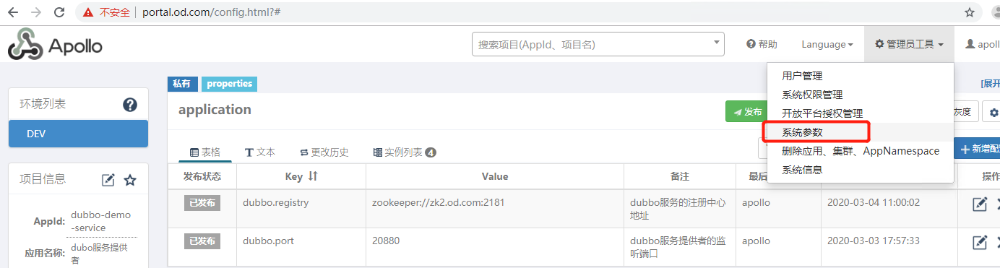

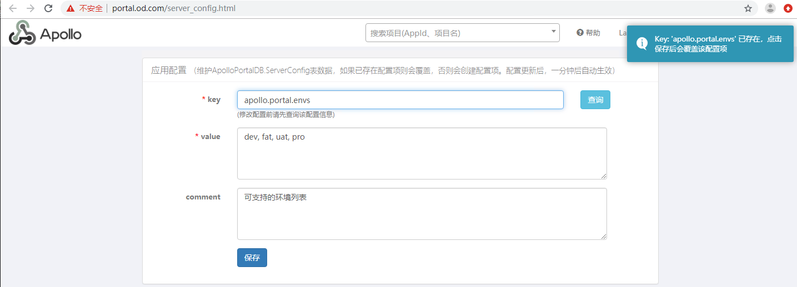

成功


### 实战发布dubbo连接Apollo到不同环境

创建项目

[portal.od.com](portal.od.com)

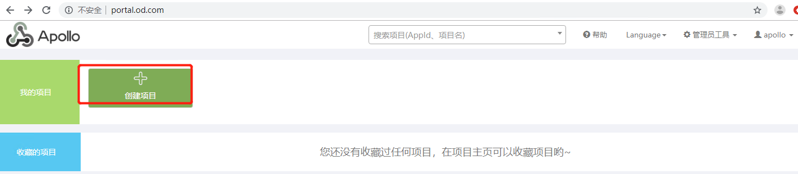


现在也可以看到环境列表有两个了

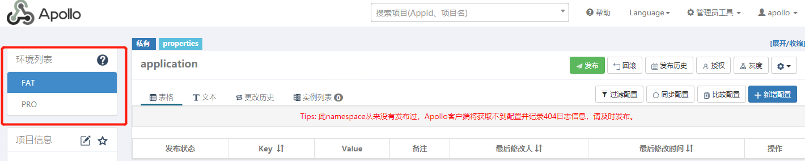

测试环境新增配置项，并发布


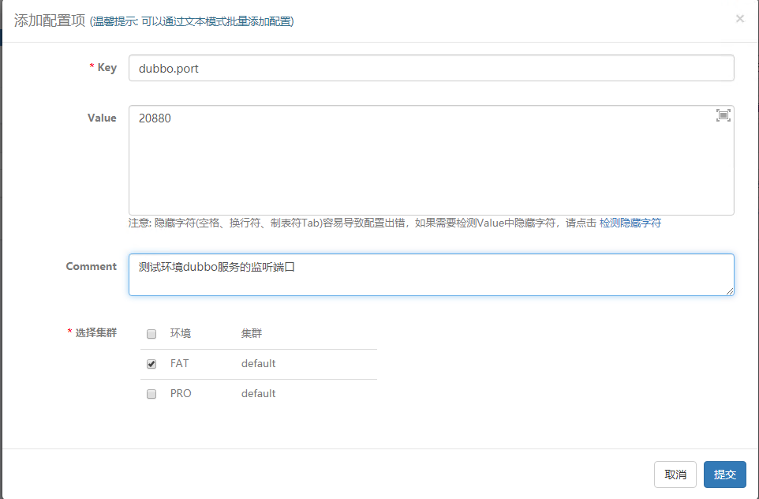


生产环境新增配置项，并发布

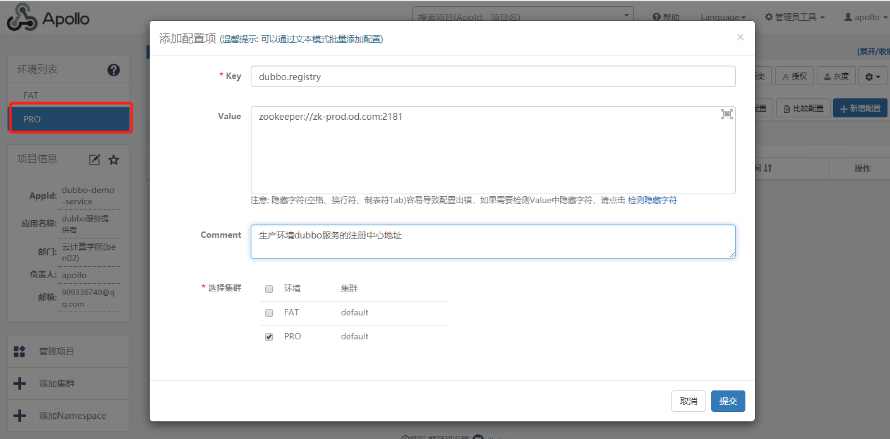


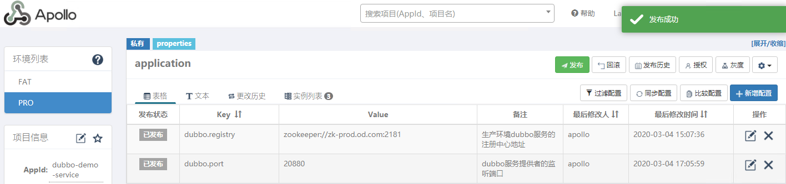

service配置好了，再配置consumer

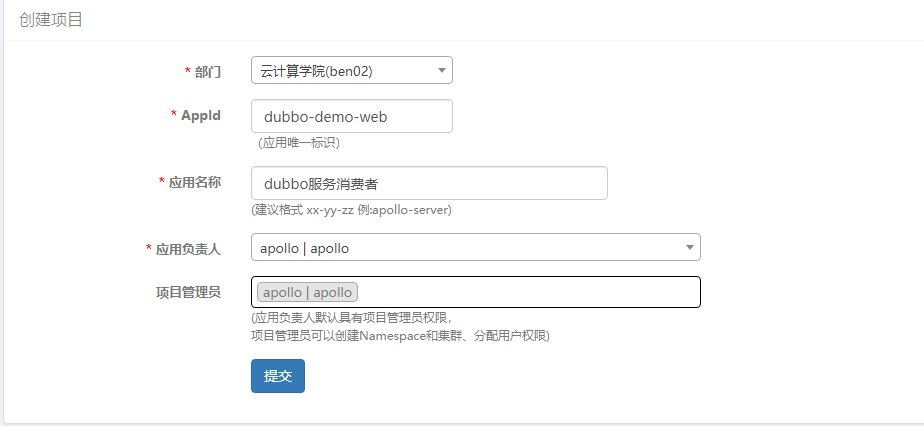

测试环境新增配置项，并发布

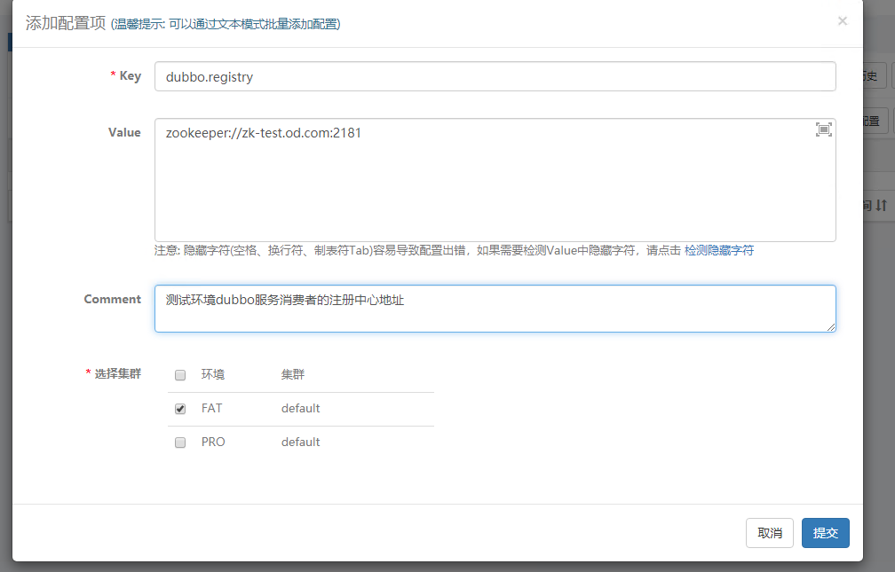


生产环境新增配置项，并发布

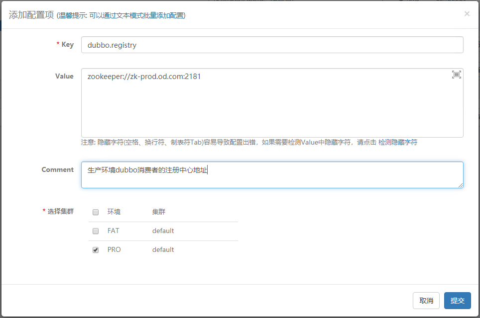

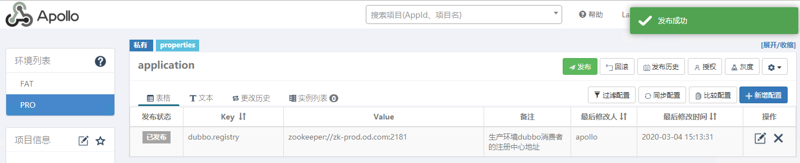

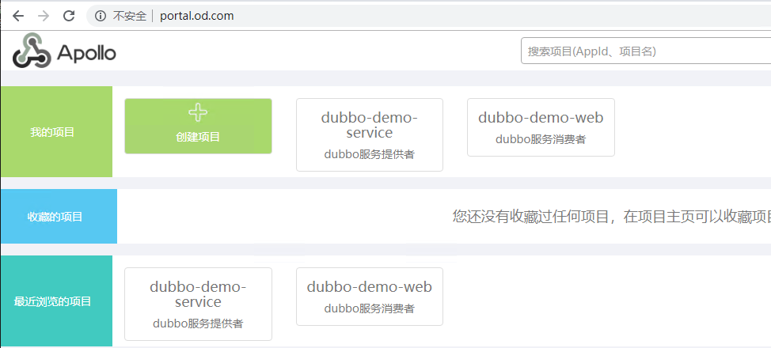

~~~
# 200机器，制作测试环境service：
cd /data/k8s-yaml/test/dubbo-demo-service/
dubbo-demo-service]# cp -a /data/k8s-yaml/dubbo-demo-service/*.yaml .
# 修改三处
dubbo-demo-service]# vi dp.yaml
  namespace: test
        env:
        - name: JAR_BALL
          value: dubbo-server.jar
        - name: C_OPTS
          value: -Denv=fat -Dapollo.meta=http://config-test.od.com
~~~


~~~
# 应用，22机器：
~]# kubectl apply -f http://k8s-yaml.od.com/test/dubbo-demo-service/dp.yaml
~~~

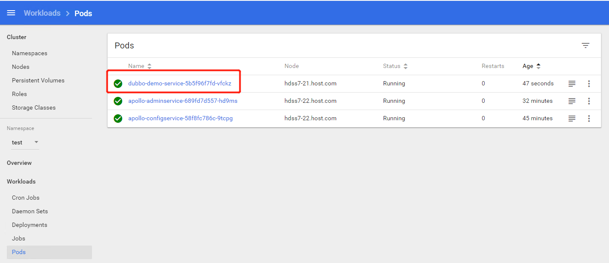

~~~
# 200机器，制作测试环境consumer：
cd /data/k8s-yaml/test/dubbo-demo-consumer/
dubbo-demo-consumer]# cp -a /data/k8s-yaml/dubbo-demo-consumer/*.yaml .
# 修改三处
dubbo-demo-consumer]# vi dp.yaml
  namespace: test
        - name: JAR_BALL
          value: dubbo-client.jar
        - name: C_OPTS
          value: -Denv=fat -Dapollo.meta=http://config-test.od.com

# 修改一处
dubbo-demo-consumer]# vi svc.yaml
  namespace: test

# 修改一处
dubbo-demo-consumer]# vi ingress.yaml
  namespace: test
  - host: demo-test.od.com
~~~


~~~
# 11机器，新增解析：
~]# vi /var/named/od.com.zone
serial 前滚一位
demo-test          A    10.4.7.10

~]# systemctl restart named
~~~

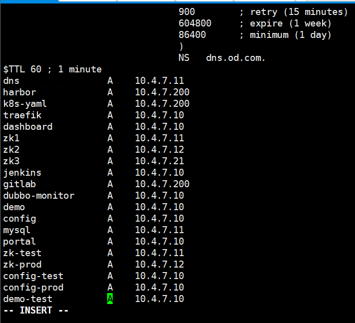

~~~
# 应用，22机器：
~]# kubectl apply -f http://k8s-yaml.od.com/test/dubbo-demo-consumer/dp.yaml
~]# kubectl apply -f http://k8s-yaml.od.com/test/dubbo-demo-consumer/svc.yaml
~]# kubectl apply -f http://k8s-yaml.od.com/test/dubbo-demo-consumer/ingress.yaml
~~~

查看dashboard的启动情况

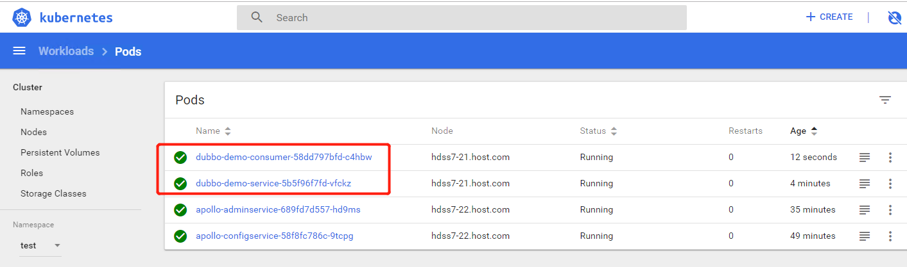

此时的monitor还是zk2，我们改成zk-test

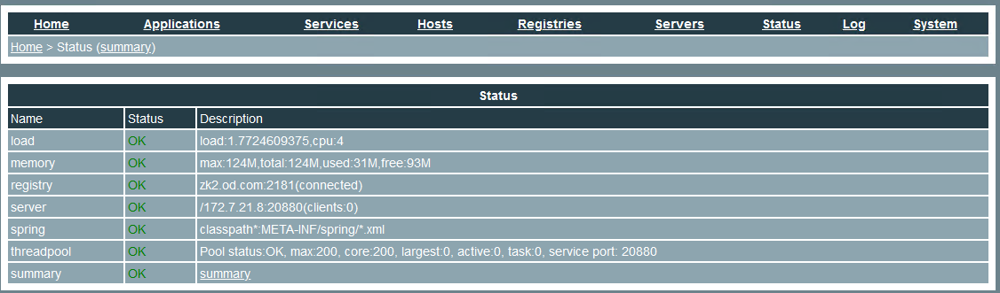

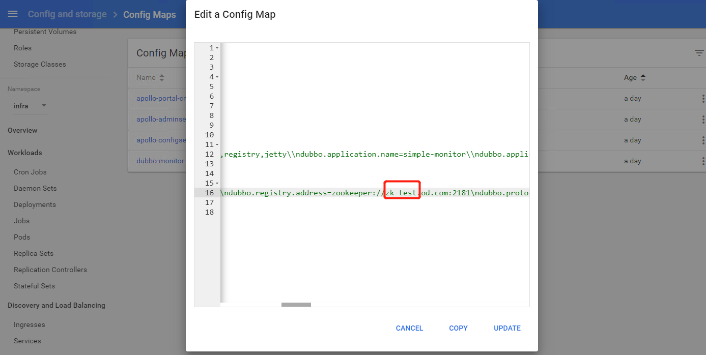

update然后删掉对应的pod让它自动重启

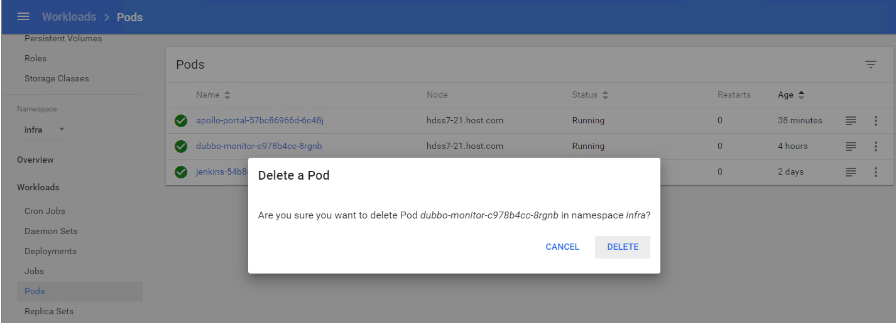

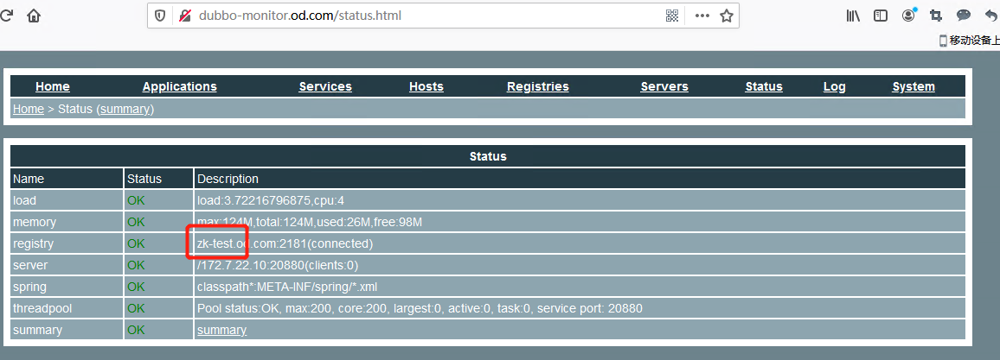

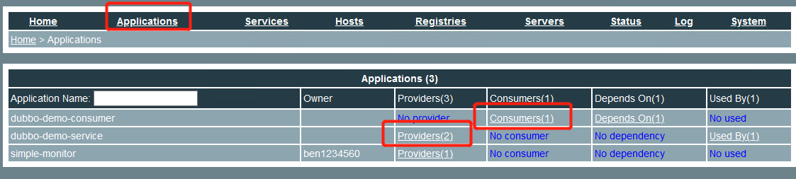

~~~
# 浏览器输入：demo-test.od.com/hello?name=test
~~~

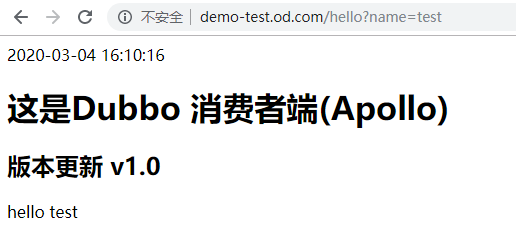

完成

开始做生产环境

~~~
# 11机器，新增解析：
~]# vi /var/named/od.com.zone
serial 前滚一位
demo-prod          A    10.4.7.10

~]# systemctl restart named
~~~

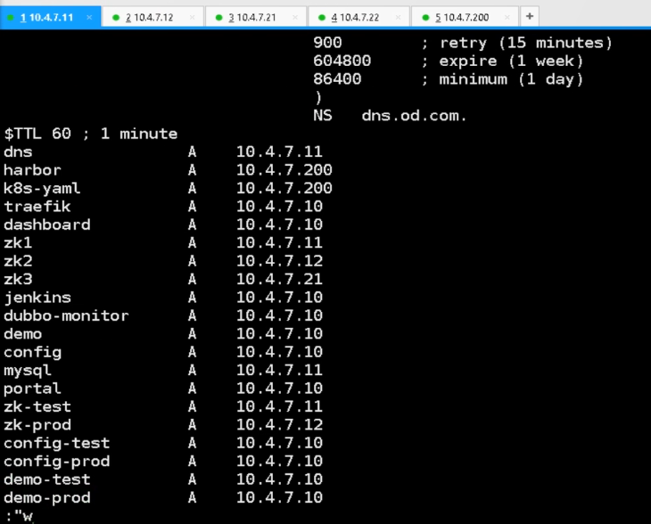

~~~
# 200机器，制作生产环境service：
cd /data/k8s-yaml/prod/dubbo-demo-service/
dubbo-demo-service]# cp -a ../../test/dubbo-demo-service/*.yaml .
# 共修改三处
dubbo-demo-service]# vi dp.yaml
  namespace: prod
        env:
        - name: JAR_BALL
          value: dubbo-server.jar
        - name: C_OPTS
          value: -Denv=pro -Dapollo.meta=http://apollo-configservice:8080
~~~

[^关于http://apollo-configservice:8080]: 直接用这个和用http://config-test.od.com是没有区别的，http://config-test.od.com是多了一层反代，而apollo-configservice:8080是因为它们在同一名称空间里，所以可以这么使用

~~~
# 应用，22机器：
~]# kubectl apply -f http://k8s-yaml.od.com/prod/dubbo-demo-service/dp.yaml
~~~

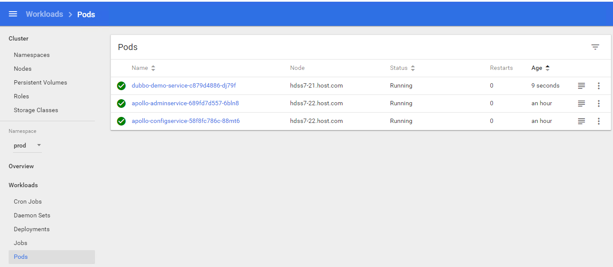

你还可以去LOGS日志里面看看

~~~
# 200机器，制作生产环境consumer：
cd /data/k8s-yaml/prod/dubbo-demo-consumer/
dubbo-demo-consumer]# cp -a /data/k8s-yaml/dubbo-demo-consumer/*.yaml .
# 共修改三处
dubbo-demo-consumer]# vi dp.yaml
  namespace: prod
        env:
        - name: JAR_BALL
          value: dubbo-client.jar
        - name: C_OPTS
          value: -Denv=pro -Dapollo.meta=http://apollo-configservice:8080
        imagePullPolicy: IfNotPresent

# 共修改一处
dubbo-demo-consumer]# vi svc.yaml
  namespace: prod

# 共修改两处
dubbo-demo-consumer]# vi ingress.yaml
  namespace: prod
spec:
  rules:
  - host: demo-prod.od.com
~~~


~~~
# 应用，22机器：
~]# kubectl apply -f http://k8s-yaml.od.com/prod/dubbo-demo-consumer/dp.yaml
~]# kubectl apply -f http://k8s-yaml.od.com/prod/dubbo-demo-consumer/svc.yaml
~]# kubectl apply -f http://k8s-yaml.od.com/prod/dubbo-demo-consumer/ingress.yaml
~~~

~~~
# 浏览器输入：demo-prod.od.com/hello?name=prod
~~~

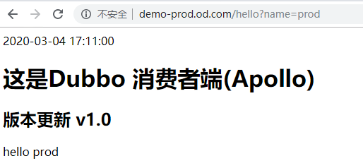

完成

> 报错：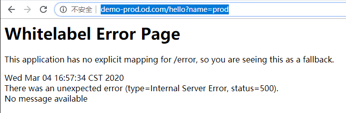
>
> 我去LOGS里面看了一下，发现我Apollo配得port写错了，写成了dubbo-port，应该是dubbo.port，改回来就可以了，删掉service得pod重新启动，删掉consumer的pod重新启动


### 实战演示项目提测，发版流程

> 模拟项目提测到发布上线，这里用得gitlab，你有可以了解一下gitlab是长什么样子的，还有怎么操作的

修改源代码，并commit

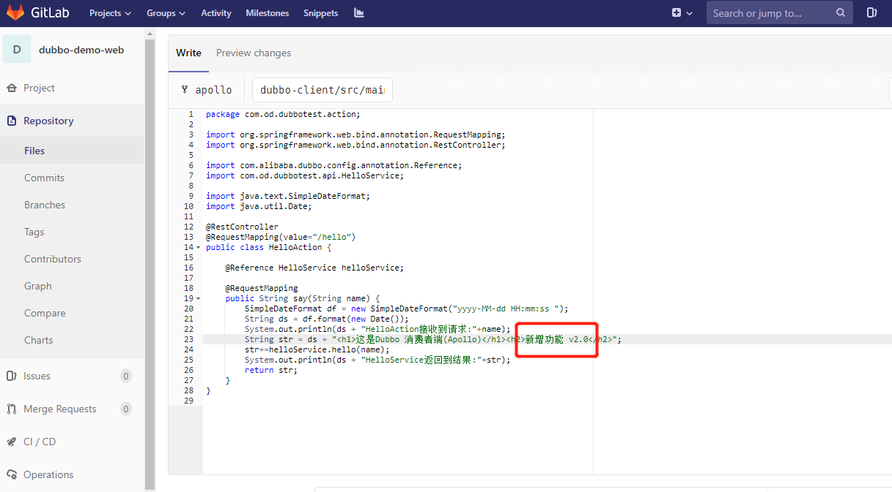


> gitlab跟gittee在更新代码的编号有所区别

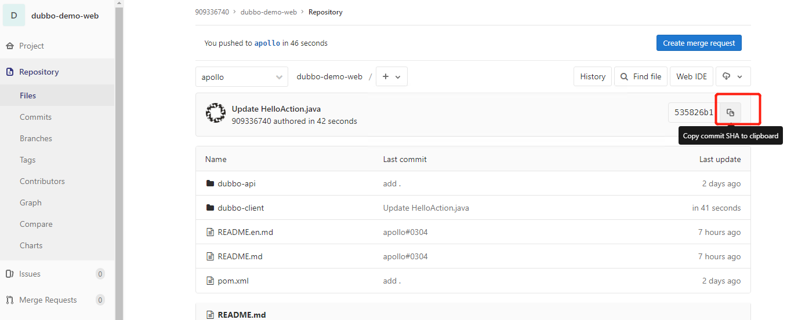

Jenkins构建

~~~
# 填入对应参数，然后build
app_name: dubbo-demo-consumer
image_name: app/dubbo-demo-consumer
git_repo: http://gitlab.od.com:10000/909336740/dubbo-demo-web.git
git_ver: 535826b1239fedba0df3799b7b3b8585d56e9e18
add_tag: 200304_1730
target_dir: ./dubbo-client/target
base_image: base/jre8:8u112
~~~


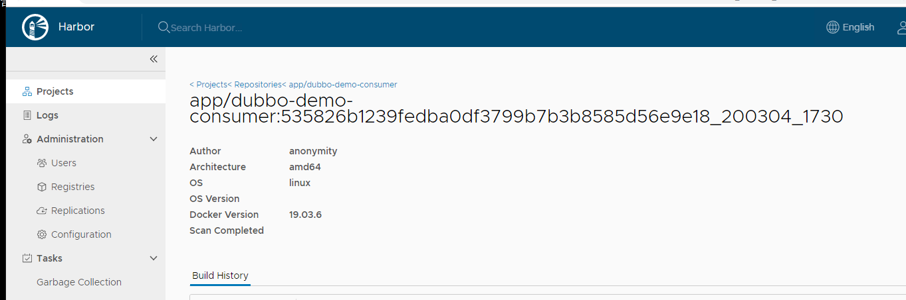

先到测试环境发布，修改tag

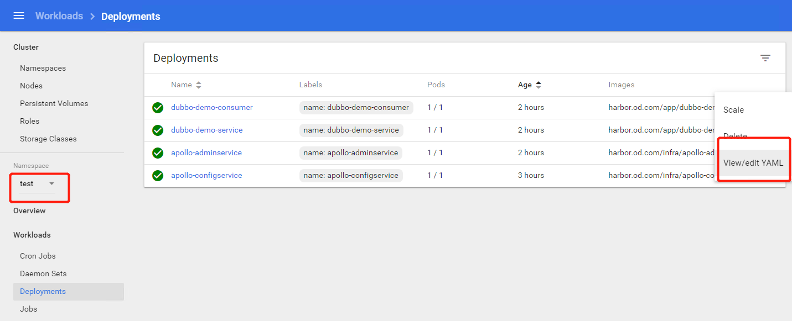

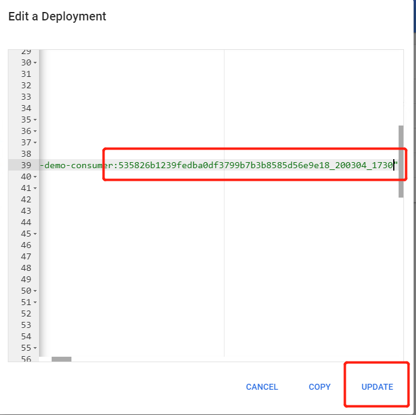

重启成功，刷新测试环境的页面，查看情况

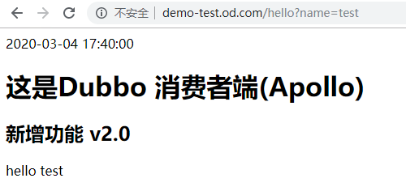

刷新生产环境的页面，查看情况，还没改变

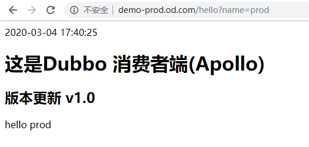

我们来修改prod的，这时候已经不需要再去Jenkins打包镜像了

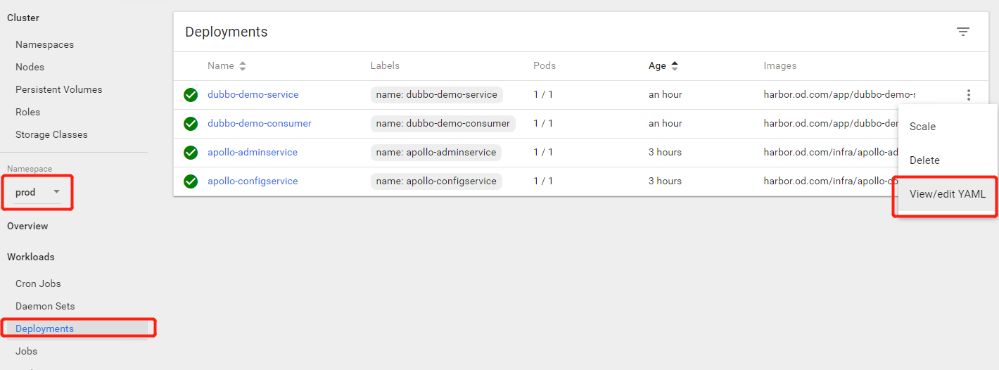


更新完启动pod后

再来刷新生产环境的页面

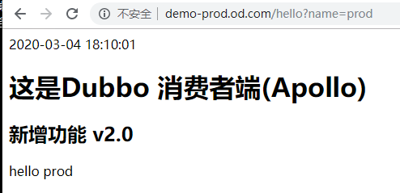

已经改变，成功

