## 第四章——dashboard插件及k8s实战交付

> 引言：在集群的章节，我们开始使用交付服务的形式来交付，接下来我们也会持续使用这种方式来交付，流程：**准备镜像—>准备资源配置清单—>解析域名（没有ingress则不需要）—>应用配置清单—>完成**

### dashboard安装部署

> **WHAT**：向企业展示度量信息和关键业务指标（[KPI](https://baike.baidu.com/item/KPI)）现状的[数据虚拟化](https://baike.baidu.com/item/%E6%95%B0%E6%8D%AE%E8%99%9A%E6%8B%9F%E5%8C%96/6734581)工具
>
> **WHY**：我们目前都是用机器去安装部署资源，但我们以后不可能动不动就上主机，那样非常不安全，而且开发人员等也需要看到POD的情况，不可能让他们也登录主机去查看，所以我们需要一个有权限控制的界面展示和控制的工具

~~~
# 200机器，准备镜像：
cd /data/k8s-yaml/
k8s-yaml]# docker pull k8scn/kubernetes-dashboard-amd64:v1.8.3
k8s-yaml]# docker images|grep dashboard
k8s-yaml]# docker tag fcac9aa03fd6 harbor.od.com/public/dashboard:v1.8.3
k8s-yaml]# docker push harbor.od.com/public/dashboard:v1.8.3
~~~

> 复习：push拉取、images显示所有镜像、|grep管道符，用于筛选、tag打标签、push上传

~~~
# 200机器，准备资源配置清单
k8s-yaml]# mkdir /data/k8s-yaml/dashboard
k8s-yaml]# cd /data/k8s-yaml/dashboard/
dashboard]# vi rbac.yaml
apiVersion: v1
kind: ServiceAccount
metadata:
  labels:
    k8s-app: kubernetes-dashboard
    addonmanager.kubernetes.io/mode: Reconcile
  name: kubernetes-dashboard-admin
  namespace: kube-system
---
apiVersion: rbac.authorization.k8s.io/v1
kind: ClusterRoleBinding
metadata:
  name: kubernetes-dashboard-admin
  namespace: kube-system
  labels:
    k8s-app: kubernetes-dashboard
    addonmanager.kubernetes.io/mode: Reconcile
roleRef:
  apiGroup: rbac.authorization.k8s.io
  kind: ClusterRole
  name: cluster-admin
subjects:
- kind: ServiceAccount
  name: kubernetes-dashboard-admin
  namespace: kube-system
  
dashboard]# vi dp.yaml
apiVersion: apps/v1
kind: Deployment
metadata:
  name: kubernetes-dashboard
  namespace: kube-system
  labels:
    k8s-app: kubernetes-dashboard
    kubernetes.io/cluster-service: "true"
    addonmanager.kubernetes.io/mode: Reconcile
spec:
  selector:
    matchLabels:
      k8s-app: kubernetes-dashboard
  template:
    metadata:
      labels:
        k8s-app: kubernetes-dashboard
      annotations:
        scheduler.alpha.kubernetes.io/critical-pod: ''
    spec:
      priorityClassName: system-cluster-critical
      containers:
      - name: kubernetes-dashboard
        image: harbor.od.com/public/dashboard:v1.8.3
        resources:
          limits:
            cpu: 100m
            memory: 300Mi
          requests:
            cpu: 50m
            memory: 100Mi
        ports:
        - containerPort: 8443
          protocol: TCP
        args:
          # PLATFORM-SPECIFIC ARGS HERE
          - --auto-generate-certificates
        volumeMounts:
        - name: tmp-volume
          mountPath: /tmp
        livenessProbe:
          httpGet:
            scheme: HTTPS
            path: /
            port: 8443
          initialDelaySeconds: 30
          timeoutSeconds: 30
      volumes:
      - name: tmp-volume
        emptyDir: {}
      serviceAccountName: kubernetes-dashboard-admin
      tolerations:
      - key: "CriticalAddonsOnly"
        operator: "Exists"
		
dashboard]# vi svc.yaml
apiVersion: v1
kind: Service
metadata:
  name: kubernetes-dashboard
  namespace: kube-system
  labels:
    k8s-app: kubernetes-dashboard
    kubernetes.io/cluster-service: "true"
    addonmanager.kubernetes.io/mode: Reconcile
spec:
  selector:
    k8s-app: kubernetes-dashboard
  ports:
  - port: 443
    targetPort: 8443
	
	
dashboard]# vi ingress.yaml
apiVersion: extensions/v1beta1
kind: Ingress
metadata:
  name: kubernetes-dashboard
  namespace: kube-system
  annotations:
    kubernetes.io/ingress.class: traefik
spec:
  rules:
  - host: dashboard.od.com
    http:
      paths:
      - backend:
          serviceName: kubernetes-dashboard
          servicePort: 443
~~~

> <a href="https://github.com/ben1234560/k8s_PaaS/blob/master/%E5%8E%9F%E7%90%86%E5%8F%8A%E6%BA%90%E7%A0%81%E8%A7%A3%E6%9E%90/Kubernetes%E5%9F%BA%E6%9C%AC%E6%A6%82%E5%BF%B5.md#rbac%E5%9F%BA%E4%BA%8E%E8%A7%92%E8%89%B2%E7%9A%84%E6%9D%83%E9%99%90%E6%8E%A7%E5%88%B6">RBAC:基于角色的权限控制</a>

~~~
# 11机器，解析域名：
~]# vi /var/named/od.com.zone
serial 前滚一位
dashboard          A    10.4.7.10

~]# systemctl restart named
~]# dig -t A dashboard.od.com @10.4.7.11 +short
~~~

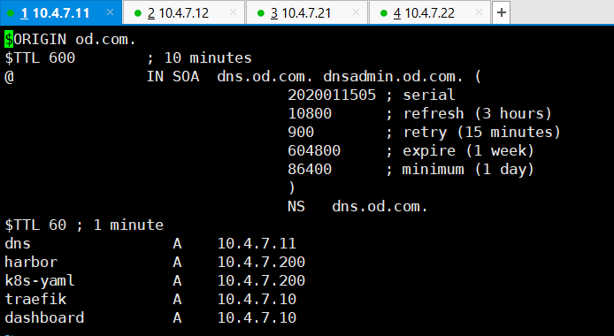

~~~
# 选择任意运算节点，我选的是22机器，应用资源配置清单：
# 选择应用节点，22机器
~]# kubectl apply -f http://k8s-yaml.od.com/dashboard/rbac.yaml
~]# kubectl apply -f http://k8s-yaml.od.com/dashboard/dp.yaml
~]# kubectl apply -f http://k8s-yaml.od.com/dashboard/svc.yaml
~]# kubectl apply -f http://k8s-yaml.od.com/dashboard/ingress.yaml
~]# kubectl get pods -n kube-system
~]# kubectl get svc -n kube-system
~]# kubectl get ingress -n kube-system
~~~

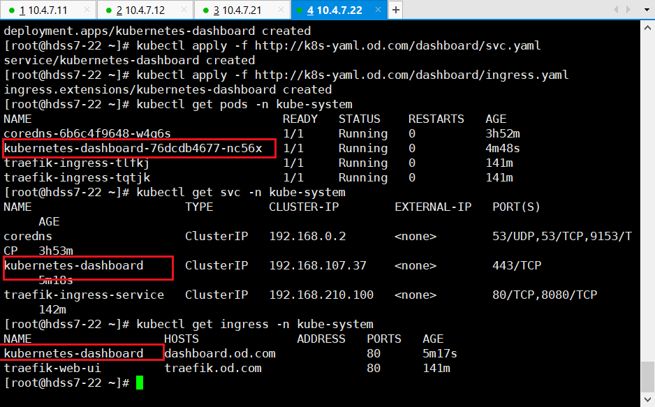

[访问dashboard.od.com](dashboard.od.com)

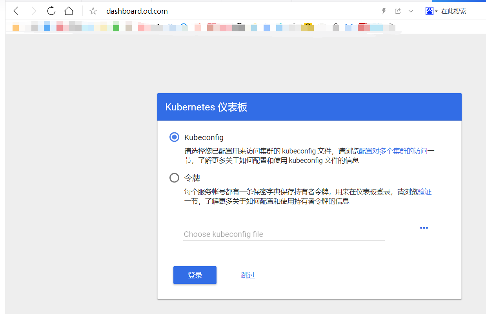

先跳过

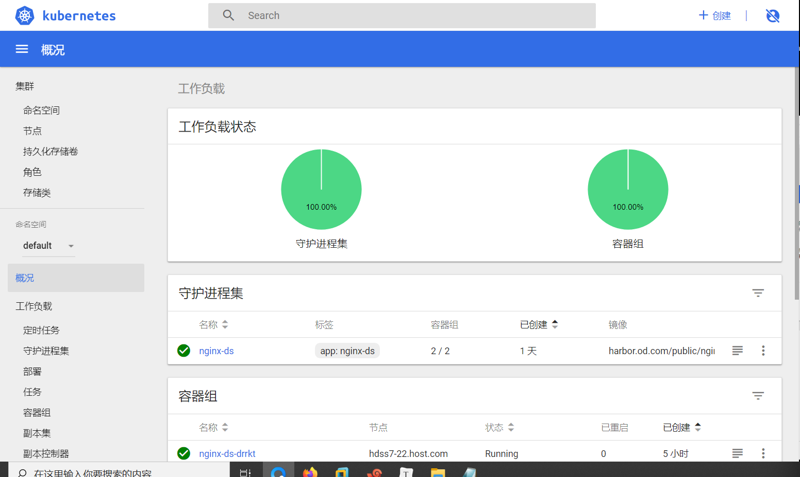

完成

### K8S仪表盘鉴权

> 上面这种是不需要登录就可以接入，我们可以用需要登录的版本，而且分权，即管理员用管理员的权限，普通用户用普通用户的权限

~~~
# 200机器，做证书：
cd /opt/certs
certs]# (umask 077; openssl genrsa -out dashboard.od.com.key 2048)
# 没有openssl的yum install openssl
certs]# openssl req -new -key dashboard.od.com.key -out dashboard.od.com.csr -subj "/CN=dashboard.od.com/C=CN/ST=BJ/L=Beijing/O=ben1234560/OU=ops"
certs]# openssl x509 -req -in dashboard.od.com.csr -CA ca.pem -CAkey ca-key.pem -CAcreateserial -out dashboard.od.com.crt -days 3650
certs]# cfssl-certinfo -cert dashboard.od.com.crt
~~~

~~~
# 拷贝到11机器的nginx:
~]# cd /etc/nginx/
nginx]# mkdir certs
nginx]# cd certs/
certs]# scp hdss7-200:/opt/certs/dashboard.od.com.crt .
certs]# scp hdss7-200:/opt/certs/dashboard.od.com.key .
certs]# cd ../conf.d/
conf.d]# vi dashboard.od.com.conf
server {
    listen       80;
    server_name  dashboard.od.com;

    rewrite ^(.*)$ https://${server_name}$1 permanent;
}
server {
    listen       443 ssl;
    server_name  dashboard.od.com;

    ssl_certificate "certs/dashboard.od.com.crt";
    ssl_certificate_key "certs/dashboard.od.com.key";
    ssl_session_cache shared:SSL:1m;
    ssl_session_timeout  10m;
    ssl_ciphers HIGH:!aNULL:!MD5;
    ssl_prefer_server_ciphers on;

    location / {
        proxy_pass http://default_backend_traefik;
        proxy_set_header Host       $http_host;
        proxy_set_header x-forwarded-for $proxy_add_x_forwarded_for;
    }
}

conf.d]# nginx -t
conf.d]# nginx -s reload
~~~

> **nginx -t**：检查nginx文件语法
>
> **nginx -s reload**：热配置，即不用重启的更新

~~~
# 200机器，前面我们部署的是dashboard1.8，现在我们试下1.10
certs]# docker pull hexun/kubernetes-dashboard-amd64:v1.10.1
certs]# docker images|grep dash
certs]# docker tag f9aed6605b81 harbor.od.com/public/dashboard:v1.10.1
certs]# docker push harbor.od.com/public/dashboard:v1.10.1
certs]# cd /data/k8s-yaml/dashboard/
# 修改以下版本信息，亦或者去dashboard修改
dashboard]# vi dp.yaml
image: harbor.od.com/public/dashboard:v1.10.1
~~~

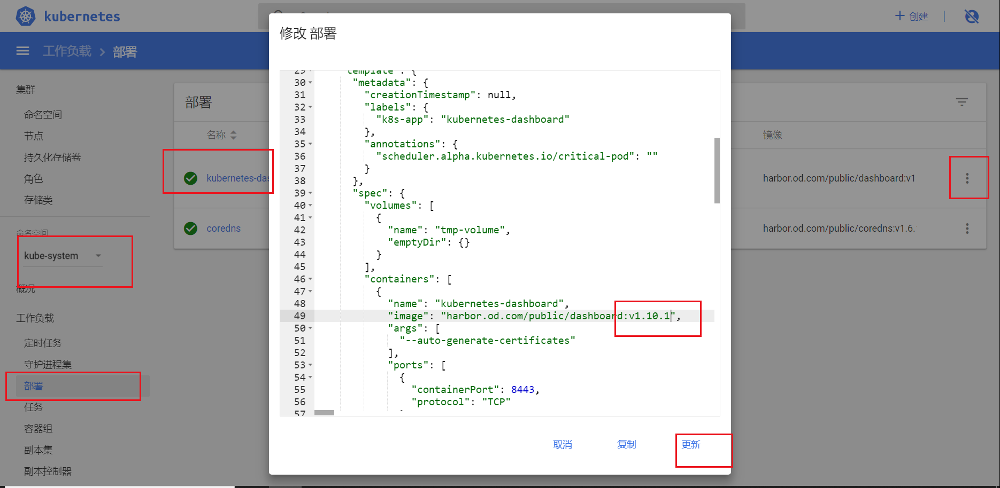

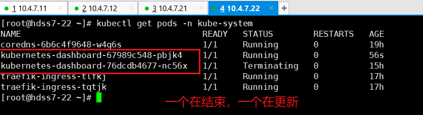

1.10.1版本是强制登录的，这时候，拿token去登录

~~~
# 21机器：
~]# kubectl get secret -n kube-system
# kubernetes-dashboard-admin-token-gq266
~]# kubectl describe secret kubernetes-dashboard-admin-token-gq266 -n kube-system
# token:eyJhbGciOiJSUzI1NiIsImtpZCI6IiJ9.eyJpc3MiOiJrdWJlcm5ldGVzL3NlcnZpY2VhY2NvdW50Iiwia3ViZXJuZXRlcy5pby9zZXJ2aWNlYWNjb3VudC9uYW1lc3BhY2UiOiJrdWJlLXN5c3RlbSIsImt1YmVybmV0ZXMuaW8vc2VydmljZWFjY291bnQvc2VjcmV0Lm5hbWUiOiJrdWJlcm5ldGVzLWRhc2hib2FyZC1hZG1pbi10b2tlbi1ncTI2NiIsImt1YmVybmV0ZXMuaW8vc2VydmljZWFjY291bnQvc2VydmljZS1hY2NvdW50Lm5hbWUiOiJrdWJlcm5ldGVzLWRhc2hib2FyZC1hZG1pbiIsImt1YmVybmV0ZXMuaW8vc2VydmljZWFjY291bnQvc2VydmljZS1hY2NvdW50LnVpZCI6IjY5MjM2OTY1LWIwOGMtNDYxNi1hOTIwLWRkMmIzNjMzOTcyZCIsInN1YiI6InN5c3RlbTpzZXJ2aWNlYWNjb3VudDprdWJlLXN5c3RlbTprdWJlcm5ldGVzLWRhc2hib2FyZC1hZG1pbiJ9.tTE7xZKgOm_o4S7Jq5iwudTXj66IWNz-1fv6y_ZxjgAJR8Jusa-DgDJppdATl_OZ7b1HPvKAA8T68ll2TzCpvoJe_rSyrCawrM9KxFVM7ZfyvNfIqScP5YqevV8GnvSkC50qMj3xClv9YM1Yo5ersgrB8bqYTqPIUPYwXsyBH-PA7PNVMWBHSeq6OzOUR4sM5IwSFKtNAvoM2Nxug7MY0wgUI2c3zFHeIe3d3do8zUWJClxKZG6HqABhEYICRL_zXFGQnoz8wyQsoSSg0YcctLY1BcvXYfzCvYVn953m_cz6t-WALhFW5kyqMz_JUODosl7povdJ0LW0pHzuicQYQA
~~~

> dashboard-admin-token指的是admin权限，即管理员权限

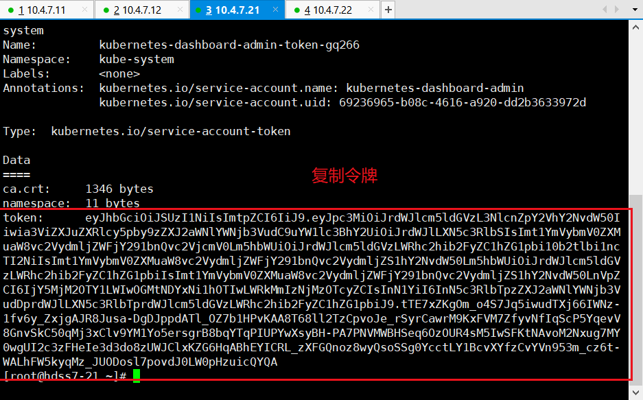

[刷新dashboard.od.com](dashboard.od.com)

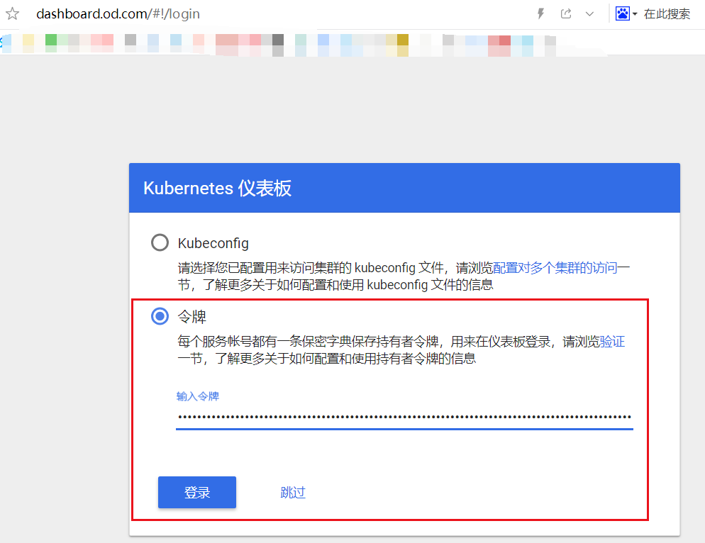

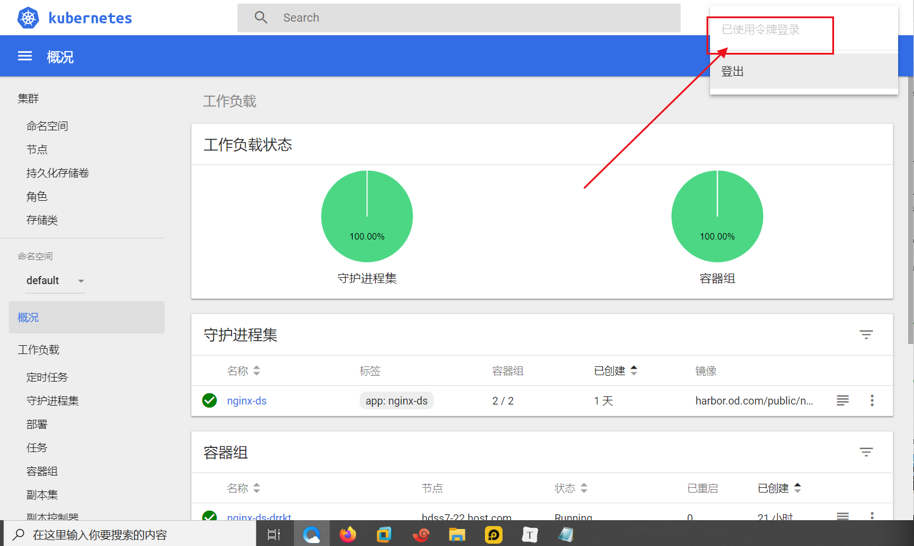

此时管理员是需要密钥登录了，登录后有所有的权限，我们再来做普通用户

[参考的官方网址](https://github.com/kubernetes/kubernetes/blob/master/cluster/addons/dashboard/)

~~~
# 200机器：
cd /data/k8s-yaml/dashboard/
dashboard]# vi rbac-minimal.yaml
apiVersion: v1
kind: ServiceAccount
metadata:
  labels:
    k8s-app: kubernetes-dashboard
    addonmanager.kubernetes.io/mode: Reconcile
  name: kubernetes-dashboard
  namespace: kube-system
---
kind: Role
apiVersion: rbac.authorization.k8s.io/v1
metadata:
  labels:
    k8s-app: kubernetes-dashboard
    addonmanager.kubernetes.io/mode: Reconcile
  name: kubernetes-dashboard-minimal
  namespace: kube-system
rules:
  # Allow Dashboard to get, update and delete Dashboard exclusive secrets.
- apiGroups: [""]
  resources: ["secrets"]
  resourceNames: ["kubernetes-dashboard-key-holder", "kubernetes-dashboard-certs"]
  verbs: ["get", "update", "delete"]
  # Allow Dashboard to get and update 'kubernetes-dashboard-settings' config map.
- apiGroups: [""]
  resources: ["configmaps"]
  resourceNames: ["kubernetes-dashboard-settings"]
  verbs: ["get", "update"]
  # Allow Dashboard to get metrics from heapster.
- apiGroups: [""]
  resources: ["services"]
  resourceNames: ["heapster"]
  verbs: ["proxy"]
- apiGroups: [""]
  resources: ["services/proxy"]
  resourceNames: ["heapster", "http:heapster:", "https:heapster:"]
  verbs: ["get"]
---
apiVersion: rbac.authorization.k8s.io/v1
kind: RoleBinding
metadata:
  name: kubernetes-dashboard-minimal
  namespace: kube-system
  labels:
    k8s-app: kubernetes-dashboard
    addonmanager.kubernetes.io/mode: Reconcile
roleRef:
  apiGroup: rbac.authorization.k8s.io
  kind: Role
  name: kubernetes-dashboard-minimal
subjects:
- kind: ServiceAccount
  name: kubernetes-dashboard
  namespace: kube-system

~~~

>  **rbac-minimal.yaml：**
>
> - 这里的name变成了name: kubernetes-dashboard，已经不是admin，权限小些
> - rules：可以看到rules给的一些比较小的权限
> - RoleBinding：角色绑定
> - 上半段是官方文档里面的dp.yaml，下面大班段是rbac-minimal.yaml

~~~
# 22机器，应用清单：
~]# kubectl apply -f http://k8s-yaml.od.com/dashboard/rbac-minimal.yaml
~~~

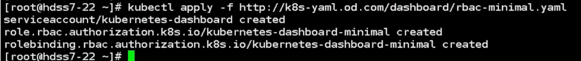

~~~
# 200机器，修改以下内容：
dashboard]# vi dp.yaml
serviceAccountName: kubernetes-dashboard
~~~

> 上面的意思如果没有令牌进来默认是普通用户，之前默认是admin用户

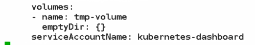

~~~
# 22机器，然后再回来应用dp：
~]# kubectl apply -f http://k8s-yaml.od.com/dashboard/dp.yaml
~]# kubectl get pods -n kube-system
~]# kubectl get secret -n kube-system
# 现在可以看到有两个token
~]# kubectl describe secret kubernetes-dashboard-token-g67v7 -n kube-system
~~~

[重新登录dashboard.od.com](dashboard.od.com)

有很多权限都没有

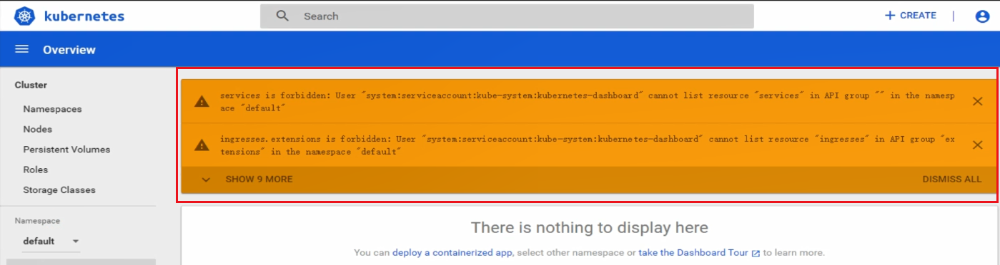

> 生产上，我们应该用1.10的版本，因为登录需要token，而不是谁过来都可以skip进来用root权限，除了真正的管理员，其他人都不应该有管理员权限，而是其他人可以看/修改自己名称空间（Namespace）的权限，你只需要配置rbac-xxx.yaml的文件并应用即可

~~~
# 200机器，改回用来的1.8.3，有skip按钮比较方便学习：
# 修改一下两段内容
dashboard]# vi dp.yaml
image: harbor.od.com/public/dashboard:v1.8.3
serviceAccountName: kubernetes-dashboard-admin
# 22机器
~]# kubectl apply -f http://k8s-yaml.od.com/dashboard/dp.yaml
~]# kubectl get pods -n kube-system
~~~

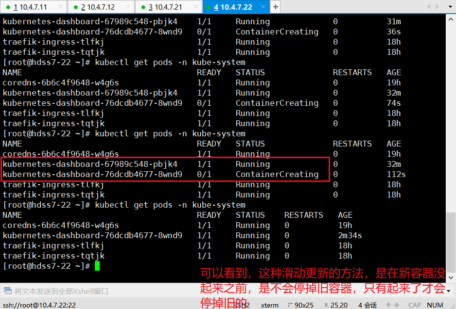

### dashboard——heapster（可不做）

> **WHAT**：让dashboard有更多图形化的小插件，不过目前由于收集的数据展示的图并不那么准确，所以可以不用部署仅作了解

~~~
# 200机器，准备镜像、资源配置清单：
dashboard]# mkdir heapster
dashboard]# cd heapster/
heapster]# docker pull quay.io/bitnami/heapster:1.5.4
heapster]# docker images|grep heapster
docker tag c359b95ad38b harbor.od.com/public/heapster:v1.5.4
heapster]# docker push harbor.od.com/public/heapster:v1.5.4
heapster]# vi rbac.yaml
apiVersion: v1
kind: ServiceAccount
metadata:
  name: heapster
  namespace: kube-system
---
kind: ClusterRoleBinding
apiVersion: rbac.authorization.k8s.io/v1beta1
metadata:
  name: heapster
roleRef:
  apiGroup: rbac.authorization.k8s.io
  kind: ClusterRole
  name: system:heapster
subjects:
- kind: ServiceAccount
  name: heapster
  namespace: kube-system

heapster]# vi dp.yaml
apiVersion: extensions/v1beta1
kind: Deployment
metadata:
  name: heapster
  namespace: kube-system
spec:
  replicas: 1
  template:
    metadata:
      labels:
        task: monitoring
        k8s-app: heapster
    spec:
      serviceAccountName: heapster
      containers:
      - name: heapster
        image: harbor.od.com/public/heapster:v1.5.4
        imagePullPolicy: IfNotPresent
        command:
        - /opt/bitnami/heapster/bin/heapster
        - --source=kubernetes:https://kubernetes.default
		
heapster]# vi svc.yaml
apiVersion: v1
kind: Service
metadata:
  labels:
    task: monitoring
    # For use as a Cluster add-on (https://github.com/kubernetes/kubernetes/tree/master/cluster/addons)
    # If you are NOT using this as an addon, you should comment out this line.
    kubernetes.io/cluster-service: 'true'
    kubernetes.io/name: Heapster
  name: heapster
  namespace: kube-system
spec:
  ports:
  - port: 80
    targetPort: 8082
  selector:
    k8s-app: heapster
~~~

~~~
# 22机器，应用资源配置清单：
~]# kubectl apply -f http://k8s-yaml.od.com/dashboard/heapster/rbac.yaml
~]# kubectl apply -f http://k8s-yaml.od.com/dashboard/heapster/dp.yaml
~]# kubectl apply -f http://k8s-yaml.od.com/dashboard/heapster/svc.yaml
~]# kubectl get pods -n kube-system
~~~

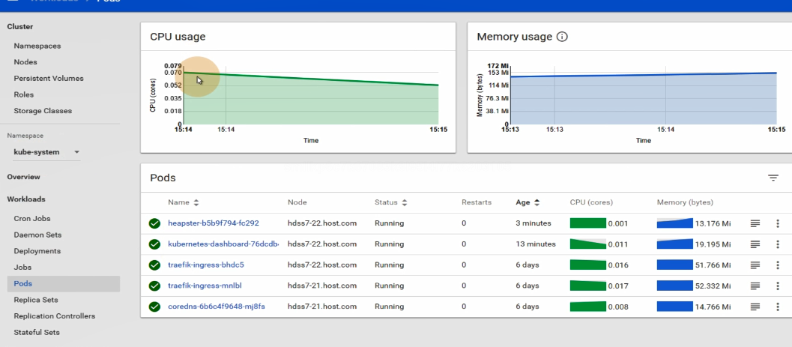

完成

### K8S平滑升级技巧

> **WHAT**：不需要做过多的操作，特别是关闭服务器等，而升级的方式
>
> **WHY**：生产中我们的服务每关一秒钟，损失的利润可能是上百万，而现在很多厂商，特别是游戏，都会写着什么时候升级但可以正常运行的公告，而且升级的时间一般是在流量低谷，流量低谷指的是用户使用量最少的时候

~~~
# 21节点
~]# kubectl get node
~]# kubectl get pod -n kube-system -o wide
~~~

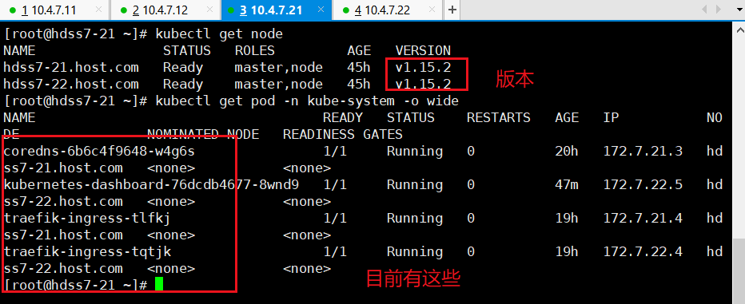

~~~
# 11机器，停掉7层网络(只需做一次)
~]# vi /etc/nginx/nginx.conf
# 把最下面的server21注释掉
~]# vi /etc/nginx/conf.d/od.com.conf
# 把server21注释掉
~]# nginx -s reload
~~~

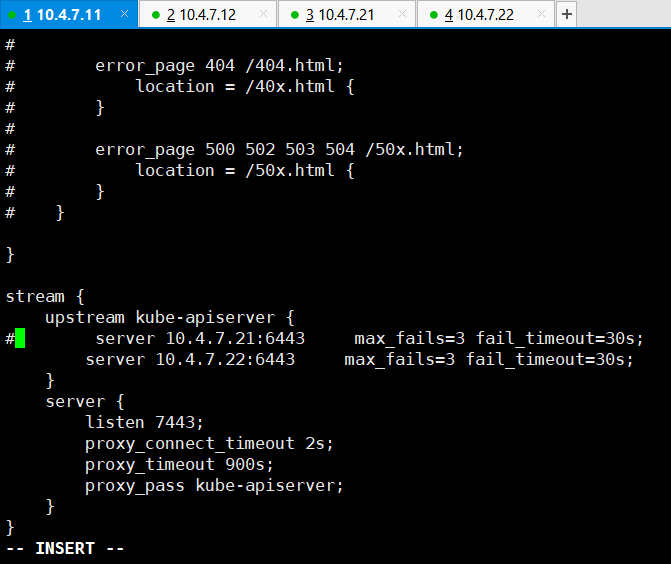

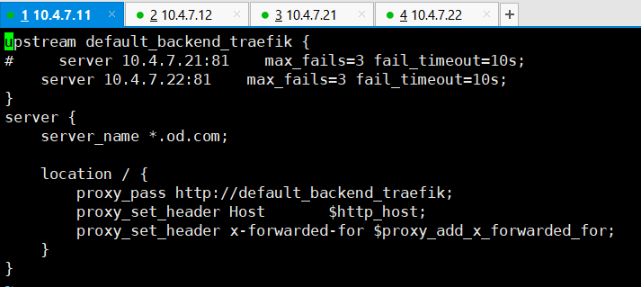

~~~
# 21/22机器:
src]# kubectl delete node hdss7-21.host.com
# 以下操作可能需要不断刷新，因为调度器知道你的node关闭，才会开始迁移到其它node（会自动平衡资源），注意看IP
src]# kubectl get nodes
src]# kubectl get pod -n kube-system -o wide
# 我们来看下dns有没有问题
dig -t A kubernetes.default.svc.cluster.local @192.168.0.2 +short
# out:192.168.0.1
~~~

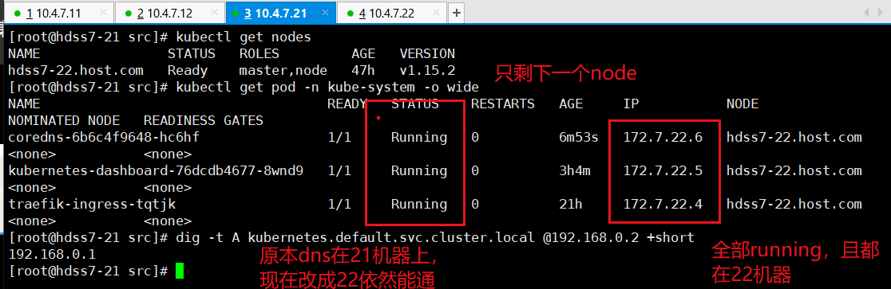

~~~
# 21/22机器:
cd /opt/src
把要升级的版本拉进来
opt]# mkdir /opt/123
opt]# cd src
src]# tar xfv kubernetes-server-linux-amd64-v1.15.4.tar.gz -C /opt/123
src]# ll
# 把名字改下
src]# cd /opt/123
123]# mv kubernetes/ ../kubernetes-v1.15.4
src]# cd ..
opt]# ll
# 这时候会有个1.15.2和1.15.4
cd /kubernetes-v1.15.4
# 删掉不需要的东西
kubernetes-v1.15.4]# rm -f kubernetes-src.tar.gz
kubernetes-v1.15.4]# cd server/bin
bin]# rm -f *.tar
bin]# rm -f *_tag
bin]# mkdir conf
bin]# mkdir cert
bin]# cd cert/
cert]# cp /opt/kubernetes/server/bin/cert/* .
cert]# cd ../conf/
conf]# cp /opt/kubernetes/server/bin/conf/* .
conf]# cd ..
bin]# cp /opt/kubernetes/server/bin/*.sh .
bin]# cd /opt
opt]# rm -rf kubernetes
opt]# ln -s /opt/kubernetes-v1.15.4/ /opt/kubernetes
# 生产上是一个一个来，我这里是一起
opt]# supervisorctl restart all
opt]# supervisorctl status
opt]# kubectl get nodes
~~~

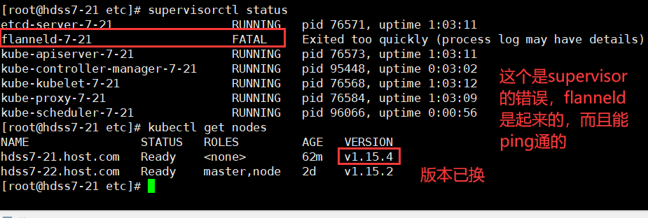

> 如果有出现起不来的情况：
>
> ​	先用ps aux|grep [名字]
>
> ​	kill -9 [id]
>
> ​	再启动supervisorctl start [名字]

完成

下面是第三次做的结果

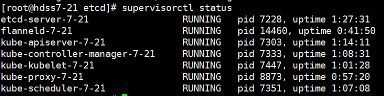

<a href="https://github.com/ben1234560/k8s_PaaS/blob/master/%E5%8E%9F%E7%90%86%E5%8F%8A%E6%BA%90%E7%A0%81%E8%A7%A3%E6%9E%90/Kubernetes%E5%9F%BA%E6%9C%AC%E6%A6%82%E5%BF%B5.md#%E6%B0%B4%E5%B9%B3%E6%89%A9%E5%B1%95%E5%92%8C%E6%BB%9A%E5%8A%A8%E5%8D%87%E7%BA%A7">水平扩展和滚动升级补充</a>