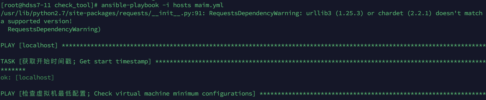

### 前言

目前仅有第二章的检查，运行脚本报错后，检查报错的对应内容

### 使用方式：

1. 下载ansible

   ~~~
   yum install ansible -y
   ~~~

2. 配置hosts，改成自己的ip和账号密码，virtual_ip没有可以先不填

3. 运行ansible脚本

   ~~~
   ansible-playbook -i hosts main.yml
   ~~~

   运行图如下：

### 文件说明

ansible.cfg:  

~~~
# ansible 的配置文件
[defaults]
host_key_checking = False  # 不进行密钥检查
log_path = ./run_ansible.log  # 运行日志写出文件
gathering = "implicit"  # 日志数据收集方式
~~~

hosts:

~~~
# 目标主机的清单文件
[all]
k8s_11 ansible_host=填写你的11机器内网IP
k8s_12 ansible_host=填写你的12机器内网IP
k8s_21 ansible_host=填写你的21机器内网IP
k8s_22 ansible_host=填写你的22机器内网IP
k8s_200 ansible_host=填写你的200机器内网IP

[all:vars]
ansible_ssh_pass=填写你的机器密码，要求密码统一
ansible_ssh_port=端口，默认22
ansible_ssh_user=用户权限，默认root

[virtual_ip]
k8s_10 ansible_host=填写你的虚拟10机器IP，没有可不填不改
~~~

maim.yml: 主运行文件

playbooks:

- pre_check.yml: 机器基础检查
- pre_for_k8s.yml: k8s前的准备内容检查
- node_base_service.yml: 节点的部署内容检查
